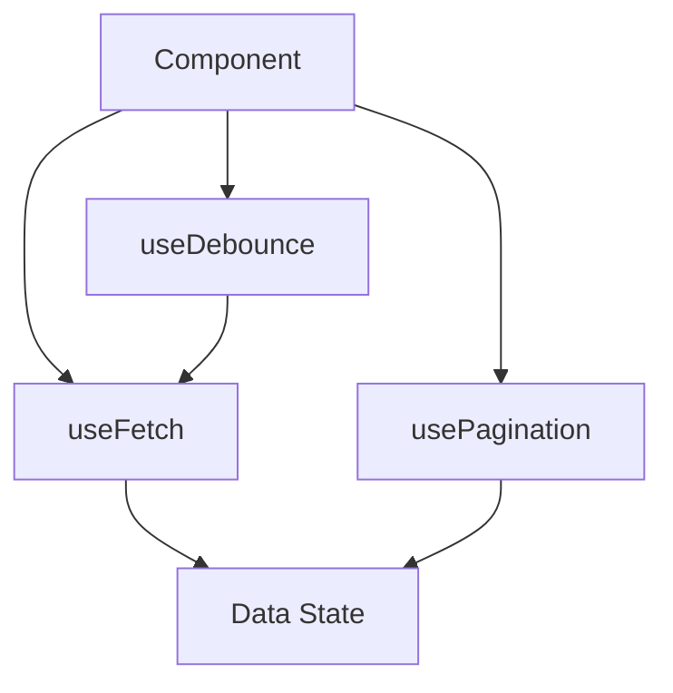

---
title: Reusable Logic Patterns
slug: day-034-reusable-logic-patterns
dayLabel: Day 34
level: Intermediate
estimatedMinutes: 30
order: 34
track: react
---
# Day 34 [Intermediate]: Reusable Logic Patterns

## Index

- [Goal](#goal)
- [Prerequisites](#prerequisites)
- [Explanation](#explanation)
- [Topic by Topic](#topic-by-topic)
- [Key Concepts](#key-concepts)
- [Visual Concept Map](#visual-concept-map)
- [End-to-End Practical](#end-to-end-practical)
- [Hands-on Coding](#hands-on-coding)
- [Mini Exercise](#mini-exercise)
- [Assessment Quiz](#assessment-quiz)
- [Task](#task)
- [Self Check](#self-check)
- [Interview Questions and Answers](#interview-questions-and-answers)
- [Day 34 Outcome](#day-34-outcome)

## Goal

Build reusable hook patterns for async state, pagination, and debounced interactions.

## Prerequisites

- Day 33 completed
- Basic custom hooks and useEffect understanding

## Explanation

Reusable logic patterns reduce repeated async and UI-state boilerplate across components.

## Topic by Topic

### Topic 1: useFetch Pattern

Theory:
Wrap loading, error, and data state into one hook API.

Practical:
Create `useFetch(url)`.

Code Example:

```jsx
const { data, loading, error } = useFetch(url);
```

**Explanation:** This topic explains useFetch Pattern in a practical way so you can apply it confidently in real React projects.

**Key Points:**

- Understand the core idea of useFetch Pattern.
- Apply the pattern using clean, readable code.
- Avoid common mistakes through predictable React flow.

### Topic 2: usePagination Pattern

Theory:
Encapsulate page index and navigation helpers.

Practical:
Build `next`, `prev`, `goToPage` actions.

Code Example:

```jsx
const { page, next, prev } = usePagination(1);
```

**Explanation:** This topic explains usePagination Pattern in a practical way so you can apply it confidently in real React projects.

**Key Points:**

- Understand the core idea of usePagination Pattern.
- Apply the pattern using clean, readable code.
- Avoid common mistakes through predictable React flow.

### Topic 3: useDebounce Pattern

Theory:
Delay expensive operations until user pauses input.

Practical:
Debounce search term by 400ms.

Code Example:

```jsx
const debouncedQuery = useDebounce(query, 400);
```

**Explanation:** This topic explains useDebounce Pattern in a practical way so you can apply it confidently in real React projects.

**Key Points:**

- Understand the core idea of useDebounce Pattern.
- Apply the pattern using clean, readable code.
- Avoid common mistakes through predictable React flow.

### Topic 4: Error-first Hook API Design

Theory:
Expose predictable shape from hooks for consistent UI handling.

Practical:
Return object with `data`, `loading`, `error`, `refetch`.

Code Example:

```jsx
return { data, loading, error, refetch };
```

**Explanation:** This topic explains Error-first Hook API Design in a practical way so you can apply it confidently in real React projects.

**Key Points:**

- Understand the core idea of Error-first Hook API Design.
- Apply the pattern using clean, readable code.
- Avoid common mistakes through predictable React flow.

### Topic 5: Composing Hooks

Theory:
Combine small hooks for rich behavior.

Practical:
useFetch + useDebounce for search-driven API.

Code Example:

```jsx
const term = useDebounce(query, 500);
```

**Explanation:** This topic explains Composing Hooks in a practical way so you can apply it confidently in real React projects.

**Key Points:**

- Understand the core idea of Composing Hooks.
- Apply the pattern using clean, readable code.
- Avoid common mistakes through predictable React flow.

### Topic 6: Request Cancellation in Reusable Fetch Hooks

Theory:
Reusable async hooks should handle cancellation to prevent race conditions and stale updates.

Practical:
Add AbortController support inside useFetch and cancel previous request on dependency change.

Code Example:

```jsx
const controller = new AbortController();
```

**Explanation:** This topic explains Request Cancellation in Reusable Fetch Hooks in a practical way so you can apply it confidently in real React projects.

**Key Points:**

- Understand the core idea of Request Cancellation in Reusable Fetch Hooks.
- Apply the pattern using clean, readable code.
- Avoid common mistakes through predictable React flow.

## Key Concepts

- Async logic extraction
- Reusable state APIs
- Debounce and pagination patterns
- Hook composition
- Predictable UI contracts
- Cancellation-safe async hooks

## Visual Concept Map



## End-to-End Practical

1. Create `useFetch` hook.
2. Add reusable error/loading/data API.
3. Create `useDebounce` hook.
4. Connect debounced query to fetch.
5. Add pagination helper hook.

## Hands-on Coding

### Example 1: Case - Reusable useFetch Hook

Scenario:
Multiple internal tools need the same data-loading boilerplate removed.

```jsx
import { useEffect, useState } from "react";

function useFetch(url) {
  const [data, setData] = useState(null);
  const [loading, setLoading] = useState(false);
  const [error, setError] = useState("");

  const fetchData = async () => {
    setLoading(true);
    setError("");
    try {
      const res = await fetch(url);
      if (!res.ok) throw new Error("Request failed");
      const json = await res.json();
      setData(json);
    } catch (err) {
      setError(err.message);
    } finally {
      setLoading(false);
    }
  };

  useEffect(() => {
    fetchData();
  }, [url]);

  return { data, loading, error, refetch: fetchData };
}
```

### Example 2: Case - Debounced Search Hook

Scenario:
A candidate search box should avoid firing request on every keystroke.

```jsx
import { useEffect, useState } from "react";

function useDebounce(value, delay = 400) {
  const [debounced, setDebounced] = useState(value);

  useEffect(() => {
    const id = setTimeout(() => setDebounced(value), delay);
    return () => clearTimeout(id);
  }, [value, delay]);

  return debounced;
}
```

### Example 3: Case - Pagination Logic Hook

Scenario:
A report table needs reusable next/previous page behavior.

```jsx
import { useState } from "react";

function usePagination(initialPage = 1) {
  const [page, setPage] = useState(initialPage);
  const next = () => setPage((p) => p + 1);
  const prev = () => setPage((p) => Math.max(1, p - 1));
  const goToPage = (p) => setPage(Math.max(1, p));
  return { page, next, prev, goToPage };
}
```

## Mini Exercise

Scenario:
You are building a jobs explorer.

Combine `useDebounce(query)` + `useFetch(urlWithQuery)` + `usePagination` into one jobs screen.

Expected output:

- Debounced query reduces request noise
- Fetch hook provides loading/error/data UI
- Pagination controls work through reusable hook

## Assessment Quiz

### Quiz Questions

1. Why return `refetch` from useFetch?
2. What problem does useDebounce solve?
3. True or False: reusable hooks should hide UI details.
4. What is the benefit of hook composition?
5. Why should hook return shape stay consistent?

### Quiz Answers

1. Manual retry/refresh control
2. Prevents excessive actions on rapid input changes
3. True
4. Builds complex behavior from small reusable blocks
5. Easier consumption and predictable UI handling

## Task

- Create at least two reusable logic hooks
- Use them together in one component
- Complete mini exercise

## Self Check

- You can design scalable reusable hook APIs
- You can compose hooks to build advanced flows
- You can answer at least 4 out of 5 quiz questions correctly

## Interview Questions and Answers

### Beginner

**Question:** What is reusable logic pattern in React?

**Answer:** A repeatable hook-based solution for common behavior.

**Question:** Why use custom hook for async data?

**Answer:** Avoid duplicate loading/error/data boilerplate.

### Middle

**Question:** What should a `useFetch` hook expose?

**Answer:** Data, loading, error, and optional refetch action.

**Question:** How does debouncing improve UX?

**Answer:** Reduces flicker and unnecessary network requests.

### Advanced

**Question:** How do you keep hook APIs stable in large codebases?

**Answer:** Use consistent return contracts and versioned changes.

**Question:** What tradeoff appears when hooks become too generic?

**Answer:** Harder to reason about behavior and maintain type clarity.

## Day 34 Outcome

- You can build reusable async and interaction logic patterns
- You can compose hooks for richer component behaviors
- You are ready to apply these in a mini project on Day 35

