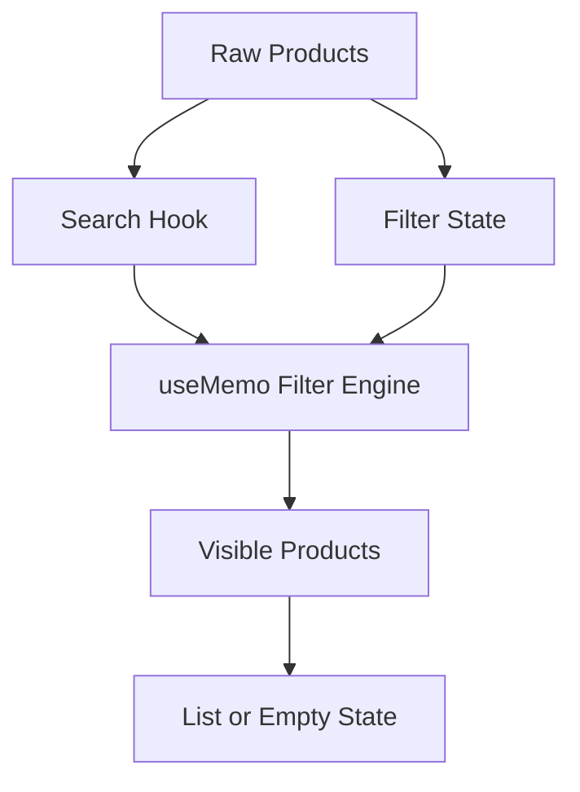

---
title: Mini Project - Search and Filter App
slug: day-035-mini-project-search-and-filter-app
dayLabel: Day 35
level: Intermediate
estimatedMinutes: 45
order: 35
track: react
---
# Day 35 [Intermediate]: Mini Project - Search and Filter App

## Index

- [Goal](#goal)
- [Prerequisites](#prerequisites)
- [Explanation](#explanation)
- [Topic by Topic](#topic-by-topic)
- [Key Concepts](#key-concepts)
- [Visual Concept Map](#visual-concept-map)
- [End-to-End Practical](#end-to-end-practical)
- [Hands-on Coding](#hands-on-coding)
- [Mini Exercise](#mini-exercise)
- [Assessment Quiz](#assessment-quiz)
- [Task](#task)
- [Self Check](#self-check)
- [Interview Questions and Answers](#interview-questions-and-answers)
- [Day 35 Outcome](#day-35-outcome)

## Goal

Build an end-to-end search and filter app using custom hooks and memoization for scalable performance.

## Prerequisites

- Day 34 completed
- useMemo, useCallback, custom hooks basics

## Explanation

This mini project combines reusable logic and performance patterns into a practical searchable/filterable product interface.

## Topic by Topic

### Topic 1: Product Data and State Model

Theory:
Define product data and filter/search states clearly.

Practical:
Create category, query, and minPrice states.

Code Example:

```jsx
const [query, setQuery] = useState("");
const [category, setCategory] = useState("all");
```

**Explanation:** This topic explains Product Data and State Model in a practical way so you can apply it confidently in real React projects.

**Key Points:**

- Understand the core idea of Product Data and State Model.
- Apply the pattern using clean, readable code.
- Avoid common mistakes through predictable React flow.

### Topic 2: Reusable Search Hook

Theory:
Extract query state and clear behavior into custom hook.

Practical:
Build `useSearch`.

Code Example:

```jsx
const { query, setQuery, clear } = useSearch();
```

**Explanation:** This topic explains Reusable Search Hook in a practical way so you can apply it confidently in real React projects.

**Key Points:**

- Understand the core idea of Reusable Search Hook.
- Apply the pattern using clean, readable code.
- Avoid common mistakes through predictable React flow.

### Topic 3: Filtered Result Memoization

Theory:
Use useMemo for expensive filtering and sorting.

Practical:
Memoize visible products list.

Code Example:

```jsx
const visible = useMemo(
  () => applyFilters(products),
  [products, query, category],
);
```

**Explanation:** This topic explains Filtered Result Memoization in a practical way so you can apply it confidently in real React projects.

**Key Points:**

- Understand the core idea of Filtered Result Memoization.
- Apply the pattern using clean, readable code.
- Avoid common mistakes through predictable React flow.

### Topic 4: Empty and No-match States

Theory:
No-match result requires dedicated message and reset action.

Practical:
Show no-results UI with clear filters button.

Code Example:

```jsx
{
  visible.length === 0 && <button onClick={clearFilters}>Reset Filters</button>;
}
```

**Explanation:** This topic explains Empty and No-match States in a practical way so you can apply it confidently in real React projects.

**Key Points:**

- Understand the core idea of Empty and No-match States.
- Apply the pattern using clean, readable code.
- Avoid common mistakes through predictable React flow.

### Topic 5: Reusable Filter Panel Component

Theory:
Keep filter controls modular for maintainability.

Practical:
Build `FilterPanel` receiving state and callbacks via props.

Code Example:

```jsx
<FilterPanel category={category} onCategoryChange={setCategory} />
```

**Explanation:** This topic explains Reusable Filter Panel Component in a practical way so you can apply it confidently in real React projects.

**Key Points:**

- Understand the core idea of Reusable Filter Panel Component.
- Apply the pattern using clean, readable code.
- Avoid common mistakes through predictable React flow.

### Topic 6: URL-Synced Filter State

Theory:
Syncing search/filter state with URL improves shareability and browser navigation behavior.

Practical:
Initialize query/category from URL params and update params when filters change.

Code Example:

```jsx
const params = new URLSearchParams(window.location.search);
```

**Explanation:** This topic explains URL-Synced Filter State in a practical way so you can apply it confidently in real React projects.

**Key Points:**

- Understand the core idea of URL-Synced Filter State.
- Apply the pattern using clean, readable code.
- Avoid common mistakes through predictable React flow.

## Key Concepts

- Mini-project architecture
- Custom hook reuse
- Memoized filtering
- Search/filter UX
- Empty-state recovery
- URL-shareable filter state

## Visual Concept Map



## End-to-End Practical

1. Create product dataset.
2. Add search and category state.
3. Extract reusable `useSearch` hook.
4. Memoize filtered list.
5. Handle empty/no-match UI and reset actions.

## Hands-on Coding

### Example 1: Case - Product Search + Category Filter

Scenario:
A shopping portal lets users search by name and filter by category.

```jsx
import { useMemo, useState } from "react";

const products = [
  { id: 1, name: "iPhone", category: "mobile", price: 800 },
  { id: 2, name: "Galaxy", category: "mobile", price: 700 },
  { id: 3, name: "ThinkPad", category: "laptop", price: 1200 },
];

function App() {
  const [query, setQuery] = useState("");
  const [category, setCategory] = useState("all");

  const visible = useMemo(() => {
    return products.filter((p) => {
      const matchQuery = p.name.toLowerCase().includes(query.toLowerCase());
      const matchCategory = category === "all" || p.category === category;
      return matchQuery && matchCategory;
    });
  }, [query, category]);

  return (
    <div>
      <input
        value={query}
        onChange={(e) => setQuery(e.target.value)}
        placeholder="Search product"
      />
      <select value={category} onChange={(e) => setCategory(e.target.value)}>
        <option value="all">All</option>
        <option value="mobile">Mobile</option>
        <option value="laptop">Laptop</option>
      </select>

      {visible.map((p) => (
        <p key={p.id}>{p.name}</p>
      ))}
    </div>
  );
}
```

### Example 2: Case - Reusable useSearch Hook

Scenario:
Multiple pages require same search input and clear behavior.

```jsx
import { useState } from "react";

function useSearch(initial = "") {
  const [query, setQuery] = useState(initial);
  const clear = () => setQuery("");
  return { query, setQuery, clear };
}
```

### Example 3: Case - No Match Recovery UI

Scenario:
When filters return no products, user needs quick reset action.

```jsx
{
  visible.length === 0 ? (
    <div>
      <p>No products match current filters.</p>
      <button
        onClick={() => {
          setQuery("");
          setCategory("all");
        }}
      >
        Reset Filters
      </button>
    </div>
  ) : (
    visible.map((p) => <p key={p.id}>{p.name}</p>)
  );
}
```

## Mini Exercise

Scenario:
You are building a course finder app.

Implement search by title, filter by level (Beginner/Intermediate/Advanced), and sort by duration.

Expected output:

- Search and filters work together
- Derived list is memoized
- Empty-state offers clear reset action

## Assessment Quiz

### Quiz Questions

1. Why memoize filtered list in search apps?
2. What should happen when no results match?
3. True or False: custom hooks can simplify repeated search logic.
4. Which states are typically needed for search + filter UI?
5. Why keep filter panel as separate component?

### Quiz Answers

1. To avoid expensive recalculation on unrelated renders
2. Show no-result message and recovery action
3. True
4. Query, category/filter, sort, and data source
5. Better modularity and maintainability

## Task

- Build complete search and filter mini project
- Use at least one custom hook and one memoization optimization
- Complete mini exercise

## Self Check

- You can combine reusable logic with performance patterns
- You can deliver robust search/filter user experience
- You can answer at least 4 out of 5 quiz questions correctly

## Interview Questions and Answers

### Beginner

**Question:** What is the core purpose of search and filter app?

**Answer:** Help users quickly find relevant items from larger data sets.

**Question:** Why store query in state?

**Answer:** To drive reactive filtering as user types.

### Middle

**Question:** How do you combine search and category filters?

**Answer:** Apply both conditions in one filter function.

**Question:** Why use useMemo in filtered lists?

**Answer:** To cache expensive derived results and reduce unnecessary computation.

### Advanced

**Question:** How would you scale this app for server-side filtering?

**Answer:** Sync filter state to query params and fetch paginated filtered data from API.

**Question:** What architecture keeps filter logic maintainable in large apps?

**Answer:** Separate filter state, reusable hooks, and pure selector utilities.

## Day 35 Outcome

- You can build a production-style search and filter mini project
- You can apply custom hooks and memoization together effectively
- You are ready for Context API introduction in Day 36

