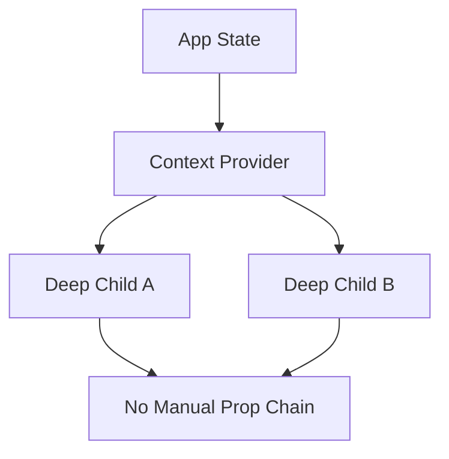

---
title: Context API Introduction
slug: day-036-context-api-introduction
dayLabel: Day 36
level: Intermediate
estimatedMinutes: 30
order: 36
track: react
---
# Day 36 [Intermediate]: Context API Introduction

## Index

- [Goal](#goal)
- [Prerequisites](#prerequisites)
- [Explanation](#explanation)
- [Topic by Topic](#topic-by-topic)
- [Key Concepts](#key-concepts)
- [Visual Concept Map](#visual-concept-map)
- [End-to-End Practical](#end-to-end-practical)
- [Hands-on Coding](#hands-on-coding)
- [Mini Exercise](#mini-exercise)
- [Assessment Quiz](#assessment-quiz)
- [Task](#task)
- [Self Check](#self-check)
- [Interview Questions and Answers](#interview-questions-and-answers)
- [Day 36 Outcome](#day-36-outcome)

## Goal

Understand when to use Context API and how it solves prop drilling for shared state.

## Prerequisites

- Day 35 completed
- Comfortable with props and component tree

## Explanation

Context API allows data to be shared across many components without passing props manually at every level.

## Topic by Topic

### Topic 1: What is Prop Drilling

Theory:
Prop drilling means passing props through components that do not use them.

Practical:
Observe user data passed App -> Layout -> Header.

Code Example:

```jsx
<Layout user={user} />
```

**Explanation:** This topic explains What is Prop Drilling in a practical way so you can apply it confidently in real React projects.

**Key Points:**

- Understand the core idea of What is Prop Drilling.
- Apply the pattern using clean, readable code.
- Avoid common mistakes through predictable React flow.

### Topic 2: What Context Solves

Theory:
Context provides shared values to nested components directly.

Practical:
Access app settings from any child.

Code Example:

```jsx
const SettingsContext = createContext();
```

**Explanation:** This topic explains What Context Solves in a practical way so you can apply it confidently in real React projects.

**Key Points:**

- Understand the core idea of What Context Solves.
- Apply the pattern using clean, readable code.
- Avoid common mistakes through predictable React flow.

### Topic 3: Context Parts

Theory:
Context has three parts: createContext, Provider, Consumer/useContext.

Practical:
Define provider at app root.

Code Example:

```jsx
<SettingsContext.Provider value={value}>{children}</SettingsContext.Provider>
```

**Explanation:** This topic explains Context Parts in a practical way so you can apply it confidently in real React projects.

**Key Points:**

- Understand the core idea of Context Parts.
- Apply the pattern using clean, readable code.
- Avoid common mistakes through predictable React flow.

### Topic 4: When to Use Context

Theory:
Use context for app-wide state like theme, auth, language.

Practical:
Place language state in context.

Code Example:

```jsx
value={{ language, setLanguage }}
```

**Explanation:** This topic explains When to Use Context in a practical way so you can apply it confidently in real React projects.

**Key Points:**

- Understand the core idea of When to Use Context.
- Apply the pattern using clean, readable code.
- Avoid common mistakes through predictable React flow.

### Topic 5: Context Caution

Theory:
Frequent provider updates can re-render many consumers.

Practical:
Split context by concern (theme vs auth).

Code Example:

```jsx
// Keep context focused by domain.
```

**Explanation:** This topic explains Context Caution in a practical way so you can apply it confidently in real React projects.

**Key Points:**

- Understand the core idea of Context Caution.
- Apply the pattern using clean, readable code.
- Avoid common mistakes through predictable React flow.

### Topic 6: Context vs Component Composition

Theory:
Context is powerful but not always required; composition can solve local sharing with less global coupling.

Practical:
Use component props/slots for narrowly scoped sharing and reserve context for broad cross-tree state.

Code Example:

```jsx
<Layout header={<Header user={user} />} />
```

**Explanation:** This topic explains Context vs Component Composition in a practical way so you can apply it confidently in real React projects.

**Key Points:**

- Understand the core idea of Context vs Component Composition.
- Apply the pattern using clean, readable code.
- Avoid common mistakes through predictable React flow.

## Key Concepts

- Prop drilling problem
- Context as shared data channel
- Provider and value scope
- Common global state use cases
- Performance-aware context design
- Context decision boundaries

## Visual Concept Map



## End-to-End Practical

1. Create context file.
2. Add provider in App.
3. Put settings value in provider.
4. Consume in deep nested component.
5. Remove unnecessary pass-through props.

## Hands-on Coding

### Example 1: Case - Language Settings Context

Scenario:
An LMS app needs current language available in navbar, footer, and profile page.

```jsx
import { createContext, useState } from "react";

export const SettingsContext = createContext();

export function SettingsProvider({ children }) {
  const [language, setLanguage] = useState("en");

  return (
    <SettingsContext.Provider value={{ language, setLanguage }}>
      {children}
    </SettingsContext.Provider>
  );
}
```

### Example 2: Case - Remove User Prop Drilling

Scenario:
User profile data should be accessible in deep components without passing through intermediate layout components.

```jsx
import { createContext, useState } from "react";

export const UserContext = createContext();

function App() {
  const [user] = useState({ name: "Asha", role: "Admin" });
  return (
    <UserContext.Provider value={user}>
      <Layout />
    </UserContext.Provider>
  );
}
```

### Example 3: Case - Multi-consumer Shared Value

Scenario:
A dashboard has multiple independent widgets that need same company name value.

```jsx
import { createContext } from "react";

export const CompanyContext = createContext("Acme");

function Header() {
  return <CompanyName />;
}
```

## Mini Exercise

Scenario:
You are building an enterprise portal.

Create a SettingsContext with values: appTitle, language, timezone. Use it in at least three distant components.

Expected output:

- No deep prop chains for settings
- Shared values available in all required components
- Settings updates reflect globally

## Assessment Quiz

### Quiz Questions

1. What problem does Context API primarily solve?
2. Name three core parts of Context usage.
3. True or False: Context replaces all local state usage.
4. Give two suitable use cases for Context.
5. Why split large context into smaller contexts?

### Quiz Answers

1. Prop drilling for shared state
2. createContext, Provider, useContext/Consumer
3. False
4. Theme, auth, language, user preferences
5. Better readability and fewer unnecessary re-renders

## Task

- Create one shared settings context
- Consume it in 3 nested components
- Complete mini exercise

## Self Check

- You can explain why Context exists
- You can identify state that belongs in Context
- You can answer at least 4 out of 5 quiz questions correctly

## Interview Questions and Answers

### Beginner

**Question:** What is React Context?

**Answer:** A way to share values across component tree without manual prop passing.

**Question:** Which hook reads context in function components?

**Answer:** useContext.

### Middle

**Question:** When should you avoid Context?

**Answer:** For state used by only one or two local components.

**Question:** Why is prop drilling problematic?

**Answer:** It makes components noisy and harder to maintain.

### Advanced

**Question:** How does context update propagation affect performance?

**Answer:** All consuming components may re-render when provider value reference changes.

**Question:** What strategy helps large-context performance?

**Answer:** Split contexts and memoize provider values.

## Day 36 Outcome

- You can explain and apply Context API fundamentals
- You can remove prop drilling in real scenarios
- You are ready to build provider architecture in Day 37

