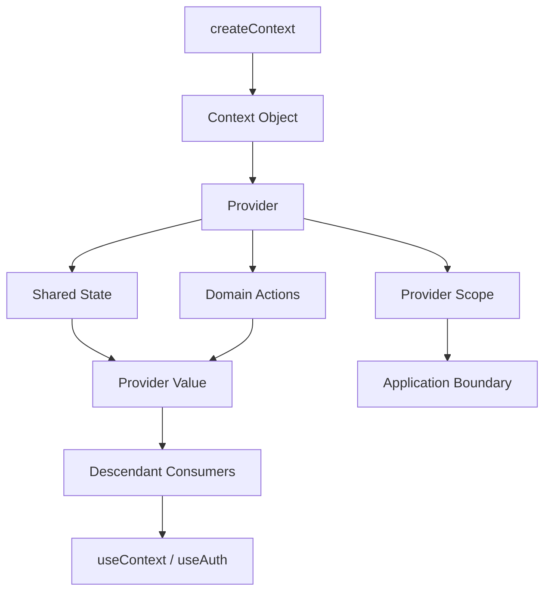

# Day 37 [Intermediate]: `createContext` and Provider Setup

## Index

- [Goal](#goal)
- [Prerequisites](#prerequisites)
- [Explanation](#explanation)
- [Topic by Topic](#topic-by-topic)
- [Key Concepts](#key-concepts)
- [Visual Concept Map](#visual-concept-map)
- [End-to-End Practical](#end-to-end-practical)
- [Hands-on Coding](#hands-on-coding)
- [Mini Exercise](#mini-exercise)
- [Assessment Quiz](#assessment-quiz)
- [Task](#task)
- [Self Check](#self-check)
- [Interview Questions and Answers](#interview-questions-and-answers)
- [Day 37 Outcome](#day-37-outcome)

## Goal

Build a reusable Context provider that owns shared state and actions, exposes a small public API, has deliberate scope, and fails safely when consumed incorrectly.

## Prerequisites

- Day 36 completed
- Context fundamentals understood
- Components, props, state, and hooks
- Basic understanding of `useMemo`, `useCallback`, and `useContext`

## Explanation

`createContext` creates a Context object. A Provider supplies a value to descendants. The important architectural question is not simply **how to create a Provider**, but **what the Provider should own and what API it should expose**.

A good provider normally has three layers:

```text
Domain Context
├── context object
├── provider component
└── consumer hook
```

The provider owns shared state and domain actions. Consumers use the public API rather than reaching into implementation details.

## Topic by Topic

### Topic 1: `createContext` Initialization

Start with a context object:

```jsx
import { createContext } from "react";

const AuthContext = createContext(null);
```

Use `null` when the Provider is required. This lets a custom hook detect a missing Provider instead of silently returning a fake default.

Avoid misleading defaults such as:

```jsx
createContext({
  user: null,
  login: () => {},
});
```

A fake default can hide configuration errors because the consumer appears to work even when the Provider is missing.

### Topic 2: Provider Wrapper Component

A Provider supplies its value to descendants:

```jsx
function AuthProvider({ children }) {
  const [user, setUser] = useState(null);

  return (
    <AuthContext.Provider value={{ user }}>
      {children}
    </AuthContext.Provider>
  );
}
```

The Provider must wrap the components that need the context.

### Topic 3: Provider Owns State and Actions

The Provider should normally own the shared state and expose domain actions:

```jsx
function AuthProvider({ children }) {
  const [user, setUser] = useState(null);

  function login(name) {
    setUser({ id: crypto.randomUUID(), name });
  }

  function logout() {
    setUser(null);
  }

  return (
    <AuthContext.Provider value={{ user, login, logout }}>
      {children}
    </AuthContext.Provider>
  );
}
```

Prefer `logout()` over exposing `setUser(null)`. A domain action communicates intent and allows the internal implementation to change later.

### Topic 4: Provider Scope and Placement

Do not automatically place every Provider around the entire application.

Ask:

> Which components actually need this value?

If only checkout pages need a provider:

```jsx
<CheckoutProvider>
  <CheckoutRoutes />
</CheckoutProvider>
```

Benefits:

- smaller dependency surface
- clearer ownership
- easier testing
- less accidental coupling

Global providers such as theme or authenticated session may legitimately sit near the application root.

### Topic 5: Provider Composition

Multiple providers can be composed:

```jsx
function AppProviders({ children }) {
  return (
    <ThemeProvider>
      <AuthProvider>
        <SettingsProvider>{children}</SettingsProvider>
      </AuthProvider>
    </ThemeProvider>
  );
}
```

If nesting becomes excessive, a composition component can improve readability. Do not create an abstraction merely to hide a few providers; use it when the composition is reused or represents a meaningful application boundary.

### Topic 6: Provider Value Reference Stability

This creates a new object whenever the Provider renders:

```jsx
<AuthContext.Provider value={{ user, login, logout }}>
```

That can cause consumers to observe a changed context value even when the meaningful data has not changed.

For a measured hot path, stabilize the value:

```jsx
const login = useCallback((name) => {
  setUser({ id: crypto.randomUUID(), name });
}, []);

const logout = useCallback(() => {
  setUser(null);
}, []);

const value = useMemo(
  () => ({ user, login, logout }),
  [user, login, logout]
);
```

Do not add `useMemo` and `useCallback` mechanically. They are optimizations, not requirements for every Provider.

### Topic 7: Split Context by Domain

Avoid one giant context:

```jsx
<AppContext.Provider
  value={{ user, theme, language, cart, notifications, search }}
>
  {children}
</AppContext.Provider>
```

Prefer focused domains:

```text
AuthContext
ThemeContext
LocaleContext
CartContext
```

This makes ownership and update boundaries clearer.

### Topic 8: Read/Write Context Separation

For high-frequency or large shared state, separate state and actions contexts can sometimes reduce update impact:

```jsx
const CartStateContext = createContext(null);
const CartActionsContext = createContext(null);
```

A component that only needs actions can consume the actions context rather than changing state data.

This is an optimization pattern, not a requirement for every application.

### Topic 9: Guarded Consumer Hook

Keep the public consumer API close to the context:

```jsx
export function useAuth() {
  const value = useContext(AuthContext);

  if (value === null) {
    throw new Error("useAuth must be used within AuthProvider");
  }

  return value;
}
```

This turns a vague runtime problem into a clear developer error.

## Key Concepts

- `createContext`
- Provider and consumer relationship
- Provider ownership
- Shared state + domain actions
- Provider scope
- Provider composition
- Context value identity
- `useMemo` / `useCallback` as targeted optimizations
- Domain-specific contexts
- Read/write context separation
- Guarded custom consumer hooks
- Context is not automatically a global state-management solution

## Visual Concept Map



## End-to-End Practical

Build an `AuthProvider` for a small internal application.

### Step 1: Create the context

```jsx
import { createContext } from "react";

export const AuthContext = createContext(null);
```

### Step 2: Add Provider state and actions

```jsx
import { useCallback, useMemo, useState } from "react";
import { AuthContext } from "./AuthContext";

export function AuthProvider({ children }) {
  const [user, setUser] = useState(null);

  const login = useCallback((name) => {
    setUser({
      id: crypto.randomUUID(),
      name,
      role: "user",
    });
  }, []);

  const logout = useCallback(() => {
    setUser(null);
  }, []);

  const value = useMemo(
    () => ({ user, login, logout }),
    [user, login, logout]
  );

  return (
    <AuthContext.Provider value={value}>
      {children}
    </AuthContext.Provider>
  );
}
```

### Step 3: Add the consumer hook

```jsx
import { useContext } from "react";
import { AuthContext } from "./AuthContext";

export function useAuth() {
  const value = useContext(AuthContext);

  if (value === null) {
    throw new Error("useAuth must be used within AuthProvider");
  }

  return value;
}
```

### Step 4: Wrap the application

```jsx
function Root() {
  return (
    <AuthProvider>
      <App />
    </AuthProvider>
  );
}
```

### Step 5: Consume it

```jsx
function Navbar() {
  const { user, login, logout } = useAuth();

  return user ? (
    <button type="button" onClick={logout}>
      Logout {user.name}
    </button>
  ) : (
    <button type="button" onClick={() => login("Learner")}>
      Login
    </button>
  );
}
```

## Hands-on Coding

### Example 1: Auth Provider Setup

**Scenario:** An internal admin application needs shared authentication state.

Implement:

- `user`
- `login(name)`
- `logout()`
- guarded `useAuth()`

### Example 2: Product Preferences Provider

**Scenario:** An e-commerce application shares currency and locale settings.

```jsx
const PreferencesContext = createContext(null);

function PreferencesProvider({ children }) {
  const [currency, setCurrency] = useState("INR");
  const [locale, setLocale] = useState("en-IN");

  return (
    <PreferencesContext.Provider
      value={{ currency, locale, setCurrency, setLocale }}
    >
      {children}
    </PreferencesContext.Provider>
  );
}
```

Discuss whether exposing the setters directly is appropriate or whether domain actions such as `changeCurrency()` would make the API clearer.

### Example 3: Provider Composition

**Scenario:** A large app needs authentication and theme contexts throughout route components.

```jsx
function Root() {
  return (
    <ThemeProvider>
      <AuthProvider>
        <App />
      </AuthProvider>
    </ThemeProvider>
  );
}
```

## Common Provider Mistakes

### Mistake 1: Provider below consumer

```jsx
<Header />
<AuthProvider>{/* too late */}</AuthProvider>
```

The header cannot receive the Provider value.

### Mistake 2: Duplicate contexts

If `AuthContext` is created in two different modules, they are different context objects even if their names match.

### Mistake 3: Provider owns unrelated state

A theme Provider should not become the home for search, cart, notifications, and authentication simply because it is already available.

### Mistake 4: Exposing setters everywhere

Prefer domain actions when the domain has meaningful behavior.

### Mistake 5: Premature memoization

`useMemo` and `useCallback` add complexity. Use them when Provider value stability matters, not as a ritual.

## Mini Exercise

You are building a course platform.

Create an `EnrollmentProvider` with:

```text
enrolledCourses
isLoading
error

enroll(course)
unenroll(courseId)
clearAll()
```

### Expected outcome

- Provider exposes shared enrollment state and actions.
- Components can enroll and unenroll from any descendant.
- Consumers cannot directly mutate the Provider's internal state.
- Provider scope is deliberate.
- Missing-provider usage produces a clear error.

## Assessment Quiz

### Quiz Questions

1. What is the Provider's role in Context architecture?
2. Why can `createContext(null)` be preferable to a fake object default?
3. Where should a Provider be placed?
4. Why include domain actions in the Provider value?
5. When can memoizing the Provider value help?
6. Why split contexts by domain?
7. When is read/write context separation useful?
8. Why can exposing `setUser` directly be less desirable than `logout()`?
9. What happens when a consumer is outside the required Provider?
10. Is Context automatically a replacement for every state-management library?

### Quiz Answers

1. It supplies shared data and actions to descendants.
2. It makes missing-provider configuration errors detectable.
3. At the nearest meaningful common ancestor, or higher when intentionally application-wide.
4. They communicate intent and hide implementation details.
5. When context value identity causes unnecessary consumer updates and profiling justifies the optimization.
6. To create clearer ownership and update boundaries.
7. For high-frequency or large shared state when consumers need only state or actions separately.
8. Domain actions preserve a stable API and prevent arbitrary state mutation semantics from leaking outward.
9. A guarded custom hook can throw a clear error.
10. No. Context solves value distribution; server state, complex client state, and other concerns may require different tools.

## Task

Build a production-minded `EnrollmentProvider`:

- [ ] Create `EnrollmentContext`.
- [ ] Create `EnrollmentProvider`.
- [ ] Add enrollment state.
- [ ] Add `enroll`, `unenroll`, and `clearAll` actions.
- [ ] Add a guarded `useEnrollment()` hook.
- [ ] Wrap only the application area that needs enrollment.
- [ ] Add at least two consumers.
- [ ] Do not expose internal state setters unnecessarily.
- [ ] Explain whether provider-value memoization is justified.

## Self Check

You should now be able to answer **yes** to all of these:

- [ ] I can explain what `createContext()` creates.
- [ ] I can explain what a Provider does.
- [ ] I can choose an appropriate Provider scope.
- [ ] I can keep shared state inside the Provider.
- [ ] I can expose domain actions instead of implementation details.
- [ ] I understand Context value identity.
- [ ] I know when `useMemo` / `useCallback` may help a Provider.
- [ ] I can split large contexts by domain.
- [ ] I can create a guarded consumer hook.
- [ ] I can diagnose a missing or misplaced Provider.

## Interview Questions and Answers

### Beginner

**Question: What is a Provider?**  
A component that supplies a Context value to descendants.

**Question: What does `createContext()` do?**  
It creates a Context object that can be read by descendants through a Provider or consumer API.

**Question: Where should a Provider be placed?**  
At the nearest common ancestor that needs to supply the value, or higher when the value is intentionally application-wide.

### Intermediate

**Question: Why use a custom hook around `useContext`?**  
It creates a clean domain API and can enforce that the consumer is rendered inside the required Provider.

**Question: Why expose `logout()` instead of `setUser(null)`?**  
`logout()` communicates domain intent and keeps implementation details inside the Provider.

**Question: Why can a Provider cause many re-renders?**  
When its value changes, consumers of that Context can update. Large or frequently changing contexts therefore need deliberate boundaries.

### Advanced

**Question: Should every Provider memoize its value?**  
No. Memoization is an optimization. Use profiling and rendering behavior to decide whether value stability provides a meaningful benefit.

**Question: How would you structure many contexts?**  
Split them by domain and compose Providers at meaningful application boundaries.

**Question: When would you split state and actions into separate contexts?**  
When update frequency or consumer patterns make it useful for some components to subscribe only to stable actions or only to changing state.

**Question: Is Context a complete state-management solution?**  
No. It distributes values through a tree. It does not automatically solve server-state caching, persistence, complex state transitions, or every global-state problem.

## Debugging Scenarios

### Scenario A: Consumer always receives the default value

Check:

1. Provider placement.
2. Whether the consumer imports the same Context object.
3. Whether multiple copies of the module exist.

### Scenario B: Consumers update when unrelated data changes

Consider:

- splitting contexts by domain
- reducing the Provider value surface
- stabilizing functions/value when justified
- profiling before optimizing

### Scenario C: Provider code is 500 lines long

Separate domain logic, reducers/actions, persistence, or server-state concerns instead of turning one Provider into an application-wide service container.

## Day 37 Outcome

You can now design **`createContext`, Provider ownership, Provider scope, domain actions, Provider composition, guarded custom hooks, context performance boundaries, and reusable context APIs**.

Day 38 will focus on consuming Context safely with `useContext` and consumer patterns.