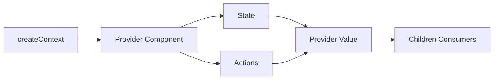

---
title: createContext and Provider Setup
slug: day-037-createcontext-and-provider-setup
dayLabel: Day 37
level: Intermediate
estimatedMinutes: 30
order: 37
track: react
---
# Day 37 [Intermediate]: createContext and Provider Setup

## Index

- [Goal](#goal)
- [Prerequisites](#prerequisites)
- [Explanation](#explanation)
- [Topic by Topic](#topic-by-topic)
- [Key Concepts](#key-concepts)
- [Visual Concept Map](#visual-concept-map)
- [End-to-End Practical](#end-to-end-practical)
- [Hands-on Coding](#hands-on-coding)
- [Mini Exercise](#mini-exercise)
- [Assessment Quiz](#assessment-quiz)
- [Task](#task)
- [Self Check](#self-check)
- [Interview Questions and Answers](#interview-questions-and-answers)
- [Day 37 Outcome](#day-37-outcome)

## Goal

Build robust context providers using createContext and Provider with state and actions.

## Prerequisites

- Day 36 completed
- Context fundamentals understood

## Explanation

Provider setup determines how shared state is created, updated, and made available to the app.

## Topic by Topic

### Topic 1: createContext Initialization

Theory:
Context starts with createContext and optional default value.

Practical:
Create AuthContext file.

Code Example:

```jsx
export const AuthContext = createContext(null);
```

**Explanation:** This topic explains createContext Initialization in a practical way so you can apply it confidently in real React projects.

**Key Points:**

- Understand the core idea of createContext Initialization.
- Apply the pattern using clean, readable code.
- Avoid common mistakes through predictable React flow.

### Topic 2: Provider Wrapper Component

Theory:
Provider component owns state and actions.

Practical:
Wrap app children with AuthProvider.

Code Example:

```jsx
<AuthContext.Provider value={value}>{children}</AuthContext.Provider>
```

**Explanation:** This topic explains Provider Wrapper Component in a practical way so you can apply it confidently in real React projects.

**Key Points:**

- Understand the core idea of Provider Wrapper Component.
- Apply the pattern using clean, readable code.
- Avoid common mistakes through predictable React flow.

### Topic 3: Exposing State and Actions

Theory:
Provider value should include data and methods.

Practical:
Expose user, login, logout.

Code Example:

```jsx
value={{ user, login, logout }}
```

**Explanation:** This topic explains Exposing State and Actions in a practical way so you can apply it confidently in real React projects.

**Key Points:**

- Understand the core idea of Exposing State and Actions.
- Apply the pattern using clean, readable code.
- Avoid common mistakes through predictable React flow.

### Topic 4: Provider Scope and Placement

Theory:
Place providers as high as needed, not always at top root.

Practical:
Wrap only authenticated app section.

Code Example:

```jsx
<AuthProvider>
  <AppRoutes />
</AuthProvider>
```

**Explanation:** This topic explains Provider Scope and Placement in a practical way so you can apply it confidently in real React projects.

**Key Points:**

- Understand the core idea of Provider Scope and Placement.
- Apply the pattern using clean, readable code.
- Avoid common mistakes through predictable React flow.

### Topic 5: Value Reference Stability

Theory:
Use memoization for provider value to reduce needless re-renders.

Practical:
Memoize value object.

Code Example:

```jsx
const value = useMemo(() => ({ user, login, logout }), [user]);
```

**Explanation:** This topic explains Value Reference Stability in a practical way so you can apply it confidently in real React projects.

**Key Points:**

- Understand the core idea of Value Reference Stability.
- Apply the pattern using clean, readable code.
- Avoid common mistakes through predictable React flow.

### Topic 6: Split Read and Write Contexts

Theory:
Separating state context from actions context can reduce consumer re-renders in larger apps.

Practical:
Expose read-only value in one context and mutation actions in another.

Code Example:

```jsx
const AuthStateContext = createContext(null);
```

**Explanation:** This topic explains Split Read and Write Contexts in a practical way so you can apply it confidently in real React projects.

**Key Points:**

- Understand the core idea of Split Read and Write Contexts.
- Apply the pattern using clean, readable code.
- Avoid common mistakes through predictable React flow.

## Key Concepts

- Provider ownership
- Shared state + actions API
- Scope design
- Value memoization
- Domain-specific context architecture
- Read/write context separation

## Visual Concept Map



## End-to-End Practical

1. Create context file.
2. Build provider state and actions.
3. Compose provider value object.
4. Wrap app tree with provider.
5. Validate state access from consumers.

## Hands-on Coding

### Example 1: Case - Auth Provider Setup

Scenario:
An internal admin app needs shared auth state with login/logout actions.

```jsx
import { createContext, useMemo, useState } from "react";

export const AuthContext = createContext(null);

export function AuthProvider({ children }) {
  const [user, setUser] = useState(null);

  const login = (name) => setUser({ name, role: "user" });
  const logout = () => setUser(null);

  const value = useMemo(() => ({ user, login, logout }), [user]);

  return <AuthContext.Provider value={value}>{children}</AuthContext.Provider>;
}
```

### Example 2: Case - Product Preferences Provider

Scenario:
An e-commerce app shares currency and locale settings globally.

```jsx
import { createContext, useState } from "react";

export const PreferencesContext = createContext(null);

export function PreferencesProvider({ children }) {
  const [currency, setCurrency] = useState("INR");
  const [locale, setLocale] = useState("en-IN");

  return (
    <PreferencesContext.Provider
      value={{ currency, locale, setCurrency, setLocale }}
    >
      {children}
    </PreferencesContext.Provider>
  );
}
```

### Example 3: Case - Provider Composition at Root

Scenario:
A large app needs auth and theme contexts both available to route components.

```jsx
function Root() {
  return (
    <ThemeProvider>
      <AuthProvider>
        <App />
      </AuthProvider>
    </ThemeProvider>
  );
}
```

## Mini Exercise

Scenario:
You are building a course platform.

Create EnrollmentProvider with state: enrolledCourses and actions: enroll(course), unenroll(courseId), clearAll(). Wrap app and verify access.

Expected output:

- Provider exposes both state and actions
- Components can enroll and unenroll from any depth
- Context updates propagate correctly

## Assessment Quiz

### Quiz Questions

1. What is the provider’s role in context architecture?
2. Why include action functions in provider value?
3. True or False: provider value should be recreated with random inline objects each render.
4. Where should provider be placed?
5. Why memoize provider value in some cases?

### Quiz Answers

1. Own and supply shared state to descendants
2. To allow consumer components to update context state
3. False
4. At nearest common ancestor of consumers
5. To reduce unnecessary consumer re-renders

## Task

- Create one domain-specific provider
- Add state and 2+ actions
- Complete mini exercise

## Self Check

- You can design and implement provider setup cleanly
- You can decide provider placement based on scope
- You can answer at least 4 out of 5 quiz questions correctly

## Interview Questions and Answers

### Beginner

**Question:** What does createContext do?

**Answer:** It creates a context object for shared data flow.

**Question:** What does Provider do?

**Answer:** It supplies context value to all descendants.

### Middle

**Question:** Why keep provider value API explicit?

**Answer:** Clear contract improves maintainability and consumer usage.

**Question:** How do you avoid prop drilling with providers?

**Answer:** Put shared state in provider and consume directly where needed.

### Advanced

**Question:** What issues arise from broad provider scope?

**Answer:** Wider re-render impact and harder state ownership boundaries.

**Question:** How would you optimize many context providers?

**Answer:** Split by domain and memoize values/actions thoughtfully.

## Day 37 Outcome

- You can build real provider structures with actions
- You can control context scope and value design
- You are ready to consume context in components on Day 38

