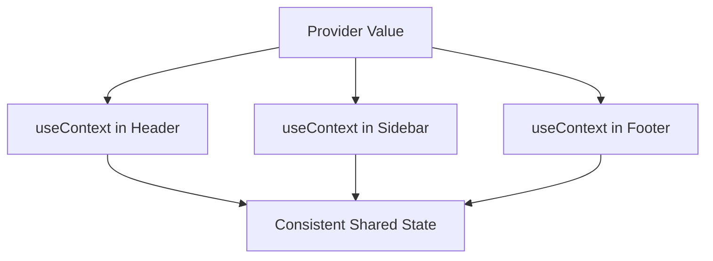

---
title: useContext in Components
slug: day-038-usecontext-in-components
dayLabel: Day 38
level: Intermediate
estimatedMinutes: 30
order: 38
track: react
---
# Day 38 [Intermediate]: useContext in Components

## Index

- [Goal](#goal)
- [Prerequisites](#prerequisites)
- [Explanation](#explanation)
- [Topic by Topic](#topic-by-topic)
- [Key Concepts](#key-concepts)
- [Visual Concept Map](#visual-concept-map)
- [End-to-End Practical](#end-to-end-practical)
- [Hands-on Coding](#hands-on-coding)
- [Mini Exercise](#mini-exercise)
- [Assessment Quiz](#assessment-quiz)
- [Task](#task)
- [Self Check](#self-check)
- [Interview Questions and Answers](#interview-questions-and-answers)
- [Day 38 Outcome](#day-38-outcome)

## Goal

Consume context cleanly with useContext in multiple components and avoid common mistakes.

## Prerequisites

- Day 37 completed
- Provider setup done

## Explanation

useContext reads provider values directly in function components. It simplifies access to shared app state.

## Topic by Topic

### Topic 1: Basic useContext Usage

Theory:
Pass context object to useContext hook.

Practical:
Read user from AuthContext.

Code Example:

```jsx
const { user } = useContext(AuthContext);
```

**Explanation:** This topic explains Basic useContext Usage in a practical way so you can apply it confidently in real React projects.

**Key Points:**

- Understand the core idea of Basic useContext Usage.
- Apply the pattern using clean, readable code.
- Avoid common mistakes through predictable React flow.

### Topic 2: Multiple Consumers

Theory:
Many components can consume same context value.

Practical:
Consume language in Header and Footer.

Code Example:

```jsx
const { language } = useContext(SettingsContext);
```

**Explanation:** This topic explains Multiple Consumers in a practical way so you can apply it confidently in real React projects.

**Key Points:**

- Understand the core idea of Multiple Consumers.
- Apply the pattern using clean, readable code.
- Avoid common mistakes through predictable React flow.

### Topic 3: Consuming Actions

Theory:
Consumers can call action functions provided by context.

Practical:
Trigger logout from navbar button.

Code Example:

```jsx
const { logout } = useContext(AuthContext);
```

**Explanation:** This topic explains Consuming Actions in a practical way so you can apply it confidently in real React projects.

**Key Points:**

- Understand the core idea of Consuming Actions.
- Apply the pattern using clean, readable code.
- Avoid common mistakes through predictable React flow.

### Topic 4: Custom Consumer Hook Pattern

Theory:
Wrap useContext in custom hook for cleaner imports and guard checks.

Practical:
Create useAuth hook.

Code Example:

```jsx
function useAuth() {
  return useContext(AuthContext);
}
```

**Explanation:** This topic explains Custom Consumer Hook Pattern in a practical way so you can apply it confidently in real React projects.

**Key Points:**

- Understand the core idea of Custom Consumer Hook Pattern.
- Apply the pattern using clean, readable code.
- Avoid common mistakes through predictable React flow.

### Topic 5: Missing Provider Safety

Theory:
Consuming context outside provider can cause undefined behavior.

Practical:
Throw helpful error in custom hook.

Code Example:

```jsx
if (!context) throw new Error("useAuth must be used within AuthProvider");
```

**Explanation:** This topic explains Missing Provider Safety in a practical way so you can apply it confidently in real React projects.

**Key Points:**

- Understand the core idea of Missing Provider Safety.
- Apply the pattern using clean, readable code.
- Avoid common mistakes through predictable React flow.

### Topic 6: Selector-Oriented Consumption Mindset

Theory:
Consumers should read only the context fields they need to keep component responsibilities focused.

Practical:
Destructure minimal values (`userName` not entire object) where possible.

Code Example:

```jsx
const { user } = useAuth();
```

**Explanation:** This topic explains Selector-Oriented Consumption Mindset in a practical way so you can apply it confidently in real React projects.

**Key Points:**

- Understand the core idea of Selector-Oriented Consumption Mindset.
- Apply the pattern using clean, readable code.
- Avoid common mistakes through predictable React flow.

## Key Concepts

- useContext consumption
- Shared values and actions
- Multi-component context access
- Custom consumer hooks
- Provider boundary safety
- Focused context consumption

## Visual Concept Map



## End-to-End Practical

1. Consume context in one component.
2. Consume same context in two more components.
3. Use context action from button click.
4. Build custom hook wrapper.
5. Add guard for missing provider.

## Hands-on Coding

### Example 1: Case - Header User Greeting

Scenario:
An employee portal header should show logged-in user name from AuthContext.

```jsx
import { useContext } from "react";
import { AuthContext } from "./AuthContext";

function Header() {
  const { user } = useContext(AuthContext);
  return <h3>Welcome {user ? user.name : "Guest"}</h3>;
}
```

### Example 2: Case - Navbar Logout Action

Scenario:
A top navbar should allow logout from any route.

```jsx
import { useContext } from "react";
import { AuthContext } from "./AuthContext";

function Navbar() {
  const { user, logout } = useContext(AuthContext);
  return user ? (
    <button onClick={logout}>Logout</button>
  ) : (
    <span>Please login</span>
  );
}
```

### Example 3: Case - Safe useAuth Custom Hook

Scenario:
A team wants one standard safe pattern for all auth context consumption.

```jsx
import { useContext } from "react";
import { AuthContext } from "./AuthContext";

export function useAuth() {
  const context = useContext(AuthContext);
  if (!context) {
    throw new Error("useAuth must be used within AuthProvider");
  }
  return context;
}
```

## Mini Exercise

Scenario:
You are building a training platform with UserContext.

Consume user data in Header, ProfileCard, and CoursePage. Add logout action in one of these components.

Expected output:

- Same context consumed across multiple components
- Action function works from any consumer
- No prop drilling for user data

## Assessment Quiz

### Quiz Questions

1. What does useContext return?
2. Why build a custom hook like useAuth?
3. True or False: useContext can only be used in class components.
4. What happens if consumer is outside provider?
5. How can context actions be triggered in child components?

### Quiz Answers

1. Current context value from nearest provider
2. Cleaner usage and provider-guard error handling
3. False
4. It gets default/undefined and may break expected behavior
5. By calling functions provided in context value

## Task

- Consume one context in at least 3 components
- Trigger one context action from a consumer
- Complete mini exercise

## Self Check

- You can use context consumption patterns safely
- You can build cleaner custom context hooks
- You can answer at least 4 out of 5 quiz questions correctly

## Interview Questions and Answers

### Beginner

**Question:** Which hook consumes context in function components?

**Answer:** useContext.

**Question:** Why use context instead of passing props deeply?

**Answer:** It removes repetitive pass-through prop chains.

### Middle

**Question:** How do you consume both state and actions from context?

**Answer:** Destructure both from useContext return value.

**Question:** Why add guard checks in custom consumer hooks?

**Answer:** To fail fast when provider wrapping is missing.

### Advanced

**Question:** How can you reduce unnecessary re-renders in context consumers?

**Answer:** Split contexts and stabilize provider values.

**Question:** When is useContext not enough for large complex state?

**Answer:** When updates are frequent and selective subscriptions are needed.

## Day 38 Outcome

- You can consume context values and actions confidently
- You can implement safe and scalable useContext patterns
- You are ready for real global theme context on Day 39

