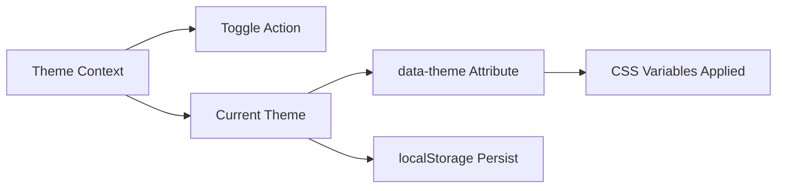

---
title: Theme Management
slug: day-039-theme-management
dayLabel: Day 39
level: Intermediate
estimatedMinutes: 30
order: 39
track: react
---
# Day 39 [Intermediate]: Theme Management

## Index

- [Goal](#goal)
- [Prerequisites](#prerequisites)
- [Explanation](#explanation)
- [Topic by Topic](#topic-by-topic)
- [Key Concepts](#key-concepts)
- [Visual Concept Map](#visual-concept-map)
- [End-to-End Practical](#end-to-end-practical)
- [Hands-on Coding](#hands-on-coding)
- [Mini Exercise](#mini-exercise)
- [Assessment Quiz](#assessment-quiz)
- [Task](#task)
- [Self Check](#self-check)
- [Interview Questions and Answers](#interview-questions-and-answers)
- [Day 39 Outcome](#day-39-outcome)

## Goal

Build a global theme system with context, CSS variables, and persistence across page reloads.

## Prerequisites

- Day 38 completed
- Context and localStorage basics

## Explanation

Theme management is a classic app-wide state use case. Context provides theme value globally, while CSS variables apply visual changes cleanly.

## Topic by Topic

### Topic 1: Global Theme State

Theory:
Theme mode (light/dark) should be shared globally.

Practical:
Store theme in ThemeProvider.

Code Example:

```jsx
const [theme, setTheme] = useState("light");
```

**Explanation:** This topic explains Global Theme State in a practical way so you can apply it confidently in real React projects.

**Key Points:**

- Understand the core idea of Global Theme State.
- Apply the pattern using clean, readable code.
- Avoid common mistakes through predictable React flow.

### Topic 2: CSS Variables Strategy

Theory:
Use CSS custom properties for scalable theming.

Practical:
Define colors in `:root` and `[data-theme="dark"]`.

Code Example:

```css
--bg: #ffffff;
```

**Explanation:** This topic explains CSS Variables Strategy in a practical way so you can apply it confidently in real React projects.

**Key Points:**

- Understand the core idea of CSS Variables Strategy.
- Apply the pattern using clean, readable code.
- Avoid common mistakes through predictable React flow.

### Topic 3: Theme Toggle Action

Theory:
Expose toggleTheme action from context.

Practical:
Switch between light and dark modes.

Code Example:

```jsx
const toggleTheme = () => setTheme((t) => (t === "light" ? "dark" : "light"));
```

**Explanation:** This topic explains Theme Toggle Action in a practical way so you can apply it confidently in real React projects.

**Key Points:**

- Understand the core idea of Theme Toggle Action.
- Apply the pattern using clean, readable code.
- Avoid common mistakes through predictable React flow.

### Topic 4: Persist Theme in localStorage

Theory:
Persist user preference between sessions.

Practical:
Save theme on updates and hydrate initial value.

Code Example:

```jsx
localStorage.setItem("theme", theme);
```

**Explanation:** This topic explains Persist Theme in localStorage in a practical way so you can apply it confidently in real React projects.

**Key Points:**

- Understand the core idea of Persist Theme in localStorage.
- Apply the pattern using clean, readable code.
- Avoid common mistakes through predictable React flow.

### Topic 5: Apply Theme Attribute

Theory:
Attach current theme to document element for CSS targeting.

Practical:
Set `data-theme` dynamically.

Code Example:

```jsx
document.documentElement.setAttribute("data-theme", theme);
```

**Explanation:** This topic explains Apply Theme Attribute in a practical way so you can apply it confidently in real React projects.

**Key Points:**

- Understand the core idea of Apply Theme Attribute.
- Apply the pattern using clean, readable code.
- Avoid common mistakes through predictable React flow.

### Topic 6: Prevent Theme Flash on First Paint

Theory:
If theme is applied after first render, users may briefly see the wrong colors.

Practical:
Initialize theme value as early as possible and apply root attribute before heavy UI paints.

Code Example:

```jsx
const initialTheme = localStorage.getItem("theme") || "light";
```

**Explanation:** This topic explains Prevent Theme Flash on First Paint in a practical way so you can apply it confidently in real React projects.

**Key Points:**

- Understand the core idea of Prevent Theme Flash on First Paint.
- Apply the pattern using clean, readable code.
- Avoid common mistakes through predictable React flow.

## Key Concepts

- Global theme context
- CSS variable-based theming
- Theme toggle architecture
- Preference persistence
- Root-level theme application
- First-paint theme stability

## Visual Concept Map



## End-to-End Practical

1. Create ThemeContext provider.
2. Add toggle action.
3. Persist theme in localStorage.
4. Apply theme to root attribute.
5. Consume theme in header/body components.

## Hands-on Coding

### Example 1: Case - Theme Provider with Persistence

Scenario:
A productivity app should remember user theme preference after browser refresh.

```jsx
import { createContext, useEffect, useState } from "react";

export const ThemeContext = createContext(null);

export function ThemeProvider({ children }) {
  const [theme, setTheme] = useState(
    () => localStorage.getItem("theme") || "light",
  );

  const toggleTheme = () => {
    setTheme((t) => (t === "light" ? "dark" : "light"));
  };

  useEffect(() => {
    localStorage.setItem("theme", theme);
    document.documentElement.setAttribute("data-theme", theme);
  }, [theme]);

  return (
    <ThemeContext.Provider value={{ theme, toggleTheme }}>
      {children}
    </ThemeContext.Provider>
  );
}
```

### Example 2: Case - Theme Toggle Button in Navbar

Scenario:
A navbar should let users switch themes from any page.

```jsx
import { useContext } from "react";
import { ThemeContext } from "./ThemeContext";

function ThemeToggle() {
  const { theme, toggleTheme } = useContext(ThemeContext);
  return <button onClick={toggleTheme}>Theme: {theme}</button>;
}
```

### Example 3: Case - CSS Variables for Light and Dark Modes

Scenario:
A design system should adapt colors globally without editing each component style manually.

```css
:root {
  --bg: #ffffff;
  --text: #111111;
}

[data-theme="dark"] {
  --bg: #111111;
  --text: #f4f4f4;
}

body {
  background: var(--bg);
  color: var(--text);
}
```

## Mini Exercise

Scenario:
You are building a coding challenge platform.

Add theme options: light, dark, and sepia. Persist selected theme and apply through CSS variables.

Expected output:

- Theme choice persists after refresh
- App styles update globally
- Toggle/control component works from any route

## Assessment Quiz

### Quiz Questions

1. Why is context useful for theming?
2. What is the benefit of CSS variables for theme management?
3. True or False: theme state should reset on every page reload.
4. Where is theme preference usually stored locally?
5. How do you apply theme globally in DOM?

### Quiz Answers

1. Theme is shared across many components
2. Centralized, scalable styling updates
3. False
4. localStorage
5. Set root `data-theme` attribute

## Task

- Build global theme provider
- Add persistent toggle
- Complete mini exercise

## Self Check

- You can implement production-style theme management
- You can combine context, localStorage, and CSS variables
- You can answer at least 4 out of 5 quiz questions correctly

## Interview Questions and Answers

### Beginner

**Question:** Why use context for theme?

**Answer:** Theme must be available across many components globally.

**Question:** What does theme toggle function do?

**Answer:** Switches current theme mode value.

### Middle

**Question:** Why choose CSS variables over inline style objects for theming?

**Answer:** They are cleaner, global, and easier to scale.

**Question:** How do you persist user-selected theme?

**Answer:** Save in localStorage and hydrate initial state from it.

### Advanced

**Question:** How would you avoid flash of wrong theme on first paint?

**Answer:** Initialize theme early before first render, including root attribute pre-set.

**Question:** How can design tokens improve theming architecture?

**Answer:** They standardize semantic colors and simplify multi-theme evolution.

## Day 39 Outcome

- You can build a robust global theme system
- You can persist and apply themes cleanly
- You are ready for auth context patterns in Day 40

