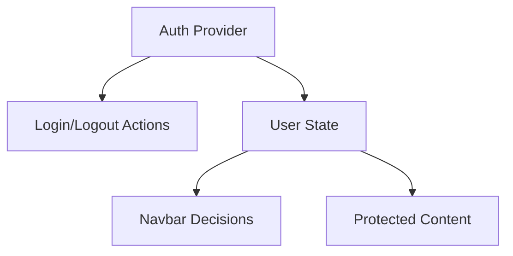

---
title: Authentication Context
slug: day-040-authentication-context
dayLabel: Day 40
level: Intermediate
estimatedMinutes: 30
order: 40
track: react
---
# Day 40 [Intermediate]: Authentication Context

## Index

- [Goal](#goal)
- [Prerequisites](#prerequisites)
- [Explanation](#explanation)
- [Topic by Topic](#topic-by-topic)
- [Key Concepts](#key-concepts)
- [Visual Concept Map](#visual-concept-map)
- [End-to-End Practical](#end-to-end-practical)
- [Hands-on Coding](#hands-on-coding)
- [Mini Exercise](#mini-exercise)
- [Assessment Quiz](#assessment-quiz)
- [Task](#task)
- [Self Check](#self-check)
- [Interview Questions and Answers](#interview-questions-and-answers)
- [Day 40 Outcome](#day-40-outcome)

## Goal

Implement authentication flow with context and render auth-aware UI elements based on login state.

## Prerequisites

- Day 39 completed
- Context provider and consumer patterns

## Explanation

Authentication context centralizes user session state and actions, enabling protected UI behavior across the app.

## Topic by Topic

### Topic 1: Auth State Model

Theory:
Auth typically tracks user object and authenticated flag.

Practical:
Store user as null or object.

Code Example:

```jsx
const [user, setUser] = useState(null);
```

**Explanation:** This topic explains Auth State Model in a practical way so you can apply it confidently in real React projects.

**Key Points:**

- Understand the core idea of Auth State Model.
- Apply the pattern using clean, readable code.
- Avoid common mistakes through predictable React flow.

### Topic 2: Login and Logout Actions

Theory:
Context should expose auth actions for consumers.

Practical:
Mock login by setting user object.

Code Example:

```jsx
const login = (email) => setUser({ email, role: "user" });
```

**Explanation:** This topic explains Login and Logout Actions in a practical way so you can apply it confidently in real React projects.

**Key Points:**

- Understand the core idea of Login and Logout Actions.
- Apply the pattern using clean, readable code.
- Avoid common mistakes through predictable React flow.

### Topic 3: Auth-aware Navbar

Theory:
Render menu links based on auth state.

Practical:
Show Profile/Logout only when logged in.

Code Example:

```jsx
{
  user ? (
    <button onClick={logout}>Logout</button>
  ) : (
    <button onClick={login}>Login</button>
  );
}
```

**Explanation:** This topic explains Auth-aware Navbar in a practical way so you can apply it confidently in real React projects.

**Key Points:**

- Understand the core idea of Auth-aware Navbar.
- Apply the pattern using clean, readable code.
- Avoid common mistakes through predictable React flow.

### Topic 4: Protected UI Segments

Theory:
Restrict sensitive components when user is not authenticated.

Practical:
Show dashboard content only for logged-in users.

Code Example:

```jsx
return user ? <Dashboard /> : <LoginPrompt />;
```

**Explanation:** This topic explains Protected UI Segments in a practical way so you can apply it confidently in real React projects.

**Key Points:**

- Understand the core idea of Protected UI Segments.
- Apply the pattern using clean, readable code.
- Avoid common mistakes through predictable React flow.

### Topic 5: Session Persistence Basics

Theory:
Persist minimal auth session details if needed.

Practical:
Store mock user in localStorage.

Code Example:

```jsx
localStorage.setItem("authUser", JSON.stringify(user));
```

**Explanation:** This topic explains Session Persistence Basics in a practical way so you can apply it confidently in real React projects.

**Key Points:**

- Understand the core idea of Session Persistence Basics.
- Apply the pattern using clean, readable code.
- Avoid common mistakes through predictable React flow.

### Topic 6: Session Security Boundaries

Theory:
Frontend auth state controls UI behavior, but real security depends on backend validation and safe token storage choices.

Practical:
Use mock localStorage in learning projects, and discuss HttpOnly cookie-based sessions for production systems.

Code Example:

```jsx
// UI guards client routes; backend still enforces real authorization.
```

**Explanation:** This topic explains Session Security Boundaries in a practical way so you can apply it confidently in real React projects.

**Key Points:**

- Understand the core idea of Session Security Boundaries.
- Apply the pattern using clean, readable code.
- Avoid common mistakes through predictable React flow.

## Key Concepts

- Central auth state
- Login/logout actions
- Auth-aware conditional UI
- Protected component rendering
- Session persistence basics
- Client vs server auth responsibilities

## Visual Concept Map



## End-to-End Practical

1. Create AuthContext and AuthProvider.
2. Add login/logout actions.
3. Wrap app with provider.
4. Build auth-aware navbar.
5. Render protected section conditionally.

## Hands-on Coding

### Example 1: Case - Basic Auth Provider

Scenario:
A company intranet app needs shared login state for all pages.

```jsx
import { createContext, useEffect, useState } from "react";

export const AuthContext = createContext(null);

export function AuthProvider({ children }) {
  const [user, setUser] = useState(() => {
    const saved = localStorage.getItem("authUser");
    return saved ? JSON.parse(saved) : null;
  });

  const login = (email) => setUser({ email, role: "user" });
  const logout = () => setUser(null);

  useEffect(() => {
    if (user) localStorage.setItem("authUser", JSON.stringify(user));
    else localStorage.removeItem("authUser");
  }, [user]);

  return (
    <AuthContext.Provider value={{ user, login, logout }}>
      {children}
    </AuthContext.Provider>
  );
}
```

### Example 2: Case - Protected Navbar Links

Scenario:
A navigation bar should show different links based on whether user is logged in.

```jsx
import { useContext } from "react";
import { AuthContext } from "./AuthContext";

function Navbar() {
  const { user, login, logout } = useContext(AuthContext);

  return (
    <nav>
      <a href="#home">Home</a>
      {user && <a href="#profile">Profile</a>}
      {user && <a href="#settings">Settings</a>}
      {user ? (
        <button onClick={logout}>Logout</button>
      ) : (
        <button onClick={() => login("learner@site.com")}>Login</button>
      )}
    </nav>
  );
}
```

### Example 3: Case - Protected Dashboard Block

Scenario:
Only authenticated users should see analytics panel.

```jsx
import { useContext } from "react";
import { AuthContext } from "./AuthContext";

function DashboardGate() {
  const { user } = useContext(AuthContext);
  if (!user) return <p>Please login to access dashboard.</p>;
  return <p>Secure analytics panel</p>;
}
```

## Mini Exercise

Scenario:
You are building an online exam portal.

Implement AuthContext with login/logout and role (`student` or `admin`). Show Admin Panel link only for admin users.

Expected output:

- Auth state available globally
- Navbar updates based on login and role
- Protected content hidden for unauthorized users

## Assessment Quiz

### Quiz Questions

1. Why keep auth state in context?
2. What should logout do besides clearing state?
3. True or False: protected UI checks alone are enough for backend security.
4. How do you conditionally render role-based links?
5. Why persist auth in localStorage in demos?

### Quiz Answers

1. Many components depend on auth info globally
2. Remove persisted session data
3. False
4. Check `user.role` before rendering links
5. To keep session across refresh for local app behavior

## Task

- Build auth provider with mock login/logout
- Add auth-aware navbar and protected section
- Complete mini exercise

## Self Check

- You can implement shared auth context correctly
- You can design auth-based conditional rendering
- You can answer at least 4 out of 5 quiz questions correctly

## Interview Questions and Answers

### Beginner

**Question:** Why use context for authentication?

**Answer:** Auth data is needed across many components globally.

**Question:** What does a login action usually update?

**Answer:** User/session state.

### Middle

**Question:** How do you show protected links in navbar?

**Answer:** Render links only when user exists or has required role.

**Question:** How can auth persistence be implemented simply?

**Answer:** Save user data in localStorage and hydrate on app start.

### Advanced

**Question:** Why is client-side auth check not enough for security?

**Answer:** Backend authorization must still validate access.

**Question:** How do you reduce auth-related re-renders in large apps?

**Answer:** Split auth context fields/actions and memoize provider value.

## Day 40 Outcome

- You can build auth-aware UI using context
- You can manage login/logout and protected rendering patterns
- You are ready for routing-focused lessons starting Day 41

