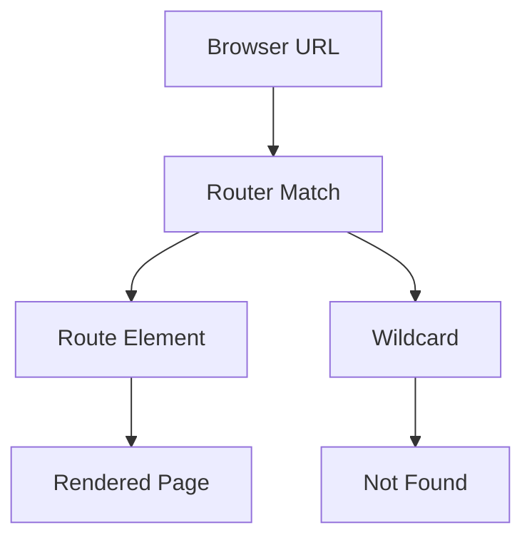

---
title: React Router Setup
slug: day-041-react-router-setup
dayLabel: Day 41
level: Intermediate
estimatedMinutes: 30
order: 41
track: react
---
# Day 41 [Intermediate]: React Router Setup

## Index

- [Goal](#goal)
- [Prerequisites](#prerequisites)
- [Explanation](#explanation)
- [Topic by Topic](#topic-by-topic)
- [Key Concepts](#key-concepts)
- [Visual Concept Map](#visual-concept-map)
- [End-to-End Practical](#end-to-end-practical)
- [Hands-on Coding](#hands-on-coding)
- [Mini Exercise](#mini-exercise)
- [Assessment Quiz](#assessment-quiz)
- [Task](#task)
- [Self Check](#self-check)
- [Interview Questions and Answers](#interview-questions-and-answers)
- [Day 41 Outcome](#day-41-outcome)

## Goal

Set up React Router in a SPA and define core routes with a Not Found fallback.

## Prerequisites

- Day 40 completed
- Basic component structure and JSX

## Explanation

React Router enables client-side navigation where URL changes render different components without full page refresh.

## Topic by Topic

### Topic 1: Router Installation and Setup

Theory:
Use `react-router-dom` for browser-based routing.

Practical:
Wrap app with BrowserRouter.

Code Example:

```jsx
import { BrowserRouter } from "react-router-dom";
```

**Explanation:** This topic explains Router Installation and Setup in a practical way so you can apply it confidently in real React projects.

**Key Points:**

- Understand the core idea of Router Installation and Setup.
- Apply the pattern using clean, readable code.
- Avoid common mistakes through predictable React flow.

### Topic 2: Route Definitions

Theory:
Use `Routes` and `Route` to map URL paths to components.

Practical:
Define Home/About/Contact routes.

Code Example:

```jsx
<Route path="/about" element={<About />} />
```

**Explanation:** This topic explains Route Definitions in a practical way so you can apply it confidently in real React projects.

**Key Points:**

- Understand the core idea of Route Definitions.
- Apply the pattern using clean, readable code.
- Avoid common mistakes through predictable React flow.

### Topic 3: Not Found Route

Theory:
Wildcard route catches unmatched paths.

Practical:
Add 404 page component.

Code Example:

```jsx
<Route path="*" element={<NotFound />} />
```

**Explanation:** This topic explains Not Found Route in a practical way so you can apply it confidently in real React projects.

**Key Points:**

- Understand the core idea of Not Found Route.
- Apply the pattern using clean, readable code.
- Avoid common mistakes through predictable React flow.

### Topic 4: Route-based Page Components

Theory:
Each route should map to focused page components.

Practical:
Create `HomePage`, `AboutPage`, `ContactPage`.

Code Example:

```jsx
function HomePage() {
  return <h2>Home</h2>;
}
```

**Explanation:** This topic explains Route-based Page Components in a practical way so you can apply it confidently in real React projects.

**Key Points:**

- Understand the core idea of Route-based Page Components.
- Apply the pattern using clean, readable code.
- Avoid common mistakes through predictable React flow.

### Topic 5: SPA Navigation Behavior

Theory:
Routing updates UI without full browser reload.

Practical:
Switch routes and observe preserved app shell.

Code Example:

```jsx
// URL changes and React renders matching route element.
```

**Explanation:** This topic explains SPA Navigation Behavior in a practical way so you can apply it confidently in real React projects.

**Key Points:**

- Understand the core idea of SPA Navigation Behavior.
- Apply the pattern using clean, readable code.
- Avoid common mistakes through predictable React flow.

### Topic 6: Layout Routing and Route Ownership

Theory:
As apps grow, routes should not all live in one large file. Grouping related routes under layouts makes routing easier to scale and maintain.

Practical:
Create one shared layout route and keep route definitions close to the page or feature that owns them.

Code Example:

```jsx
<Routes>
  <Route path="/" element={<MainLayout />}>
    <Route index element={<Home />} />
    <Route path="about" element={<About />} />
  </Route>
</Routes>
```

**Explanation:** This topic explains Layout Routing and Route Ownership in a practical way so you can apply it confidently in real React projects.

**Key Points:**

- Understand the core idea of Layout Routing and Route Ownership.
- Apply the pattern using clean, readable code.
- Avoid common mistakes through predictable React flow.

## Key Concepts

- BrowserRouter wrapper
- Routes and Route mapping
- Wildcard fallback route
- SPA navigation flow
- Page component separation
- Layout-based route grouping
- Route ownership for growing apps

## Visual Concept Map



## End-to-End Practical

1. Install and import router package.
2. Wrap root app with BrowserRouter.
3. Create three page components.
4. Add route mappings.
5. Add wildcard route for 404.

## Hands-on Coding

### Example 1: Case - Company Website Basic Routing

Scenario:
A corporate website needs Home, About, and Contact pages.

```jsx
import { BrowserRouter, Route, Routes } from "react-router-dom";

function Home() {
  return <h2>Home</h2>;
}
function About() {
  return <h2>About</h2>;
}
function Contact() {
  return <h2>Contact</h2>;
}

function App() {
  return (
    <BrowserRouter>
      <Routes>
        <Route path="/" element={<Home />} />
        <Route path="/about" element={<About />} />
        <Route path="/contact" element={<Contact />} />
      </Routes>
    </BrowserRouter>
  );
}
```

### Example 2: Case - Add Not Found Route

Scenario:
Unknown URLs should show a friendly 404 page.

```jsx
function NotFound() {
  return <h2>404 - Page Not Found</h2>;
}

<Route path="*" element={<NotFound />} />;
```

### Example 3: Case - Route Components as Separate Files

Scenario:
A training app keeps route pages modular for maintainability.

```jsx
<Routes>
  <Route path="/" element={<HomePage />} />
  <Route path="/courses" element={<CoursesPage />} />
  <Route path="/profile" element={<ProfilePage />} />
</Routes>
```

## Mini Exercise

Scenario:
You are building a school portal.

Create routes for Dashboard, Students, Teachers, and a 404 page.

Expected output:

- Correct component renders for each path
- Unknown path renders 404 page
- SPA navigation behavior works without full reload

## Assessment Quiz

### Quiz Questions

1. What is the purpose of BrowserRouter?
2. Why do we use Route inside Routes?
3. True or False: `path="*"` handles unmatched URLs.
4. What is the benefit of client-side routing in SPA?
5. Why keep route pages as separate components?
6. Why are layout routes useful in larger React apps?

### Quiz Answers

1. It enables routing using browser history
2. To map URL paths to components
3. True
4. Faster navigation without full page reload
5. Better maintainability and page separation
6. They group related pages under shared UI and keep route structure easier to manage.

## Task

- Configure Router with at least 4 routes
- Add wildcard 404 route
- Complete mini exercise

## Self Check

- You can configure base React Router setup
- You can define route mappings and fallback behavior
- You can answer at least 4 out of 5 quiz questions correctly

## Interview Questions and Answers

### Beginner

**Question:** What is React Router used for?

**Answer:** Client-side navigation between pages in a React SPA.

**Question:** What does `Route` define?

**Answer:** A mapping between path and component element.

### Middle

**Question:** Why add a wildcard route?

**Answer:** To handle unknown paths with a proper Not Found page.

**Question:** Where should BrowserRouter be placed?

**Answer:** Usually near root so routing is available across app.

### Advanced

**Question:** How does React Router differ from server-side routing?

**Answer:** Router matches paths in browser and updates UI without full request cycle.

**Question:** What deployment setting helps direct URL refresh with client routing?

**Answer:** Server fallback to index.html for unmatched static paths.

## Day 41 Outcome

- You can set up router foundation in a React SPA
- You can add standard and fallback routes confidently
- You are ready for navigation patterns in Day 42

