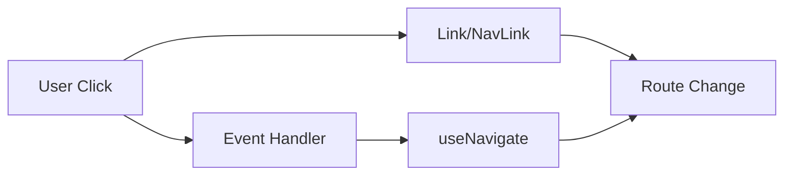

---
title: Routes and Navigation
slug: day-042-routes-and-navigation
dayLabel: Day 42
level: Intermediate
estimatedMinutes: 30
order: 42
track: react
---
# Day 42 [Intermediate]: Routes and Navigation

## Index

- [Goal](#goal)
- [Prerequisites](#prerequisites)
- [Explanation](#explanation)
- [Topic by Topic](#topic-by-topic)
- [Key Concepts](#key-concepts)
- [Visual Concept Map](#visual-concept-map)
- [End-to-End Practical](#end-to-end-practical)
- [Hands-on Coding](#hands-on-coding)
- [Mini Exercise](#mini-exercise)
- [Assessment Quiz](#assessment-quiz)
- [Task](#task)
- [Self Check](#self-check)
- [Interview Questions and Answers](#interview-questions-and-answers)
- [Day 42 Outcome](#day-42-outcome)

## Goal

Implement both link-based and programmatic navigation with active route styling.

## Prerequisites

- Day 41 completed
- Basic route setup available

## Explanation

Navigation in React Router includes clickable links (`Link`, `NavLink`) and code-driven redirects using `useNavigate`.

## Topic by Topic

### Topic 1: Link vs Anchor Tag

Theory:
Use `Link` to avoid full page reload in SPA.

Practical:
Replace `<a href>` with `<Link to>`.

Code Example:

```jsx
<Link to="/about">About</Link>
```

**Explanation:** This topic explains Link vs Anchor Tag in a practical way so you can apply it confidently in real React projects.

**Key Points:**

- Understand the core idea of Link vs Anchor Tag.
- Apply the pattern using clean, readable code.
- Avoid common mistakes through predictable React flow.

### Topic 2: NavLink Active Styling

Theory:
`NavLink` provides active state for current route.

Practical:
Highlight current page tab.

Code Example:

```jsx
<NavLink
  to="/dashboard"
  className={({ isActive }) => (isActive ? "active" : "")}
>
  Dashboard
</NavLink>
```

**Explanation:** This topic explains NavLink Active Styling in a practical way so you can apply it confidently in real React projects.

**Key Points:**

- Understand the core idea of NavLink Active Styling.
- Apply the pattern using clean, readable code.
- Avoid common mistakes through predictable React flow.

### Topic 3: Programmatic Navigation

Theory:
`useNavigate` navigates after events like form submit.

Practical:
Redirect to success page after save.

Code Example:

```jsx
const navigate = useNavigate();
navigate("/success");
```

**Explanation:** This topic explains Programmatic Navigation in a practical way so you can apply it confidently in real React projects.

**Key Points:**

- Understand the core idea of Programmatic Navigation.
- Apply the pattern using clean, readable code.
- Avoid common mistakes through predictable React flow.

### Topic 4: Navigation with State

Theory:
You can pass temporary state during navigation.

Practical:
Pass form status to target route.

Code Example:

```jsx
navigate("/result", { state: { message: "Saved" } });
```

**Explanation:** This topic explains Navigation with State in a practical way so you can apply it confidently in real React projects.

**Key Points:**

- Understand the core idea of Navigation with State.
- Apply the pattern using clean, readable code.
- Avoid common mistakes through predictable React flow.

### Topic 5: Back/Forward Navigation

Theory:
Navigate can move browser history stack.

Practical:
Add back button.

Code Example:

```jsx
navigate(-1);
```

**Explanation:** This topic explains Back/Forward Navigation in a practical way so you can apply it confidently in real React projects.

**Key Points:**

- Understand the core idea of Back/Forward Navigation.
- Apply the pattern using clean, readable code.
- Avoid common mistakes through predictable React flow.

### Topic 6: Navigation Accessibility and Focus

Theory:
After route changes, keyboard and screen-reader users need clear focus position and page context.

Practical:
Move focus to main heading or content landmark on navigation in complex apps.

Code Example:

```jsx
// Set focus to route heading after navigation for better accessibility.
```

**Explanation:** This topic explains Navigation Accessibility and Focus in a practical way so you can apply it confidently in real React projects.

**Key Points:**

- Understand the core idea of Navigation Accessibility and Focus.
- Apply the pattern using clean, readable code.
- Avoid common mistakes through predictable React flow.

## Key Concepts

- Link and NavLink usage
- Active route styling
- Programmatic redirects
- Navigation state passing
- History navigation
- Accessible route transitions

## Visual Concept Map



## End-to-End Practical

1. Create navbar with NavLink.
2. Apply active style class.
3. Build submit form page.
4. Redirect after submit using navigate.
5. Add back navigation button.

## Hands-on Coding

### Example 1: Case - Active Menu in Admin Panel

Scenario:
An admin UI should visibly highlight active section in left menu.

```jsx
import { NavLink } from "react-router-dom";

function Sidebar() {
  return (
    <nav>
      <NavLink
        to="/overview"
        className={({ isActive }) => (isActive ? "active" : "")}
      >
        Overview
      </NavLink>
      <NavLink
        to="/reports"
        className={({ isActive }) => (isActive ? "active" : "")}
      >
        Reports
      </NavLink>
      <NavLink
        to="/settings"
        className={({ isActive }) => (isActive ? "active" : "")}
      >
        Settings
      </NavLink>
    </nav>
  );
}
```

### Example 2: Case - Redirect After Contact Form Submit

Scenario:
A contact page should redirect users to thank-you page after submit.

```jsx
import { useNavigate } from "react-router-dom";

function ContactForm() {
  const navigate = useNavigate();

  const handleSubmit = (e) => {
    e.preventDefault();
    navigate("/thank-you", { state: { from: "contact" } });
  };

  return (
    <form onSubmit={handleSubmit}>
      <button type="submit">Send</button>
    </form>
  );
}
```

### Example 3: Case - Back Button in Details Page

Scenario:
User should return to previous list view quickly from details page.

```jsx
import { useNavigate } from "react-router-dom";

function BackButton() {
  const navigate = useNavigate();
  return <button onClick={() => navigate(-1)}>Go Back</button>;
}
```

## Mini Exercise

Scenario:
You are building a job portal.

Create nav links for Jobs, Companies, Profile with active styles. On applying to a job, redirect to application-success page programmatically.

Expected output:

- Active link style updates with route
- Form submit navigates to success page
- Back button returns to previous route

## Assessment Quiz

### Quiz Questions

1. Why prefer Link over anchor in React SPA?
2. What does NavLink provide beyond Link?
3. True or False: useNavigate can only move to string paths.
4. How do you navigate after API success?
5. What does navigate(-1) do?

### Quiz Answers

1. Prevents full reload and keeps SPA routing flow
2. Active-state awareness for styling
3. False
4. Call `navigate` inside success handler
5. Moves one step back in history

## Task

- Build nav with active link states
- Add one programmatic redirect flow
- Complete mini exercise

## Self Check

- You can build route navigation UX patterns
- You can use both static and programmatic navigation
- You can answer at least 4 out of 5 quiz questions correctly

## Interview Questions and Answers

### Beginner

**Question:** What does useNavigate do?

**Answer:** It navigates to another route from JavaScript logic.

**Question:** Why use NavLink?

**Answer:** To style currently active route links.

### Middle

**Question:** How do you pass data while navigating?

**Answer:** Use second argument `state` in navigate.

**Question:** What is a common mistake with navigation links?

**Answer:** Using regular anchor tags causing full page reload.

### Advanced

**Question:** How do you preserve post-login return path?

**Answer:** Pass intended path in navigation state and redirect after auth.

**Question:** How can navigation impact accessibility?

**Answer:** Active indicators and focus management improve keyboard navigation clarity.

## Day 42 Outcome

- You can implement robust app navigation patterns
- You can handle redirects and active route styling cleanly
- You are ready for dynamic URL params in Day 43

