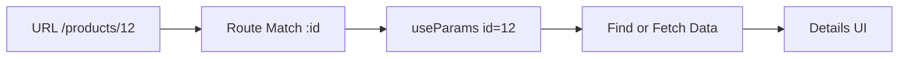

---
title: Route Parameters
slug: day-043-route-parameters
dayLabel: Day 43
level: Beginner
estimatedMinutes: 30
order: 43
track: react
---
# Day 43 [Intermediate to Advanced]: Route Parameters

## Index

- [Goal](#goal)
- [Prerequisites](#prerequisites)
- [Explanation](#explanation)
- [Topic by Topic](#topic-by-topic)
- [Key Concepts](#key-concepts)
- [Visual Concept Map](#visual-concept-map)
- [End-to-End Practical](#end-to-end-practical)
- [Hands-on Coding](#hands-on-coding)
- [Mini Exercise](#mini-exercise)
- [Assessment Quiz](#assessment-quiz)
- [Task](#task)
- [Self Check](#self-check)
- [Interview Questions and Answers](#interview-questions-and-answers)
- [Day 43 Outcome](#day-43-outcome)

## Goal

Use route parameters to build dynamic detail pages driven by URL values.

## Prerequisites

- Day 42 completed
- Basic route and navigation understanding

## Explanation

Route params like `/products/:id` let one component render different content based on URL input.

## Topic by Topic

### Topic 1: Dynamic Route Syntax

Theory:
Prefix segment with `:` for parameter placeholders.

Practical:
Define product details route.

Code Example:

```jsx
<Route path="/products/:id" element={<ProductDetails />} />
```

**Explanation:** This topic explains Dynamic Route Syntax in a practical way so you can apply it confidently in real React projects.

**Key Points:**

- Understand the core idea of Dynamic Route Syntax.
- Apply the pattern using clean, readable code.
- Avoid common mistakes through predictable React flow.

### Topic 2: Reading Params with useParams

Theory:
`useParams` returns key-value route parameter object.

Practical:
Read product id string.

Code Example:

```jsx
const { id } = useParams();
```

**Explanation:** This topic explains Reading Params with useParams in a practical way so you can apply it confidently in real React projects.

**Key Points:**

- Understand the core idea of Reading Params with useParams.
- Apply the pattern using clean, readable code.
- Avoid common mistakes through predictable React flow.

### Topic 3: Finding Matched Data

Theory:
Use param to find matching item from list or API result.

Practical:
Match by id in local product array.

Code Example:

```jsx
const product = products.find((p) => p.id === Number(id));
```

**Explanation:** This topic explains Finding Matched Data in a practical way so you can apply it confidently in real React projects.

**Key Points:**

- Understand the core idea of Finding Matched Data.
- Apply the pattern using clean, readable code.
- Avoid common mistakes through predictable React flow.

### Topic 4: Invalid Param Handling

Theory:
Unknown ids should show safe fallback UI.

Practical:
Show "Product not found" message.

Code Example:

```jsx
if (!product) return <p>Product not found</p>;
```

**Explanation:** This topic explains Invalid Param Handling in a practical way so you can apply it confidently in real React projects.

**Key Points:**

- Understand the core idea of Invalid Param Handling.
- Apply the pattern using clean, readable code.
- Avoid common mistakes through predictable React flow.

### Topic 5: Param + Fetch Integration

Theory:
Params can trigger API requests for detail views.

Practical:
Fetch user details by id parameter.

Code Example:

```jsx
useEffect(() => {
  fetch(`/api/users/${id}`);
}, [id]);
```

**Explanation:** This topic explains Param + Fetch Integration in a practical way so you can apply it confidently in real React projects.

**Key Points:**

- Understand the core idea of Param + Fetch Integration.
- Apply the pattern using clean, readable code.
- Avoid common mistakes through predictable React flow.

### Topic 6: Params with Query Strings

Theory:
Many real pages combine path params (resource identity) with query params (view controls like tab or sort).

Practical:
Use `:id` for entity selection and query string for UI state such as `?tab=activity`.

Code Example:

```jsx
// Example URL: /users/42?tab=activity
```

**Explanation:** This topic explains Params with Query Strings in a practical way so you can apply it confidently in real React projects.

**Key Points:**

- Understand the core idea of Params with Query Strings.
- Apply the pattern using clean, readable code.
- Avoid common mistakes through predictable React flow.

## Key Concepts

- Dynamic path segments
- Param extraction via useParams
- ID-driven details rendering
- Invalid param fallback
- Param-based data fetching
- URL contract design

## Visual Concept Map



## End-to-End Practical

1. Add list page with links to detail paths.
2. Define dynamic route path.
3. Read id from useParams.
4. Resolve item by id.
5. Handle no-match state.

## Hands-on Coding

### Example 1: Case - Product Details by ID

Scenario:
An e-commerce catalog should open detail page using selected product id.

```jsx
import { Link, Route, Routes, useParams } from "react-router-dom";

const products = [
  { id: 1, name: "Phone", price: 500 },
  { id: 2, name: "Laptop", price: 1200 },
];

function ProductList() {
  return products.map((p) => (
    <Link key={p.id} to={`/products/${p.id}`}>
      {p.name}
    </Link>
  ));
}

function ProductDetails() {
  const { id } = useParams();
  const product = products.find((p) => p.id === Number(id));
  if (!product) return <p>Product not found</p>;
  return (
    <p>
      {product.name} - ${product.price}
    </p>
  );
}
```

### Example 2: Case - Employee Profile Route

Scenario:
An HR app routes to employee profile by employee id.

```jsx
function EmployeeProfile({ employees }) {
  const { id } = useParams();
  const emp = employees.find((e) => e.id === Number(id));
  return emp ? <h3>{emp.name}</h3> : <p>Employee not found</p>;
}
```

### Example 3: Case - Param-driven API Fetch

Scenario:
A blog details page fetches post data whenever route id changes.

```jsx
import { useEffect, useState } from "react";
import { useParams } from "react-router-dom";

function PostDetails() {
  const { id } = useParams();
  const [post, setPost] = useState(null);

  useEffect(() => {
    fetch(`https://jsonplaceholder.typicode.com/posts/${id}`)
      .then((res) => res.json())
      .then(setPost);
  }, [id]);

  if (!post) return <p>Loading...</p>;
  return <h3>{post.title}</h3>;
}
```

## Mini Exercise

Scenario:
You are building a course catalog.

Create list page and details page using route param `:courseId`. Handle invalid id with friendly message.

Expected output:

- Clicking list item navigates to dynamic details route
- useParams resolves selected id
- Invalid ID renders fallback UI

## Assessment Quiz

### Quiz Questions

1. How do you define route parameter in path?
2. Which hook reads route params?
3. True or False: Route params are always numbers.
4. Why cast param id before number comparison?
5. What should happen when param does not map to data?

### Quiz Answers

1. Use `:name` syntax in route path
2. useParams
3. False
4. Params are strings by default
5. Show no-data or not-found fallback

## Task

- Build one param-driven detail page
- Add invalid-param fallback state
- Complete mini exercise

## Self Check

- You can build URL-driven dynamic views
- You can safely handle route parameter edge cases
- You can answer at least 4 out of 5 quiz questions correctly

## Interview Questions and Answers

### Beginner

**Question:** What is route parameter?

**Answer:** A dynamic URL segment used to identify specific data.

**Question:** Which hook gives access to route params?

**Answer:** useParams.

### Middle

**Question:** Why is param usually parsed to number?

**Answer:** Because route params are strings and IDs may be numeric in data.

**Question:** How do you link to a dynamic route?

**Answer:** Build path string with selected item id.

### Advanced

**Question:** How can you avoid duplicate fetch logic on param pages?

**Answer:** Extract param-based loader logic into reusable hooks.

**Question:** What security note applies to route params?

**Answer:** Params are user-controlled input, so backend validation is still required.

## Day 43 Outcome

- You can build dynamic details pages using route params
- You can integrate params with local data and API fetch
- You are ready for nested route layouts in Day 44

