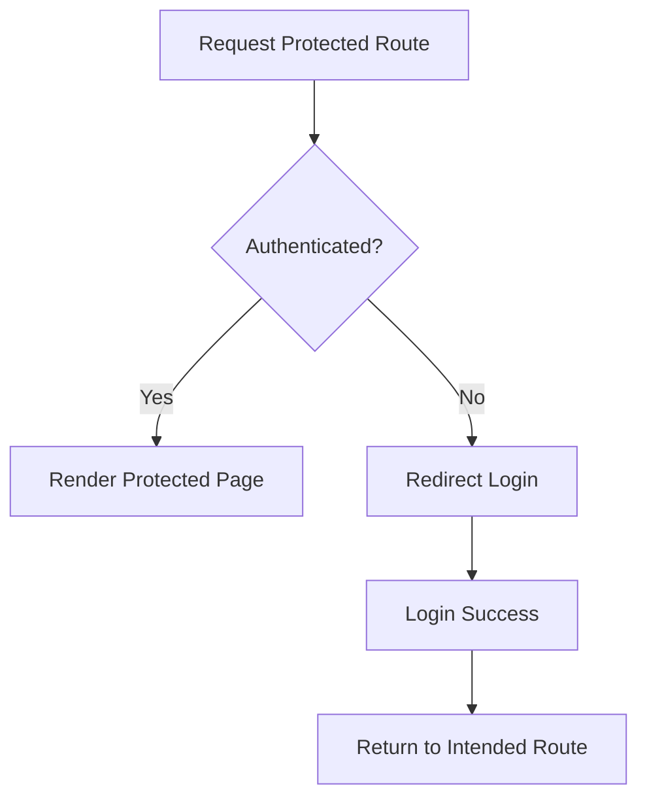

---
title: Protected Routes
slug: day-045-protected-routes
dayLabel: Day 45
level: Beginner
estimatedMinutes: 30
order: 45
track: react
---
# Day 45 [Intermediate to Advanced]: Protected Routes

## Index

- [Goal](#goal)
- [Prerequisites](#prerequisites)
- [Explanation](#explanation)
- [Topic by Topic](#topic-by-topic)
- [Key Concepts](#key-concepts)
- [Visual Concept Map](#visual-concept-map)
- [End-to-End Practical](#end-to-end-practical)
- [Hands-on Coding](#hands-on-coding)
- [Mini Exercise](#mini-exercise)
- [Assessment Quiz](#assessment-quiz)
- [Task](#task)
- [Self Check](#self-check)
- [Interview Questions and Answers](#interview-questions-and-answers)
- [Day 45 Outcome](#day-45-outcome)

## Goal

Implement route guards that allow access only to authenticated users and redirect others safely.

## Prerequisites

- Day 44 completed
- Auth context and routing fundamentals

## Explanation

Protected routes guard sensitive pages. If user is not authenticated, they are redirected to login and can optionally return afterward.

## Topic by Topic

### Topic 1: Guard Component Pattern

Theory:
Wrap protected elements in a reusable guard component.

Practical:
Create `ProtectedRoute` with auth check.

Code Example:

```jsx
return user ? children : <Navigate to="/login" replace />;
```

**Explanation:** This topic explains Guard Component Pattern in a practical way so you can apply it confidently in real React projects.

**Key Points:**

- Understand the core idea of Guard Component Pattern.
- Apply the pattern using clean, readable code.
- Avoid common mistakes through predictable React flow.

### Topic 2: Redirect with Navigate

Theory:
`Navigate` performs declarative redirection.

Practical:
Redirect unauthenticated user.

Code Example:

```jsx
<Navigate to="/login" replace />
```

**Explanation:** This topic explains Redirect with Navigate in a practical way so you can apply it confidently in real React projects.

**Key Points:**

- Understand the core idea of Redirect with Navigate.
- Apply the pattern using clean, readable code.
- Avoid common mistakes through predictable React flow.

### Topic 3: Preserve Intended Destination

Theory:
Store original path in location state for post-login return.

Practical:
Pass `from` path during redirect.

Code Example:

```jsx
<Navigate to="/login" state={{ from: location.pathname }} replace />
```

**Explanation:** This topic explains Preserve Intended Destination in a practical way so you can apply it confidently in real React projects.

**Key Points:**

- Understand the core idea of Preserve Intended Destination.
- Apply the pattern using clean, readable code.
- Avoid common mistakes through predictable React flow.

### Topic 4: Role-based Guards

Theory:
Some routes require specific roles beyond login.

Practical:
Allow admin page only for admin role.

Code Example:

```jsx
if (user?.role !== "admin") return <Navigate to="/forbidden" replace />;
```

**Explanation:** This topic explains Role-based Guards in a practical way so you can apply it confidently in real React projects.

**Key Points:**

- Understand the core idea of Role-based Guards.
- Apply the pattern using clean, readable code.
- Avoid common mistakes through predictable React flow.

### Topic 5: Guard Placement Strategy

Theory:
Protect individual routes or entire route groups.

Practical:
Wrap parent layout route with guard.

Code Example:

```jsx
<Route
  path="/app"
  element={
    <ProtectedRoute>
      <AppLayout />
    </ProtectedRoute>
  }
/>
```

**Explanation:** This topic explains Guard Placement Strategy in a practical way so you can apply it confidently in real React projects.

**Key Points:**

- Understand the core idea of Guard Placement Strategy.
- Apply the pattern using clean, readable code.
- Avoid common mistakes through predictable React flow.

### Topic 6: Auth Loading State in Guards

Theory:
When auth is restored asynchronously, guard checks should wait for loading completion to avoid false redirects.

Practical:
Add `isAuthLoading` state and render a short loader before deciding allow/redirect.

Code Example:

```jsx
if (isAuthLoading) return <p>Checking session...</p>;
```

**Explanation:** This topic explains Auth Loading State in Guards in a practical way so you can apply it confidently in real React projects.

**Key Points:**

- Understand the core idea of Auth Loading State in Guards.
- Apply the pattern using clean, readable code.
- Avoid common mistakes through predictable React flow.

## Key Concepts

- Authentication gate logic
- Redirect flow with Navigate
- Return-path state handling
- Role authorization checks
- Group-level route protection
- Loading-aware guard decisions

## Visual Concept Map



## End-to-End Practical

1. Build AuthContext with user state.
2. Create ProtectedRoute component.
3. Wrap protected routes with guard.
4. Redirect to login when unauthenticated.
5. Return user to original route after login.

## Hands-on Coding

### Example 1: Case - Basic Protected Dashboard Route

Scenario:
A dashboard should only be visible to signed-in users.

```jsx
import { Navigate } from "react-router-dom";
import { useAuth } from "./useAuth";

function ProtectedRoute({ children }) {
  const { user } = useAuth();
  return user ? children : <Navigate to="/login" replace />;
}
```

### Example 2: Case - Redirect Back After Login

Scenario:
User opening `/reports` directly should return there after successful login.

```jsx
import { Navigate, useLocation } from "react-router-dom";

function ProtectedRoute({ children }) {
  const { user } = useAuth();
  const location = useLocation();
  if (!user) {
    return <Navigate to="/login" state={{ from: location.pathname }} replace />;
  }
  return children;
}
```

### Example 3: Case - Admin-only Route Guard

Scenario:
Admin settings route should be blocked for normal users.

```jsx
function AdminRoute({ children }) {
  const { user } = useAuth();
  if (!user) return <Navigate to="/login" replace />;
  if (user.role !== "admin") return <Navigate to="/forbidden" replace />;
  return children;
}
```

## Mini Exercise

Scenario:
You are building an online assessment platform.

Protect `/exam` and `/results` routes for logged-in users only, and protect `/admin/reports` for admin role.

Expected output:

- Unauthenticated users are redirected to login
- Role-based route denies non-admin users
- Successful login returns user to intended route

## Assessment Quiz

### Quiz Questions

1. What is a protected route?
2. Which component is commonly used for redirect in React Router?
3. True or False: Client-side route guard replaces backend authorization.
4. Why pass `from` in redirect state?
5. How do role-based guards differ from basic auth guards?

### Quiz Answers

1. A route that requires auth checks before rendering
2. Navigate
3. False
4. To return user to intended destination after login
5. They verify both authentication and permission role

## Task

- Implement ProtectedRoute and AdminRoute components
- Apply guards to multiple routes
- Complete mini exercise

## Self Check

- You can guard routes using auth context
- You can implement redirect and return-path flows
- You can answer at least 4 out of 5 quiz questions correctly

## Interview Questions and Answers

### Beginner

**Question:** Why do we need protected routes?

**Answer:** To prevent unauthorized users from accessing restricted pages.

**Question:** What does Navigate do in route guards?

**Answer:** Redirects user to another route.

### Middle

**Question:** How do you return user to original page after login?

**Answer:** Store target path in navigation state and use it after auth success.

**Question:** How do you guard multiple routes with one pattern?

**Answer:** Wrap route groups with reusable guard components.

### Advanced

**Question:** Why should backend still enforce authorization?

**Answer:** Frontend guards are bypassable and only control UI access.

**Question:** How can guard logic stay maintainable at scale?

**Answer:** Centralize auth state, use focused guard components, and keep role rules declarative.

## Day 45 Outcome

- You can implement practical auth and role-based route guards
- You can design safe redirect flows for protected navigation
- You are ready for lazy loading and route performance topics ahead

