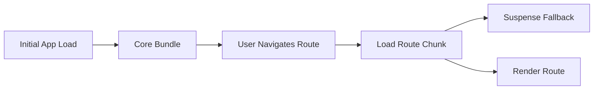

---
title: Lazy Loading Routes
slug: day-046-lazy-loading-routes
dayLabel: Day 46
level: Beginner
estimatedMinutes: 30
order: 46
track: react
---
# Day 46 [Intermediate to Advanced]: Lazy Loading Routes

## Index

- [Goal](#goal)
- [Prerequisites](#prerequisites)
- [Explanation](#explanation)
- [Topic by Topic](#topic-by-topic)
- [Key Concepts](#key-concepts)
- [Visual Concept Map](#visual-concept-map)
- [End-to-End Practical](#end-to-end-practical)
- [Hands-on Coding](#hands-on-coding)
- [Mini Exercise](#mini-exercise)
- [Assessment Quiz](#assessment-quiz)
- [Task](#task)
- [Self Check](#self-check)
- [Interview Questions and Answers](#interview-questions-and-answers)
- [Day 46 Outcome](#day-46-outcome)

## Goal

Implement lazy route loading with Suspense so route bundles load only when needed.

## Prerequisites

- Day 45 completed
- React Router setup and route guards knowledge

## Explanation

Lazy loading routes reduces initial JavaScript size by splitting route components into separate chunks loaded on demand.

## Topic by Topic

### Topic 1: What Lazy Loading Solves

Theory:
Large apps should avoid loading all route code on first page load.

Practical:
Load dashboard route only when user opens dashboard.

Code Example:

```jsx
const DashboardPage = lazy(() => import("./pages/DashboardPage"));
```

**Explanation:** This topic explains What Lazy Loading Solves in a practical way so you can apply it confidently in real React projects.

**Key Points:**

- Understand the core idea of What Lazy Loading Solves.
- Apply the pattern using clean, readable code.
- Avoid common mistakes through predictable React flow.

### Topic 2: React.lazy Basics

Theory:
`React.lazy` loads a component via dynamic import.

Practical:
Convert static imports into lazy imports.

Code Example:

```jsx
import { lazy } from "react";
```

**Explanation:** This topic explains React.lazy Basics in a practical way so you can apply it confidently in real React projects.

**Key Points:**

- Understand the core idea of React.lazy Basics.
- Apply the pattern using clean, readable code.
- Avoid common mistakes through predictable React flow.

### Topic 3: Suspense Fallback

Theory:
Suspense renders fallback UI while lazy chunk is loading.

Practical:
Show loader text during route fetch.

Code Example:

```jsx
<Suspense fallback={<p>Loading page...</p>}>
```

**Explanation:** This topic explains Suspense Fallback in a practical way so you can apply it confidently in real React projects.

**Key Points:**

- Understand the core idea of Suspense Fallback.
- Apply the pattern using clean, readable code.
- Avoid common mistakes through predictable React flow.

### Topic 4: Route-level Lazy Strategy

Theory:
Critical routes can stay eager; non-critical routes can be lazy.

Practical:
Keep Home eager, lazy load Reports/Settings.

Code Example:

```jsx
<Route path="/reports" element={<ReportsPage />} />
```

**Explanation:** This topic explains Route-level Lazy Strategy in a practical way so you can apply it confidently in real React projects.

**Key Points:**

- Understand the core idea of Route-level Lazy Strategy.
- Apply the pattern using clean, readable code.
- Avoid common mistakes through predictable React flow.

### Topic 5: Error Handling Around Lazy Chunks

Theory:
Network failures can break chunk loading.

Practical:
Wrap lazy routes with error boundary.

Code Example:

```jsx
// Error boundary catches lazy import failures.
```

**Explanation:** This topic explains Error Handling Around Lazy Chunks in a practical way so you can apply it confidently in real React projects.

**Key Points:**

- Understand the core idea of Error Handling Around Lazy Chunks.
- Apply the pattern using clean, readable code.
- Avoid common mistakes through predictable React flow.

### Topic 6: Prefetch Likely Next Routes

Theory:
If users commonly move to specific next pages, prefetching those chunks can reduce perceived wait.

Practical:
Prefetch high-probability routes after idle time or on link hover.

Code Example:

```jsx
// Prefetch next route chunk based on navigation behavior.
```

**Explanation:** This topic explains Prefetch Likely Next Routes in a practical way so you can apply it confidently in real React projects.

**Key Points:**

- Understand the core idea of Prefetch Likely Next Routes.
- Apply the pattern using clean, readable code.
- Avoid common mistakes through predictable React flow.

## Key Concepts

- Route-level chunking
- lazy + dynamic import
- Suspense fallback UX
- Critical vs non-critical loading
- Lazy-load failure resilience
- Prefetch strategy awareness

## Visual Concept Map



## End-to-End Practical

1. Convert two route pages to lazy imports.
2. Add Suspense around route rendering.
3. Keep Home route eager.
4. Add loading fallback component.
5. Navigate and verify on-demand chunk loading.

## Hands-on Coding

### Example 1: Case - Lazy Admin Routes

Scenario:
An enterprise app should load admin pages only when admin section is visited.

```jsx
import { Suspense, lazy } from "react";
import { Route, Routes } from "react-router-dom";
import HomePage from "./pages/HomePage";

const AdminUsersPage = lazy(() => import("./pages/AdminUsersPage"));
const AdminReportsPage = lazy(() => import("./pages/AdminReportsPage"));

function AppRoutes() {
  return (
    <Suspense fallback={<p>Loading page...</p>}>
      <Routes>
        <Route path="/" element={<HomePage />} />
        <Route path="/admin/users" element={<AdminUsersPage />} />
        <Route path="/admin/reports" element={<AdminReportsPage />} />
      </Routes>
    </Suspense>
  );
}
```

### Example 2: Case - Product Dashboard Deferred Load

Scenario:
A product team wants analytics and insights routes to load only on demand.

```jsx
import { Suspense, lazy } from "react";

const InsightsPage = lazy(() => import("./pages/InsightsPage"));

function InsightsRoute() {
  return (
    <Suspense fallback={<p>Loading insights...</p>}>
      <InsightsPage />
    </Suspense>
  );
}
```

### Example 3: Case - Protected Lazy Settings Page

Scenario:
Settings route should be both protected and lazy loaded.

```jsx
const SettingsPage = lazy(() => import("./pages/SettingsPage"));

<Route
  path="/settings"
  element={
    <ProtectedRoute>
      <Suspense fallback={<p>Loading settings...</p>}>
        <SettingsPage />
      </Suspense>
    </ProtectedRoute>
  }
/>;
```

## Mini Exercise

Scenario:
You are building a learning platform.

Lazy load three routes: Courses, Assignments, and Reports. Keep Home route eager. Add fallback loader and validate transitions.

Expected output:

- Initial bundle excludes non-home route chunks
- Lazy routes show fallback while loading
- Route navigation remains functional

## Assessment Quiz

### Quiz Questions

1. What problem does route lazy loading solve?
2. Which API loads components dynamically?
3. True or False: Suspense is optional for lazy components.
4. Why keep some routes eager?
5. What should fallback UI communicate?

### Quiz Answers

1. Reduces initial bundle size and startup cost
2. React.lazy with dynamic import
3. False
4. Critical routes should be immediately available
5. That page content is loading

## Task

- Lazy load at least 2 routes
- Add Suspense fallback UI
- Complete mini exercise

## Self Check

- You can configure lazy route loading confidently
- You can improve perceived performance with fallbacks
- You can answer at least 4 out of 5 quiz questions correctly

## Interview Questions and Answers

### Beginner

**Question:** What is lazy loading in React?

**Answer:** Loading component code only when it is needed.

**Question:** Why use Suspense with lazy components?

**Answer:** To render fallback UI while lazy chunk loads.

### Middle

**Question:** Which routes are best candidates for lazy loading?

**Answer:** Non-critical, infrequently visited, or heavy feature pages.

**Question:** Can lazy loading be combined with protected routes?

**Answer:** Yes, wrap lazy component inside guard and Suspense.

### Advanced

**Question:** How can lazy route loading affect SEO in CSR apps?

**Answer:** Content appears later on client; SSR strategies may be needed for SEO-sensitive pages.

**Question:** How do you recover from chunk load failures?

**Answer:** Use error boundaries and retry/reload guidance.

## Day 46 Outcome

- You can set up lazy-loaded routes with robust fallback handling
- You can reduce initial route bundle cost effectively
- You are ready for broader code-splitting strategies in Day 47

