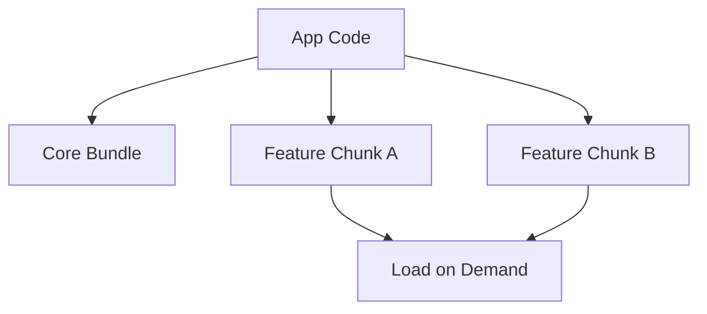

---
title: Code Splitting
slug: day-047-code-splitting
dayLabel: Day 47
level: Beginner
estimatedMinutes: 30
order: 47
track: react
---
# Day 47 [Intermediate to Advanced]: Code Splitting

## Index

- [Goal](#goal)
- [Prerequisites](#prerequisites)
- [Explanation](#explanation)
- [Topic by Topic](#topic-by-topic)
- [Key Concepts](#key-concepts)
- [Visual Concept Map](#visual-concept-map)
- [End-to-End Practical](#end-to-end-practical)
- [Hands-on Coding](#hands-on-coding)
- [Mini Exercise](#mini-exercise)
- [Assessment Quiz](#assessment-quiz)
- [Task](#task)
- [Self Check](#self-check)
- [Interview Questions and Answers](#interview-questions-and-answers)
- [Day 47 Outcome](#day-47-outcome)

## Goal

Apply code-splitting techniques beyond routes to improve initial load and runtime performance.

## Prerequisites

- Day 46 completed
- Lazy route loading basics

## Explanation

Code splitting breaks app bundles into smaller chunks so users load only what they need for current interaction.

## Topic by Topic

### Topic 1: Route vs Component Splitting

Theory:
Routes are common split points, but heavy widgets can be split too.

Practical:
Lazy load chart component on demand.

Code Example:

```jsx
const HeavyChart = lazy(() => import("./HeavyChart"));
```

**Explanation:** This topic explains Route vs Component Splitting in a practical way so you can apply it confidently in real React projects.

**Key Points:**

- Understand the core idea of Route vs Component Splitting.
- Apply the pattern using clean, readable code.
- Avoid common mistakes through predictable React flow.

### Topic 2: Conditional Dynamic Import

Theory:
Load code only when feature is opened.

Practical:
Open analytics modal and load analytics chunk.

Code Example:

```jsx
if (open) import("./AnalyticsPanel");
```

**Explanation:** This topic explains Conditional Dynamic Import in a practical way so you can apply it confidently in real React projects.

**Key Points:**

- Understand the core idea of Conditional Dynamic Import.
- Apply the pattern using clean, readable code.
- Avoid common mistakes through predictable React flow.

### Topic 3: Suspense Boundaries

Theory:
Use local Suspense boundaries to avoid blocking whole page.

Practical:
Wrap only heavy panel in Suspense.

Code Example:

```jsx
<Suspense fallback={<p>Loading chart...</p>}>
  <HeavyChart />
</Suspense>
```

**Explanation:** This topic explains Suspense Boundaries in a practical way so you can apply it confidently in real React projects.

**Key Points:**

- Understand the core idea of Suspense Boundaries.
- Apply the pattern using clean, readable code.
- Avoid common mistakes through predictable React flow.

### Topic 4: Vendor and Shared Chunks

Theory:
Bundlers split third-party libraries into shared chunks.

Practical:
Inspect bundle output and chunk graph.

Code Example:

```jsx
// Analyze chunk sizes using build stats tooling.
```

**Explanation:** This topic explains Vendor and Shared Chunks in a practical way so you can apply it confidently in real React projects.

**Key Points:**

- Understand the core idea of Vendor and Shared Chunks.
- Apply the pattern using clean, readable code.
- Avoid common mistakes through predictable React flow.

### Topic 5: Performance Verification

Theory:
Measure improvements with metrics (TTI, bundle size, network waterfall).

Practical:
Compare before/after initial JS payload.

Code Example:

```jsx
// Track bundle and first load timing before and after split.
```

**Explanation:** This topic explains Performance Verification in a practical way so you can apply it confidently in real React projects.

**Key Points:**

- Understand the core idea of Performance Verification.
- Apply the pattern using clean, readable code.
- Avoid common mistakes through predictable React flow.

### Topic 6: Chunk Caching and Long-term Performance

Theory:
Stable chunk names and cache-friendly build output help returning users load less JavaScript over time.

Practical:
Use production build settings that support hashed chunk files and strong caching.

Code Example:

```jsx
// Prefer cacheable hashed chunks for repeat visits.
```

**Explanation:** This topic explains Chunk Caching and Long-term Performance in a practical way so you can apply it confidently in real React projects.

**Key Points:**

- Understand the core idea of Chunk Caching and Long-term Performance.
- Apply the pattern using clean, readable code.
- Avoid common mistakes through predictable React flow.

## Key Concepts

- Split-point strategy
- Lazy loading heavy components
- Fine-grained Suspense boundaries
- Bundle analysis mindset
- Metric-driven optimization
- Long-term chunk caching

## Visual Concept Map



## End-to-End Practical

1. Identify heavy component.
2. Convert to lazy import.
3. Add local Suspense boundary.
4. Trigger load via user action.
5. Compare load metrics before/after.

## Hands-on Coding

### Example 1: Case - Split Analytics Chart Widget

Scenario:
Dashboard home should load quickly while heavy chart library loads only if user opens analytics tab.

```jsx
import { Suspense, lazy, useState } from "react";

const AnalyticsChart = lazy(() => import("./AnalyticsChart"));

function Dashboard() {
  const [showChart, setShowChart] = useState(false);

  return (
    <div>
      <button onClick={() => setShowChart(true)}>Open Analytics</button>
      {showChart && (
        <Suspense fallback={<p>Loading analytics...</p>}>
          <AnalyticsChart />
        </Suspense>
      )}
    </div>
  );
}
```

### Example 2: Case - Split Export Tool Module

Scenario:
An admin page should load CSV export logic only when user clicks Export.

```jsx
async function handleExport() {
  const module = await import("./exportUtils");
  module.exportCsv();
}
```

### Example 3: Case - Split Feature Modal

Scenario:
A product page opens recommendations modal rarely, so modal code is deferred.

```jsx
const RecommendationsModal = lazy(() => import("./RecommendationsModal"));

{
  isOpen && (
    <Suspense fallback={<p>Loading recommendations...</p>}>
      <RecommendationsModal />
    </Suspense>
  );
}
```

## Mini Exercise

Scenario:
You are building a project management app.

Code split three heavy features: Gantt chart, audit logs panel, and export center. Load each on demand and add dedicated fallback UI.

Expected output:

- Main page loads without heavy feature chunks
- Feature chunk loads on user interaction
- Fallback appears only in local feature area

## Assessment Quiz

### Quiz Questions

1. How is code splitting different from minification?
2. Why prefer local Suspense boundaries?
3. True or False: every tiny component should be lazy loaded.
4. What is a practical split point?
5. Which metrics help verify improvement?

### Quiz Answers

1. Splitting controls chunk loading timing; minification shrinks code text
2. It avoids blocking unrelated UI
3. False
4. Heavy, optional, or infrequently used features
5. Bundle size, network timing, and interactive load metrics

## Task

- Split at least one route and two heavy components
- Add local fallback for each split chunk
- Complete mini exercise

## Self Check

- You can identify practical split points
- You can implement and verify code-splitting gains
- You can answer at least 4 out of 5 quiz questions correctly

## Interview Questions and Answers

### Beginner

**Question:** What is code splitting?

**Answer:** Dividing JavaScript into chunks loaded when needed.

**Question:** Which React APIs are commonly used for splitting?

**Answer:** React.lazy and Suspense.

### Middle

**Question:** Why can over-splitting hurt UX?

**Answer:** Too many tiny network requests can add latency overhead.

**Question:** How do you choose split candidates?

**Answer:** Prioritize heavy, optional, low-frequency features.

### Advanced

**Question:** How does HTTP/2 impact code-splitting decisions?

**Answer:** Multiple requests are cheaper, but chunk strategy still needs balance.

**Question:** How do you reduce chunk-load jank?

**Answer:** Use prefetch hints, graceful fallbacks, and stable layout placeholders.

## Day 47 Outcome

- You can apply component-level code splitting effectively
- You can measure and reason about performance trade-offs
- You are ready to integrate advanced routing patterns in Day 48

