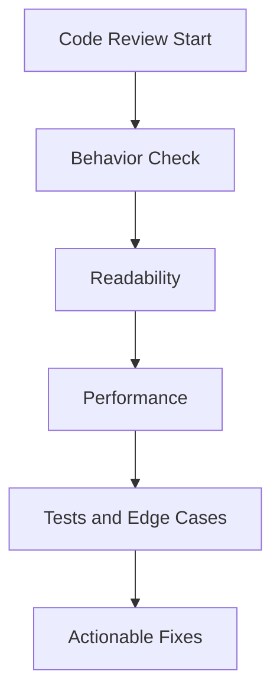

---
title: Code Review Session
slug: day-049-code-review-session
dayLabel: Day 49
level: Beginner
estimatedMinutes: 35
order: 49
track: react
---
# Day 49 [Intermediate to Advanced]: Code Review Session

## Index

- [Goal](#goal)
- [Prerequisites](#prerequisites)
- [Explanation](#explanation)
- [Topic by Topic](#topic-by-topic)
- [Key Concepts](#key-concepts)
- [Visual Concept Map](#visual-concept-map)
- [End-to-End Practical](#end-to-end-practical)
- [Hands-on Coding](#hands-on-coding)
- [Mini Exercise](#mini-exercise)
- [Assessment Quiz](#assessment-quiz)
- [Task](#task)
- [Self Check](#self-check)
- [Interview Questions and Answers](#interview-questions-and-answers)
- [Day 49 Outcome](#day-49-outcome)

## Goal

Learn a practical code-review workflow to improve readability, reliability, and maintainability.

## Prerequisites

- Day 48 completed
- One mini project available for review

## Explanation

Code review catches bugs early, improves consistency, and creates shared engineering standards.

## Topic by Topic

### Topic 1: Review Checklist Mindset

Theory:
Review with structured checklist: correctness, clarity, performance, UX, tests.

Practical:
Inspect one component against checklist.

Code Example:

```jsx
// Check naming, edge cases, and side effects before approving.
```

**Explanation:** This topic explains Review Checklist Mindset in a practical way so you can apply it confidently in real React projects.

**Key Points:**

- Understand the core idea of Review Checklist Mindset.
- Apply the pattern using clean, readable code.
- Avoid common mistakes through predictable React flow.

### Topic 2: Identify Behavioral Bugs

Theory:
Prioritize issues that break behavior over style nits.

Practical:
Find invalid param crash in detail route.

Code Example:

```jsx
if (!item) return <NotFound />;
```

**Explanation:** This topic explains Identify Behavioral Bugs in a practical way so you can apply it confidently in real React projects.

**Key Points:**

- Understand the core idea of Identify Behavioral Bugs.
- Apply the pattern using clean, readable code.
- Avoid common mistakes through predictable React flow.

### Topic 3: Improve Readability

Theory:
Clear names and small components reduce cognitive load.

Practical:
Split large component into focused child parts.

Code Example:

```jsx
<FilterPanel />
<PostList />
```

**Explanation:** This topic explains Improve Readability in a practical way so you can apply it confidently in real React projects.

**Key Points:**

- Understand the core idea of Improve Readability.
- Apply the pattern using clean, readable code.
- Avoid common mistakes through predictable React flow.

### Topic 4: Performance and Re-render Checks

Theory:
Look for unnecessary rerenders and heavy computations.

Practical:
Memoize expensive filter function.

Code Example:

```jsx
const visible = useMemo(() => compute(data), [data]);
```

**Explanation:** This topic explains Performance and Re-render Checks in a practical way so you can apply it confidently in real React projects.

**Key Points:**

- Understand the core idea of Performance and Re-render Checks.
- Apply the pattern using clean, readable code.
- Avoid common mistakes through predictable React flow.

### Topic 5: Testing and Edge Cases

Theory:
Review should include missing test scenarios.

Practical:
Add tests for empty state, bad route param, and retry flow.

Code Example:

```jsx
// Add test for invalid id -> not found state.
```

**Explanation:** This topic explains Testing and Edge Cases in a practical way so you can apply it confidently in real React projects.

**Key Points:**

- Understand the core idea of Testing and Edge Cases.
- Apply the pattern using clean, readable code.
- Avoid common mistakes through predictable React flow.

### Topic 6: Production Guardrails for Code Review Session

Theory:
At this stage, strong engineering comes from repeatable quality checks that prevent regressions in state flow, edge cases, and maintainability.

Practical:
Define a short review checklist for this topic that verifies correctness, fallback behavior, and readability before merge.

Code Example:

`jsx
// Add a checklist step before release for this feature area.
`
**Explanation:** This topic explains Production Guardrails for Code Review Session in a practical way so you can apply it confidently in real React projects.

**Key Points:**

- Understand the core idea of Production Guardrails for Code Review Session.
- Apply the pattern using clean, readable code.
- Avoid common mistakes through predictable React flow.

## Key Concepts

- Risk-first review
- Correctness over cosmetics
- Readability and maintainability improvements
- Performance-aware review
- Test coverage gaps

- Quality guardrail mindset

## Visual Concept Map



## End-to-End Practical

1. Select previous mini project.
2. Run checklist-based review.
3. Log findings by severity.
4. Fix top 5 high-impact issues.
5. Re-test and summarize quality improvements.

## Hands-on Coding

### Example 1: Case - Route Param Safety Fix

Scenario:
Blog details component crashes on invalid URL param and needs safe fallback.

```jsx
function PostDetails({ posts, id }) {
  const post = posts.find((p) => p.id === Number(id));
  if (!post) return <p>Post not found</p>;
  return <h3>{post.title}</h3>;
}
```

### Example 2: Case - Extract Reusable Loading/Error Block

Scenario:
Multiple screens duplicate loading and error markup.

```jsx
function RequestState({ loading, error, onRetry }) {
  if (loading) return <p>Loading...</p>;
  if (error) return <button onClick={onRetry}>Retry</button>;
  return null;
}
```

### Example 3: Case - Memoize Heavy Filter Logic

Scenario:
Search page stutters because filtering runs on every render.

```jsx
const filteredPosts = useMemo(() => {
  return posts.filter((p) =>
    p.title.toLowerCase().includes(query.toLowerCase()),
  );
}, [posts, query]);
```

## Mini Exercise

Scenario:
You are reviewing the Day 48 blog app.

Find and fix at least 5 issues across categories:

- One correctness bug
- One readability issue
- One performance improvement
- One UX edge-case handling
- One testing gap note

Expected output:

- Issue list with rationale and fix
- Updated code for top issues
- Short review summary and next steps

## Assessment Quiz

### Quiz Questions

1. What should be prioritized first in code review?
2. Why are actionable comments important?
3. True or False: Code review is only for style preferences.
4. Name two common edge cases reviewers should check.
5. Why include testing feedback in review?

### Quiz Answers

1. Bugs and behavioral regressions
2. They help developers fix issues quickly and clearly
3. False
4. Empty data states and invalid route params
5. To prevent regressions and verify expected behavior

## Task

- Review one mini project with checklist
- Fix at least 5 quality issues
- Complete mini exercise

## Self Check

- You can perform structured code review independently
- You can identify high-impact issues confidently
- You can answer at least 4 out of 5 quiz questions correctly

## Interview Questions and Answers

### Beginner

**Question:** Why is code review important?

**Answer:** It catches bugs early and improves code quality.

**Question:** What should review comments include?

**Answer:** Clear issue, reason, and suggested improvement.

### Middle

**Question:** How do you keep reviews constructive?

**Answer:** Focus on code behavior, clarity, and concrete fixes.

**Question:** What is a high-quality review outcome?

**Answer:** Fewer bugs, clearer code, and better maintainability.

### Advanced

**Question:** How do teams standardize review quality?

**Answer:** Shared checklists, severity labels, and review guidelines.

**Question:** How can review process reduce production incidents?

**Answer:** By catching edge-case failures and risky changes before merge.

## Day 49 Outcome

- You can execute practical review workflows with measurable impact
- You can convert findings into concrete code improvements
- You are ready to transition into Redux state architecture in Day 50

