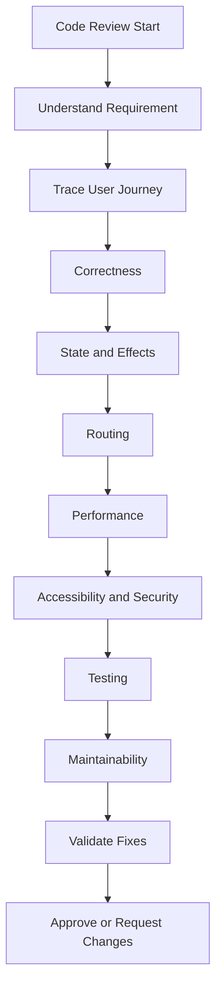

# Day 49 [Intermediate to Advanced]: Code Review Session

## Index

- [Goal](#goal)
- [Prerequisites](#prerequisites)
- [Explanation](#explanation)
- [Topic by Topic](#topic-by-topic)
- [Key Concepts](#key-concepts)
- [Visual Concept Map](#visual-concept-map)
- [End-to-End Practical](#end-to-end-practical)
- [Hands-on Coding](#hands-on-coding)
- [Mini Exercise](#mini-exercise)
- [Assessment Quiz](#assessment-quiz)
- [Task](#task)
- [Self Check](#self-check)
- [Interview Questions and Answers](#interview-questions-and-answers)
- [Day 49 Outcome](#day-49-outcome)

## Goal

Learn a practical, risk-first code-review workflow for React applications. You will review the Day 48 Blog App, identify correctness, state, routing, performance, accessibility, security, testing, and maintainability issues, propose fixes, and validate the result before approval.

This session is intentionally practical: the goal is not simply to say that code can be improved, but to explain **what is wrong, why it matters, how to fix it, and how to verify the fix**.

## Prerequisites

- Day 41–47 completed: routing, nested routes, protected routes, lazy loading, and code splitting
- Day 48 completed: Mini Project — Production-Ready Blog App
- React hooks: `useState`, `useEffect`, `useMemo`, `useCallback`
- Basic testing knowledge
- Basic browser DevTools knowledge

## Explanation

Code review is an engineering quality process, not a formatting exercise. A strong reviewer first understands the intended behavior, then checks correctness and user impact before moving to maintainability and style.

A useful review sequence is:

```text
Requirement
    ↓
User journey
    ↓
Correctness
    ↓
State + Effects
    ↓
Routing
    ↓
Performance
    ↓
Accessibility + Security
    ↓
Testing
    ↓
Maintainability
    ↓
Validation
    ↓
Approve / Request Changes
```

### Review priority

| Priority | Review focus | Example |
|---|---|---|
| P0 | Security/data loss/outage risk | Client-only authorization for a mutation |
| P1 | Functional defect | Invalid route crashes the page |
| P1 | Data/state correctness | Stale effect or incorrect dependency |
| P1 | Accessibility/UX failure | Keyboard user cannot submit a form |
| P2 | Performance/maintainability | Unnecessary expensive work |
| P3 | Style/preference | Naming or formatting suggestion |

Severity labels vary by team. The important principle is to communicate **impact and urgency** clearly.

### Good vs weak review comment

Weak:

> This is not clean. Please refactor.

Better:

> `filteredPosts` is duplicated state derived from `posts` and `query`. Keeping both values synchronized adds an unnecessary state transition. Please derive the filtered list during render, or use `useMemo` only if profiling shows the calculation is expensive.

A useful review comment follows:

```text
Problem → Impact → Suggested direction → Validation
```

## Topic by Topic

### Topic 1: Review Checklist Mindset

**Theory:**

Review with a structured checklist rather than jumping directly to formatting or personal preferences.

**Practical:**

Inspect one Day 48 component for correctness, edge cases, state flow, accessibility, performance, and tests.

**Code Example:**

```jsx
// Review order:
// 1. Does it work?
// 2. What happens at the boundaries?
// 3. Is the state/data flow correct?
// 4. Is it accessible and tested?
// 5. Is optimization justified?
```

**Explanation:**

Start with user-visible risk. A naming issue should not distract from a route that crashes or a mutation that is not protected by the backend.

**Key Points:**

- Understand the requirement before commenting.
- Review behavior before cosmetics.
- Make severity and impact explicit.

### Topic 2: Identify Behavioral Bugs

**Theory:**

Behavioral defects should normally be prioritized above style suggestions.

**Practical:**

Find an invalid route parameter that causes a details component to crash.

**Code Example:**

```jsx
function PostDetails({ posts, id }) {
  const post = posts.find((item) => item.id === Number(id));

  if (!post) {
    return <p>Post not found.</p>;
  }

  return <h3>{post.title}</h3>;
}
```

**Explanation:**

A valid route can still point to a resource that does not exist. The reviewer should distinguish application-route 404 from resource 404.

**Key Points:**

- Check invalid parameters.
- Check null and unexpected API data.
- Check loading, empty, error, and not-found behavior.

### Topic 3: State, Effects and Data Flow

**Theory:**

Reviewers should identify unnecessary state, duplicated derived data, stale closures, incorrect effect dependencies, and unclear ownership.

**Practical:**

Review this pattern:

```jsx
const [filteredPosts, setFilteredPosts] = useState([]);

useEffect(() => {
  setFilteredPosts(
    posts.filter((post) =>
      post.title.toLowerCase().includes(query.toLowerCase())
    )
  );
}, [posts, query]);
```

If filtering is inexpensive, prefer:

```jsx
const filteredPosts = posts.filter((post) =>
  post.title.toLowerCase().includes(query.toLowerCase())
);
```

If the calculation is genuinely expensive, measure first and then consider:

```jsx
const filteredPosts = useMemo(() => {
  return expensiveFilter(posts, query);
}, [posts, query]);
```

**Explanation:**

Not every calculation needs an effect, and not every calculation needs memoization. The reviewer should understand whether the value is derived data or independently owned state.

**Key Points:**

- Avoid duplicated derived state.
- Verify effect dependencies.
- Watch for stale closures.
- Do not add `useMemo` or `useCallback` mechanically.

### Topic 4: Improve Readability and Component Boundaries

**Theory:**

Large components are not automatically bad, but components with many unrelated responsibilities become harder to test and maintain.

**Practical:**

A large blog page can be reviewed as:

```text
BlogPage
├── BlogFilters
├── PostList
│   └── PostCard
└── BlogStatus
```

**Code Example:**

```jsx
<FilterPanel />
<PostList />
<BlogStatus />
```

**Explanation:**

Extract components around behavior, responsibility, reuse, or testability—not merely because a file is long.

**Key Points:**

- Keep data ownership clear.
- Avoid unnecessary prop drilling.
- Avoid splitting components mechanically.

### Topic 5: Performance and Re-render Checks

**Theory:**

Performance review should be evidence-driven. Look for unnecessary renders, expensive calculations, duplicate network requests, oversized initial bundles, and inappropriate memoization.

**Practical:**

Use React DevTools and browser DevTools to compare before/after behavior.

**Code Example:**

```jsx
const visiblePosts = useMemo(() => {
  return expensiveFilter(posts, query);
}, [posts, query]);
```

**Explanation:**

`useMemo` is justified when expensive computation or referential stability matters. Do not optimize solely because a hook exists.

**Key Points:**

- Measure before optimizing.
- Review network behavior as well as render cost.
- Avoid unnecessary `useCallback` and `useMemo`.

### Topic 6: Routing and Protected Routes

**Theory:**

Review dynamic parameters, nested routes, route ordering, unknown routes, resource-not-found handling, and protected boundaries.

**Practical:**

Review the Day 48 route tree:

```text
/blog
/blog/category/:slug
/blog/:postId
/blog/admin
/blog/admin/new
/blog/admin/edit/:postId
```

**Code Example:**

```jsx
<Route path="blog" element={<BlogLayout />}>
  <Route index element={<BlogHome />} />
  <Route path="category/:slug" element={<CategoryPage />} />
  <Route path=":postId" element={<PostDetails />} />
</Route>
```

**Explanation:**

A protected React route controls navigation and UI access, but it does not replace backend authorization.

**Key Points:**

- Handle invalid route parameters.
- Keep nested route structure understandable.
- Treat client-side guards as UX/navigation protection.
- Require backend authorization for sensitive operations.

### Topic 7: Testing, Accessibility and Production Guardrails

**Theory:**

A review is incomplete when critical behavior is not tested or accessible.

**Practical:**

Check keyboard navigation, semantic HTML, loading/error announcements, invalid routes, protected routes, and critical CRUD flows.

**Code Example:**

```jsx
<p role="status">Loading posts...</p>
<p role="alert">Unable to load posts.</p>
```

**Explanation:**

Testing should focus on behavior users depend on, while accessibility should be treated as part of functionality.

**Key Points:**

- Test important user journeys.
- Test failure and edge states.
- Use semantic controls.
- Validate the fix before approval.

## Key Concepts

- Risk-first code review
- Correctness before cosmetics
- Derived state vs owned state
- Effect dependency correctness
- Stale closures and async race conditions
- Component boundaries and data ownership
- Evidence-driven performance optimization
- Routing and protected-route review
- Client UX protection vs backend authorization
- Loading, error, empty, forbidden, and not-found states
- Accessibility as functionality
- Behavioral testing
- Actionable review comments
- Severity and impact classification
- Validate before approving

## Visual Concept Map



## End-to-End Practical

Review the **Day 48 Production-Ready Blog App** from start to finish.

### Step 1 — Understand the feature

Document:

```text
What changed?
Which routes changed?
Which state changed?
Which API calls changed?
Which user journeys are affected?
```

### Step 2 — Review the main journeys

```text
Blog Home
  ↓
Open Post
  ↓
Post Details

Blog Home
  ↓
Invalid Post ID
  ↓
Not Found

Blog
  ↓
Admin
  ↓
Unauthenticated
  ↓
Login / Redirect

Admin
  ↓
Lazy Feature
  ↓
Loading
  ↓
Loaded
```

### Step 3 — Record findings

For every issue record:

```text
ID
Severity
Location
Problem
Impact
Recommended Fix
Validation Method
```

### Step 4 — Fix the top five

Prioritize correctness, security, serious UX/accessibility failures, and data integrity before style improvements.

### Step 5 — Validate

Run tests, manually verify critical journeys, and use DevTools when making performance claims.

## Hands-on Coding

### Example 1: Route Parameter Safety

```jsx
function PostDetails({ posts, id }) {
  const post = posts.find((post) => post.id === Number(id));

  if (!post) {
    return <p>Post not found.</p>;
  }

  return <h3>{post.title}</h3>;
}
```

**Review:** What happens when `id` is invalid? What happens if IDs are strings rather than numbers?

### Example 2: Derived Data Instead of Duplicate State

```jsx
function PostList({ posts, query }) {
  const normalizedQuery = query.trim().toLowerCase();

  const visiblePosts = posts.filter((post) =>
    post.title.toLowerCase().includes(normalizedQuery)
  );

  return visiblePosts.map((post) => (
    <article key={post.id}>{post.title}</article>
  ));
}
```

**Review:** Is `visiblePosts` independent state? No. It is derived from `posts` and `query`.

### Example 3: Review an Async Effect

```jsx
useEffect(() => {
  const controller = new AbortController();

  async function loadPost() {
    try {
      const response = await fetch(`/api/posts/${postId}`, {
        signal: controller.signal,
      });

      if (!response.ok) {
        throw new Error("Unable to load post");
      }

      const data = await response.json();
      setPost(data);
    } catch (error) {
      if (error.name !== "AbortError") {
        setError(error);
      }
    }
  }

  loadPost();

  return () => controller.abort();
}, [postId]);
```

**Review:** Check dependency correctness, cancellation, HTTP failure handling, and error state.

### Example 4: Actionable Review Comment

```text
Problem: The delete operation checks the user's role only in React.
Impact: A client can bypass this UI check and call the API directly.
Recommendation: Enforce authorization on the backend for the delete endpoint.
Validation: Attempt the mutation with an unauthorized account/API request.
```

### Example 5: Behavioral Test

```jsx
expect(
  screen.getByRole("heading", { name: /post not found/i })
).toBeInTheDocument();
```

The test verifies user-visible behavior rather than a private implementation detail.

## Mini Exercise

Scenario: You are reviewing the Day 48 blog app.

Find at least **10 issues** across:

- correctness
- state/effects
- routing
- performance
- accessibility
- security
- testing
- maintainability

Expected output for every issue:

```text
Issue
Severity
Why it matters
Suggested fix
Validation method
```

Then fix the five highest-impact issues and re-run the relevant tests.

## Assessment Quiz

### Quiz Questions

1. What should normally be prioritized before style feedback?
2. Why can derived data be problematic when stored as state?
3. When should `useMemo` be introduced?
4. What is a stale closure?
5. Why does a client-side protected route not secure an API?
6. What is the difference between route 404 and resource 404?
7. Why should loading and error states remain distinct?
8. Why can excessive code splitting hurt performance?
9. What makes a review comment actionable?
10. Why is behavioral testing stronger than implementation-detail testing?
11. What should a reviewer inspect for async effects?
12. Why should accessibility be part of correctness?

### Quiz Answers

1. Functional correctness, security, data integrity, and serious user-impacting issues.
2. It creates extra synchronization and can become stale relative to the source values.
3. When referential stability or expensive computation is justified, preferably with measurement.
4. A function or effect uses a value captured from an older render instead of the current value.
5. Browser/client code can be manipulated; the server must independently authorize protected data and mutations.
6. Route 404 means the URL does not match an application route; resource 404 means a valid route points to a missing resource.
7. A failed request is different from a successful request that returned no data.
8. Too many small chunks can increase request/loading overhead and complexity.
9. It identifies the problem, explains impact, proposes a direction, and gives a way to validate the fix.
10. It verifies user-visible behavior and remains more resilient to implementation refactors.
11. Dependencies, cancellation/races, error handling, loading cleanup, and obsolete responses.
12. A feature is incomplete if users cannot perceive or operate it effectively.

## Task

Complete a production-style review of the Day 48 Blog App.

### Required deliverables

- Architecture summary
- At least 10 findings
- Severity for every finding
- Evidence or reproduction steps
- Recommended fixes
- Tests added or identified as missing
- Performance observations
- Accessibility observations
- Security observations
- Final recommendation: Approve / Request Changes / Comment Only

Do not submit comments such as:

```text
Improve this
Refactor
Not clean
Use best practice
```

Instead use:

```text
Problem
→ Why it matters
→ Concrete recommendation
→ How to validate the fix
```

## Self Check

Before moving to Day 50, confirm:

- [ ] I can explain the requirement before reviewing implementation details.
- [ ] I can identify high-impact correctness issues.
- [ ] I can distinguish derived data from owned state.
- [ ] I can review `useEffect` dependencies and stale closures.
- [ ] I can evaluate `useMemo` and `useCallback` without blindly recommending them.
- [ ] I can review dynamic and nested routes.
- [ ] I understand why client-side route guards do not replace backend authorization.
- [ ] I can review loading, error, empty, forbidden, and not-found states.
- [ ] I can identify accessibility problems.
- [ ] I can identify meaningful testing gaps.
- [ ] I can write an actionable review comment.
- [ ] I validate important fixes before approval.

Target: complete at least **10 of 12** checks confidently.

## Interview Questions and Answers

### Beginner

**Question:** Why is code review important?

**Answer:** It catches defects early, improves maintainability, shares engineering knowledge, and creates consistent quality standards.

**Question:** What should a useful review comment include?

**Answer:** A concrete problem, its impact, and a practical improvement direction.

### Intermediate

**Question:** Why should derived data usually not be duplicated in state?

**Answer:** Duplicated state introduces synchronization problems and additional updates when the source values already determine the result.

**Question:** How do you review a React component?

**Answer:** Start with expected behavior, then inspect data flow, state, effects, rendering, edge cases, accessibility, performance, and tests.

**Question:** When is `useCallback` useful?

**Answer:** When callback identity matters to an optimization or dependency boundary, such as a memoized child. It should not be added mechanically.

### Advanced

**Question:** How would you review a large React pull request?

**Answer:** Understand the requirement first, trace major user journeys, review high-risk behavior, inspect architecture and state flow, then evaluate performance, accessibility, security, tests, and maintainability. Finally validate fixes and summarize remaining risk.

**Question:** How do you identify a real performance problem rather than a theoretical one?

**Answer:** Reproduce the issue and measure it with profiling, browser/network performance data, or appropriate production-oriented metrics. Apply the smallest justified optimization and compare before/after results.

**Question:** How would you review a protected admin feature?

**Answer:** Verify client-side navigation and UX protection, but also verify that the backend independently authenticates and authorizes every protected operation.

**Question:** What makes a code review mature?

**Answer:** Risk-based prioritization, evidence-driven recommendations, constructive communication, automated checks where possible, and validation after fixes.

## Day 49 Outcome

By the end of Day 49:

- You can perform a structured React code review.
- You can prioritize correctness and security over cosmetic feedback.
- You can identify state, effect, routing, and rendering problems.
- You can evaluate performance using evidence rather than assumptions.
- You can review accessibility and testing as part of product quality.
- You can distinguish client-side route protection from backend authorization.
- You can write actionable review comments.
- You can validate fixes before approving a change.
- You are ready to transition into Redux state architecture in Day 50.
