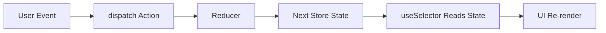

---
title: Redux Concepts
slug: day-050-redux-concepts
dayLabel: Day 50
level: Advanced
estimatedMinutes: 120
order: 50
track: react
---

# Day 50 [Advanced]: Redux Concepts

## Goal

Understand Redux fundamentals deeply enough to:

- choose when Redux is appropriate
- model state transitions with actions and reducers
- wire a store to React UI safely
- debug predictable one-way state flow

This lesson focuses on core concepts without Redux Toolkit convenience APIs so the underlying architecture remains clear.

## Prerequisites

- Day 49 completed
- Strong understanding of React state, props, and Context
- Comfortable with arrays, objects, and immutable update patterns
- Basic understanding of event handling in React

## Learning Outcomes

By the end of this day, you should be able to:

1. Explain why Redux exists and what problem it solves.
2. Define store, action, reducer, dispatch, and selector clearly.
3. Describe Redux one-way data flow step by step.
4. Write pure reducers with immutable updates.
5. Dispatch actions with and without payloads.
6. Connect React components to global state using react-redux hooks.
7. Diagnose common Redux bugs such as state mutation and action-type mismatch.
8. Compare Redux to lighter alternatives and make practical tradeoff decisions.

## Redux Mental Model

When an event happens in the UI, Redux does not let components mutate shared state directly. Instead, every change is represented as a declarative action.

```text
UI Event
  -> dispatch(action)
  -> store passes action to reducer
  -> reducer computes next state
  -> store updates state
  -> subscribed UI reads new state
  -> UI re-renders
```

A useful rule:

> State changes should be explicit, traceable, and reproducible.

That traceability is what makes Redux valuable for medium and large applications.

## Core Building Blocks

### Store

The store is the single source of truth for a Redux state tree.

```jsx
import { createStore } from "redux";

const store = createStore(rootReducer);
```

### Action

An action is a plain object describing what happened.

```jsx
{ type: "cart/itemAdded", payload: { id: 10, qty: 1 } }
```

### Reducer

A reducer is a pure function:

```text
(currentState, action) => nextState
```

It must not mutate existing state.

### Dispatch

`dispatch` sends an action to the store.

```jsx
store.dispatch({ type: "counter/increment" });
```

### Selector

A selector reads specific data from state.

```jsx
const count = useSelector((state) => state.counter.count);
```

Selectors keep components focused and avoid passing full state objects around.

## Topic by Topic

### Topic 1: Why Redux

Local component state works well for isolated UI behavior. As apps grow, shared cross-screen state can become scattered and inconsistent.

Typical pain points before Redux:

- duplicated logic across screens
- deeply nested prop drilling for shared state
- difficult debugging of who changed what
- non-reproducible bugs from implicit updates

Redux helps by making every state transition explicit via actions and reducers.

### Topic 2: Action Design

Action types should represent domain events, not UI implementation details.

Good examples:

- `cart/itemAdded`
- `auth/loginSucceeded`
- `filters/priceRangeChanged`

Weak examples:

- `buttonClicked`
- `setData`

Action payloads should include only necessary data.

```jsx
{
  type: "cart/itemAdded",
  payload: {
    productId: 101,
    quantity: 2,
  },
}
```

### Topic 3: Reducer Purity and Immutability

Reducers should be deterministic and side-effect free.

Bad reducer (mutation):

```jsx
function reducer(state = { count: 0 }, action) {
  switch (action.type) {
    case "counter/increment":
      state.count += 1;
      return state;
    default:
      return state;
  }
}
```

Correct reducer (immutable update):

```jsx
function reducer(state = { count: 0 }, action) {
  switch (action.type) {
    case "counter/increment":
      return { ...state, count: state.count + 1 };
    default:
      return state;
  }
}
```

### Topic 4: Store and Subscription Flow

In React apps, you usually subscribe through `useSelector` rather than direct `store.subscribe`.

```jsx
import { useSelector } from "react-redux";

function HeaderBadge() {
  const totalItems = useSelector((state) => state.cart.totalItems);
  return <span>Cart: {totalItems}</span>;
}
```

`useSelector` re-runs after dispatch and triggers render when selected value changes.

### Topic 5: Predictable One-way Data Flow

The flow remains stable regardless of app size:

1. A user interaction occurs.
2. Component dispatches an action.
3. Reducer calculates next state.
4. UI reads new state and reflects it.

This is simpler to reason about than direct state mutations from arbitrary modules.

### Topic 6: Redux vs Context

Context and Redux solve related but different concerns.

| Concern | Context | Redux |
|---|---|---|
| Primary purpose | Value delivery through tree | Structured state transitions |
| Change tracking | Provider value identity | Action log + reducer transitions |
| Tooling | Basic | Rich (DevTools ecosystem) |
| Team-scale conventions | Flexible | Strong and explicit |

Use Context for low-frequency shared values (theme, locale, auth snapshot). Use Redux when state transitions are frequent, cross-feature, and require strict traceability.

### Topic 7: Redux vs Lighter Stores

Alternatives like Zustand can reduce boilerplate for smaller apps.

Choose Redux when you need:

- clear event-driven architecture
- strict transition modeling
- ecosystem maturity for large teams
- explicit debugging and predictable patterns

Choose lighter solutions when:

- global state is moderate
- team prefers minimal abstraction
- feature velocity matters more than strict ceremony

### Topic 8: Production Guardrails

Before scaling Redux usage across features, align on guardrails:

- action naming conventions
- reducer ownership boundaries
- normalized state shape conventions
- selector naming and placement
- no side effects inside reducers
- test strategy for reducers and selectors

## Redux Flow Diagram



## End-to-End Practical

Build a tiny inventory counter with the complete Redux cycle.

### Step 1: Create reducer

```jsx
const initialState = {
  booksIssued: 0,
};

function libraryReducer(state = initialState, action) {
  switch (action.type) {
    case "library/issueOne":
      return { ...state, booksIssued: state.booksIssued + 1 };
    case "library/returnOne":
      return { ...state, booksIssued: Math.max(0, state.booksIssued - 1) };
    case "library/issueMany":
      return {
        ...state,
        booksIssued: state.booksIssued + Math.max(0, Number(action.payload) || 0),
      };
    default:
      return state;
  }
}
```

### Step 2: Create store

```jsx
import { createStore } from "redux";

export const store = createStore(libraryReducer);
```

### Step 3: Provide store

```jsx
import { Provider } from "react-redux";
import { store } from "./store";
import App from "./App";

export default function Root() {
  return (
    <Provider store={store}>
      <App />
    </Provider>
  );
}
```

### Step 4: Read and dispatch in UI

```jsx
import { useDispatch, useSelector } from "react-redux";

export default function LibraryPanel() {
  const booksIssued = useSelector((state) => state.booksIssued);
  const dispatch = useDispatch();

  return (
    <section>
      <h2>Books Issued: {booksIssued}</h2>

      <button type="button" onClick={() => dispatch({ type: "library/issueOne" })}>
        Issue 1
      </button>

      <button type="button" onClick={() => dispatch({ type: "library/returnOne" })}>
        Return 1
      </button>

      <button
        type="button"
        onClick={() => dispatch({ type: "library/issueMany", payload: 3 })}
      >
        Issue 3
      </button>
    </section>
  );
}
```

## Hands-on Coding

### Example 1: Counter Store (Foundation)

```jsx
import { createStore } from "redux";

const initialState = { count: 0 };

function counterReducer(state = initialState, action) {
  switch (action.type) {
    case "counter/increment":
      return { ...state, count: state.count + 1 };
    case "counter/decrement":
      return { ...state, count: state.count - 1 };
    case "counter/reset":
      return { ...state, count: 0 };
    default:
      return state;
  }
}

export const store = createStore(counterReducer);
```

### Example 2: Selector-Driven UI

```jsx
import { useDispatch, useSelector } from "react-redux";

export function CounterPanel() {
  const count = useSelector((state) => state.count);
  const dispatch = useDispatch();

  return (
    <div>
      <p>Count: {count}</p>
      <button type="button" onClick={() => dispatch({ type: "counter/increment" })}>
        +
      </button>
      <button type="button" onClick={() => dispatch({ type: "counter/decrement" })}>
        -
      </button>
      <button type="button" onClick={() => dispatch({ type: "counter/reset" })}>
        Reset
      </button>
    </div>
  );
}
```

### Example 3: Payload Validation Pattern

```jsx
function cartReducer(state = { quantity: 0 }, action) {
  switch (action.type) {
    case "cart/addBy": {
      const amount = Number(action.payload);
      const safeAmount = Number.isFinite(amount) ? Math.max(0, amount) : 0;
      return { ...state, quantity: state.quantity + safeAmount };
    }
    default:
      return state;
  }
}
```

## Common Mistakes

1. Mutating state in reducers.
2. Using vague action names such as `setData`.
3. Putting async side effects directly inside reducers.
4. Returning incomplete state objects accidentally.
5. Selecting more state than a component actually needs.
6. Designing one giant reducer with no feature boundaries.
7. Treating Redux as mandatory for every project.

## Debugging Lab

### Bug A: Mutating array state

```jsx
function reducer(state = { items: [] }, action) {
  switch (action.type) {
    case "items/add":
      state.items.push(action.payload);
      return state;
    default:
      return state;
  }
}
```

Why it is broken:

- same state object is reused
- renders and tools can miss changes

Fix:

```jsx
function reducer(state = { items: [] }, action) {
  switch (action.type) {
    case "items/add":
      return { ...state, items: [...state.items, action.payload] };
    default:
      return state;
  }
}
```

### Bug B: Action typo

```jsx
dispatch({ type: "counter/incremnt" });
```

Why it is broken:

- reducer has no matching case
- state does not change

Fix:

- standardize type strings
- keep action creators/constants in one place

### Bug C: Accidentally dropping state branch

```jsx
function reducer(state = { user: null, token: null }, action) {
  switch (action.type) {
    case "auth/loginSucceeded":
      return { user: action.payload.user };
    default:
      return state;
  }
}
```

Why it is broken:

- `token` is lost after login

Fix:

```jsx
return {
  ...state,
  user: action.payload.user,
  token: action.payload.token,
};
```

## Hands-on Exercises

1. Build a task tracker reducer with `addTask`, `toggleTask`, and `removeTask`.
2. Add a filter state branch with actions `setFilter` and `clearFilter`.
3. Create selectors for `allTasks`, `completedTasks`, and `activeTasks`.
4. Add guard logic so invalid payloads do not corrupt state.
5. Write one reducer unit test per action.

## Assessment Quiz

### Questions

1. What is the main responsibility of a reducer?
2. Why must reducers stay pure?
3. What does dispatch do?
4. Why is immutability important in Redux?
5. When is Redux generally a better choice than local component state?
6. Is Context a full replacement for Redux in all cases?
7. What is a selector and why is it useful?
8. Which is better action naming: `setData` or `cart/itemAdded` and why?

### Answers

1. Compute next state from current state and action.
2. Purity ensures predictable and testable state transitions.
3. Dispatch sends an action to the store update pipeline.
4. It preserves reliable change tracking and prevents hidden side effects.
5. When cross-feature shared state and strict transition traceability are required.
6. No. Context solves value delivery, while Redux adds structured transition modeling.
7. A selector reads focused state slices and improves component clarity.
8. `cart/itemAdded` is better because it is explicit and domain meaningful.

## Interview Questions and Answers

### Beginner

What are the core Redux concepts?

Store, action, reducer, dispatch, and selector.

Why is Redux called predictable?

All updates follow explicit action -> reducer -> next state flow.

### Intermediate

How do you avoid reducer mutation bugs?

Use immutable updates for arrays/objects and keep reducer logic pure.

How do selectors help performance and maintainability?

Selectors keep components focused on the minimum necessary data and reduce coupling.

### Advanced

When should a team avoid introducing Redux?

When app state is small, mostly local, and the extra architecture adds more complexity than value.

How would you scale Redux architecture in a large app?

Split state by feature domains, standardize action naming, centralize selector patterns, and enforce reducer tests.

## Production Checklist

- [ ] Action names follow domain/event style.
- [ ] Reducers are pure and immutable.
- [ ] State shape is intentionally designed by feature.
- [ ] Components select only required slices.
- [ ] Invalid payload handling is defined.
- [ ] Unit tests cover reducer transitions.
- [ ] Async logic strategy is clear for next lessons.
- [ ] Team can debug action flow confidently.

## Self Check

- [ ] I can explain Redux one-way data flow without notes.
- [ ] I can write reducers with immutable updates.
- [ ] I can dispatch actions with typed payloads.
- [ ] I can connect store data to React using hooks.
- [ ] I can find and fix common Redux bugs.
- [ ] I can justify when Redux should or should not be used.

## Day 50 Outcome

You now understand Redux fundamentals as an architecture, not only as a syntax pattern.

Next day (Day 51) will move from Redux core concepts to Redux Toolkit, where the same ideas become easier to implement with modern APIs.
