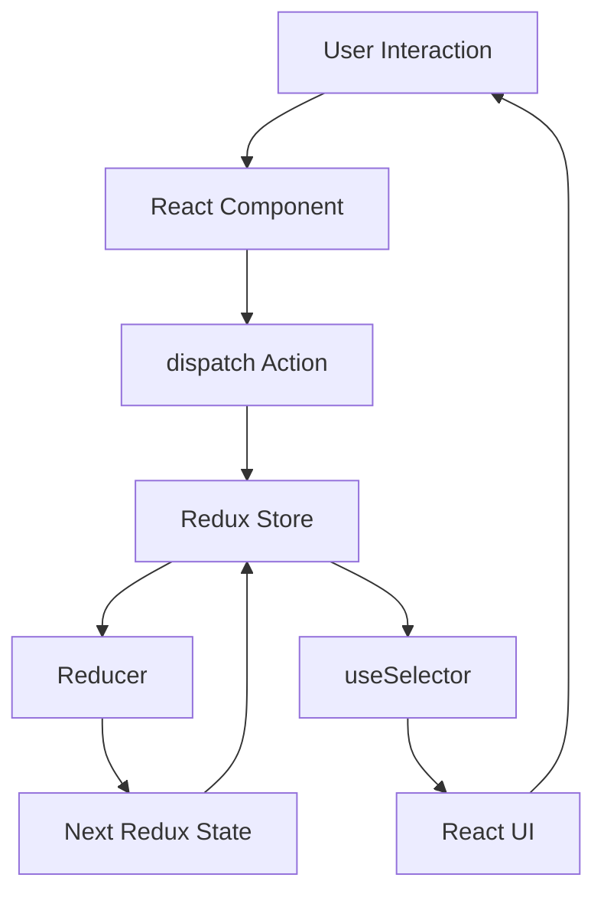

# Day 50 [Advanced]: Redux Concepts

## Index

- [Goal](#goal)
- [Prerequisites](#prerequisites)
- [Learning Outcomes](#learning-outcomes)
- [Explanation](#explanation)
- [Topic by Topic](#topic-by-topic)
- [Key Concepts](#key-concepts)
- [Visual Concept Map](#visual-concept-map)
- [End-to-End Practical](#end-to-end-practical)
- [Hands-on Coding](#hands-on-coding)
- [Mini Exercise](#mini-exercise)
- [Common Mistakes](#common-mistakes)
- [Debugging Lab](#debugging-lab)
- [Assessment Quiz](#assessment-quiz)
- [Task](#task)
- [Self Check](#self-check)
- [Interview Questions and Answers](#interview-questions-and-answers)
- [Production Checklist](#production-checklist)
- [Day 50 Outcome](#day-50-outcome)

## Goal

Understand Redux fundamentals deeply enough to:

- choose when Redux is appropriate
- model state transitions with actions and reducers
- understand the Redux store and one-way data flow
- connect a Redux store to React UI safely
- debug predictable state transitions
- prepare for modern Redux Toolkit usage in Day 51

This lesson focuses on the underlying Redux architecture first. Modern production applications generally use **Redux Toolkit**, which will be introduced next. Understanding the core concepts makes Redux Toolkit much easier to reason about.

## Prerequisites

- Day 49 completed
- Strong understanding of React state and props
- Understanding of Context API
- Comfortable with arrays, objects, and immutable update patterns
- Basic understanding of event handling in React
- Basic understanding of component rendering and re-rendering

## Learning Outcomes

By the end of this day, you should be able to:

1. Explain why Redux exists and what problem it solves.
2. Define store, action, reducer, dispatch, and selector clearly.
3. Describe Redux one-way data flow step by step.
4. Write pure reducers with immutable updates.
5. Dispatch actions with and without payloads.
6. Connect React components to global state using React-Redux hooks.
7. Diagnose common Redux bugs such as state mutation and action-type mismatch.
8. Explain Redux versus Context and lighter state-management options.
9. Recognize when Redux is unnecessary.
10. Understand why Redux Toolkit is preferred for modern Redux applications.

## Explanation

### What Problem Does Redux Solve?

React already provides local state through `useState` and shared values through Context. Redux becomes useful when application state is shared across many features and state transitions need to be explicit, predictable, testable, and easy to debug.

Consider a large application with:

- authentication state
- shopping cart state
- user preferences
- notifications
- filters
- permissions
- cached domain data

If many unrelated components can change and consume the same state, simply passing props can become difficult to maintain.

Redux introduces a predictable state-management model:

```text
User Interaction
      ↓
Component dispatches an action
      ↓
Redux Store receives action
      ↓
Reducer calculates next state
      ↓
Store holds next state
      ↓
React-Redux selectors read required state
      ↓
UI re-renders
```

The key idea is that components do not directly mutate shared Redux state.

### Important Modern Redux Note

The classic Redux API uses `createStore`, but modern Redux documentation recommends **Redux Toolkit** and `configureStore` for production applications. `createStore` is still useful in this lesson because it exposes the underlying Redux concepts clearly, but you should not interpret it as the preferred setup for a new production application.

Day 51 will introduce Redux Toolkit and show how the same architecture is implemented with modern APIs.

## Topic by Topic

### Topic 1: Why Redux

Local component state works well for isolated UI behavior. As applications grow, shared cross-screen state can become scattered and inconsistent.

Typical problems include:

- duplicated state logic across screens
- deeply nested prop drilling
- unclear ownership of shared state
- difficult debugging of state changes
- inconsistent update patterns

Redux helps by making state transitions explicit through actions and reducers.

### Topic 2: Store

The Redux store holds the application's Redux state tree and coordinates dispatching actions through reducers.

A store created with the classic API looks like this:

```jsx
import { createStore } from "redux";

const store = createStore(rootReducer);
```

For modern production code, prefer Redux Toolkit's `configureStore`, which will be covered on Day 51.

The Redux store is the source of truth **for the Redux state tree**. It does not mean every piece of UI state must live in Redux.

### Topic 3: Action

An action is a plain JavaScript object describing what happened.

```jsx
{
  type: "cart/itemAdded",
  payload: {
    id: 10,
    qty: 1,
  },
}
```

Good action names describe domain events:

```text
cart/itemAdded
auth/loginSucceeded
filters/priceRangeChanged
```

Avoid vague names such as:

```text
buttonClicked
setData
changeValue
```

The action should communicate the event, not the implementation detail of the UI.

### Topic 4: Reducer

A reducer is a pure function that calculates the next state from the current state and an action:

```text
(currentState, action) => nextState
```

Example:

```jsx
function counterReducer(state = { count: 0 }, action) {
  switch (action.type) {
    case "counter/increment":
      return {
        ...state,
        count: state.count + 1,
      };
    default:
      return state;
  }
}
```

A reducer should:

- be deterministic
- avoid side effects
- not mutate existing state
- return the current state for unknown actions

### Topic 5: Immutability

This is incorrect because it mutates the existing state object:

```jsx
function reducer(state = { count: 0 }, action) {
  switch (action.type) {
    case "counter/increment":
      state.count += 1;
      return state;
    default:
      return state;
  }
}
```

Use an immutable update:

```jsx
function reducer(state = { count: 0 }, action) {
  switch (action.type) {
    case "counter/increment":
      return {
        ...state,
        count: state.count + 1,
      };
    default:
      return state;
  }
}
```

For arrays:

```jsx
return {
  ...state,
  items: [...state.items, action.payload],
};
```

Day 51 will show how Redux Toolkit and Immer make immutable update logic much easier to write safely.

### Topic 6: Dispatch

`dispatch` sends an action into the Redux update pipeline.

```jsx
store.dispatch({
  type: "counter/increment",
});
```

Inside React, the usual approach is the `useDispatch` hook:

```jsx
const dispatch = useDispatch();

dispatch({ type: "counter/increment" });
```

### Topic 7: Selector

A selector reads a particular part of the Redux state.

```jsx
const count = useSelector((state) => state.count);
```

If the Redux state is structured as:

```jsx
{
  counter: {
    count: 10,
  },
  cart: {
    items: [],
  },
}
```

then a selector can target only the required branch:

```jsx
const count = useSelector((state) => state.counter.count);
```

Selectors reduce coupling between components and the complete store shape.

### Topic 8: React-Redux Provider

React components need access to the Redux store through the `Provider` supplied by React-Redux.

```jsx
import { Provider } from "react-redux";
import { store } from "./store";
import App from "./App";

export default function Root() {
  return (
    <Provider store={store}>
      <App />
    </Provider>
  );
}
```

Then components can use `useSelector` and `useDispatch`.

### Topic 9: Predictable One-way Data Flow

The flow remains consistent:

1. User interaction occurs.
2. Component dispatches an action.
3. Redux processes the action through the reducer.
4. Reducer returns the next state.
5. Store holds the next state.
6. Components select the data they need.
7. React updates the UI when selected data changes.

### Topic 10: Redux vs Context

Context and Redux are not identical tools.

| Concern | Context | Redux |
|---|---|---|
| Primary purpose | Value delivery through component tree | Structured state transitions |
| Typical examples | Theme, locale, auth snapshot | Cart, complex workflows, shared domain state |
| Update model | Provider value changes | Actions + reducers |
| Debugging ecosystem | Basic | Strong Redux DevTools ecosystem |
| Architecture | Flexible | More explicit conventions |

Context can be enough for many applications. Do not introduce Redux simply because state is shared.

### Topic 11: Redux vs Lighter Stores

Solutions such as Zustand can provide global state with less ceremony.

Choose Redux when you need strong conventions, explicit event-driven transitions, mature debugging tooling, or a team-wide architecture.

Choose a lighter solution when the application's global state is relatively small and Redux would add unnecessary complexity.

### Topic 12: Production Guardrails

Before introducing Redux across a large application, establish conventions for:

- action naming
- feature boundaries
- state shape
- selectors
- reducer tests
- async workflows
- normalization where appropriate
- serializable state
- debugging practices

## Key Concepts

| Concept | Meaning | Example |
|---|---|---|
| Store | Holds Redux state and coordinates updates | `store` |
| Action | Describes what happened | `{ type: "cart/itemAdded" }` |
| Reducer | Calculates next state | `reducer(state, action)` |
| Dispatch | Sends an action | `dispatch(action)` |
| Selector | Reads required state | `useSelector(...)` |
| Provider | Makes store available to React | `<Provider store={store}>` |
| Immutable update | Returns new objects/arrays instead of mutating old state | `{ ...state }` |

### Redux Rules to Remember

```text
Do:
  dispatch events
  keep reducers pure
  return immutable updates
  select only required data

Avoid:
  mutating state
  side effects in reducers
  vague action names
  putting every UI value in Redux
```

## Visual Concept Map



### Mental Model

```text
Event
  ↓
Action
  ↓
Reducer
  ↓
New State
  ↓
Selector
  ↓
UI
```

A useful rule is:

> State changes should be explicit, predictable, traceable, and reproducible.

## End-to-End Practical

Build a small library inventory counter using the complete Redux cycle.

### Step 1: Create the reducer

```jsx
const initialState = {
  booksIssued: 0,
};

function libraryReducer(state = initialState, action) {
  switch (action.type) {
    case "library/issueOne":
      return {
        ...state,
        booksIssued: state.booksIssued + 1,
      };

    case "library/returnOne":
      return {
        ...state,
        booksIssued: Math.max(0, state.booksIssued - 1),
      };

    case "library/issueMany": {
      const amount = Number(action.payload);
      const safeAmount = Number.isInteger(amount) && amount > 0 ? amount : 0;

      return {
        ...state,
        booksIssued: state.booksIssued + safeAmount,
      };
    }

    default:
      return state;
  }
}
```

### Step 2: Create the store

> This uses the classic Redux API for learning the underlying architecture. Modern applications should generally use Redux Toolkit's `configureStore`.

```jsx
import { createStore } from "redux";
import { libraryReducer } from "./libraryReducer";

export const store = createStore(libraryReducer);
```

### Step 3: Provide the store

```jsx
import { Provider } from "react-redux";
import { store } from "./store";
import App from "./App";

export default function Root() {
  return (
    <Provider store={store}>
      <App />
    </Provider>
  );
}
```

### Step 4: Read and dispatch in the UI

```jsx
import { useDispatch, useSelector } from "react-redux";

export default function LibraryPanel() {
  const booksIssued = useSelector((state) => state.booksIssued);
  const dispatch = useDispatch();

  return (
    <section>
      <h2>Books Issued: {booksIssued}</h2>

      <button
        type="button"
        onClick={() => dispatch({ type: "library/issueOne" })}
      >
        Issue 1
      </button>

      <button
        type="button"
        onClick={() => dispatch({ type: "library/returnOne" })}
      >
        Return 1
      </button>

      <button
        type="button"
        onClick={() => dispatch({ type: "library/issueMany", payload: 3 })}
      >
        Issue 3
      </button>
    </section>
  );
}
```

### Expected Behavior

```text
Initial: 0
Issue 1 → 1
Issue 3 → 4
Return 1 → 3
Return 1 repeatedly → never below 0
```

## Hands-on Coding

### Example 1: Counter Reducer

```jsx
const initialState = { count: 0 };

function counterReducer(state = initialState, action) {
  switch (action.type) {
    case "counter/increment":
      return { ...state, count: state.count + 1 };

    case "counter/decrement":
      return { ...state, count: state.count - 1 };

    case "counter/reset":
      return { ...state, count: 0 };

    default:
      return state;
  }
}
```

### Example 2: Selector-driven UI

```jsx
import { useDispatch, useSelector } from "react-redux";

export function CounterPanel() {
  const count = useSelector((state) => state.count);
  const dispatch = useDispatch();

  return (
    <div>
      <p>Count: {count}</p>

      <button
        type="button"
        onClick={() => dispatch({ type: "counter/increment" })}
      >
        +
      </button>

      <button
        type="button"
        onClick={() => dispatch({ type: "counter/decrement" })}
      >
        -
      </button>

      <button
        type="button"
        onClick={() => dispatch({ type: "counter/reset" })}
      >
        Reset
      </button>
    </div>
  );
}
```

### Example 3: Payload Validation

```jsx
function cartReducer(state = { quantity: 0 }, action) {
  switch (action.type) {
    case "cart/addBy": {
      const amount = Number(action.payload);
      const safeAmount = Number.isInteger(amount) && amount > 0 ? amount : 0;

      return {
        ...state,
        quantity: state.quantity + safeAmount,
      };
    }

    default:
      return state;
  }
}
```

## Mini Exercise

Build a `tasksReducer` with this state:

```jsx
const initialState = {
  tasks: [],
};
```

Support these actions:

```text
 tasks/add
 tasks/toggle
 tasks/remove
```

Requirements:

1. `tasks/add` adds a task with `id`, `title`, and `completed`.
2. `tasks/toggle` changes only the matching task.
3. `tasks/remove` removes the matching task.
4. No reducer may mutate the existing array.
5. Unknown actions must return the current state.

### Expected Task Shape

```jsx
{
  id: 1,
  title: "Learn Redux",
  completed: false,
}
```

## Common Mistakes

### Mistake 1: Mutating state

```jsx
state.items.push(action.payload);
return state;
```

Use:

```jsx
return {
  ...state,
  items: [...state.items, action.payload],
};
```

### Mistake 2: Vague action names

Avoid:

```text
setData
buttonClicked
```

Prefer domain events:

```text
cart/itemAdded
profile/nameChanged
```

### Mistake 3: Side effects inside reducers

Do not perform API calls, timers, logging workflows, or other side effects as part of reducer logic.

### Mistake 4: Dropping state branches

This can accidentally remove unrelated data:

```jsx
return {
  user: action.payload.user,
};
```

If the state contains other branches, return them intentionally:

```jsx
return {
  ...state,
  user: action.payload.user,
};
```

### Mistake 5: Putting every state value in Redux

A text input's temporary value or a modal's open/closed state does not automatically belong in Redux. Keep state close to where it is used unless there is a clear reason to share it.

### Mistake 6: Assuming Redux is always better than Context

Redux adds architecture and conventions. Use it when those benefits justify the additional complexity.

## Debugging Lab

### Bug A: Mutating an array

Broken:

```jsx
function reducer(state = { items: [] }, action) {
  switch (action.type) {
    case "items/add":
      state.items.push(action.payload);
      return state;
    default:
      return state;
  }
}
```

Fix:

```jsx
function reducer(state = { items: [] }, action) {
  switch (action.type) {
    case "items/add":
      return {
        ...state,
        items: [...state.items, action.payload],
      };
    default:
      return state;
  }
}
```

### Bug B: Action typo

```jsx
dispatch({ type: "counter/incremnt" });
```

The reducer expects `counter/increment`, so no matching case runs.

Fix the action type and establish a consistent action naming strategy.

### Bug C: Accidentally dropping a state branch

Broken:

```jsx
function reducer(state = { user: null, token: null }, action) {
  switch (action.type) {
    case "auth/loginSucceeded":
      return {
        user: action.payload.user,
      };
    default:
      return state;
  }
}
```

Correct:

```jsx
return {
  ...state,
  user: action.payload.user,
  token: action.payload.token,
};
```

### Debugging Questions

For each bug, ask:

1. What action was dispatched?
2. Which reducer case handled it?
3. Was the previous state mutated?
4. What exact next state was returned?
5. What does the component select?
6. Does the selected value actually change?

## Assessment Quiz

### Questions

1. What is the main responsibility of a reducer?
2. Why must reducers avoid mutation?
3. What does `dispatch` do?
4. What is the purpose of a selector?
5. Why is Redux state different from local component state?
6. Is Context a complete replacement for Redux in every application?
7. Why are domain-event action names preferred over UI-event names?
8. Why should side effects not be placed in reducers?
9. What is the role of `Provider` in a React-Redux application?
10. Why is Redux Toolkit preferred for modern Redux applications?

### Answers

1. A reducer calculates the next state from the current state and an action.
2. Immutable updates make state transitions predictable and allow reliable change detection and debugging.
3. `dispatch` sends an action into the Redux update pipeline.
4. A selector reads the specific state data a component needs.
5. Local state is owned by a component or small component subtree; Redux is intended for shared application state that benefits from centralized transitions.
6. No. Context is excellent for value delivery and many shared-state cases, while Redux provides a more structured state-transition architecture and ecosystem.
7. Domain events describe what happened in the business/application domain and remain meaningful even if the UI changes.
8. Reducers should be deterministic and pure; side effects make state transitions harder to reason about and test.
9. `Provider` makes the Redux store available to descendant React components through React-Redux.
10. Redux Toolkit reduces boilerplate and provides recommended APIs for store setup, reducers, immutable updates, and common Redux patterns.

## Task

### Build a Redux-powered Task Board

Create a small React application with a Redux store that supports:

- adding a task
- toggling completion
- deleting a task
- filtering by `all`, `active`, and `completed`
- displaying total task count
- displaying completed task count

### Requirements

1. Create a reducer for task state.
2. Define meaningful domain actions.
3. Use immutable updates.
4. Connect the React UI with `Provider`.
5. Read state with `useSelector`.
6. dispatch actions with `useDispatch`.
7. Keep derived values as selectors/calculations rather than duplicated state.
8. Handle an invalid task ID safely.
9. Add at least three reducer tests.

### Bonus

Add a selector for:

```text
activeTasks
completedTasks
completionPercentage
```

Do not store these derived values separately unless you have a strong reason.

## Self Check

- [ ] I can explain Redux without memorizing definitions.
- [ ] I can explain the complete action → reducer → state → selector flow.
- [ ] I can write a pure reducer.
- [ ] I can update arrays and objects immutably.
- [ ] I can dispatch an action from a React component.
- [ ] I can read Redux state with `useSelector`.
- [ ] I understand the role of `Provider`.
- [ ] I can identify a reducer mutation bug.
- [ ] I can explain Redux versus Context.
- [ ] I understand why Redux Toolkit is the modern approach.

## Interview Questions and Answers

### Beginner

**1. What are the core Redux concepts?**

Store, action, reducer, dispatch, selector, and the React-Redux `Provider` when integrating Redux with React.

**2. What is a reducer?**

A pure function that receives the current state and an action and returns the next state.

**3. What is an action?**

A plain object describing an event that should be processed by Redux.

### Intermediate

**4. Why should reducers be pure?**

Pure reducers are deterministic, easier to test, and easier to debug because the same state and action produce the same result.

**5. Why is immutability important in Redux?**

It makes state transitions explicit and supports reliable change detection and debugging tools.

**6. What is the difference between `useSelector` and `useDispatch`?**

`useSelector` reads selected Redux state; `useDispatch` gives the component access to the dispatch function for sending actions.

**7. When would you choose Context instead of Redux?**

When the shared value is relatively simple and primarily needs tree-wide delivery, such as theme or locale, or when Redux's additional architecture is unnecessary.

### Advanced

**8. Why should action names represent events rather than setters?**

Event-style actions preserve the meaning of what happened and make state transitions easier to understand, debug, and extend.

**9. When should a team avoid Redux?**

When most state is local, shared state is simple, and centralized transition management would add more complexity than value.

**10. Why is Redux Toolkit preferred over manually using `createStore` in new applications?**

Redux Toolkit provides the recommended modern APIs, simplifies store setup, reduces boilerplate, and uses Immer-powered immutable update patterns where appropriate.

**11. Where should asynchronous work go if reducers must remain pure?**

Async workflows should be handled outside reducers using the appropriate Redux middleware/tooling. Redux Toolkit's async patterns will be covered in later lessons.

**12. How would you structure Redux state in a large application?**

Organize state by feature/domain, keep ownership boundaries clear, create focused selectors, avoid unnecessary duplication, and establish consistent testing and async-data conventions.

## Production Checklist

- [ ] Redux is being used for state that actually benefits from centralized management.
- [ ] Local UI state remains local when appropriate.
- [ ] Action names describe domain events.
- [ ] Reducers are pure.
- [ ] Existing state is never mutated.
- [ ] State shape is intentionally designed by feature/domain.
- [ ] Components select only the data they need.
- [ ] Derived data is not unnecessarily duplicated in state.
- [ ] Reducers and selectors have meaningful tests.
- [ ] Async workflows have a defined strategy.
- [ ] Modern Redux code uses Redux Toolkit for production setup.

## Day 50 Outcome

You now understand Redux as a state-management architecture rather than just a collection of APIs.

You can explain and implement the fundamental flow:

```text
React Event
   ↓
Action
   ↓
Dispatch
   ↓
Reducer
   ↓
Next State
   ↓
Selector
   ↓
React UI
```

You can also identify when Redux is useful, when Context or local state is enough, and why modern applications generally use Redux Toolkit instead of manually building a store with `createStore`.

### Next Step

**Day 51 — Redux Toolkit** will build on these fundamentals and introduce `configureStore`, `createSlice`, Immer-powered reducer updates, and modern Redux patterns.
