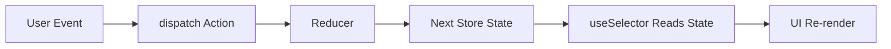

# Day 50 [Advanced]: Redux Concepts

## Goal

Understand Redux fundamentals deeply enough to:

- choose when Redux is appropriate
- model state transitions with actions and reducers
- wire a store to React UI safely
- debug predictable one-way state flow
- design a state shape that remains maintainable as an application grows
- distinguish Redux fundamentals from modern Redux Toolkit usage

This lesson focuses on core concepts without Redux Toolkit convenience APIs so the underlying architecture remains clear. The examples intentionally use the classic Redux APIs for learning the fundamentals; for new production applications, Redux Toolkit is the recommended modern approach and will be covered next.

## Prerequisites

- Day 49 completed
- Strong understanding of React state, props, and Context
- Comfortable with arrays, objects, and immutable update patterns
- Basic understanding of event handling in React
- Familiarity with component composition and shared state

## Learning Outcomes

By the end of this day, you should be able to:

1. Explain why Redux exists and what problem it solves.
2. Define store, action, reducer, dispatch, and selector clearly.
3. Describe Redux one-way data flow step by step.
4. Write pure reducers with immutable updates.
5. Dispatch actions with and without payloads.
6. Connect React components to global state using react-redux hooks.
7. Diagnose common Redux bugs such as state mutation and action-type mismatch.
8. Compare Redux to lighter alternatives and make practical tradeoff decisions.
9. Design a small feature state shape without putting unrelated UI state into Redux.
10. Explain why Redux Toolkit is preferred for new Redux applications.

## Redux Mental Model

When an event happens in the UI, Redux does not let components mutate shared state directly. Instead, every change is represented as a declarative action.

```text
UI Event
  -> dispatch(action)
  -> store passes action to reducer
  -> reducer computes next state
  -> store updates state
  -> subscribed UI reads new state
  -> UI re-renders
```

A useful rule:

> State changes should be explicit, traceable, and reproducible.

That traceability is what makes Redux valuable for medium and large applications.

A practical distinction is important: Redux does not mean that every piece of application state belongs in the store. Temporary input values, modal visibility, hover state, and other component-local concerns can remain local to React. Redux is most useful when multiple parts of an application need a shared, predictable state model.

## Core Building Blocks

### Store

The store is the central object that holds the current Redux state tree and coordinates dispatching and subscriptions.

```jsx
import { createStore } from "redux";

const store = createStore(rootReducer);
```

For learning the classic Redux architecture, `createStore` makes the flow visible. For a new application, prefer Redux Toolkit's `configureStore`, which reduces boilerplate and enables recommended defaults.

### Action

An action is a plain object describing what happened.

```jsx
{ type: "cart/itemAdded", payload: { id: 10, qty: 1 } }
```

A good action describes an event rather than telling the reducer how to implement the change. This keeps the action useful for logging, debugging, testing, and replaying state transitions.

### Reducer

A reducer is a pure function:

```text
(currentState, action) => nextState
```

It must not mutate existing state, perform network requests, access the DOM, generate unpredictable values, or perform other side effects.

### Dispatch

`dispatch` sends an action to the store.

```jsx
store.dispatch({ type: "counter/increment" });
```

The component does not directly assign a new Redux state value. It communicates what happened, and the reducer determines the next state.

### Selector

A selector reads specific data from state.

```jsx
const count = useSelector((state) => state.counter.count);
```

Selectors keep components focused and avoid passing full state objects around. They also create a useful boundary so the component does not need to understand the entire store shape.

A simple selector can be reused:

```jsx
const selectCartTotalItems = (state) => state.cart.totalItems;

function CartBadge() {
  const totalItems = useSelector(selectCartTotalItems);
  return <span>Cart: {totalItems}</span>;
}
```

## Topic by Topic

### Topic 1: Why Redux

Local component state works well for isolated UI behavior. As apps grow, shared cross-screen state can become scattered and inconsistent.

Typical pain points before Redux:

- duplicated logic across screens
- deeply nested prop drilling for shared state
- difficult debugging of who changed what
- non-reproducible bugs from implicit updates
- multiple components needing to coordinate the same business state

Redux helps by making every state transition explicit via actions and reducers.

However, Redux is not automatically the best answer to prop drilling. Component composition and Context can often solve simple data-sharing problems with less infrastructure. Introduce Redux when the application benefits from centralized, event-driven state management and predictable transitions.

### Topic 2: Action Design

Action types should represent domain events, not UI implementation details.

Good examples:

- `cart/itemAdded`
- `auth/loginSucceeded`
- `filters/priceRangeChanged`

Weak examples:

- `buttonClicked`
- `setData`

Action payloads should include only necessary data.

```jsx
{
  type: "cart/itemAdded",
  payload: {
    productId: 101,
    quantity: 2,
  },
}
```

Prefer actions that describe something that happened. For example, `cart/itemAdded` communicates a domain event, while `cart/setItems` can hide why the collection changed.

When an action needs more information, keep the payload shape predictable:

```jsx
{
  type: "cart/itemQuantityChanged",
  payload: {
    productId: 101,
    quantity: 3,
  },
}
```

### Topic 3: Reducer Purity and Immutability

Reducers should be deterministic and side-effect free.

Bad reducer (mutation):

```jsx
function reducer(state = { count: 0 }, action) {
  switch (action.type) {
    case "counter/increment":
      state.count += 1;
      return state;
    default:
      return state;
  }
}
```

Correct reducer (immutable update):

```jsx
function reducer(state = { count: 0 }, action) {
  switch (action.type) {
    case "counter/increment":
      return { ...state, count: state.count + 1 };
    default:
      return state;
  }
}
```

For nested state, every changed object/array along the update path needs a new reference:

```jsx
function profileReducer(state = { profile: { name: "Asha", city: "Kolkata" } }, action) {
  switch (action.type) {
    case "profile/cityChanged":
      return {
        ...state,
        profile: {
          ...state.profile,
          city: action.payload,
        },
      };
    default:
      return state;
  }
}
```

This is one reason Redux Toolkit is useful later: it uses Immer internally so reducers can be written with mutation-like syntax while still producing immutable updates.

### Topic 4: Store and Subscription Flow

In React apps, you usually subscribe through `useSelector` rather than direct `store.subscribe`.

```jsx
import { useSelector } from "react-redux";

function HeaderBadge() {
  const totalItems = useSelector((state) => state.cart.totalItems);
  return <span>Cart: {totalItems}</span>;
}
```

`useSelector` runs the selector when the component renders and after store updates. React Redux compares the selected result to determine whether the component needs to re-render.

Prefer selecting the smallest useful value instead of returning the entire state tree:

```jsx
// Prefer
const userName = useSelector((state) => state.auth.user.name);

// Avoid when the component needs only one field
const appState = useSelector((state) => state);
```

### Topic 5: Predictable One-way Data Flow

The flow remains stable regardless of app size:

1. A user interaction occurs.
2. Component dispatches an action.
3. Reducer calculates next state.
4. UI reads new state and reflects it.

This is simpler to reason about than direct state mutations from arbitrary modules.

Example:

```text
Click "Add to Cart"
        ↓
dispatch(cart/itemAdded)
        ↓
cartReducer
        ↓
new cart state
        ↓
selector reads cart count
        ↓
CartBadge renders new count
```

This separation also makes debugging easier because a state change can be traced back to the action that caused it.

### Topic 6: Redux vs Context

Context and Redux solve related but different concerns.

| Concern | Context | Redux |
|---|---|---|
| Primary purpose | Value delivery through tree | Structured state transitions |
| Change tracking | Provider value identity | Action log + reducer transitions |
| Tooling | Basic | Rich DevTools ecosystem |
| Team-scale conventions | Flexible | Strong and explicit |
| Async/business workflows | Usually application-defined | Strong ecosystem and conventions |

Use Context for low-frequency shared values (theme, locale, auth snapshot). Use Redux when state transitions are frequent, cross-feature, and require strict traceability.

Context itself does not provide reducers, action conventions, time-travel debugging, or a standardized global state architecture. It can be combined with `useReducer`, but that still does not make it identical to Redux.

### Topic 7: Redux vs Lighter Stores

Alternatives like Zustand can reduce boilerplate for smaller apps.

Choose Redux when you need:

- clear event-driven architecture
- strict transition modeling
- ecosystem maturity for large teams
- explicit debugging and predictable patterns
- conventions that multiple teams can follow consistently

Choose lighter solutions when:

- global state is moderate
- team prefers minimal abstraction
- feature velocity matters more than strict ceremony
- the application does not need a centralized event history

The correct decision depends on application complexity, team familiarity, debugging requirements, and long-term maintenance cost—not simply on which library has less code.

### Topic 8: Production Guardrails

Before scaling Redux usage across features, align on guardrails:

- action naming conventions
- reducer ownership boundaries
- normalized state shape conventions
- selector naming and placement
- no side effects inside reducers
- test strategy for reducers and selectors
- clear ownership of server state versus client state
- avoid putting sensitive secrets or tokens into Redux without understanding persistence and exposure risks
- define which state should remain local to a component

A useful production rule is to keep the Redux state serializable whenever possible. Serializable state improves debugging, persistence strategies, and DevTools behavior.

## Redux Flow Diagram



The diagram represents the conceptual flow. Middleware and other Redux infrastructure can participate in the dispatch pipeline, but reducers themselves remain pure functions.

## End-to-End Practical

Build a tiny inventory counter with the complete Redux cycle.

### Step 1: Create reducer

```jsx
const initialState = {
  booksIssued: 0,
};

function libraryReducer(state = initialState, action) {
  switch (action.type) {
    case "library/issueOne":
      return { ...state, booksIssued: state.booksIssued + 1 };
    case "library/returnOne":
      return { ...state, booksIssued: Math.max(0, state.booksIssued - 1) };
    case "library/issueMany":
      return {
        ...state,
        booksIssued: state.booksIssued + Math.max(0, Number(action.payload) || 0),
      };
    default:
      return state;
  }
}
```

The `returnOne` rule prevents the counter from becoming negative. In a real application, business rules such as maximum inventory, user permissions, or server confirmation would need to be modeled separately.

### Step 2: Create store

```jsx
import { createStore } from "redux";

export const store = createStore(libraryReducer);
```

This uses the classic Redux API intentionally for learning. For a new production application, the modern equivalent would normally use Redux Toolkit's `configureStore`.

### Step 3: Provide store

```jsx
import { Provider } from "react-redux";
import { store } from "./store";
import App from "./App";

export default function Root() {
  return (
    <Provider store={store}>
      <App />
    </Provider>
  );
}
```

`Provider` makes the Redux store available to React Redux hooks in descendant components.

### Step 4: Read and dispatch in UI

```jsx
import { useDispatch, useSelector } from "react-redux";

export default function LibraryPanel() {
  const booksIssued = useSelector((state) => state.booksIssued);
  const dispatch = useDispatch();

  return (
    <section>
      <h2>Books Issued: {booksIssued}</h2>

      <button type="button" onClick={() => dispatch({ type: "library/issueOne" })}>
        Issue 1
      </button>

      <button type="button" onClick={() => dispatch({ type: "library/returnOne" })}>
        Return 1
      </button>

      <button
        type="button"
        onClick={() => dispatch({ type: "library/issueMany", payload: 3 })}
      >
        Issue 3
      </button>
    </section>
  );
}
```

At this point the complete loop is visible: the component dispatches an event, the reducer creates a new state object, and `useSelector` reads the updated value.

## Hands-on Coding

### Example 1: Counter Store (Foundation)

```jsx
import { createStore } from "redux";

const initialState = { count: 0 };

function counterReducer(state = initialState, action) {
  switch (action.type) {
    case "counter/increment":
      return { ...state, count: state.count + 1 };
    case "counter/decrement":
      return { ...state, count: state.count - 1 };
    case "counter/reset":
      return { ...state, count: 0 };
    default:
      return state;
  }
}

export const store = createStore(counterReducer);
```

### Example 2: Selector-Driven UI

```jsx
import { useDispatch, useSelector } from "react-redux";

export function CounterPanel() {
  const count = useSelector((state) => state.count);
  const dispatch = useDispatch();

  return (
    <div>
      <p>Count: {count}</p>
      <button type="button" onClick={() => dispatch({ type: "counter/increment" })}>
        +
      </button>
      <button type="button" onClick={() => dispatch({ type: "counter/decrement" })}>
        -
      </button>
      <button type="button" onClick={() => dispatch({ type: "counter/reset" })}>
        Reset
      </button>
    </div>
  );
}
```

The selector matches the reducer's root state shape in this example. If the reducer were combined under a `counter` key, the selector would instead be `state.counter.count`. Always verify the actual store shape before writing selectors.

### Example 3: Payload Validation Pattern

```jsx
function cartReducer(state = { quantity: 0 }, action) {
  switch (action.type) {
    case "cart/addBy": {
      const amount = Number(action.payload);
      const safeAmount = Number.isFinite(amount) ? Math.max(0, amount) : 0;
      return { ...state, quantity: state.quantity + safeAmount };
    }
    default:
      return state;
  }
}
```

Payload validation should reflect the application's domain rules. Do not treat client-side validation as a security boundary when the value ultimately affects a server-side operation.

## Common Mistakes

1. Mutating state in reducers.
2. Using vague action names such as `setData`.
3. Putting async side effects directly inside reducers.
4. Returning incomplete state objects accidentally.
5. Selecting more state than a component actually needs.
6. Designing one giant reducer with no feature boundaries.
7. Treating Redux as mandatory for every project.
8. Assuming Context and Redux are interchangeable.
9. Mixing server-owned data and temporary UI state without a clear reason.
10. Copying Redux examples without checking the actual store shape used by the application.
11. Assuming `createStore` is the preferred API for new production Redux applications.

## Debugging Lab

### Bug A: Mutating array state

```jsx
function reducer(state = { items: [] }, action) {
  switch (action.type) {
    case "items/add":
      state.items.push(action.payload);
      return state;
    default:
      return state;
  }
}
```

Why it is broken:

- same state object is reused
- renders and tools can miss changes
- the reducer is no longer a pure immutable state transition

Fix:

```jsx
function reducer(state = { items: [] }, action) {
  switch (action.type) {
    case "items/add":
      return { ...state, items: [...state.items, action.payload] };
    default:
      return state;
  }
}
```

### Bug B: Action typo

```jsx
dispatch({ type: "counter/incremnt" });
```

Why it is broken:

- reducer has no matching case
- state does not change

Fix:

- standardize type strings
- keep action creators/constants in one place
- inspect the dispatched action in Redux DevTools when debugging

### Bug C: Accidentally dropping state branch

```jsx
function reducer(state = { user: null, token: null }, action) {
  switch (action.type) {
    case "auth/loginSucceeded":
      return { user: action.payload.user };
    default:
      return state;
  }
}
```

Why it is broken:

- `token` is lost after login
- the next state no longer has the expected shape

Fix:

```jsx
return {
  ...state,
  user: action.payload.user,
  token: action.payload.token,
};
```

### Bug D: Wrong selector path

Suppose the store shape is:

```jsx
{
  counter: {
    count: 5,
  },
}
```

This selector is wrong:

```jsx
const count = useSelector((state) => state.count);
```

Correct selector:

```jsx
const count = useSelector((state) => state.counter.count);
```

When a selector returns `undefined`, first inspect the actual store shape before changing the reducer.

## Hands-on Exercises

1. Build a task tracker reducer with `addTask`, `toggleTask`, and `removeTask`.
2. Add a filter state branch with actions `setFilter` and `clearFilter`.
3. Create selectors for `allTasks`, `completedTasks`, and `activeTasks`.
4. Add guard logic so invalid payloads do not corrupt state.
5. Write one reducer unit test per action.
6. Add an `editingTaskId` value and decide whether it belongs in Redux or local component state. Explain your decision.
7. Intentionally introduce an incorrect selector path, reproduce the bug, and diagnose it using the store shape.

## Assessment Quiz

### Questions

1. What is the main responsibility of a reducer?
2. Why must reducers stay pure?
3. What does dispatch do?
4. Why is immutability important in Redux?
5. When is Redux generally a better choice than local component state?
6. Is Context a full replacement for Redux in all cases?
7. What is a selector and why is it useful?
8. Which is better action naming: `setData` or `cart/itemAdded` and why?
9. Why should new Redux applications generally prefer Redux Toolkit over the classic `createStore` API?
10. If `useSelector((state) => state.counter.count)` returns `undefined`, what should you inspect first?

### Answers

1. Compute next state from current state and action.
2. Purity ensures predictable and testable state transitions and keeps side effects outside reducers.
3. Dispatch sends an action into the Redux update pipeline.
4. It preserves reliable change tracking and prevents hidden state mutation.
5. When cross-feature shared state and strict transition traceability are required.
6. No. Context solves value delivery, while Redux adds structured transition modeling and an ecosystem around state management.
7. A selector reads focused state slices and improves component clarity and reuse.
8. `cart/itemAdded` is better because it is explicit and domain meaningful.
9. Redux Toolkit provides recommended defaults, less boilerplate, and safer modern Redux patterns.
10. Inspect the actual Redux state shape and confirm whether the `counter` branch exists at that path.

## Interview Questions and Answers

### Beginner

What are the core Redux concepts?

Store, action, reducer, dispatch, and selector.

Why is Redux called predictable?

All updates follow explicit action -> reducer -> next state flow.

### Intermediate

How do you avoid reducer mutation bugs?

Use immutable updates for arrays/objects and keep reducer logic pure. In modern Redux, Redux Toolkit uses Immer to make immutable updates easier to write.

How do selectors help performance and maintainability?

Selectors keep components focused on the minimum necessary data and reduce coupling to the full state shape. They also provide a reusable place for state-reading logic.

Why should not every React state value be moved into Redux?

Globalizing local UI state creates unnecessary coupling and complexity. State should be placed where it has the appropriate ownership and sharing requirements.

### Advanced

When should a team avoid introducing Redux?

When app state is small, mostly local, and the extra architecture adds more complexity than value.

How would you scale Redux architecture in a large app?

Split state by feature domains, standardize action naming, centralize selector patterns, keep reducers pure, test important transitions, and use Redux Toolkit for modern implementation.

What is the difference between Redux and Context at an architectural level?

Context primarily provides values through a React tree. Redux defines a broader state-management architecture based on a store, actions, reducers, dispatch, selectors, and supporting tooling.

Why is action design important in a large application?

Good action names form a meaningful event history. They make debugging, logging, testing, and communication between teams easier.

## Production Checklist

- [ ] Action names follow domain/event style.
- [ ] Reducers are pure and immutable.
- [ ] State shape is intentionally designed by feature.
- [ ] Components select only required slices.
- [ ] Invalid payload handling is defined.
- [ ] Unit tests cover reducer transitions.
- [ ] Async logic strategy is clear for next lessons.
- [ ] Team can debug action flow confidently.
- [ ] New production Redux code uses Redux Toolkit rather than manually creating stores with legacy APIs.
- [ ] Server state, client state, and local UI state have clear ownership.
- [ ] Sensitive information is not persisted into Redux without a deliberate security review.
- [ ] Selectors are tested when they contain meaningful business logic.

## Self Check

- [ ] I can explain Redux one-way data flow without notes.
- [ ] I can write reducers with immutable updates.
- [ ] I can dispatch actions with typed payloads.
- [ ] I can connect store data to React using hooks.
- [ ] I can find and fix common Redux bugs.
- [ ] I can justify when Redux should or should not be used.
- [ ] I can explain why Redux Toolkit is preferred for modern Redux development.
- [ ] I can inspect a Redux state tree and write the correct selector path.

## Day 50 Outcome

You now understand Redux fundamentals as an architecture, not only as a syntax pattern.

You can explain the store, actions, reducers, dispatch, selectors, immutable updates, and one-way data flow; connect Redux state to React; diagnose common state-management bugs; and make a reasoned decision about when Redux is appropriate.

The classic APIs in this lesson are intentionally used to expose the underlying concepts. Next day (Day 51) will move from Redux core concepts to Redux Toolkit, where the same ideas become easier to implement with modern APIs.
