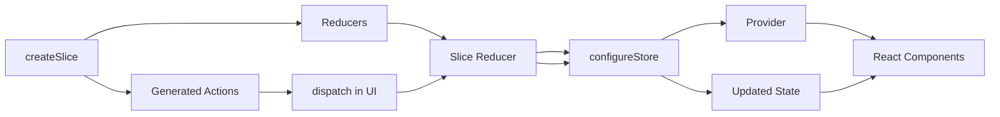

# Day 51 [Advanced]: Redux Toolkit Introduction

## Goal

Understand why Redux Toolkit (RTK) is the recommended way to write modern Redux applications, and learn how to migrate classic Redux concepts from Day 50 into `configureStore`, `createSlice`, generated action creators, and Immer-powered reducers.

By the end of this lesson, you should understand not only **how** RTK works, but also **why** its conventions make Redux code easier to maintain, test, review, and scale.

## Prerequisites

- Day 50 completed
- Basic Redux store, action, reducer, and dispatch knowledge
- Basic React component and event-handling knowledge
- Basic understanding of JavaScript modules and object/array updates

## Explanation

Redux Toolkit is the official recommended approach for writing Redux logic. It reduces the repetitive setup required by classic Redux while keeping the core Redux data-flow model intact.

The most important RTK APIs introduced today are:

- `configureStore` — creates a Redux store with sensible defaults and middleware configuration.
- `createSlice` — keeps initial state, reducer logic, and generated action creators together.
- Immer integration — allows reducer code to use concise mutation-like syntax while producing immutable state updates safely.
- Generated action creators — removes the need to manually maintain action-type constants and matching action-creator functions for common slice actions.

RTK does **not** change the fundamental Redux flow:

```text
UI event
   ↓
dispatch(action)
   ↓
reducer
   ↓
new Redux state
   ↓
subscribed components re-render
```

The major improvement is that RTK removes boilerplate around that flow.

> Important: RTK's mutation-like reducer syntax is safe because Immer tracks changes to a draft state and produces the next immutable state. This does not mean that arbitrary Redux state can be mutated outside a reducer.

## Topic by Topic

### Topic 1: Why Redux Toolkit

Theory:

Classic Redux often requires separate action-type constants, action creators, switch-based reducers, and store configuration. That separation can be useful for understanding Redux fundamentals, but it becomes repetitive as the application grows.

Redux Toolkit keeps related logic together and provides recommended defaults.

Practical:

Instead of maintaining code such as:

```jsx
const INCREMENT = "counter/increment";

const increment = () => ({ type: INCREMENT });
```

you can define the reducer inside a slice and let RTK generate the action creator.

Code Example:

```jsx
import { createSlice } from "@reduxjs/toolkit";

const counterSlice = createSlice({
  name: "counter",
  initialState: { value: 0 },
  reducers: {
    increment: (state) => {
      state.value += 1;
    },
  },
});
```

**Explanation:** `createSlice` derives the action type from the slice name and reducer name. The generated action can then be dispatched from React components.

**Key Points:**

- RTK reduces Redux boilerplate; it does not remove Redux's unidirectional data flow.
- Related state and reducer logic can live together in a domain-oriented slice.
- Generated action creators reduce manual string-based action handling.
- Prefer RTK for new Redux applications instead of manually assembling classic Redux patterns.

### Topic 2: createSlice Basics

Theory:

A slice represents one logical area of application state. `createSlice` accepts a `name`, `initialState`, and `reducers` object.

Each reducer function can receive the current draft state and an action. RTK automatically creates action creators for the reducer names.

Practical:

Create a counter slice with increment, decrement, and reset behavior.

Code Example:

```jsx
import { createSlice } from "@reduxjs/toolkit";

const initialState = { value: 0 };

const counterSlice = createSlice({
  name: "counter",
  initialState,
  reducers: {
    increment: (state) => {
      state.value += 1;
    },
    decrement: (state) => {
      state.value -= 1;
    },
    reset: (state) => {
      state.value = 0;
    },
  },
});

export const { increment, decrement, reset } = counterSlice.actions;
export default counterSlice.reducer;
```

**Explanation:** `counterSlice.reducer` is the reducer that will be registered in the store. `counterSlice.actions` contains action creators generated from the reducer names.

**Key Points:**

- `name` becomes part of generated action types such as `counter/increment`.
- `initialState` defines the state owned by this slice.
- `reducers` contains synchronous state-transition logic.
- Export generated actions and the slice reducer separately.

### Topic 3: configureStore Basics

Theory:

`configureStore` creates the Redux store and provides sensible defaults, including development checks and middleware configuration.

Practical:

Register the counter reducer under the `counter` state key.

Code Example:

```jsx
import { configureStore } from "@reduxjs/toolkit";
import counterReducer from "./counterSlice";

export const store = configureStore({
  reducer: {
    counter: counterReducer,
  },
});
```

With this configuration, the Redux state shape is:

```jsx
{
  counter: {
    value: 0
  }
}
```

Therefore, a selector for the counter value can use `state.counter.value`.

**Explanation:** The key used inside `reducer` becomes the corresponding top-level key in the Redux state tree. Keeping this relationship clear prevents many selector bugs.

**Key Points:**

- `configureStore` is the standard store setup API for modern Redux.
- Reducers can be registered by feature/domain name.
- The configured reducer keys determine the top-level Redux state shape.
- Avoid creating multiple unrelated stores for one React application unless there is a deliberate architectural reason.

### Topic 4: Immer-style Reducer Updates

Theory:

RTK integrates Immer, allowing reducer code to look as though it mutates state:

```jsx
state.value += 1;
```

Immer tracks the draft changes and produces the next immutable state.

Practical:

Use mutation-like syntax inside an RTK reducer, but remember that this syntax is only safe inside the Immer-managed reducer context.

Code Example:

```jsx
increment: (state) => {
  state.value += 1;
},
```

An equivalent immutable update outside an Immer reducer would look conceptually like:

```jsx
const nextState = {
  ...state,
  value: state.value + 1,
};
```

**Explanation:** The important distinction is that RTK does not make JavaScript objects universally mutable. Immer manages a draft specifically while the reducer executes.

**Key Points:**

- Mutation-like syntax is safe inside RTK's Immer-powered reducers.
- Do not mutate Redux state directly inside React components.
- Do not assume Immer applies to arbitrary helper functions that are outside the reducer draft context.
- Immutable state transitions remain a core Redux concept.

### Topic 5: Generated Actions

Theory:

For each reducer defined inside `createSlice`, RTK generates a corresponding action creator.

Practical:

Dispatch the generated `increment` action from a React component.

Code Example:

```jsx
import { useDispatch } from "react-redux";
import { increment } from "./counterSlice";

function IncrementButton() {
  const dispatch = useDispatch();

  return (
    <button onClick={() => dispatch(increment())}>
      Increment
    </button>
  );
}
```

For actions that need data, use the action payload:

```jsx
addBy: (state, action) => {
  state.value += action.payload;
},
```

and dispatch it with:

```jsx
dispatch(addBy(5));
```

**Explanation:** Generated action creators standardize the connection between reducer definitions and dispatch calls. Payloads should represent the data needed to perform the state transition.

**Key Points:**

- Reducer names become generated action creators.
- `dispatch(increment())` creates and dispatches the corresponding action.
- Payload-based actions are useful when a state transition needs input data.
- Keep action payloads focused and predictable.

### Topic 6: Production Guardrails for Redux Toolkit Introduction

Theory:

At this stage, strong engineering comes from repeatable quality checks that prevent regressions in state flow, edge cases, and maintainability.

Practical:

Before merging an RTK feature, verify:

1. The slice owns a clearly defined domain of state.
2. The reducer handles valid payloads predictably.
3. Components select only the state they need.
4. Components dispatch generated actions instead of manually constructing common action objects.
5. State is not mutated directly outside reducer logic.
6. Store keys and selector paths agree.
7. Tests cover important state transitions.

Code Example:

```jsx
const ticketsSlice = createSlice({
  name: "tickets",
  initialState: { open: 0 },
  reducers: {
    openTicket: (state) => {
      state.open += 1;
    },
    closeTicket: (state) => {
      if (state.open > 0) {
        state.open -= 1;
      }
    },
  },
});
```

Here the guard prevents the ticket count from becoming negative when `closeTicket` is dispatched while no tickets are open.

**Explanation:** Production-ready Redux is not just about using RTK APIs. State ownership, predictable transitions, selector correctness, tests, and meaningful domain boundaries are equally important.

**Key Points:**

- Validate domain invariants inside reducers when appropriate.
- Keep slices focused on meaningful state domains.
- Prefer selectors over reaching into store details throughout the component tree.
- Test important reducers and user-visible state transitions.

## Key Concepts

- Boilerplate reduction
- Slice-centric architecture
- `configureStore` defaults
- `createSlice`
- Immer draft updates
- Auto-generated action creators
- Action payloads
- Redux state shape and selectors
- Provider/store integration
- Quality guardrail mindset

## Visual Concept Map



## End-to-End Practical

1. Install `@reduxjs/toolkit` and `react-redux`.
2. Create a `counterSlice` with `increment`, `decrement`, and `reset` reducers.
3. Configure the store with `configureStore`.
4. Wrap the React application with `Provider`.
5. Read state using `useSelector`.
6. Dispatch generated actions using `useDispatch`.
7. Add one payload-based reducer such as `incrementBy`.
8. Verify that the selector path matches the reducer key registered in the store.
9. Test the reducer transitions before connecting more UI behavior.

A typical application setup is:

```jsx
// store.js
import { configureStore } from "@reduxjs/toolkit";
import counterReducer from "./counterSlice";

export const store = configureStore({
  reducer: {
    counter: counterReducer,
  },
});
```

```jsx
// main.jsx
import React from "react";
import ReactDOM from "react-dom/client";
import { Provider } from "react-redux";
import { store } from "./store";
import App from "./App";

ReactDOM.createRoot(document.getElementById("root")).render(
  <Provider store={store}>
    <App />
  </Provider>
);
```

## Hands-on Coding

### Example 1: Case - Counter Migration to RTK Slice

Scenario:
A training app migrates a classic Redux counter into an RTK slice for cleaner structure.

```jsx
import { createSlice } from "@reduxjs/toolkit";

const initialState = { value: 0 };

const counterSlice = createSlice({
  name: "counter",
  initialState,
  reducers: {
    increment: (state) => {
      state.value += 1;
    },
    decrement: (state) => {
      state.value -= 1;
    },
    reset: (state) => {
      state.value = 0;
    },
    incrementBy: (state, action) => {
      state.value += action.payload;
    },
  },
});

export const { increment, decrement, reset, incrementBy } = counterSlice.actions;
export default counterSlice.reducer;
```

### Example 2: Case - Store Setup with configureStore

Scenario:
A dashboard app centralizes reducers using `configureStore`.

```jsx
import { configureStore } from "@reduxjs/toolkit";
import counterReducer from "./counterSlice";

export const store = configureStore({
  reducer: {
    counter: counterReducer,
  },
});
```

### Example 3: Case - UI Dispatch with Generated Actions

Scenario:
A toolbar should use generated actions without manually writing action-type strings.

```jsx
import { useDispatch, useSelector } from "react-redux";
import { increment, decrement, reset } from "./counterSlice";

function CounterPanel() {
  const value = useSelector((state) => state.counter.value);
  const dispatch = useDispatch();

  return (
    <div>
      <p>Count: {value}</p>
      <button onClick={() => dispatch(increment())}>+</button>
      <button onClick={() => dispatch(decrement())}>-</button>
      <button onClick={() => dispatch(reset())}>Reset</button>
    </div>
  );
}

export default CounterPanel;
```

### Example 4: Case - Payload-based Reducer

Scenario:
A dashboard needs to increase a value by a user-selected amount.

```jsx
import { useDispatch } from "react-redux";
import { incrementBy } from "./counterSlice";

function AddFiveButton() {
  const dispatch = useDispatch();

  return (
    <button onClick={() => dispatch(incrementBy(5))}>
      Add 5
    </button>
  );
}

export default AddFiveButton;
```

The important flow is:

```text
incrementBy(5)
     ↓
action.payload === 5
     ↓
reducer receives action
     ↓
state.value += 5
```

## Mini Exercise

Scenario:
You are building a support dashboard.

Migrate classic Redux ticket-counter logic to RTK using `createSlice`. Add actions: `openTicket`, `closeTicket`, and `resetTickets`.

Expected output:

- Slice file includes state + reducers + generated actions
- Store uses `configureStore`
- UI dispatches generated actions
- Selector reads the correct `state.tickets` path
- `closeTicket` should not reduce the count below zero
- Add one payload-based action such as `closeTicketsBy(count)`

Challenge:

Add a `priority` field to the state and create a reducer that changes it from the UI. Explain why the priority belongs in Redux state for this exercise instead of being stored as unrelated component state.

## Assessment Quiz

### Quiz Questions

1. What does `createSlice` generate automatically?
2. Why is `configureStore` preferred over manually creating a classic Redux store for modern Redux applications?
3. True or False: RTK reducers can safely use mutation-like syntax when operating on the Immer draft state.
4. Which library powers RTK draft mutation behavior?
5. What is one major maintainability benefit of RTK in teams?
6. If a reducer is registered as `counter: counterReducer`, what is the selector path for `value` when the state shape is `{ value: 0 }`?
7. Where should direct state mutation be avoided even when the application uses RTK?

### Quiz Answers

1. Action creators and the slice reducer for the reducers defined in `createSlice`.
2. It provides recommended defaults, middleware configuration, development checks, and a simpler setup.
3. True. Immer tracks changes to the draft and produces the immutable next state.
4. Immer.
5. Less boilerplate, co-located domain logic, and more consistent Redux patterns.
6. `state.counter.value`.
7. In React components or arbitrary application code outside the Immer-managed reducer context.

## Task

- Migrate one classic Redux feature to an RTK slice.
- Configure the store using `configureStore`.
- Connect the store with `Provider`.
- Read state with `useSelector`.
- Dispatch generated actions with `useDispatch`.
- Complete the ticket-counter mini exercise.
- Add at least one payload-based reducer.
- Document the state shape and explain why each top-level store key exists.

## Self Check

- You can explain the value of RTK over classic Redux.
- You can create a slice with state, reducers, and generated actions.
- You can create a store with `configureStore`.
- You understand why Immer allows mutation-like reducer syntax.
- You can identify the correct selector path from the store configuration.
- You can dispatch payload-based actions.
- You can explain where direct state mutation is still unsafe.
- You can answer at least 6 out of 7 quiz questions correctly.

## Interview Questions and Answers

### Beginner

**Question:** What is Redux Toolkit?

**Answer:** Redux Toolkit (RTK) is the official recommended way to write Redux logic. It provides APIs and defaults that reduce boilerplate and encourage common Redux best practices.

**Question:** What does `createSlice` do?

**Answer:** It combines a slice's initial state and reducer logic and automatically generates action creators and action types for those reducers.

### Middle

**Question:** Why is RTK considered a better default for new Redux applications?

**Answer:** It provides recommended store configuration, middleware and development checks, concise reducer definitions, and conventions that reduce common setup mistakes.

**Question:** How does RTK simplify immutable updates?

**Answer:** RTK uses Immer internally, so reducers can write mutation-like operations against a draft state while Immer creates the immutable next state.

**Question:** Is RTK actually mutating the Redux state object?

**Answer:** No. The reducer receives an Immer draft. Immer tracks the changes and produces a new immutable state result.

### Advanced

**Question:** How does RTK improve long-term maintainability?

**Answer:** Domain-oriented slices colocate related state transitions and generated actions, reducing scattered action types and repetitive reducer code while making feature ownership clearer.

**Question:** Why is action creator generation useful for large codebases?

**Answer:** It reduces manually duplicated action-type strings and keeps action creators tied directly to their slice reducers, lowering the risk of mismatched names and boilerplate.

**Question:** What is an important limitation of Immer-style mutation syntax?

**Answer:** It is safe only in the Immer-managed reducer context. It does not make Redux state freely mutable throughout the application.

**Question:** When should you avoid putting state into Redux?

**Answer:** If state is purely local to one component and does not need to be shared, persisted, or coordinated across distant parts of the application, local React state may be simpler and more appropriate.

## Day 51 Outcome

- You can explain why Redux Toolkit is the recommended modern Redux approach.
- You can migrate classic Redux reducer logic into an RTK slice.
- You can create a clean store with `configureStore`.
- You can use generated action creators and payloads.
- You understand Immer's role in immutable state updates.
- You can connect Redux Toolkit state to React components with `Provider`, `useSelector`, and `useDispatch`.
- You are ready for multi-slice store design and larger Redux state architecture in Day 52.
