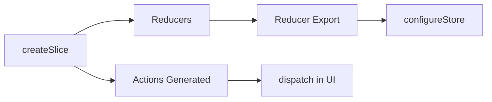

---
title: Redux Toolkit Introduction
slug: day-051-redux-toolkit-introduction
dayLabel: Day 51
level: Advanced
estimatedMinutes: 30
order: 51
track: react
---
# Day 51 [Advanced]: Redux Toolkit Introduction

## Index

- [Goal](#goal)
- [Prerequisites](#prerequisites)
- [Explanation](#explanation)
- [Topic by Topic](#topic-by-topic)
- [Key Concepts](#key-concepts)
- [Visual Concept Map](#visual-concept-map)
- [End-to-End Practical](#end-to-end-practical)
- [Hands-on Coding](#hands-on-coding)
- [Mini Exercise](#mini-exercise)
- [Assessment Quiz](#assessment-quiz)
- [Task](#task)
- [Self Check](#self-check)
- [Interview Questions and Answers](#interview-questions-and-answers)
- [Day 51 Outcome](#day-51-outcome)

## Goal

Understand why Redux Toolkit (RTK) is the recommended Redux approach and migrate classic Redux logic to RTK patterns.

## Prerequisites

- Day 50 completed
- Basic Redux store, action, reducer knowledge

## Explanation

Redux Toolkit removes boilerplate by using `configureStore`, `createSlice`, and Immer-powered immutable updates with simpler syntax.

## Topic by Topic

### Topic 1: Why Redux Toolkit

Theory:
Classic Redux needs verbose action types and reducer switches.

Practical:
Replace multiple files with single slice module.

Code Example:

```jsx
import { createSlice } from "@reduxjs/toolkit";
```

**Explanation:** This topic explains Why Redux Toolkit in a practical way so you can apply it confidently in real React projects.

**Key Points:**

- Understand the core idea of Why Redux Toolkit.
- Apply the pattern using clean, readable code.
- Avoid common mistakes through predictable React flow.

### Topic 2: createSlice Basics

Theory:
Slice defines state, reducer logic, and action creators together.

Practical:
Create counter slice with increment/decrement/reset.

Code Example:

```jsx
createSlice({ name: "counter", initialState, reducers: {} });
```

**Explanation:** This topic explains createSlice Basics in a practical way so you can apply it confidently in real React projects.

**Key Points:**

- Understand the core idea of createSlice Basics.
- Apply the pattern using clean, readable code.
- Avoid common mistakes through predictable React flow.

### Topic 3: configureStore Basics

Theory:
`configureStore` creates store with good defaults and middleware.

Practical:
Register counter reducer in store.

Code Example:

```jsx
configureStore({ reducer: { counter: counterReducer } });
```

**Explanation:** This topic explains configureStore Basics in a practical way so you can apply it confidently in real React projects.

**Key Points:**

- Understand the core idea of configureStore Basics.
- Apply the pattern using clean, readable code.
- Avoid common mistakes through predictable React flow.

### Topic 4: Immer-style Reducer Updates

Theory:
RTK lets you "mutate" draft state safely via Immer.

Practical:
Use `state.count += 1` in reducer.

Code Example:

```jsx
increment: (state) => {
  state.count += 1;
};
```

**Explanation:** This topic explains Immer-style Reducer Updates in a practical way so you can apply it confidently in real React projects.

**Key Points:**

- Understand the core idea of Immer-style Reducer Updates.
- Apply the pattern using clean, readable code.
- Avoid common mistakes through predictable React flow.

### Topic 5: Generated Actions

Theory:
Slice automatically generates action creators from reducer names.

Practical:
Dispatch `increment()` action creator.

Code Example:

```jsx
dispatch(increment());
```

**Explanation:** This topic explains Generated Actions in a practical way so you can apply it confidently in real React projects.

**Key Points:**

- Understand the core idea of Generated Actions.
- Apply the pattern using clean, readable code.
- Avoid common mistakes through predictable React flow.

### Topic 6: Production Guardrails for Redux Toolkit Introduction

Theory:
At this stage, strong engineering comes from repeatable quality checks that prevent regressions in state flow, edge cases, and maintainability.

Practical:
Define a short review checklist for this topic that verifies correctness, fallback behavior, and readability before merge.

Code Example:

`jsx
// Add a checklist step before release for this feature area.
`
**Explanation:** This topic explains Production Guardrails for Redux Toolkit Introduction in a practical way so you can apply it confidently in real React projects.

**Key Points:**

- Understand the core idea of Production Guardrails for Redux Toolkit Introduction.
- Apply the pattern using clean, readable code.
- Avoid common mistakes through predictable React flow.

## Key Concepts

- Boilerplate reduction
- Slice-centric architecture
- configureStore defaults
- Immer draft updates
- Auto-generated action creators

- Quality guardrail mindset

## Visual Concept Map



## End-to-End Practical

1. Install `@reduxjs/toolkit` and `react-redux`.
2. Create counter slice.
3. Configure store with slice reducer.
4. Wrap app with Provider.
5. Dispatch generated actions from component.

## Hands-on Coding

### Example 1: Case - Counter Migration to RTK Slice

Scenario:
A training app migrates classic Redux counter into RTK slice for cleaner structure.

```jsx
import { createSlice } from "@reduxjs/toolkit";

const counterSlice = createSlice({
  name: "counter",
  initialState: { value: 0 },
  reducers: {
    increment: (state) => {
      state.value += 1;
    },
    decrement: (state) => {
      state.value -= 1;
    },
    reset: (state) => {
      state.value = 0;
    },
  },
});

export const { increment, decrement, reset } = counterSlice.actions;
export default counterSlice.reducer;
```

### Example 2: Case - Store Setup with configureStore

Scenario:
A dashboard app centralizes reducers using configureStore.

```jsx
import { configureStore } from "@reduxjs/toolkit";
import counterReducer from "./counterSlice";

export const store = configureStore({
  reducer: {
    counter: counterReducer,
  },
});
```

### Example 3: Case - UI Dispatch with Generated Actions

Scenario:
A toolbar should use generated actions without manual action type strings.

```jsx
import { useDispatch, useSelector } from "react-redux";
import { increment, decrement, reset } from "./counterSlice";

function CounterPanel() {
  const value = useSelector((state) => state.counter.value);
  const dispatch = useDispatch();

  return (
    <div>
      <p>{value}</p>
      <button onClick={() => dispatch(increment())}>+</button>
      <button onClick={() => dispatch(decrement())}>-</button>
      <button onClick={() => dispatch(reset())}>Reset</button>
    </div>
  );
}
```

## Mini Exercise

Scenario:
You are building a support dashboard.

Migrate ticket counter logic from classic Redux to RTK using `createSlice`. Add actions: `openTicket`, `closeTicket`, `resetTickets`.

Expected output:

- Slice file includes state + reducers + generated actions
- Store uses `configureStore`
- UI dispatches generated actions

## Assessment Quiz

### Quiz Questions

1. What does createSlice generate automatically?
2. Why is configureStore preferred over createStore?
3. True or False: RTK reducers can directly mutate state object safely.
4. Which library powers RTK draft mutation behavior?
5. What is one major benefit of RTK in teams?

### Quiz Answers

1. Action creators and slice reducer
2. Better defaults, middleware, and simpler setup
3. True
4. Immer
5. Less boilerplate and consistent architecture

## Task

- Migrate one classic Redux feature to RTK slice
- Configure store via configureStore
- Complete mini exercise

## Self Check

- You can explain RTK value over classic Redux
- You can build slice + store with generated actions
- You can answer at least 4 out of 5 quiz questions correctly

## Interview Questions and Answers

### Beginner

**Question:** What is Redux Toolkit?

**Answer:** Official, recommended way to write Redux with less boilerplate.

**Question:** What does createSlice do?

**Answer:** Creates reducers and action creators in one place.

### Middle

**Question:** Why is RTK considered safer for new Redux apps?

**Answer:** It includes best-practice defaults and avoids common setup mistakes.

**Question:** How does RTK simplify immutable updates?

**Answer:** Immer lets reducers write concise mutation-like code.

### Advanced

**Question:** How does RTK improve long-term maintainability?

**Answer:** Domain slices keep related logic co-located and predictable.

**Question:** Why is action creator generation useful for large codebases?

**Answer:** Reduces string constant errors and repetitive action boilerplate.

## Day 51 Outcome

- You can migrate classic Redux logic into RTK slices
- You can create clean stores with modern Redux patterns
- You are ready for multi-slice store design in Day 52

