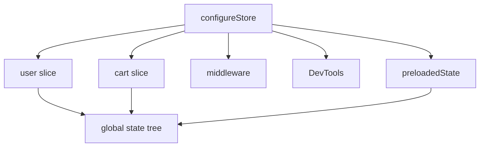

# Day 52 [Advanced]: Store Configuration

## Goal

Configure a scalable Redux Toolkit store with multiple slices, predictable state shape, preloaded state, and middleware awareness.

By the end of this lesson, you should be able to explain not only **how** `configureStore` is configured, but also **why** each option exists and when changing the defaults is appropriate.

## Prerequisites

- Day 51 completed
- RTK slice fundamentals
- Basic understanding of reducers, actions, and selectors

## Explanation

As an application grows, the Redux store becomes the central contract between feature slices and the UI. A good store configuration makes the state tree predictable, keeps development checks enabled, and avoids unnecessary customization.

Redux Toolkit's `configureStore` is preferred over the older `createStore` API because it provides useful defaults such as thunk middleware, development checks, and DevTools integration. The configuration should normally stay small and explicit.

A useful mental model is:

```text
configureStore
├── reducer map → state tree
├── middleware → dispatch pipeline
├── preloadedState → initial state
└── devTools → debugging integration
```

## Topic by Topic

### Topic 1: Multi-slice Reducer Map

Theory:

The `reducer` option accepts an object whose keys become the top-level keys in the Redux state tree. Each value is the reducer produced by a slice.

Practical:

Add `user` and `cart` slices and keep their state isolated by feature.

Code Example:

```jsx
import { configureStore } from "@reduxjs/toolkit";
import userReducer from "./features/user/userSlice";
import cartReducer from "./features/cart/cartSlice";

export const store = configureStore({
  reducer: {
    user: userReducer,
    cart: cartReducer,
  },
});
```

The resulting state shape is conceptually:

```js
{
  user: { /* user slice state */ },
  cart: { /* cart slice state */ },
}
```

**Why it matters:** the reducer-map key becomes part of the selector contract. If the key is `cart`, components should select from `state.cart`, not `state.shoppingCart` unless the store is configured with that key.

**Common mistake:** changing a reducer-map key without updating selectors, tests, and any code that relies on the state shape.

**Key Points:**

- Understand how multiple slice reducers form one state tree.
- Treat reducer keys as part of the application's state contract.
- Keep feature state separated and predictable.

### Topic 2: Preloaded State Concept

Theory:

`preloadedState` provides the initial Redux state when the store is created. It is useful for server-provided data, persisted state hydration, controlled tests, or restoring a session.

Practical:

Use preloaded cart data when creating the store.

Code Example:

```jsx
const preloadedState = {
  cart: {
    items: [{ id: "course-101", quantity: 1 }],
  },
};

const store = configureStore({
  reducer: {
    user: userReducer,
    cart: cartReducer,
  },
  preloadedState,
});
```

The shape of `preloadedState` should match the reducer map. If the cart reducer owns `items`, the preloaded cart state should provide the expected structure.

**Important:** preloaded state is initial input to the store; it is not a replacement for normal reducer-driven updates after the store has been created.

**Common mistake:** supplying a state shape that does not match the slice's expected initial state.

**Key Points:**

- Understand when initial state must come from outside the reducer defaults.
- Keep preloaded state aligned with the configured reducer map.
- Validate persisted or server-provided data before trusting it as application state.

### Topic 3: Middleware Defaults

Theory:

`configureStore` adds useful middleware by default. In a normal RTK application, you should keep those defaults unless you have a specific reason to change them.

Practical:

Use `getDefaultMiddleware()` when adding middleware configuration.

Code Example:

```jsx
const store = configureStore({
  reducer: {
    user: userReducer,
    cart: cartReducer,
  },
  middleware: (getDefaultMiddleware) =>
    getDefaultMiddleware(),
});
```

RTK's default middleware includes development checks such as immutable-state and serializable-value checks. These checks can reveal accidental mutations or non-serializable values during development.

If custom middleware is required, preserve the defaults unless you deliberately understand the trade-off:

```jsx
middleware: (getDefaultMiddleware) =>
  getDefaultMiddleware().concat(myMiddleware),
```

**Common mistake:** replacing the default middleware array with a custom array and accidentally removing useful RTK middleware.

**Key Points:**

- Understand that `configureStore` provides middleware defaults.
- Prefer extending defaults over replacing them unnecessarily.
- Treat serializability warnings as useful signals rather than simply hiding them.

### Topic 4: DevTools Configuration

Theory:

Redux DevTools makes action and state history easier to inspect. `configureStore` enables DevTools integration by default in typical development usage.

Practical:

You can explicitly control the option when your application has a specific environment requirement.

Code Example:

```jsx
const store = configureStore({
  reducer: {
    user: userReducer,
    cart: cartReducer,
  },
  devTools: import.meta.env?.DEV ?? true,
});
```

The exact environment flag depends on the build tool. For Vite, `import.meta.env.DEV` is the usual development flag. In a Create React App application, `process.env.NODE_ENV` is commonly used instead.

**Common mistake:** copying an environment-variable expression from one build tool into another without checking how that tool exposes environment information.

**Key Points:**

- Understand the purpose of Redux DevTools.
- Prefer the build tool's documented environment flag.
- Avoid treating DevTools configuration as a substitute for application security.

### Topic 5: Folder Structure for Scale

Theory:

Feature-based organization keeps Redux logic close to the domain it represents. A feature can contain its slice, selectors, tests, and related UI without forcing the application into one large global folder.

Practical:

Organize `features/user` and `features/cart` around their responsibilities.

Example Structure:

```text
src/
├── app/
│   └── store.js
├── features/
│   ├── user/
│   │   ├── userSlice.js
│   │   ├── userSelectors.js
│   │   └── userSlice.test.js
│   └── cart/
│       ├── cartSlice.js
│       ├── cartSelectors.js
│       └── cartSlice.test.js
└── components/
```

**Why it matters:** feature-based structure makes ownership clearer and reduces the chance that unrelated domains become tightly coupled through one large slice.

**Common mistake:** creating a single `redux.js` file containing every slice, selector, action, and middleware rule as the application grows.

**Key Points:**

- Organize state logic by business feature.
- Keep selectors and tests close to the feature they serve.
- Keep global store wiring small while feature logic remains local.

### Topic 6: Production Guardrails for Store Configuration

Theory:

Strong store configuration uses repeatable checks to prevent state-shape regressions, unsafe persistence, accidental middleware removal, and hard-to-debug environment differences.

Practical:

Before merging a store configuration change, verify:

- every reducer is registered under the intended key
- preloaded state matches the reducer shape
- default middleware has not been accidentally removed
- selectors still point to the correct state paths
- persisted data is validated before hydration
- production configuration does not expose sensitive state through debugging tools

Code Example:

```jsx
const store = configureStore({
  reducer: {
    user: userReducer,
    cart: cartReducer,
  },
  middleware: (getDefaultMiddleware) =>
    getDefaultMiddleware().concat(myMiddleware),
});
```

**Important:** do not put secrets, access tokens, or other sensitive values into Redux state merely because Redux DevTools can display them. Redux is an application-state mechanism, not a secure storage mechanism.

**Key Points:**

- Review store configuration as an application contract.
- Preserve useful RTK defaults unless there is a clear reason to customize them.
- Consider security, persistence, debugging, and testability before production release.

## Key Concepts

- Reducer composition
- State shape design
- Middleware defaults
- DevTools integration
- Preloaded state
- Scalable store organization
- Feature-based Redux structure
- Quality guardrail mindset

## Visual Concept Map



## End-to-End Practical

1. Create `user` and `cart` slice reducers.
2. Register both reducers in the `configureStore` reducer map.
3. Confirm the resulting state shape matches the reducer keys.
4. Add `preloadedState` only when the application has a real hydration requirement.
5. Wrap the React application with Redux `Provider`.
6. Read each feature through selectors.
7. Dispatch slice actions and verify the expected state transition in DevTools.
8. Add custom middleware only when there is a concrete requirement, preserving RTK defaults.
9. Test the store configuration with representative initial state and actions.

## Hands-on Coding

### Example 1: Case - User + Cart Store Setup

Scenario:

An e-commerce app needs unified state for authenticated user and cart operations.

```jsx
import { configureStore } from "@reduxjs/toolkit";
import userReducer from "./features/user/userSlice";
import cartReducer from "./features/cart/cartSlice";

export const store = configureStore({
  reducer: {
    user: userReducer,
    cart: cartReducer,
  },
});
```

Verify the resulting state conceptually:

```js
store.getState();
// { user: ..., cart: ... }
```

### Example 2: Case - Preloaded Session State

Scenario:

A persisted user session should hydrate initial store values on app start.

```jsx
const preloadedState = {
  user: {
    profile: { name: "Asha" },
    loggedIn: true,
  },
};

const store = configureStore({
  reducer: {
    user: userReducer,
    cart: cartReducer,
  },
  preloadedState,
});
```

The preloaded object must match the state shape expected by the `user` slice. In a real application, persisted data should also be validated and migrated when the schema changes.

### Example 3: Case - Middleware and DevTools Config

Scenario:

A production application should preserve useful middleware while using the appropriate environment configuration for debugging.

```jsx
const store = configureStore({
  reducer: {
    user: userReducer,
    cart: cartReducer,
  },
  middleware: (getDefaultMiddleware) =>
    getDefaultMiddleware().concat(myMiddleware),
  devTools: import.meta.env?.DEV ?? true,
});
```

If your project uses Create React App instead of Vite, use the environment mechanism supported by that tool rather than copying the Vite expression.

## Mini Exercise

Scenario:

You are building a learning commerce app.

Configure a store with slices: `auth`, `courses`, and `cart`. Add preloaded `auth` state and verify selectors in the UI.

Expected output:

- Store state has clear feature keys.
- Slices update independently.
- Preloaded auth state appears at startup.
- Selectors read from the correct state paths.
- Existing RTK middleware defaults remain enabled.

Bonus:

Add one custom middleware without removing the default middleware.

## Assessment Quiz

### Quiz Questions

1. Why use a reducer object in `configureStore`?
2. What is `preloadedState` used for?
3. True or False: RTK `configureStore` has no middleware by default.
4. Why should the Redux state shape remain predictable?
5. What tool helps inspect action/state history?
6. Why is `getDefaultMiddleware().concat(customMiddleware)` often safer than replacing the middleware configuration completely?
7. What can happen if a reducer is registered under a different key from the one expected by a selector?

### Quiz Answers

1. To combine feature reducers into a predictable global state tree.
2. To initialize the store with externally supplied state, such as persisted, server-provided, or test data.
3. False. `configureStore` provides useful default middleware.
4. Predictable state shape makes selectors, debugging, testing, and maintenance easier.
5. Redux DevTools.
6. It preserves useful RTK defaults while adding the custom middleware.
7. Selectors can read `undefined` or the wrong part of the state, causing incorrect UI behavior or runtime errors.

## Task

- Configure a multi-slice RTK store.
- Add optional preloaded state for one feature.
- Keep RTK default middleware enabled.
- Complete the mini exercise.
- Add one selector per feature and verify its state path.
- Inspect at least one action/state transition using Redux DevTools.

## Self Check

- You can build a scalable RTK store configuration.
- You can reason about multi-slice state architecture.
- You can explain the purpose of `preloadedState`.
- You understand why RTK middleware defaults should usually be preserved.
- You can identify a selector/state-shape mismatch.
- You can answer at least 6 out of 7 quiz questions correctly.

## Interview Questions and Answers

### Beginner

**Question:** What does `configureStore` do?

**Answer:** It creates a Redux store and configures reducers, middleware, and DevTools integration with useful RTK defaults.

**Question:** Can one store have multiple slices?

**Answer:** Yes. Multiple slice reducers can be registered under different reducer-map keys, creating one global state tree.

### Middle

**Question:** Why is `preloadedState` useful?

**Answer:** It allows the store to start with externally supplied state, which is useful for hydration, persistence, testing, or server-provided data.

**Question:** How do you structure slice keys in a store?

**Answer:** Usually by domain features such as `auth`, `cart`, `products`, or `courses`, with selectors designed around those stable state paths.

**Question:** Why should you normally extend rather than replace RTK's default middleware?

**Answer:** The defaults provide useful development and runtime checks. Replacing them unnecessarily can remove protections such as serializability and immutability checks.

### Advanced

**Question:** Why should store configuration remain deterministic?

**Answer:** Deterministic configuration makes state flow easier to trace, test, debug, and reproduce across environments.

**Question:** How can a reducer-map change become a breaking change even when the slice logic itself is correct?

**Answer:** The reducer key determines the state path. Changing `cart` to `shoppingCart`, for example, can break selectors, tests, persisted-state hydration, and components that depend on `state.cart`.

**Question:** When might you intentionally customize middleware?

**Answer:** When the application has a concrete requirement such as analytics, logging, synchronization, or a specific integration. The customization should preserve appropriate RTK defaults unless there is a documented reason not to.

**Question:** What is a security concern with Redux DevTools and sensitive state?

**Answer:** DevTools can expose Redux state during development. Sensitive secrets should not be stored in Redux simply because the application needs them temporarily; secure credential handling should use an appropriate mechanism and avoid exposing secrets unnecessarily.

## Day 52 Outcome

- You can configure scalable multi-slice Redux Toolkit stores.
- You can design and reason about maintainable global state structure.
- You understand `preloadedState`, middleware defaults, and DevTools configuration.
- You can identify common store-configuration mistakes before they reach production.
- You are ready for advanced slice logic and more complex Redux Toolkit patterns in Day 53.
