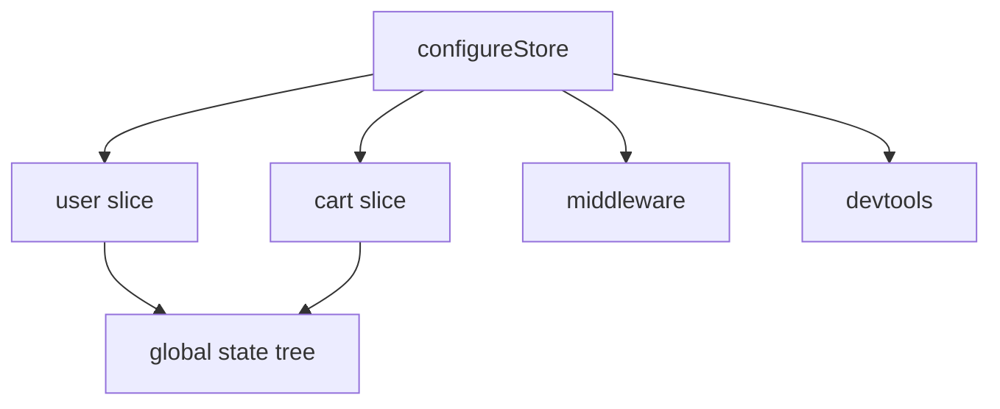

---
title: Store Configuration
slug: day-052-store-configuration
dayLabel: Day 52
level: Advanced
estimatedMinutes: 30
order: 52
track: react
---
# Day 52 [Advanced]: Store Configuration

## Index

- [Goal](#goal)
- [Prerequisites](#prerequisites)
- [Explanation](#explanation)
- [Topic by Topic](#topic-by-topic)
- [Key Concepts](#key-concepts)
- [Visual Concept Map](#visual-concept-map)
- [End-to-End Practical](#end-to-end-practical)
- [Hands-on Coding](#hands-on-coding)
- [Mini Exercise](#mini-exercise)
- [Assessment Quiz](#assessment-quiz)
- [Task](#task)
- [Self Check](#self-check)
- [Interview Questions and Answers](#interview-questions-and-answers)
- [Day 52 Outcome](#day-52-outcome)

## Goal

Configure a scalable Redux Toolkit store with multiple slices and middleware awareness.

## Prerequisites

- Day 51 completed
- RTK slice fundamentals

## Explanation

As apps grow, store configuration must combine multiple reducers and maintain clear state structure.

## Topic by Topic

### Topic 1: Multi-slice Reducer Map

Theory:
Store reducer object maps slice keys to slice reducers.

Practical:
Add user and cart slices.

Code Example:

```jsx
reducer: { user: userReducer, cart: cartReducer }
```

**Explanation:** This topic explains Multi-slice Reducer Map in a practical way so you can apply it confidently in real React projects.

**Key Points:**

- Understand the core idea of Multi-slice Reducer Map.
- Apply the pattern using clean, readable code.
- Avoid common mistakes through predictable React flow.

### Topic 2: Preloaded State Concept

Theory:
Store can initialize from persisted or server-hydrated state.

Practical:
Use preloaded cart data.

Code Example:

```jsx
configureStore({ reducer, preloadedState });
```

**Explanation:** This topic explains Preloaded State Concept in a practical way so you can apply it confidently in real React projects.

**Key Points:**

- Understand the core idea of Preloaded State Concept.
- Apply the pattern using clean, readable code.
- Avoid common mistakes through predictable React flow.

### Topic 3: Middleware Defaults

Theory:
configureStore includes useful default middleware.

Practical:
Understand serializable and immutability checks.

Code Example:

```jsx
middleware: (getDefaultMiddleware) => getDefaultMiddleware();
```

**Explanation:** This topic explains Middleware Defaults in a practical way so you can apply it confidently in real React projects.

**Key Points:**

- Understand the core idea of Middleware Defaults.
- Apply the pattern using clean, readable code.
- Avoid common mistakes through predictable React flow.

### Topic 4: DevTools Configuration

Theory:
Redux DevTools improve state debugging.

Practical:
Enable devtools only in development.

Code Example:

```jsx
devTools: process.env.NODE_ENV !== "production";
```

**Explanation:** This topic explains DevTools Configuration in a practical way so you can apply it confidently in real React projects.

**Key Points:**

- Understand the core idea of DevTools Configuration.
- Apply the pattern using clean, readable code.
- Avoid common mistakes through predictable React flow.

### Topic 5: Folder Structure for Scale

Theory:
Use feature-based folders for slices and selectors.

Practical:
Organize `features/user`, `features/cart`.

Code Example:

```jsx
features / cart / cartSlice.js;
```

**Explanation:** This topic explains Folder Structure for Scale in a practical way so you can apply it confidently in real React projects.

**Key Points:**

- Understand the core idea of Folder Structure for Scale.
- Apply the pattern using clean, readable code.
- Avoid common mistakes through predictable React flow.

### Topic 6: Production Guardrails for Store Configuration

Theory:
At this stage, strong engineering comes from repeatable quality checks that prevent regressions in state flow, edge cases, and maintainability.

Practical:
Define a short review checklist for this topic that verifies correctness, fallback behavior, and readability before merge.

Code Example:

`jsx
// Add a checklist step before release for this feature area.
`
**Explanation:** This topic explains Production Guardrails for Store Configuration in a practical way so you can apply it confidently in real React projects.

**Key Points:**

- Understand the core idea of Production Guardrails for Store Configuration.
- Apply the pattern using clean, readable code.
- Avoid common mistakes through predictable React flow.

## Key Concepts

- Reducer composition
- State shape design
- Middleware defaults
- DevTools integration
- Scalable store organization

- Quality guardrail mindset

## Visual Concept Map



## End-to-End Practical

1. Create two slice reducers.
2. Combine in configureStore reducer map.
3. Wrap app with Provider.
4. Read from each slice in components.
5. Dispatch actions and verify global state updates.

## Hands-on Coding

### Example 1: Case - User + Cart Store Setup

Scenario:
An e-commerce app needs unified state for authenticated user and cart operations.

```jsx
import { configureStore } from "@reduxjs/toolkit";
import userReducer from "./features/user/userSlice";
import cartReducer from "./features/cart/cartSlice";

export const store = configureStore({
  reducer: {
    user: userReducer,
    cart: cartReducer,
  },
});
```

### Example 2: Case - Preloaded Session State

Scenario:
A persisted user session should hydrate initial store values on app start.

```jsx
const preloadedState = {
  user: { profile: { name: "Asha" }, loggedIn: true },
};

const store = configureStore({
  reducer: { user: userReducer, cart: cartReducer },
  preloadedState,
});
```

### Example 3: Case - Middleware and DevTools Config

Scenario:
A production-ready app should keep debug helpers in development only.

```jsx
const store = configureStore({
  reducer: { user: userReducer, cart: cartReducer },
  middleware: (getDefaultMiddleware) => getDefaultMiddleware(),
  devTools: process.env.NODE_ENV !== "production",
});
```

## Mini Exercise

Scenario:
You are building a learning commerce app.

Configure store with slices: `auth`, `courses`, `cart`. Add preloaded `auth` state and verify selectors in UI.

Expected output:

- Store state has clear feature keys
- Slices update independently
- Preloaded auth state appears at startup

## Assessment Quiz

### Quiz Questions

1. Why use reducer object in configureStore?
2. What is preloadedState used for?
3. True or False: RTK configureStore has no middleware by default.
4. Why keep state shape predictable?
5. What tool helps inspect action/state history?

### Quiz Answers

1. To combine feature reducers into global state
2. To initialize store from existing data
3. False
4. Easier selectors, maintenance, and debugging
5. Redux DevTools

## Task

- Configure multi-slice store
- Add optional preloaded state
- Complete mini exercise

## Self Check

- You can build scalable RTK store configuration
- You can reason about multi-slice state architecture
- You can answer at least 4 out of 5 quiz questions correctly

## Interview Questions and Answers

### Beginner

**Question:** What does configureStore do?

**Answer:** Creates Redux store with reducer map and defaults.

**Question:** Can one store have multiple slices?

**Answer:** Yes, via reducer object keys.

### Middle

**Question:** Why is preloadedState useful?

**Answer:** Hydrates initial data from persisted/session sources.

**Question:** How do you structure slice keys in store?

**Answer:** By domain features like auth, cart, products.

### Advanced

**Question:** Why should store config remain deterministic?

**Answer:** Deterministic state flow improves traceability and testability.

**Question:** How do middleware settings influence reliability?

**Answer:** They can enforce immutability/serializability and catch runtime mistakes.

## Day 52 Outcome

- You can configure scalable multi-slice stores confidently
- You can design maintainable global state structure
- You are ready for advanced slice logic in Day 53

