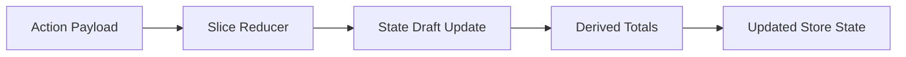

---
title: createSlice Deep Dive
slug: day-053-createslice-deep-dive
dayLabel: Day 53
level: Advanced
estimatedMinutes: 30
order: 53
track: react
---
# Day 53 [Advanced]: createSlice Deep Dive

## Index

- [Goal](#goal)
- [Prerequisites](#prerequisites)
- [Explanation](#explanation)
- [Topic by Topic](#topic-by-topic)
- [Key Concepts](#key-concepts)
- [Visual Concept Map](#visual-concept-map)
- [End-to-End Practical](#end-to-end-practical)
- [Hands-on Coding](#hands-on-coding)
- [Mini Exercise](#mini-exercise)
- [Assessment Quiz](#assessment-quiz)
- [Task](#task)
- [Self Check](#self-check)
- [Interview Questions and Answers](#interview-questions-and-answers)
- [Day 53 Outcome](#day-53-outcome)

## Goal

Master advanced `createSlice` patterns for complex state transitions, payload handling, and reusable reducers.

## Prerequisites

- Day 52 completed
- Multi-slice store understanding

## Explanation

`createSlice` can handle sophisticated state updates like nested arrays, lookup maps, and derived counters while keeping code concise.

## Topic by Topic

### Topic 1: Slice State Modeling

Theory:
Design state shape for predictable updates and selectors.

Practical:
Cart state with items array + totals.

Code Example:

```jsx
initialState: { items: [], totalQty: 0, totalPrice: 0 }
```

**Explanation:** This topic explains Slice State Modeling in a practical way so you can apply it confidently in real React projects.

**Key Points:**

- Understand the core idea of Slice State Modeling.
- Apply the pattern using clean, readable code.
- Avoid common mistakes through predictable React flow.

### Topic 2: Payload-driven Reducers

Theory:
Reducers receive dynamic payload values for reusable logic.

Practical:
Add product by payload.

Code Example:

```jsx
addItem: (state, action) => { ...action.payload }
```

**Explanation:** This topic explains Payload-driven Reducers in a practical way so you can apply it confidently in real React projects.

**Key Points:**

- Understand the core idea of Payload-driven Reducers.
- Apply the pattern using clean, readable code.
- Avoid common mistakes through predictable React flow.

### Topic 3: Reusable Helper Functions

Theory:
Complex slices can use pure helpers to keep reducers readable.

Practical:
Extract recalculation helper.

Code Example:

```jsx
recalculateTotals(state.items);
```

**Explanation:** This topic explains Reusable Helper Functions in a practical way so you can apply it confidently in real React projects.

**Key Points:**

- Understand the core idea of Reusable Helper Functions.
- Apply the pattern using clean, readable code.
- Avoid common mistakes through predictable React flow.

### Topic 4: Nested Update Scenarios

Theory:
Immer supports direct nested changes safely.

Practical:
Increment quantity in matching cart item.

Code Example:

```jsx
item.quantity += 1;
```

**Explanation:** This topic explains Nested Update Scenarios in a practical way so you can apply it confidently in real React projects.

**Key Points:**

- Understand the core idea of Nested Update Scenarios.
- Apply the pattern using clean, readable code.
- Avoid common mistakes through predictable React flow.

### Topic 5: Extra Reducer Readiness

Theory:
`extraReducers` handles async thunk lifecycle actions.

Practical:
Prepare slice for fetch cart items thunk.

Code Example:

```jsx
extraReducers: (builder) => {};
```

**Explanation:** This topic explains Extra Reducer Readiness in a practical way so you can apply it confidently in real React projects.

**Key Points:**

- Understand the core idea of Extra Reducer Readiness.
- Apply the pattern using clean, readable code.
- Avoid common mistakes through predictable React flow.

### Topic 6: Production Guardrails for createSlice Deep Dive

Theory:
At this stage, strong engineering comes from repeatable quality checks that prevent regressions in state flow, edge cases, and maintainability.

Practical:
Define a short review checklist for this topic that verifies correctness, fallback behavior, and readability before merge.

Code Example:

`jsx
// Add a checklist step before release for this feature area.
`
**Explanation:** This topic explains Production Guardrails for createSlice Deep Dive in a practical way so you can apply it confidently in real React projects.

**Key Points:**

- Understand the core idea of Production Guardrails for createSlice Deep Dive.
- Apply the pattern using clean, readable code.
- Avoid common mistakes through predictable React flow.

## Key Concepts

- Rich slice state design
- Payload-driven transitions
- Helper-assisted reducer readability
- Immer nested updates
- Async-ready slice architecture

- Quality guardrail mindset

## Visual Concept Map



## End-to-End Practical

1. Model cart slice state.
2. Add reducers for add/remove/inc/dec.
3. Recalculate totals in each mutation path.
4. Export actions and selectors.
5. Use in component and verify behavior.

## Hands-on Coding

### Example 1: Case - Cart Add/Remove Operations

Scenario:
An online store needs predictable cart item add/remove logic.

```jsx
import { createSlice } from "@reduxjs/toolkit";

const initialState = { items: [], totalQty: 0, totalPrice: 0 };

function computeTotals(items) {
  return items.reduce(
    (acc, item) => {
      acc.totalQty += item.quantity;
      acc.totalPrice += item.quantity * item.price;
      return acc;
    },
    { totalQty: 0, totalPrice: 0 },
  );
}

const cartSlice = createSlice({
  name: "cart",
  initialState,
  reducers: {
    addItem: (state, action) => {
      const item = action.payload;
      const existing = state.items.find((i) => i.id === item.id);
      if (existing) existing.quantity += 1;
      else state.items.push({ ...item, quantity: 1 });
      Object.assign(state, computeTotals(state.items));
    },
    removeItem: (state, action) => {
      state.items = state.items.filter((i) => i.id !== action.payload);
      Object.assign(state, computeTotals(state.items));
    },
  },
});
```

### Example 2: Case - Quantity Increment/Decrement

Scenario:
Cart page should increase or decrease item quantity with zero-safe removal.

```jsx
incrementQty: (state, action) => {
	const item = state.items.find((i) => i.id === action.payload);
	if (item) item.quantity += 1;
	Object.assign(state, computeTotals(state.items));
},
decrementQty: (state, action) => {
	const item = state.items.find((i) => i.id === action.payload);
	if (!item) return;
	item.quantity -= 1;
	if (item.quantity <= 0) {
		state.items = state.items.filter((i) => i.id !== action.payload);
	}
	Object.assign(state, computeTotals(state.items));
},
```

### Example 3: Case - Clear Cart and Derived Reset

Scenario:
After successful payment, cart should reset fully.

```jsx
clearCart: (state) => {
	state.items = [];
	state.totalQty = 0;
	state.totalPrice = 0;
},
```

## Mini Exercise

Scenario:
You are building an event booking cart.

Implement slice reducers for: addTicket, removeTicket, incrementSeat, decrementSeat, clearBooking. Maintain derived totals (seats + amount).

Expected output:

- All transitions handled through one slice
- Derived totals always stay correct
- UI actions dispatch cleanly to reducers

## Assessment Quiz

### Quiz Questions

1. Why keep derived totals inside slice state in some apps?
2. What does action.payload provide to reducers?
3. True or False: createSlice reducers must return new objects manually for every change.
4. Why use helper functions in complex slices?
5. Which slice field helps async lifecycle extension later?

### Quiz Answers

1. Fast access and consistent computed values after each action
2. Dynamic action data
3. False
4. Cleaner reducers and reusable calculations
5. extraReducers

## Task

- Implement one complex slice with 5+ reducers
- Include payload-based and derived-state updates
- Complete mini exercise

## Self Check

- You can design robust slice reducers for real use cases
- You can keep complex state transitions clear and predictable
- You can answer at least 4 out of 5 quiz questions correctly

## Interview Questions and Answers

### Beginner

**Question:** What does createSlice combine together?

**Answer:** Slice name, initial state, reducers, and generated actions.

**Question:** Can reducers access action payload?

**Answer:** Yes, through `action.payload`.

### Middle

**Question:** Why is `computeTotals` helper useful in cart slice?

**Answer:** It centralizes repeated derived-state calculations.

**Question:** How does Immer simplify nested updates?

**Answer:** You write concise direct updates while Immer preserves immutability.

### Advanced

**Question:** How do you prevent slice bloat over time?

**Answer:** Keep domain boundaries clear and extract helpers/selectors.

**Question:** When should derived values be computed by selectors instead of state fields?

**Answer:** When recalculation cost is low and avoiding duplicated source of truth is preferable.

## Day 53 Outcome

- You can implement advanced createSlice state transitions
- You can manage complex reducer logic with clean structure
- You are ready for async lifecycle handling in Day 54

