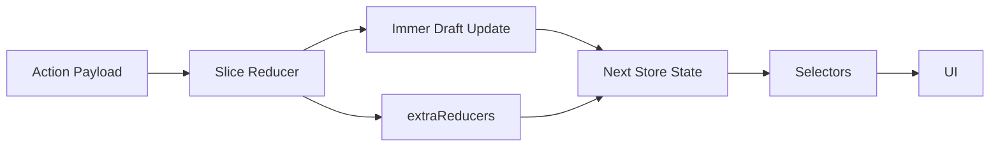

---
title: createSlice Deep Dive
slug: day-053-createslice-deep-dive
dayLabel: Day 53
level: Advanced
estimatedMinutes: 30
order: 53
track: react
---
# Day 53 [Advanced]: createSlice Deep Dive

## Goal

Master advanced `createSlice` patterns for complex state transitions, payload handling, reusable reducer helpers, nested updates, and preparing a slice for asynchronous workflows.

## Prerequisites

- Day 52 completed
- Multi-slice store understanding
- Familiarity with `configureStore`, `Provider`, `useSelector`, and `useDispatch`
- Basic understanding of Redux Toolkit and Immer

## Explanation

`createSlice` is the main Redux Toolkit API for defining a domain's initial state and reducer logic while automatically generating action creators and action types.

For simple state, a slice can be very small. As a feature grows, however, reducer logic can become more complex. A well-designed slice should keep state transitions predictable, validate important payload assumptions, avoid unnecessary duplicated state, and keep domain-specific calculations readable.

A useful mental model is:

```text
Action
  ↓
action.payload
  ↓
Slice reducer
  ↓
Immer draft update
  ↓
Next Redux state
  ↓
Selectors
  ↓
UI
```

The goal of a deep `createSlice` implementation is not to put every piece of business logic into one file. It is to make state transitions explicit while keeping the slice maintainable.

## Topic by Topic

### Topic 1: Slice State Modeling

Theory:

State shape is one of the most important design decisions in Redux. A slice should store the minimum authoritative data needed by the feature. Values that can be cheaply derived from existing state are often better calculated by selectors rather than stored separately.

For a cart, for example, the source of truth can be the item list:

```jsx
const initialState = {
  items: [],
};
```

If the application needs `totalQty` and `totalPrice`, there are two approaches. They can be stored and updated after every mutation, or they can be derived through selectors. Storing derived values can be useful when the domain explicitly requires a stable snapshot, but it also creates a second source of truth that must remain synchronized.

Practical:

Design a cart state with stable item identity and predictable item fields.

```jsx
const initialState = {
  items: [],
  status: "idle",
  error: null,
};
```

**Explanation:** Keep server/request status separate from the actual domain data. Avoid adding fields simply because a component currently needs a calculated value.

**Key Points:**

- Choose state shape based on domain ownership.
- Prefer one authoritative source of truth.
- Use stable identifiers for collection items.
- Keep request status and errors explicit when asynchronous work is involved.

### Topic 2: Payload-driven Reducers

Theory:

Reducers receive the dispatched action as their second argument. Redux Toolkit action creators generated by `createSlice` place the supplied value in `action.payload`.

```jsx
addItem: (state, action) => {
  const product = action.payload;
  // update state using product
}
```

Payloads should represent the information the reducer needs. Avoid passing unrelated UI data into a domain reducer when a smaller payload is sufficient.

Practical:

Add a product using a payload containing the product identity and price.

```jsx
addItem: (state, action) => {
  const { id, name, price } = action.payload;
  const existing = state.items.find((item) => item.id === id);

  if (existing) {
    existing.quantity += 1;
    return;
  }

  state.items.push({ id, name, price, quantity: 1 });
}
```

**Explanation:** The reducer receives dynamic data without requiring a separate reducer for every product. The payload contract should remain clear and predictable.

**Key Points:**

- `action.payload` carries dynamic action data.
- Define a clear payload contract.
- Avoid trusting payload fields that the reducer does not need.
- Keep business meaning in action names such as `addItem`, `removeItem`, or `incrementQty`.

### Topic 3: Reusable Helper Functions

Theory:

Complex slices can use pure helper functions to keep reducers readable. Helpers are especially useful for repeated calculations, normalization, validation, or searching collections.

A helper should preferably have a clear input/output contract and should not dispatch actions or directly mutate Redux state outside the reducer's controlled Immer draft.

Practical:

Extract cart total calculation into a pure helper.

```jsx
function calculateTotals(items) {
  return items.reduce(
    (totals, item) => {
      totals.totalQty += item.quantity;
      totals.totalPrice += item.quantity * item.price;
      return totals;
    },
    { totalQty: 0, totalPrice: 0 },
  );
}
```

If the helper is called with ordinary data, it is easier to test independently.

**Explanation:** A helper keeps repeated calculations out of individual reducers and makes the reducer's state transition easier to read.

**Key Points:**

- Prefer pure helpers for calculations.
- Keep helpers focused on one responsibility.
- Unit-test complex helpers independently when useful.
- Do not hide action dispatching or unrelated side effects inside reducer helpers.

### Topic 4: Nested Update Scenarios

Theory:

Redux Toolkit uses Immer internally. This allows reducer code to express updates against a draft using direct-looking mutations while Immer creates the immutable next state.

Practical:

Increment the quantity of a matching cart item.

```jsx
incrementQty: (state, action) => {
  const item = state.items.find((item) => item.id === action.payload);

  if (item) {
    item.quantity += 1;
  }
}
```

This is valid inside a Redux Toolkit reducer. The same direct mutation would not be appropriate when updating ordinary React state outside Immer.

For nested data:

```jsx
updateAddress: (state, action) => {
  state.customer.address.city = action.payload.city;
}
```

**Explanation:** Immer makes nested updates concise, but the reducer still needs correct business rules. Immer does not automatically prevent invalid state transitions.

**Key Points:**

- Direct-looking mutations are safe inside RTK reducers because of Immer.
- Check that the target entity exists before updating it.
- Keep reducer transitions deterministic.
- Do not assume Immer makes arbitrary external mutations safe.

### Topic 5: Extra Reducer Readiness

Theory:

`extraReducers` lets a slice respond to actions that are not generated by its own `reducers` field. This becomes especially important with `createAsyncThunk`, where a slice commonly responds to `pending`, `fulfilled`, and `rejected` lifecycle actions.

Practical:

Prepare a slice for a future cart-loading thunk.

```jsx
extraReducers: (builder) => {
  builder
    .addCase(fetchCart.pending, (state) => {
      state.status = "loading";
      state.error = null;
    })
    .addCase(fetchCart.fulfilled, (state, action) => {
      state.status = "succeeded";
      state.items = action.payload;
    })
    .addCase(fetchCart.rejected, (state, action) => {
      state.status = "failed";
      state.error = action.error.message ?? "Unable to load cart";
    });
}
```

The thunk itself is introduced in more detail in the following lessons. The important idea here is that a slice can react to external action types while keeping its own local reducers focused on synchronous domain transitions.

**Explanation:** `extraReducers` is the bridge between a slice and actions created elsewhere, including async lifecycle actions.

**Key Points:**

- `reducers` creates the slice's own actions.
- `extraReducers` responds to external actions.
- `builder.addCase` provides readable lifecycle handling.
- Keep loading, success, and failure state transitions explicit.

### Topic 6: Production Guardrails for createSlice Deep Dive

Theory:

Advanced Redux code needs guardrails around state shape, payload contracts, derived values, and reducer complexity. A reducer should be deterministic and easy to reason about from the action and previous state.

Practical:

Before merging a complex slice, review:

```text
[ ] State has one clear source of truth
[ ] Payload contracts are explicit
[ ] Missing entities are handled safely
[ ] Derived values cannot become inconsistent
[ ] Reducers contain no network or timer side effects
[ ] Helpers are deterministic and testable
[ ] Async lifecycle states are explicit
[ ] Selectors match the actual store shape
```

**Explanation:** A checklist catches state bugs that syntax checking cannot detect. In production, the most dangerous Redux bugs are often logically valid JavaScript that produces an incorrect state transition.

**Key Points:**

- Keep reducers deterministic.
- Validate important edge cases at the reducer boundary.
- Avoid side effects inside reducers.
- Prefer clear state contracts over clever abstractions.
- Test important state transitions, not just action creation.

## Key Concepts

- Rich slice state design
- Payload-driven transitions
- Source of truth vs derived state
- Helper-assisted reducer readability
- Immer nested updates
- Safe collection updates
- Async-ready slice architecture
- `reducers` vs `extraReducers`
- Deterministic reducer design
- Production guardrail mindset

## Visual Concept Map



## End-to-End Practical

1. Model the cart slice with a clear source of truth.
2. Add reducers for add, remove, increment, decrement, and clear operations.
3. Define explicit payload contracts for each action.
4. Use a pure helper when repeated calculations genuinely need one.
5. Handle missing item IDs safely.
6. Export actions and selectors from the slice module.
7. Prepare `extraReducers` for a future async cart request.
8. Connect the slice to the store and verify the actual state path.
9. Test each important transition, including an empty-cart edge case.

## Hands-on Coding

### Example 1: Case - Cart Add/Remove Operations

Scenario:
An online store needs predictable cart item add/remove logic.

```jsx
import { createSlice } from "@reduxjs/toolkit";

const initialState = {
  items: [],
  totalQty: 0,
  totalPrice: 0,
};

function computeTotals(items) {
  return items.reduce(
    (acc, item) => {
      acc.totalQty += item.quantity;
      acc.totalPrice += item.quantity * item.price;
      return acc;
    },
    { totalQty: 0, totalPrice: 0 },
  );
}

const cartSlice = createSlice({
  name: "cart",
  initialState,
  reducers: {
    addItem: (state, action) => {
      const item = action.payload;
      const existing = state.items.find((current) => current.id === item.id);

      if (existing) {
        existing.quantity += 1;
      } else {
        state.items.push({ ...item, quantity: 1 });
      }

      Object.assign(state, computeTotals(state.items));
    },
    removeItem: (state, action) => {
      state.items = state.items.filter((item) => item.id !== action.payload);
      Object.assign(state, computeTotals(state.items));
    },
  },
});

export const { addItem, removeItem } = cartSlice.actions;
export default cartSlice.reducer;
```

**Why this works:** `state` is an Immer draft, so updating `existing.quantity` or assigning a new `items` array is valid inside the reducer. The helper keeps the repeated totals calculation in one place.

**Important design note:** In a production application, consider deriving totals with selectors instead of storing `totalQty` and `totalPrice` if those values do not need to be persisted as state. This avoids duplicated sources of truth.

### Example 2: Case - Quantity Increment/Decrement

Scenario:
The cart page should increase or decrease item quantity with zero-safe removal.

```jsx
incrementQty: (state, action) => {
  const item = state.items.find((item) => item.id === action.payload);

  if (item) {
    item.quantity += 1;
  }

  Object.assign(state, computeTotals(state.items));
},

decrementQty: (state, action) => {
  const item = state.items.find((item) => item.id === action.payload);

  if (!item) return;

  item.quantity -= 1;

  if (item.quantity <= 0) {
    state.items = state.items.filter((item) => item.id !== action.payload);
  }

  Object.assign(state, computeTotals(state.items));
},
```

**Edge cases to test:**

- ID does not exist.
- Quantity is already `1`.
- Quantity should never become negative.
- Removing the last item should reset totals to zero.

### Example 3: Case - Clear Cart and Derived Reset

Scenario:
After successful payment, the cart should reset fully.

```jsx
clearCart: (state) => {
  state.items = [];
  state.totalQty = 0;
  state.totalPrice = 0;
},
```

**Important:** If totals are derived through selectors instead of stored state, `clearCart` only needs to clear `items`. This is one reason avoiding unnecessary duplicated state can simplify reducers.

## Mini Exercise

Scenario:
You are building an event booking cart.

Implement slice reducers for: `addTicket`, `removeTicket`, `incrementSeat`, `decrementSeat`, and `clearBooking`. Maintain derived totals for seats and amount.

Requirements:

- Use payloads for ticket identity and ticket data.
- Do not allow a seat quantity to become negative.
- Safely handle an unknown ticket ID.
- Keep the reducer transitions deterministic.
- Decide whether totals should be stored or derived, and explain your choice.

Expected output:

- All transitions handled through one slice
- Derived totals always stay correct if they are stored
- UI actions dispatch cleanly to reducers
- Unknown IDs do not crash the reducer
- The state model has one clearly documented source of truth

## Assessment Quiz

### Quiz Questions

1. Why is state shape important when designing a complex slice?
2. What does `action.payload` provide to a reducer?
3. True or False: `createSlice` reducers must manually return a new object for every state change.
4. Why are pure helper functions useful in complex slices?
5. What is the purpose of `extraReducers`?
6. What happens if a reducer tries to update an item that does not exist?
7. Why can storing derived totals create a synchronization problem?
8. Where should network requests be performed: inside a reducer or outside the reducer flow?

### Quiz Answers

1. A predictable state shape makes selectors, updates, debugging, and feature ownership easier to reason about.
2. It carries the dynamic data supplied when the action is dispatched.
3. False. Redux Toolkit uses Immer, so reducers can use direct-looking mutations against the draft.
4. They centralize repeated deterministic logic and keep reducers easier to read and test.
5. It allows the slice to respond to actions created outside its own `reducers`, such as async thunk lifecycle actions.
6. The reducer should handle the missing entity safely rather than assuming it exists.
7. Every update path must keep the derived field synchronized with the source data.
8. Outside reducers, typically through middleware, thunks, or other appropriate application layers.

## Task

- Implement one complex slice with 5+ reducers.
- Include payload-based and derived-state updates.
- Include at least one safe missing-ID path.
- Extract one repeated calculation into a pure helper.
- Add an `extraReducers` section that handles a sample async lifecycle.
- Complete the mini exercise.
- Write at least three tests for add, decrement/remove, and unknown-ID behavior.

## Self Check

- You can design robust slice reducers for real use cases.
- You can explain the difference between source state and derived state.
- You can use `action.payload` safely.
- You understand why Immer allows direct-looking updates inside RTK reducers.
- You know when to use `extraReducers`.
- You can identify reducer logic that should be extracted into a helper.
- You can answer at least 6 out of 8 quiz questions correctly.

## Interview Questions and Answers

### Beginner

**Question:** What does `createSlice` combine together?

**Answer:** A slice name, initial state, reducer functions, and automatically generated action creators/action types.

**Question:** Can reducers access action payload?

**Answer:** Yes. The reducer receives the action as its second argument and can read `action.payload`.

### Middle

**Question:** Why is a `computeTotals` helper useful in a cart slice?

**Answer:** It centralizes repeated deterministic calculations so multiple reducers do not each implement slightly different total logic.

**Question:** How does Immer simplify nested updates?

**Answer:** RTK wraps reducers with Immer, allowing direct-looking changes to a draft while Immer produces the immutable next state.

**Question:** What is the difference between `reducers` and `extraReducers`?

**Answer:** `reducers` defines the slice's own case reducers and generated actions. `extraReducers` lets the slice respond to actions created elsewhere, including async thunk lifecycle actions.

### Advanced

**Question:** How do you prevent slice bloat over time?

**Answer:** Keep clear domain boundaries, extract pure helpers and selectors where appropriate, avoid unrelated responsibilities, and move asynchronous orchestration outside reducers.

**Question:** When should derived values be computed by selectors instead of stored in state?

**Answer:** When they can be calculated reliably from existing state and do not need to be persisted as an independent source of truth. Selectors reduce synchronization bugs and keep the state model smaller.

**Question:** Why must reducers remain deterministic?

**Answer:** Given the same previous state and action, a reducer should produce the same result. Determinism makes Redux debugging, replay, testing, and DevTools inspection reliable.

**Question:** Why should a network request not be placed directly inside a reducer?

**Answer:** Reducers must be synchronous and free of side effects. Async work belongs in an appropriate orchestration mechanism such as a thunk or middleware flow.

## Day 53 Outcome

- You can model complex state transitions with `createSlice`.
- You can design clear payload contracts and safely update collections.
- You can use Immer correctly for nested updates.
- You can extract deterministic helper logic without hiding side effects.
- You understand when to use `extraReducers`.
- You can recognize duplicated derived state and make an informed design choice.
- You are ready for async Redux Toolkit workflows and thunk lifecycle handling in Day 54.
