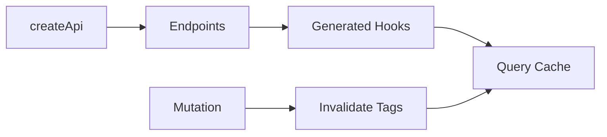

---
title: RTK Query
slug: day-055-rtk-query
dayLabel: Day 55
level: Advanced
estimatedMinutes: 30
order: 55
track: react
---
# Day 55 [Advanced]: RTK Query

## Index

- [Goal](#goal)
- [Prerequisites](#prerequisites)
- [Explanation](#explanation)
- [Topic by Topic](#topic-by-topic)
- [Key Concepts](#key-concepts)
- [Visual Concept Map](#visual-concept-map)
- [End-to-End Practical](#end-to-end-practical)
- [Hands-on Coding](#hands-on-coding)
- [Mini Exercise](#mini-exercise)
- [Assessment Quiz](#assessment-quiz)
- [Task](#task)
- [Self Check](#self-check)
- [Interview Questions and Answers](#interview-questions-and-answers)
- [Day 55 Outcome](#day-55-outcome)

## Goal

Use RTK Query to build API layers with automatic caching, loading states, and invalidation.

## Prerequisites

- Day 54 completed
- RTK store and async thunk basics

## Explanation

RTK Query is Redux Toolkit's data-fetching solution that reduces API boilerplate and handles caching, deduping, and lifecycle state automatically.

## Topic by Topic

### Topic 1: createApi and baseQuery

Theory:
API slice defines endpoints and shared base request configuration.

Practical:
Create `productsApi` with base URL.

Code Example:

```jsx
createApi({
  reducerPath: "productsApi",
  baseQuery: fetchBaseQuery({ baseUrl }),
});
```

**Explanation:** This topic explains createApi and baseQuery in a practical way so you can apply it confidently in real React projects.

**Key Points:**

- Understand the core idea of createApi and baseQuery.
- Apply the pattern using clean, readable code.
- Avoid common mistakes through predictable React flow.

### Topic 2: Query Endpoints

Theory:
`query` endpoints fetch and cache server data.

Practical:
Define `getProducts` and `getProductById`.

Code Example:

```jsx
getProducts: builder.query({ query: () => "/products" });
```

**Explanation:** This topic explains Query Endpoints in a practical way so you can apply it confidently in real React projects.

**Key Points:**

- Understand the core idea of Query Endpoints.
- Apply the pattern using clean, readable code.
- Avoid common mistakes through predictable React flow.

### Topic 3: Generated Query Hooks

Theory:
RTK Query auto-generates hooks from endpoint names.

Practical:
Use `useGetProductsQuery()` in component.

Code Example:

```jsx
const { data, isLoading, error } = useGetProductsQuery();
```

**Explanation:** This topic explains Generated Query Hooks in a practical way so you can apply it confidently in real React projects.

**Key Points:**

- Understand the core idea of Generated Query Hooks.
- Apply the pattern using clean, readable code.
- Avoid common mistakes through predictable React flow.

### Topic 4: Mutation + Invalidation

Theory:
Mutations can invalidate tags to refresh stale query data.

Practical:
Invalidate product list after creating item.

Code Example:

```jsx
invalidatesTags: ["Products"];
```

**Explanation:** This topic explains Mutation + Invalidation in a practical way so you can apply it confidently in real React projects.

**Key Points:**

- Understand the core idea of Mutation + Invalidation.
- Apply the pattern using clean, readable code.
- Avoid common mistakes through predictable React flow.

### Topic 5: Caching and Refetch Controls

Theory:
Control stale behavior with refetch options.

Practical:
Refetch on focus/reconnect when needed.

Code Example:

```jsx
useGetProductsQuery(undefined, { refetchOnFocus: true });
```

**Explanation:** This topic explains Caching and Refetch Controls in a practical way so you can apply it confidently in real React projects.

**Key Points:**

- Understand the core idea of Caching and Refetch Controls.
- Apply the pattern using clean, readable code.
- Avoid common mistakes through predictable React flow.

### Topic 6: Optimistic Updates and Cache Safety

Theory:
Fast UI feels better when changes appear immediately, but optimistic updates must be reversible if the server rejects the change.

Practical:
Use mutation lifecycle hooks to patch cache and undo when request fails.

Code Example:

```jsx
async onQueryStarted(newProduct, { dispatch, queryFulfilled }) {
  const patch = dispatch(
    productsApi.util.updateQueryData("getProducts", undefined, (draft) => {
      draft.unshift({ id: "temp", ...newProduct });
    }),
  );

  try {
    await queryFulfilled;
  } catch {
    patch.undo();
  }
}
```

**Explanation:** This topic explains Optimistic Updates and Cache Safety in a practical way so you can apply it confidently in real React projects.

**Key Points:**

- Understand the core idea of Optimistic Updates and Cache Safety.
- Apply the pattern using clean, readable code.
- Avoid common mistakes through predictable React flow.

## Key Concepts

- API slice architecture
- Auto-generated query hooks
- Built-in request state handling
- Tag-based cache invalidation
- Refetch strategy controls
- Optimistic cache updates
- Rollback-safe mutation handling

## Visual Concept Map



## End-to-End Practical

1. Create API slice with baseQuery.
2. Add query endpoints for list and detail.
3. Register API reducer + middleware in store.
4. Use generated query hook in UI.
5. Add mutation endpoint with tag invalidation.

## Hands-on Coding

### Example 1: Case - Products API Slice Setup

Scenario:
An e-commerce platform centralizes product endpoints in one RTK Query API slice.

```jsx
import { createApi, fetchBaseQuery } from "@reduxjs/toolkit/query/react";

export const productsApi = createApi({
  reducerPath: "productsApi",
  baseQuery: fetchBaseQuery({ baseUrl: "https://fakestoreapi.com" }),
  tagTypes: ["Products"],
  endpoints: (builder) => ({
    getProducts: builder.query({
      query: () => "/products",
      providesTags: ["Products"],
    }),
    getProductById: builder.query({
      query: (id) => `/products/${id}`,
    }),
  }),
});

export const { useGetProductsQuery, useGetProductByIdQuery } = productsApi;
```

### Example 2: Case - Product List Component Using Query Hook

Scenario:
A catalog screen should automatically fetch and cache product list.

```jsx
function ProductList() {
  const { data = [], isLoading, isError, error } = useGetProductsQuery();

  if (isLoading) return <p>Loading products...</p>;
  if (isError) return <p>{String(error?.error || "Failed to load")}</p>;

  return data.slice(0, 6).map((p) => <p key={p.id}>{p.title}</p>);
}
```

### Example 3: Case - Add Product Mutation with Invalidation

Scenario:
Admin adds a product and list should auto-refresh without manual dispatch flow.

```jsx
addProduct: builder.mutation({
  query: (newProduct) => ({
    url: "/products",
    method: "POST",
    body: newProduct,
  }),
  invalidatesTags: ["Products"],
});
```

## Mini Exercise

Scenario:
You are building a course marketplace.

Create RTK Query API with endpoints:

- `getCourses`
- `getCourseById`
- `addCourse`

Use tags so list auto-refreshes after adding a course.

Expected output:

- Query hooks fetch list/detail
- Mutation triggers list invalidation
- UI handles loading/error/success cleanly
- Optimistic UI can be added safely with rollback

## Assessment Quiz

### Quiz Questions

1. What does createApi generate besides reducer?
2. Why add API middleware to store?
3. True or False: RTK Query needs manual loading state reducers.
4. What do providesTags and invalidatesTags enable?
5. Which hook form is generated for query endpoint `getUsers`?
6. Why must optimistic cache updates support undo?

### Quiz Answers

1. Endpoint hooks and utilities
2. To enable caching, subscriptions, and request lifecycle features
3. False
4. Cache linking and automatic refetch
5. `useGetUsersQuery`
6. Because the UI may need to revert if the mutation fails on the server.

## Task

- Set up one RTK Query API slice
- Build list + detail + mutation flows
- Complete mini exercise

## Self Check

- You can integrate RTK Query into Redux store correctly
- You can use automatic caching and invalidation patterns
- You can answer at least 4 out of 5 quiz questions correctly

## Interview Questions and Answers

### Beginner

**Question:** What is RTK Query?

**Answer:** Redux Toolkit data fetching and caching solution.

**Question:** Why is RTK Query easier than manual thunk setup?

**Answer:** It auto-manages request state and cache.

### Middle

**Question:** How does RTK Query refetch data after mutation?

**Answer:** Use tag invalidation with providesTags/invalidatesTags.

**Question:** Where do generated hooks come from?

**Answer:** Endpoint definitions in createApi.

### Advanced

**Question:** How does RTK Query reduce duplicate network calls?

**Answer:** It shares cached query subscriptions by key and endpoint args.

**Question:** When might you still use thunks alongside RTK Query?

**Answer:** For non-CRUD orchestration or complex side-effect workflows outside standard API querying.

## Day 55 Outcome

- You can build efficient API layers with RTK Query
- You can handle caching and invalidation with minimal boilerplate
- You are ready for final Redux mini-project integration ahead

