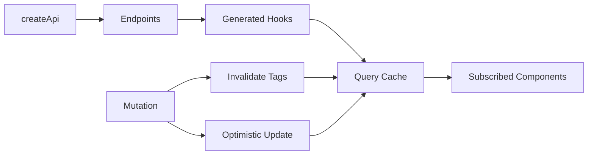

---
title: RTK Query
slug: day-055-rtk-query
dayLabel: Day 55
level: Advanced
estimatedMinutes: 30
order: 55
track: react
---
---
title: RTK Query
slug: day-055-rtk-query
dayLabel: Day 55
level: Advanced
estimatedMinutes: 30
order: 55
track: react
---
# Day 55 [Advanced]: RTK Query

## Goal

Use RTK Query to build API layers with automatic caching, loading states, deduplication, subscriptions, and tag-based invalidation. By the end of this lesson, you should understand not only how to call an endpoint, but also why RTK Query needs to be registered in the Redux store and how its cache lifecycle affects the UI.

## Prerequisites

- Day 54 completed
- RTK store and async thunk basics
- Understanding of reducers, actions, selectors, and Redux Toolkit slices

## Explanation

RTK Query is Redux Toolkit's data-fetching and caching solution. It moves common server-state concerns—request lifecycle state, caching, subscriptions, refetching, and invalidation—out of hand-written reducers and thunks.

A useful mental model is:

```text
Component
   ↓
Generated Query/Mutation Hook
   ↓
RTK Query Endpoint
   ↓
baseQuery → Server
   ↓
Normalized cache entry for that endpoint + arguments
   ↓
Subscribed components receive updated data/state
```

RTK Query is primarily designed for **server state**. Local UI state such as whether a modal is open does not automatically belong in RTK Query. Keeping that distinction clear prevents overloading the API cache with client-only state.

## Topic by Topic

### Topic 1: createApi and baseQuery

Theory:
An API slice defines a group of related endpoints and the shared request configuration. `createApi` creates the API service, while `fetchBaseQuery` provides a lightweight wrapper around `fetch`.

Practical:
Create `productsApi` with a base URL and keep endpoint definitions together when they share the same backend service.

Code Example:

```jsx
import { createApi, fetchBaseQuery } from "@reduxjs/toolkit/query/react";

export const productsApi = createApi({
  reducerPath: "productsApi",
  baseQuery: fetchBaseQuery({
    baseUrl: "https://fakestoreapi.com",
  }),
  tagTypes: ["Products"],
  endpoints: (builder) => ({
    getProducts: builder.query({
      query: () => "/products",
    }),
  }),
});
```

`reducerPath` identifies the API state inside Redux. The `baseQuery` defines how requests are made. The `endpoints` callback describes the operations the application can perform.

**Explanation:** This topic explains how an API slice becomes the central contract between React components and a remote API. One API slice can contain multiple related queries and mutations instead of creating a separate hand-written loading reducer for every request.

**Key Points:**

- `createApi` creates the RTK Query service and endpoint definitions.
- `baseQuery` controls the common request behavior.
- `reducerPath` determines where RTK Query stores its cache state.
- Keep endpoint definitions focused on server-state operations.

### Topic 2: Query Endpoints

Theory:
`builder.query` defines a read operation. RTK Query uses the endpoint name and serialized arguments to identify a cache entry.

Practical:
Define `getProducts` and `getProductById` so the list and detail screens can share cached server data.

Code Example:

```jsx
endpoints: (builder) => ({
  getProducts: builder.query({
    query: () => "/products",
  }),
  getProductById: builder.query({
    query: (id) => `/products/${id}`,
  }),
});
```

Calling `useGetProductByIdQuery(5)` and `useGetProductByIdQuery(6)` creates different cache entries because the endpoint argument is different. This is important when reasoning about cache reuse.

**Explanation:** Query endpoints describe how data is read from the server. They also define the cache identity and therefore determine when an existing result can be reused.

**Key Points:**

- Use `builder.query` for reads.
- Query arguments participate in cache identity.
- Different arguments normally represent different cache entries.
- Avoid putting client-only UI state into query endpoints.

### Topic 3: Generated Query Hooks

Theory:
RTK Query auto-generates React hooks from endpoint names. For a query endpoint named `getProducts`, the generated hook is `useGetProductsQuery`.

Practical:
Use the hook directly in a component and let RTK Query provide request state.

Code Example:

```jsx
const {
  data = [],
  isLoading,
  isFetching,
  isError,
  error,
} = useGetProductsQuery();
```

`isLoading` is useful for the initial load when no data exists yet. `isFetching` can remain true during a later background request when cached data is already available. This distinction helps avoid replacing a useful UI with a full-page spinner during every refetch.

**Explanation:** Generated hooks connect the component to the API cache and subscription lifecycle. The component does not need a separate `useEffect`, request flag, and reducer just to represent ordinary query state.

**Key Points:**

- Query hooks subscribe the component to an API cache entry.
- `data`, `error`, and lifecycle flags describe the current request state.
- `isLoading` and `isFetching` have different UI implications.
- Components should render based on the hook state instead of duplicating request state locally.

### Topic 4: Mutation + Invalidation

Theory:
Mutations represent server-side changes. Tags connect mutation results to cached query data so RTK Query can identify which cached data may now be stale.

Practical:
Provide a `Products` tag from the list query and invalidate that tag after creating or updating a product.

Code Example:

```jsx
getProducts: builder.query({
  query: () => "/products",
  providesTags: ["Products"],
}),

addProduct: builder.mutation({
  query: (newProduct) => ({
    url: "/products",
    method: "POST",
    body: newProduct,
  }),
  invalidatesTags: ["Products"],
}),
```

When the mutation succeeds, the invalidated query can be considered stale and RTK Query can refetch it for active subscribers. Tag invalidation is therefore a cache coordination mechanism, not a manual `dispatch(fetchProducts())` replacement.

**Explanation:** This topic explains how mutations and cache invalidation work together. It also highlights why tags should represent meaningful server-data relationships rather than being added randomly to every endpoint.

**Key Points:**

- Use `builder.mutation` for server-side changes.
- `providesTags` labels cached query data.
- `invalidatesTags` tells RTK Query which cached data may be stale.
- Prefer targeted tags for large applications to avoid unnecessary refetches.

### Topic 5: Caching and Refetch Controls

Theory:
RTK Query retains cached data according to its subscription and cache-lifetime rules. Refetch options let you control when a query should contact the server again.

Practical:
Refetch on focus/reconnect when fresh data is important, while avoiding aggressive refetching for data that changes rarely.

Code Example:

```jsx
const { data = [] } = useGetProductsQuery(undefined, {
  refetchOnFocus: true,
  refetchOnReconnect: true,
});
```

For application-wide behavior, these options can also be configured when creating the API or store according to the RTK Query configuration you need. Choose a policy based on data freshness requirements rather than enabling every refetch option by default.

**Explanation:** Caching is useful only when its freshness behavior matches the business requirement. A product catalog, stock price, chat feed, and static reference list should not necessarily use identical refetch policies.

**Key Points:**

- Cache reuse reduces unnecessary network requests.
- Refetch settings should match business freshness requirements.
- `refetchOnFocus` and `refetchOnReconnect` are useful for stale-prone screens.
- Avoid aggressive refetching when the data is expensive or changes rarely.

### Topic 6: Optimistic Updates and Cache Safety

Theory:
Fast UI feels better when changes appear immediately, but optimistic updates must be reversible if the server rejects the change.

Practical:
Use `onQueryStarted` and `updateQueryData` to patch a known cache entry, then undo the patch if the mutation fails.

Code Example:

```jsx
async onQueryStarted(newProduct, { dispatch, queryFulfilled }) {
  const patch = dispatch(
    productsApi.util.updateQueryData(
      "getProducts",
      undefined,
      (draft) => {
        draft.unshift({ id: `temp-${Date.now()}`, ...newProduct });
      },
    ),
  );

  try {
    await queryFulfilled;
  } catch {
    patch.undo();
  }
}
```

The cache entry passed to `updateQueryData` must match an existing query and its arguments. If the mutation fails, `patch.undo()` restores the previous cache state. In production, consider reconciling the temporary item with the server response when the API returns a real identifier or server-generated fields.

**Explanation:** This topic explains the important trade-off behind optimistic UI: the client temporarily assumes success, so it must have a reliable recovery path. Optimistic updates should be used where the UX benefit justifies the additional cache complexity.

**Key Points:**

- Optimistic updates improve perceived responsiveness.
- Always plan for server rejection.
- Patch the correct query cache entry.
- Undo failed optimistic changes.
- Prefer the server response as the final source of truth.

## Key Concepts

- API slice architecture
- `createApi` and `fetchBaseQuery`
- Auto-generated query and mutation hooks
- Query cache identity
- Built-in request state handling
- Tag-based cache invalidation
- Refetch strategy controls
- Subscription-aware caching
- Optimistic cache updates
- Rollback-safe mutation handling
- Server state vs client UI state

## Visual Concept Map



## End-to-End Practical

1. Create API slice with `baseQuery`.
2. Add query endpoints for list and detail.
3. Register the API reducer in the Redux store.
4. Register the API middleware in the Redux store; this is required for RTK Query's request and cache lifecycle behavior.
5. Use generated query hooks in the UI.
6. Add a mutation endpoint with tag invalidation.
7. Decide appropriate refetch behavior for the screen.
8. Add optimistic updates only where rollback and cache reconciliation are well understood.

## Hands-on Coding

### Example 1: Case - Products API Slice Setup

Scenario:
An e-commerce platform centralizes product endpoints in one RTK Query API slice.

```jsx
import { createApi, fetchBaseQuery } from "@reduxjs/toolkit/query/react";

export const productsApi = createApi({
  reducerPath: "productsApi",
  baseQuery: fetchBaseQuery({ baseUrl: "https://fakestoreapi.com" }),
  tagTypes: ["Products"],
  endpoints: (builder) => ({
    getProducts: builder.query({
      query: () => "/products",
      providesTags: ["Products"],
    }),
    getProductById: builder.query({
      query: (id) => `/products/${id}`,
    }),
  }),
});

export const { useGetProductsQuery, useGetProductByIdQuery } = productsApi;
```

Production note: for a real application, centralize the base URL in configuration rather than hard-coding an environment-specific URL in the API module.

### Example 2: Case - Product List Component Using Query Hook

Scenario:
A catalog screen should automatically fetch and cache product list.

```jsx
function ProductList() {
  const { data = [], isLoading, isFetching, isError, error } =
    useGetProductsQuery();

  if (isLoading) return <p>Loading products...</p>;
  if (isError) {
    return <p>{String(error?.error || "Failed to load products")}</p>;
  }

  return (
    <section aria-busy={isFetching}>
      {isFetching && <small>Refreshing...</small>}
      {data.slice(0, 6).map((product) => (
        <p key={product.id}>{product.title}</p>
      ))}
    </section>
  );
}
```

The component keeps previously loaded data visible during a background refetch instead of treating every request as a first-load state.

### Example 3: Case - Add Product Mutation with Invalidation

Scenario:
Admin adds a product and the active product list should become stale automatically.

```jsx
addProduct: builder.mutation({
  query: (newProduct) => ({
    url: "/products",
    method: "POST",
    body: newProduct,
  }),
  invalidatesTags: ["Products"],
}),
```

A component can consume the generated mutation hook:

```jsx
const [addProduct, { isLoading, isError }] = useAddProductMutation();

async function handleAdd(product) {
  await addProduct(product).unwrap();
}
```

`unwrap()` is useful when the component needs normal promise-style success/error handling after the mutation completes.

## Mini Exercise

Scenario:
You are building a course marketplace.

Create RTK Query API with endpoints:

- `getCourses`
- `getCourseById`
- `addCourse`

Use tags so the list can be refreshed after adding a course. Register both the API reducer and middleware in the Redux store.

Expected output:

- Query hooks fetch list/detail
- Mutation triggers targeted list invalidation
- UI handles loading/error/success cleanly
- Background refetch does not unnecessarily replace existing data
- Optimistic UI can be added safely with rollback

## Assessment Quiz

### Quiz Questions

1. What does `createApi` create besides endpoint definitions?
2. Why must RTK Query middleware be registered in the store?
3. True or False: RTK Query requires a separate hand-written loading reducer for every API request.
4. What do `providesTags` and `invalidatesTags` enable?
5. Which hook is generated for a query endpoint named `getUsers`?
6. What is the difference between `isLoading` and `isFetching`?
7. Why must optimistic cache updates support undo or another recovery strategy?
8. Why can two calls to the same endpoint with different arguments use different cache entries?

### Quiz Answers

1. It creates the API service configuration, reducer, middleware integration metadata, endpoint definitions, and generated utilities/hooks for the configured React integration.
2. The middleware handles RTK Query's request lifecycle, subscriptions, caching behavior, polling/refetch behavior, and related actions.
3. False. RTK Query provides request lifecycle state through its generated hooks.
4. They connect cached query data with invalidation rules so mutations can mark related data stale and trigger appropriate refetching.
5. `useGetUsersQuery`.
6. `isLoading` is primarily the initial loading state when no result is available yet; `isFetching` indicates an active request and can also be true during a refetch when cached data already exists.
7. Because the server can reject the mutation or return a different final state, so the temporary client change must be recoverable.
8. Query arguments participate in the cache key, so different arguments normally represent different server-data requests.

## Task

- Set up one RTK Query API slice
- Register its reducer and middleware correctly
- Build list + detail + mutation flows
- Add tag-based invalidation
- Choose a suitable refetch policy
- Complete the mini exercise
- Explain in your own words when RTK Query is preferable to a manual thunk

## Self Check

- You can integrate RTK Query into a Redux store correctly
- You can distinguish query and mutation endpoints
- You understand generated hooks and query cache identity
- You can use automatic caching and invalidation patterns
- You understand `isLoading` vs `isFetching`
- You can explain why API middleware is required
- You can answer at least 6 out of 8 quiz questions correctly

## Interview Questions and Answers

### Beginner

**Question:** What is RTK Query?

**Answer:** RTK Query is the data-fetching and caching solution included with Redux Toolkit. It provides endpoint definitions, generated hooks, request lifecycle state, and cache management for server data.

**Question:** Why is RTK Query easier than manual thunk setup for common API requests?

**Answer:** It provides request state, caching, subscriptions, refetching, and invalidation without requiring separate action types and reducers for every request.

### Middle

**Question:** How does RTK Query refetch data after a mutation?

**Answer:** A query can expose cache tags with `providesTags`, while a mutation can invalidate related tags with `invalidatesTags`. Active queries associated with invalidated data can then be refetched.

**Question:** Why must the API middleware be added to the Redux store?

**Answer:** The middleware coordinates RTK Query's request and cache lifecycle. Registering only the generated reducer is not enough for normal RTK Query behavior.

### Advanced

**Question:** How does RTK Query reduce duplicate network calls?

**Answer:** It maintains cache entries and subscriptions keyed by endpoint and arguments. Components requesting the same cache entry can share the existing result instead of independently implementing the same request lifecycle.

**Question:** When might you still use thunks alongside RTK Query?

**Answer:** Thunks can be useful for workflows that are not primarily server-data queries, such as coordinating several unrelated side effects or implementing imperative application orchestration. RTK Query should generally remain the preferred tool for ordinary API data fetching when it fits the use case.

**Question:** When would you choose manual cache updates instead of invalidating a tag?

**Answer:** A targeted cache update can be useful when the mutation response already contains enough information to update the visible cache immediately and predictably. Tag invalidation is simpler when the server should remain the source of truth and a refetch is acceptable.

## Day 55 Outcome

- You can build efficient API layers with RTK Query
- You can configure query and mutation endpoints
- You understand generated hooks, caching, subscriptions, and invalidation
- You can choose sensible refetch and optimistic-update strategies
- You are ready for final Redux mini-project integration ahead
