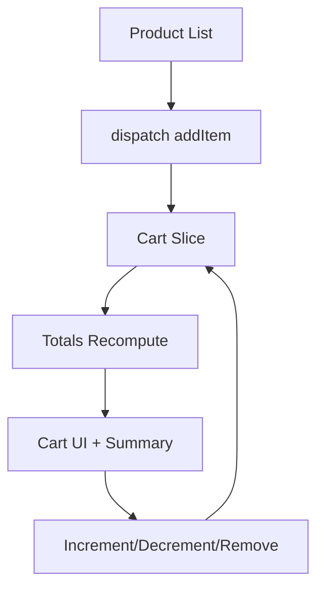

---
title: Mini Project - Shopping Cart
slug: day-056-mini-project-shopping-cart
dayLabel: Day 56
level: Advanced
estimatedMinutes: 45
order: 56
track: react
---
# Day 56 [Advanced]: Mini Project - Shopping Cart

## Index

- [Goal](#goal)
- [Prerequisites](#prerequisites)
- [Explanation](#explanation)
- [Topic by Topic](#topic-by-topic)
- [Key Concepts](#key-concepts)
- [Visual Concept Map](#visual-concept-map)
- [End-to-End Practical](#end-to-end-practical)
- [Hands-on Coding](#hands-on-coding)
- [Mini Exercise](#mini-exercise)
- [Assessment Quiz](#assessment-quiz)
- [Task](#task)
- [Self Check](#self-check)
- [Interview Questions and Answers](#interview-questions-and-answers)
- [Day 56 Outcome](#day-56-outcome)

## Goal

Build a complete Redux Toolkit shopping cart flow with realistic product actions, totals, and stable global state updates.

## Prerequisites

- Day 55 completed
- RTK slices, store, and async data familiarity

## Explanation

This mini project integrates product listing, cart mutations, quantity updates, and totals management in one production-style flow.

## Topic by Topic

### Topic 1: Cart State Design

Theory:
Cart needs line items plus derived totals.

Practical:
Model `items`, `totalQty`, and `totalPrice` in slice.

Code Example:

```jsx
initialState: { items: [], totalQty: 0, totalPrice: 0 }
```

**Explanation:** This topic explains Cart State Design in a practical way so you can apply it confidently in real React projects.

**Key Points:**

- Understand the core idea of Cart State Design.
- Apply the pattern using clean, readable code.
- Avoid common mistakes through predictable React flow.

### Topic 2: Add-to-cart Behavior

Theory:
Adding existing item should increment quantity, not duplicate rows.

Practical:
Find existing line by id and update quantity.

Code Example:

```jsx
const existing = state.items.find((i) => i.id === item.id);
```

**Explanation:** This topic explains Add-to-cart Behavior in a practical way so you can apply it confidently in real React projects.

**Key Points:**

- Understand the core idea of Add-to-cart Behavior.
- Apply the pattern using clean, readable code.
- Avoid common mistakes through predictable React flow.

### Topic 3: Quantity Controls

Theory:
Increment/decrement actions should preserve consistent totals.

Practical:
Auto-remove line if quantity reaches zero.

Code Example:

```jsx
if (item.quantity <= 0) state.items = state.items.filter(...);
```

**Explanation:** This topic explains Quantity Controls in a practical way so you can apply it confidently in real React projects.

**Key Points:**

- Understand the core idea of Quantity Controls.
- Apply the pattern using clean, readable code.
- Avoid common mistakes through predictable React flow.

### Topic 4: Totals Recalculation

Theory:
Derived totals should update after every cart mutation.

Practical:
Use helper function to recompute totals.

Code Example:

```jsx
Object.assign(state, computeTotals(state.items));
```

**Explanation:** This topic explains Totals Recalculation in a practical way so you can apply it confidently in real React projects.

**Key Points:**

- Understand the core idea of Totals Recalculation.
- Apply the pattern using clean, readable code.
- Avoid common mistakes through predictable React flow.

### Topic 5: Cart UI Composition

Theory:
Separate product list, cart list, and summary components.

Practical:
Use selectors and dispatch in focused components.

Code Example:

```jsx
const cart = useSelector((state) => state.cart);
```

**Explanation:** This topic explains Cart UI Composition in a practical way so you can apply it confidently in real React projects.

**Key Points:**

- Understand the core idea of Cart UI Composition.
- Apply the pattern using clean, readable code.
- Avoid common mistakes through predictable React flow.

### Topic 6: Production Guardrails for Mini Project   Shopping Cart

Theory:
At this stage, strong engineering comes from repeatable quality checks that prevent regressions in state flow, edge cases, and maintainability.

Practical:
Define a short review checklist for this topic that verifies correctness, fallback behavior, and readability before merge.

Code Example:

`jsx
// Add a checklist step before release for this feature area.
`
**Explanation:** This topic explains Production Guardrails for Mini Project   Shopping Cart in a practical way so you can apply it confidently in real React projects.

**Key Points:**

- Understand the core idea of Production Guardrails for Mini Project   Shopping Cart.
- Apply the pattern using clean, readable code.
- Avoid common mistakes through predictable React flow.

## Key Concepts

- Global cart state architecture
- Idempotent add/update logic
- Derived totals synchronization
- Componentized cart UI
- Predictable Redux updates

- Quality guardrail mindset

## Visual Concept Map



## End-to-End Practical

1. Create cart slice with items and totals.
2. Add reducers for add/remove/inc/dec/clear.
3. Build ProductCard with Add button.
4. Build CartList with qty controls.
5. Build Summary panel and verify totals.

## Hands-on Coding

### Example 1: Case - Add Products to Cart

Scenario:
An e-commerce catalog adds products into cart state and merges duplicate products by quantity.

```jsx
addItem: (state, action) => {
	const item = action.payload;
	const existing = state.items.find((i) => i.id === item.id);
	if (existing) existing.quantity += 1;
	else state.items.push({ ...item, quantity: 1 });
	Object.assign(state, computeTotals(state.items));
},
```

### Example 2: Case - Quantity Update Controls

Scenario:
Cart rows need + and - actions for quick quantity edits.

```jsx
incrementQty: (state, action) => {
	const item = state.items.find((i) => i.id === action.payload);
	if (item) item.quantity += 1;
	Object.assign(state, computeTotals(state.items));
},
decrementQty: (state, action) => {
	const item = state.items.find((i) => i.id === action.payload);
	if (!item) return;
	item.quantity -= 1;
	if (item.quantity <= 0) {
		state.items = state.items.filter((i) => i.id !== action.payload);
	}
	Object.assign(state, computeTotals(state.items));
},
```

### Example 3: Case - Cart Summary Panel

Scenario:
Checkout sidebar should show line count and grand total from global state.

```jsx
function CartSummary() {
  const { totalQty, totalPrice } = useSelector((state) => state.cart);
  return (
    <div>
      <p>Total Items: {totalQty}</p>
      <p>Total Price: ${totalPrice.toFixed(2)}</p>
    </div>
  );
}
```

## Mini Exercise

Scenario:
You are building a grocery checkout module.

Implement coupon discount logic (`applyCoupon`) and show final payable amount in summary.

Expected output:

- Coupon adjusts final total correctly
- Cart totals remain accurate after quantity updates
- Clear cart resets full checkout state

## Assessment Quiz

### Quiz Questions

1. Why should addItem merge duplicate ids?
2. What must happen after every cart mutation?
3. True or False: Derived totals should be recalculated only once at app start.
4. Why remove item when quantity reaches zero?
5. What is one advantage of cart state in Redux?

### Quiz Answers

1. Prevent duplicate lines and keep quantity semantics
2. Recompute totals and quantity summary
3. False
4. Keeps cart data valid and clean
5. Any component can read/update cart consistently

## Task

- Build full shopping cart mini project
- Add quantity controls and summary totals
- Complete mini exercise

## Self Check

- You can implement production-style cart logic
- You can keep derived cart totals consistent
- You can answer at least 4 out of 5 quiz questions correctly

## Interview Questions and Answers

### Beginner

**Question:** Why use global state for shopping cart?

**Answer:** Many pages/components need cart info and actions.

**Question:** What happens when user clicks Add to Cart?

**Answer:** Action dispatch updates cart slice in store.

### Middle

**Question:** How do you avoid duplicate cart rows?

**Answer:** Check existing item by id and increment quantity.

**Question:** Why keep totals in sync after each reducer action?

**Answer:** Ensures checkout summary is always accurate.

### Advanced

**Question:** What tradeoff exists between storing totals vs computing selectors?

**Answer:** Stored totals reduce repeated computation but require careful synchronization.

**Question:** How would you support optimistic server-cart sync?

**Answer:** Apply local mutation immediately, then reconcile with API result/error rollback.

## Day 56 Outcome

- You can build a complete Redux Toolkit shopping cart project
- You can manage complex global state with confidence
- You are ready for render optimization with React.memo in Day 57

