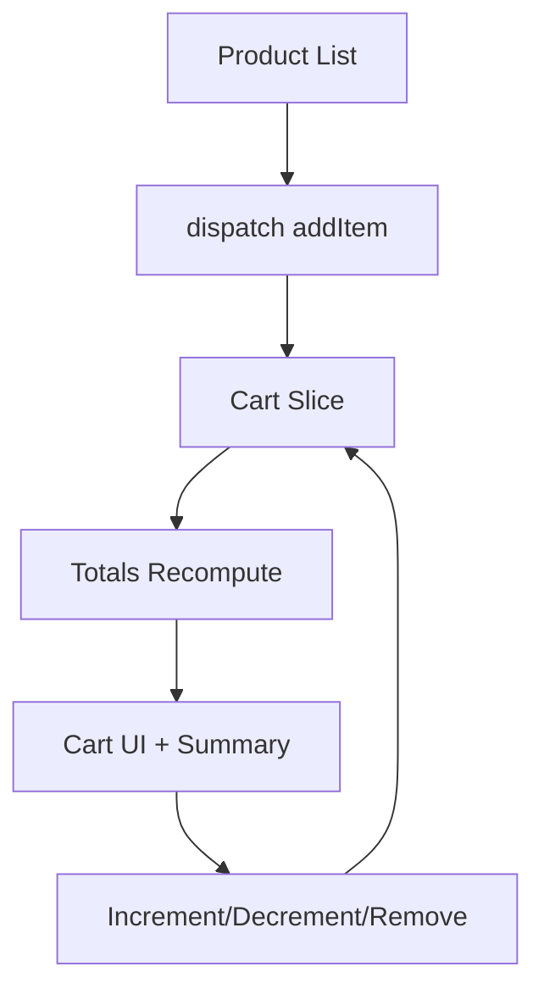

---
title: Mini Project - Shopping Cart
slug: day-056-mini-project-shopping-cart
dayLabel: Day 56
level: Advanced
estimatedMinutes: 45
order: 56
track: react
---
---
title: Mini Project - Shopping Cart
slug: day-056-mini-project-shopping-cart
dayLabel: Day 56
level: Advanced
estimatedMinutes: 45
order: 56
track: react
---
# Day 56 [Advanced]: Mini Project - Shopping Cart

## Goal

Build a complete Redux Toolkit shopping cart flow with realistic product actions, quantity controls, totals, edge-case handling, and stable global state updates. By the end of the project, you should be able to explain why each cart update belongs in Redux and how the UI stays synchronized with the store.

## Prerequisites

- Day 55 completed
- RTK slices, store, selectors, and async data familiarity
- Understanding of immutable update concepts and Redux Toolkit's Immer-based reducers

## Explanation

This mini project integrates product listing, cart mutations, quantity updates, derived totals, and focused UI components in one production-style flow.

A useful mental model is:

```text
Product UI
   ↓ dispatch
Cart Slice
   ↓ state update
Redux Store
   ↓ selectors
Cart UI + Summary
```

The cart should have one clear source of truth. Product data can come from an API, while cart state represents the user's current selection. Derived values such as total quantity and total price must remain consistent after every cart mutation.

## Topic by Topic

### Topic 1: Cart State Design

Theory:
Cart needs line items plus derived totals. A line item should contain a stable product identifier, the display information needed by the cart, and the current quantity.

Practical:
Model `items`, `totalQty`, and `totalPrice` in the slice. Keep the state shape predictable so selectors and components know exactly where to read the data.

Code Example:

```jsx
initialState: {
  items: [],
  totalQty: 0,
  totalPrice: 0,
}
```

For a real application, avoid putting unnecessary API response data into every cart line. Store the minimum information required by the cart or maintain a clear relationship with product data.

**Explanation:** This topic explains Cart State Design in a practical way so you can apply it confidently in real React projects. The most important rule is to define one predictable state shape and one stable identifier for every cart item.

**Key Points:**

- Understand the core idea of Cart State Design.
- Use a stable product id to identify cart lines.
- Keep the state shape predictable and easy to select.
- Decide deliberately which values are stored and which are derived.
- Avoid common mistakes through predictable Redux flow.

### Topic 2: Add-to-cart Behavior

Theory:
Adding an existing item should increment quantity, not duplicate rows. This gives the cart one row per product and makes quantity changes easier to reason about.

Practical:
Find the existing line by id and update its quantity. If it does not exist, add a new line with `quantity: 1`.

Code Example:

```jsx
const existing = state.items.find((i) => i.id === item.id);

if (existing) {
  existing.quantity += 1;
} else {
  state.items.push({ ...item, quantity: 1 });
}
```

Because this reducer runs inside Redux Toolkit's Immer-powered reducer logic, these apparent mutations are converted into immutable state updates safely.

**Explanation:** This topic explains Add-to-cart Behavior in a practical way so you can apply it confidently in real React projects. The reducer should be idempotent with respect to the product identity: repeated Add actions increase quantity instead of creating duplicate product rows.

**Key Points:**

- Understand the core idea of Add-to-cart Behavior.
- Match existing items by a stable id.
- Increment quantity for an existing item.
- Create a new line only when the item is not already present.
- Avoid common mistakes through predictable React flow.

### Topic 3: Quantity Controls

Theory:
Increment/decrement actions should preserve consistent totals. Decrementing the final unit should either remove the line or follow an explicitly defined minimum quantity rule.

Practical:
Auto-remove the line if quantity reaches zero. Also guard against a missing item so stale UI events do not cause runtime errors.

Code Example:

```jsx
if (item.quantity <= 0) {
  state.items = state.items.filter((i) => i.id !== action.payload);
}
```

Do not allow quantity to silently become negative. The reducer should enforce the business invariant even if the UI already disables the decrement button.

**Explanation:** This topic explains Quantity Controls in a practical way so you can apply it confidently in real React projects. Reducers should protect state invariants rather than relying only on UI validation.

**Key Points:**

- Understand the core idea of Quantity Controls.
- Protect against negative quantities.
- Handle missing cart items safely.
- Remove a line when its quantity reaches the defined minimum.
- Recalculate dependent values after quantity changes.

### Topic 4: Totals Recalculation

Theory:
Derived totals should update after every cart mutation. If totals are stored in the slice, every reducer that changes `items` must keep them synchronized.

Practical:
Use a helper function to recompute totals from the authoritative `items` collection.

Code Example:

```jsx
function computeTotals(items) {
  return items.reduce(
    (totals, item) => {
      totals.totalQty += item.quantity;
      totals.totalPrice += item.price * item.quantity;
      return totals;
    },
    { totalQty: 0, totalPrice: 0 },
  );
}

Object.assign(state, computeTotals(state.items));
```

For monetary values, real production systems should consider integer minor units such as cents/paise or a decimal-safe money strategy rather than relying blindly on JavaScript floating-point arithmetic.

**Explanation:** This topic explains Totals Recalculation in a practical way so you can apply it confidently in real React projects. Recomputing from `items` avoids incrementally updating multiple totals in different ways and reduces the chance of drift between fields.

**Key Points:**

- Understand the core idea of Totals Recalculation.
- Derive totals from the authoritative cart items.
- Recalculate after every mutation that changes quantity or membership.
- Consider safe money representation for production applications.
- Avoid common mistakes through predictable state flow.

### Topic 5: Cart UI Composition

Theory:
Separate product list, cart list, quantity controls, and summary components. Each component should have a focused responsibility while Redux remains the shared source of cart state.

Practical:
Use selectors and dispatch in focused components. Prefer specific selectors when a component only needs one part of the cart state.

Code Example:

```jsx
const cart = useSelector((state) => state.cart);
```

For a larger application, selectors such as `selectCartItems`, `selectTotalQty`, and `selectTotalPrice` make component dependencies clearer and provide a central place to evolve the state shape.

**Explanation:** This topic explains Cart UI Composition in a practical way so you can apply it confidently in real React projects. Good component boundaries keep rendering logic understandable and prevent one large cart component from owning every responsibility.

**Key Points:**

- Understand the core idea of Cart UI Composition.
- Keep product, cart, and summary responsibilities focused.
- Use selectors rather than duplicating cart calculations in components.
- Dispatch domain actions from UI interactions.
- Avoid common mistakes through predictable React flow.

### Topic 6: Production Guardrails for Mini Project   Shopping Cart

Theory:
At this stage, strong engineering comes from repeatable quality checks that prevent regressions in state flow, edge cases, totals, and maintainability.

Practical:
Define a short review checklist for this topic that verifies correctness, fallback behavior, and readability before merge.

Code Example:

```jsx
const isValidQuantity = Number.isInteger(item.quantity) && item.quantity > 0;
const isValidPrice = Number.isFinite(item.price) && item.price >= 0;

if (!isValidQuantity || !isValidPrice) {
  return;
}
```

Use guardrails at the correct boundary. UI validation improves user experience, while reducer/domain validation protects the state contract from unexpected actions or stale data.

**Explanation:** This topic explains Production Guardrails for Mini Project   Shopping Cart in a practical way so you can apply it confidently in real React projects.

**Key Points:**

- Understand the core idea of Production Guardrails for Mini Project   Shopping Cart.
- Validate important state invariants.
- Keep cart calculations deterministic.
- Test add, remove, increment, decrement, clear, and empty-cart cases.
- Avoid common mistakes through predictable React flow.

## Key Concepts

- Global cart state architecture
- Idempotent add/update logic
- Stable item identity
- Derived totals synchronization
- Componentized cart UI
- Predictable Redux updates
- State invariants and edge-case handling
- Selector-based component access
- Production-safe money considerations
- Quality guardrail mindset

## Visual Concept Map



## End-to-End Practical

1. Create cart slice with items and totals.
2. Add reducers for add/remove/inc/dec/clear.
3. Create a shared totals helper and use it after every relevant cart mutation.
4. Build ProductCard with an Add button.
5. Build CartList with quantity controls and a safe empty-cart state.
6. Build Summary panel and verify totals after every action.
7. Test duplicate adds, missing ids, zero quantity, clear cart, and empty state.

## Hands-on Coding

### Example 1: Case - Add Products to Cart

Scenario:
An e-commerce catalog adds products into cart state and merges duplicate products by quantity.

```jsx
addItem: (state, action) => {
  const item = action.payload;
  const existing = state.items.find((i) => i.id === item.id);

  if (existing) {
    existing.quantity += 1;
  } else {
    state.items.push({ ...item, quantity: 1 });
  }

  Object.assign(state, computeTotals(state.items));
},
```

Enhancement challenge: decide what should happen when the payload has a missing id, an invalid price, or a quantity that is not a positive integer.

### Example 2: Case - Quantity Update Controls

Scenario:
Cart rows need + and - actions for quick quantity edits while keeping the state valid.

```jsx
incrementQty: (state, action) => {
  const item = state.items.find((i) => i.id === action.payload);
  if (!item) return;

  item.quantity += 1;
  Object.assign(state, computeTotals(state.items));
},

decrementQty: (state, action) => {
  const item = state.items.find((i) => i.id === action.payload);
  if (!item) return;

  item.quantity -= 1;

  if (item.quantity <= 0) {
    state.items = state.items.filter((i) => i.id !== action.payload);
  }

  Object.assign(state, computeTotals(state.items));
},
```

The reducer handles the business rule even if the UI receives a stale click or dispatches an unexpected decrement action.

### Example 3: Case - Cart Summary Panel

Scenario:
Checkout sidebar should show line count and grand total from global state.

```jsx
function CartSummary() {
  const { totalQty, totalPrice } = useSelector((state) => state.cart);

  return (
    <div aria-label="Cart summary">
      <p>Total Items: {totalQty}</p>
      <p>Total Price: ${totalPrice.toFixed(2)}</p>
    </div>
  );
}
```

The summary should read values from Redux rather than maintaining a second local copy. This prevents the UI from displaying a different total from the cart state.

## Mini Exercise

Scenario:
You are building a grocery checkout module.

Implement coupon discount logic (`applyCoupon`) and show final payable amount in summary. Define how invalid, expired, or repeated coupon applications should behave.

Expected output:

- Coupon adjusts final total correctly
- Cart totals remain accurate after quantity updates
- Clear cart resets full checkout state
- Invalid coupons do not corrupt cart totals
- Empty cart has a predictable summary state
- Coupon logic has clear rules for applying and removing a discount

## Assessment Quiz

### Quiz Questions

1. Why should `addItem` merge duplicate ids?
2. What must happen after every cart mutation that changes `items`?
3. True or False: Derived totals should be recalculated only once at app start.
4. Why remove an item when quantity reaches zero?
5. What is one advantage of cart state in Redux?
6. Why should reducers guard against negative quantities even when the UI disables the decrement button?
7. What is a risk of storing totals separately from the item list?
8. Why should selectors be preferred over duplicating cart calculations across components?

### Quiz Answers

1. To prevent duplicate lines and keep quantity semantics predictable for the same product.
2. Recompute totals and quantity summary so all derived state remains synchronized.
3. False. Totals must change whenever the underlying cart items change.
4. It keeps the cart state valid and prevents zero/negative quantity lines from remaining in the cart.
5. Any component can read or update cart state consistently through the Redux store.
6. Reducers are a state boundary and must protect invariants even when actions come from stale or unexpected UI state.
7. One mutation may update `items` without updating totals, causing inconsistent checkout values.
8. Centralized selectors reduce duplicated logic and make components less coupled to the exact Redux state shape.

## Task

- Build the full shopping cart mini project
- Add quantity controls and summary totals
- Add safe add/remove/increment/decrement/clear behavior
- Complete the coupon mini exercise
- Test duplicate products and empty-cart behavior
- Complete the mini exercise

## Self Check

- You can implement production-style cart logic
- You can keep derived cart totals consistent
- You can protect quantity and price invariants
- You can explain why Redux Toolkit reducers can use Immer-style updates
- You can answer at least 6 out of 8 quiz questions correctly

## Interview Questions and Answers

### Beginner

**Question:** Why use global state for a shopping cart?

**Answer:** Many pages and components need cart information and actions. A shared Redux store gives them a predictable source of truth instead of requiring deeply nested prop passing or duplicated state.

**Question:** What happens when the user clicks Add to Cart?

**Answer:** The UI dispatches an action, the cart reducer updates the store, and subscribed components read the new state through selectors and re-render as needed.

### Middle

**Question:** How do you avoid duplicate cart rows?

**Answer:** Check for an existing item by its stable id. If it exists, increment its quantity; otherwise add a new line with an initial quantity.

**Question:** Why keep totals in sync after each reducer action?

**Answer:** The checkout summary must reflect the authoritative item collection immediately. Recomputing totals after relevant mutations prevents stale derived values.

### Advanced

**Question:** What tradeoff exists between storing totals versus computing them with selectors?

**Answer:** Stored totals can make frequently used values inexpensive to read, but every item mutation must keep them synchronized. Selector-derived totals reduce duplicated stored state but may perform calculations on reads. The right choice depends on data size, access patterns, and application complexity.

**Question:** How would you support optimistic server-cart sync?

**Answer:** Apply the local cart mutation immediately, send the server request, then reconcile the local state with the authoritative API response. If the request fails, roll back the optimistic change or refetch the server cart according to the application's consistency strategy.

**Question:** How would you prevent a stale product price from silently producing an incorrect checkout amount?

**Answer:** Treat the server as the authoritative source for final pricing. The client cart can display an estimated total, but checkout should validate current prices, availability, discounts, and other business rules on the server before completing the order.

## Day 56 Outcome

- You can build a complete Redux Toolkit shopping cart project
- You can manage complex global state with confidence
- You can keep derived values synchronized with authoritative cart items
- You can handle common edge cases and state invariants
- You are ready for render optimization with React.memo in Day 57
