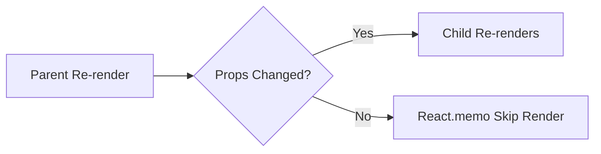

---
title: React.memo
slug: day-057-react-memo
dayLabel: Day 57
level: Advanced
estimatedMinutes: 30
order: 57
track: react
---
# Day 57 [Advanced]: React.memo

## Index

- [Goal](#goal)
- [Prerequisites](#prerequisites)
- [Explanation](#explanation)
- [Topic by Topic](#topic-by-topic)
- [Key Concepts](#key-concepts)
- [Visual Concept Map](#visual-concept-map)
- [End-to-End Practical](#end-to-end-practical)
- [Hands-on Coding](#hands-on-coding)
- [Mini Exercise](#mini-exercise)
- [Assessment Quiz](#assessment-quiz)
- [Task](#task)
- [Self Check](#self-check)
- [Interview Questions and Answers](#interview-questions-and-answers)
- [Day 57 Outcome](#day-57-outcome)

## Goal

Use `React.memo` effectively to reduce avoidable component re-renders.

## Prerequisites

- Day 56 completed
- useMemo/useCallback fundamentals

## Explanation

`React.memo` memoizes functional components and skips re-render when props are shallow-equal.

## Topic by Topic

### Topic 1: What React.memo Does

Theory:
Memoized components rerender only when props change.

Practical:
Wrap list row component with `React.memo`.

Code Example:

```jsx
const Row = React.memo(function Row(props) { ... });
```

**Explanation:** This topic explains What React.memo Does in a practical way so you can apply it confidently in real React projects.

**Key Points:**

- Understand the core idea of What React.memo Does.
- Apply the pattern using clean, readable code.
- Avoid common mistakes through predictable React flow.

### Topic 2: Shallow Prop Comparison

Theory:
Objects/functions with new references break memo benefits.

Practical:
Stabilize callbacks with useCallback.

Code Example:

```jsx
const onClick = useCallback(() => {}, []);
```

**Explanation:** This topic explains Shallow Prop Comparison in a practical way so you can apply it confidently in real React projects.

**Key Points:**

- Understand the core idea of Shallow Prop Comparison.
- Apply the pattern using clean, readable code.
- Avoid common mistakes through predictable React flow.

### Topic 3: React.memo + Lists

Theory:
Large list rows are prime candidates for memoization.

Practical:
Memoize product row in cart list.

Code Example:

```jsx
products.map((p) => <ProductRow key={p.id} product={p} />);
```

**Explanation:** This topic explains React.memo + Lists in a practical way so you can apply it confidently in real React projects.

**Key Points:**

- Understand the core idea of React.memo + Lists.
- Apply the pattern using clean, readable code.
- Avoid common mistakes through predictable React flow.

### Topic 4: Custom Comparison Function

Theory:
Optional custom compare can control rerender checks.

Practical:
Compare only selected props.

Code Example:

```jsx
React.memo(Component, (prev, next) => prev.id === next.id);
```

**Explanation:** This topic explains Custom Comparison Function in a practical way so you can apply it confidently in real React projects.

**Key Points:**

- Understand the core idea of Custom Comparison Function.
- Apply the pattern using clean, readable code.
- Avoid common mistakes through predictable React flow.

### Topic 5: Measure Before Optimizing

Theory:
Memoization adds complexity; use profiling evidence.

Practical:
Track render counts before/after React.memo.

Code Example:

```jsx
console.log("Row rendered");
```

**Explanation:** This topic explains Measure Before Optimizing in a practical way so you can apply it confidently in real React projects.

**Key Points:**

- Understand the core idea of Measure Before Optimizing.
- Apply the pattern using clean, readable code.
- Avoid common mistakes through predictable React flow.

### Topic 6: Production Guardrails for React.memo

Theory:
At this stage, strong engineering comes from repeatable quality checks that prevent regressions in state flow, edge cases, and maintainability.

Practical:
Define a short review checklist for this topic that verifies correctness, fallback behavior, and readability before merge.

Code Example:

`jsx
// Add a checklist step before release for this feature area.
`
**Explanation:** This topic explains Production Guardrails for React.memo in a practical way so you can apply it confidently in real React projects.

**Key Points:**

- Understand the core idea of Production Guardrails for React.memo.
- Apply the pattern using clean, readable code.
- Avoid common mistakes through predictable React flow.

## Key Concepts

- Component memoization behavior
- Shallow prop equality
- Stable prop references
- List rendering optimization
- Evidence-based performance tuning

- Quality guardrail mindset

## Visual Concept Map



## End-to-End Practical

1. Build parent + heavy child setup.
2. Observe child rerenders on unrelated state changes.
3. Wrap child with React.memo.
4. Stabilize callback/object props.
5. Verify reduced rerender count.

## Hands-on Coding

### Example 1: Case - Memoized Cart Row

Scenario:
A shopping cart has many rows and should not rerender unaffected rows when theme changes.

```jsx
import React from "react";

const CartRow = React.memo(function CartRow({ item, onIncrement }) {
  console.log("CartRow rendered:", item.id);
  return (
    <div>
      <span>
        {item.name} ({item.quantity})
      </span>
      <button onClick={() => onIncrement(item.id)}>+</button>
    </div>
  );
});
```

### Example 2: Case - Stable Callback for Memo Child

Scenario:
A dashboard parent should avoid passing new callback reference every render.

```jsx
import { useCallback } from "react";

const onRefresh = useCallback(
  (id) => {
    dispatch(refreshWidget(id));
  },
  [dispatch],
);
```

### Example 3: Case - Custom Compare for Score Card

Scenario:
Leaderboard card should rerender only when score changes.

```jsx
const ScoreCard = React.memo(
  function ScoreCard({ name, score }) {
    return (
      <p>
        {name}: {score}
      </p>
    );
  },
  (prev, next) => prev.score === next.score,
);
```

## Mini Exercise

Scenario:
You are building an exam result table.

Memoize `ResultRow` and ensure row rerenders only when that student marks change.

Expected output:

- Unrelated page state changes do not rerender every row
- Stable callbacks prevent prop-reference churn
- Render logs show optimization effect

## Assessment Quiz

### Quiz Questions

1. What does React.memo optimize?
2. Why can inline object props defeat memoization?
3. True or False: React.memo always guarantees faster performance.
4. Which hooks commonly pair with React.memo?
5. What should be done before and after applying memoization?

### Quiz Answers

1. Skips rerender when props are unchanged
2. New reference appears each render
3. False
4. useMemo and useCallback
5. Measure render behavior and compare impact

## Task

- Memoize one heavy child component
- Stabilize props passed to memoized child
- Complete mini exercise

## Self Check

- You can apply React.memo in practical scenarios
- You can detect and fix memoization blockers
- You can answer at least 4 out of 5 quiz questions correctly

## Interview Questions and Answers

### Beginner

**Question:** What is React.memo?

**Answer:** A higher-order component that memoizes functional components.

**Question:** When does memoized component rerender?

**Answer:** When shallow-compared props change.

### Middle

**Question:** Why combine useCallback with React.memo?

**Answer:** To keep callback references stable and avoid unnecessary rerenders.

**Question:** What is a common misuse of React.memo?

**Answer:** Applying it everywhere without profiling need.

### Advanced

**Question:** When should custom comparator be avoided?

**Answer:** If comparator cost outweighs rerender savings.

**Question:** How can memoization harm maintainability?

**Answer:** Extra complexity and stale-prop bugs if overused.

## Day 57 Outcome

- You can optimize component rerenders with React.memo
- You can pair memoization with stable prop strategies
- You are ready for systematic optimization workflow in Day 58

