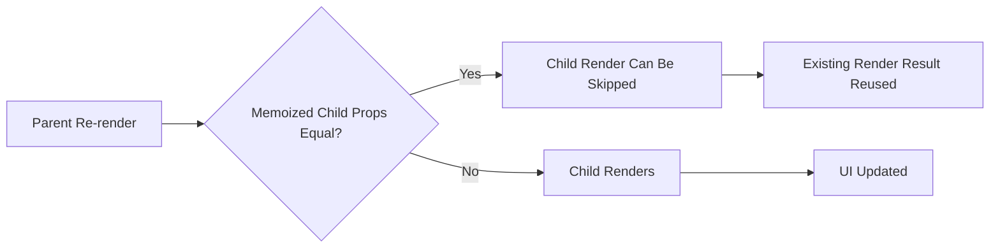

---
title: React.memo
slug: day-057-react-memo
dayLabel: Day 57
level: Advanced
estimatedMinutes: 30
order: 57
track: react
---
---
title: React.memo
slug: day-057-react-memo
dayLabel: Day 57
level: Advanced
estimatedMinutes: 30
order: 57
track: react
---
# Day 57 [Advanced]: React.memo

## Goal

Use `React.memo` effectively to reduce avoidable component re-renders without adding unnecessary memoization complexity. By the end of this lesson, you should be able to identify when a memoized component can actually benefit from stable props and when memoization is unnecessary.

## Prerequisites

- Day 56 completed
- useMemo/useCallback fundamentals
- Understanding of parent-child rendering and component props

## Explanation

`React.memo` memoizes a functional component and allows React to skip rendering that component when its props are considered equal to the previous props. By default, React compares each prop using `Object.is` semantics.

A critical point is that `React.memo` does **not** stop the parent from rendering, and it does not mean the child can never render again. A memoized component can still render when its own state changes or when a context value it consumes changes.

A useful mental model is:

```text
Parent renders
     ↓
React.memo child receives props
     ↓
Are props equal to previous props?
     ├── Yes → child render can be skipped
     └── No  → child renders with new props
```

Memoization is a performance optimization, not a correctness mechanism. First make the component correct and measure the render cost; then introduce `React.memo` where it provides a meaningful benefit.

## Topic by Topic

### Topic 1: What React.memo Does

Theory:
Memoized components can skip a render when their incoming props are equal to the previous props. The parent component may still render normally.

Practical:
Wrap a relatively expensive list-row component with `React.memo` and observe its render behavior when the parent changes unrelated state.

Code Example:

```jsx
import React from "react";

const Row = React.memo(function Row({ name }) {
  console.log("Row rendered:", name);
  return <p>{name}</p>;
});
```

**Explanation:** `React.memo` is most useful when a child receives the same props across many parent renders and the child render is expensive enough that skipping it matters. It is less useful for tiny components where the comparison itself provides little benefit.

**Key Points:**

- `React.memo` memoizes a functional component's rendered work based on props.
- The default comparison uses `Object.is` semantics for each prop.
- Parent renders are not prevented by `React.memo`.
- Memoization should be driven by measured performance needs.

### Topic 2: Shallow Prop Comparison

Theory:
New object, array, and function references can cause a memoized child to render again even when their contents look identical. Primitive values are generally easier to keep stable.

Practical:
Compare an unstable callback with a callback stabilized using `useCallback`.

Code Example:

```jsx
const onClick = useCallback(() => {
  setSelectedId(id);
}, [id]);
```

For an object prop, `useMemo` can provide a stable reference when the object should remain the same until its dependencies change:

```jsx
const options = useMemo(
  () => ({ pageSize: 20, sort: "price" }),
  [],
);
```

**Explanation:** Memoization checks references, not deep object contents. Creating `{}` or `() => {}` inline on every parent render creates a new reference. However, do not automatically wrap every value in `useMemo` or `useCallback`; the additional complexity should have a measurable reason.

**Key Points:**

- Reference identity matters for object, array, and function props.
- New references can defeat `React.memo` benefits.
- `useCallback` can stabilize callback references when appropriate.
- `useMemo` can stabilize derived object/array references when appropriate.

### Topic 3: React.memo + Lists

Theory:
Large lists can contain many repeated child components. Memoizing rows can reduce work when unrelated parent state changes and each row continues to receive the same props.

Practical:
Memoize a product row in a cart or catalog list and use a stable `key` for each item.

Code Example:

```jsx
const ProductRow = React.memo(function ProductRow({ product }) {
  console.log("ProductRow rendered:", product.id);
  return <p>{product.name}</p>;
});

products.map((product) => (
  <ProductRow key={product.id} product={product} />
));
```

**Explanation:** `key` helps React identify list items; it does not itself provide memoization. If a parent creates a brand-new `product` object for every row on every render, the memoized rows can still render because the `product` prop reference changed. Keep item identity and derived data stable where practical.

**Key Points:**

- `React.memo` can be valuable for expensive repeated rows.
- Stable `key` values are still required for list reconciliation.
- Keys and memoization solve different problems.
- Stable item references are important if object props are used.

### Topic 4: Custom Comparison Function

Theory:
`React.memo` accepts an optional comparison function that can decide whether the previous and next props are equivalent for the component's rendering requirements.

Practical:
Compare only the props that genuinely determine the component output, but make sure the comparator remains correct whenever relevant props change.

Code Example:

```jsx
const ScoreCard = React.memo(
  function ScoreCard({ name, score }) {
    return (
      <p>
        {name}: {score}
      </p>
    );
  },
  (prev, next) =>
    prev.name === next.name && prev.score === next.score,
);
```

**Explanation:** A custom comparator is a correctness-sensitive optimization. If the comparator returns `true` when a prop that affects rendering has actually changed, React may skip work that should have happened and the UI can become stale. The comparator also has a runtime cost, so it should not perform expensive deep comparisons without a clear benefit.

**Key Points:**

- Custom comparison controls whether React can reuse the previous render result.
- Compare every prop that can affect the component's output or behavior.
- Incorrect comparators can cause stale UI.
- Comparator cost must be considered against the render cost being avoided.

### Topic 5: Measure Before Optimizing

Theory:
Memoization adds comparison work and conceptual complexity. Use evidence from the React DevTools Profiler or controlled render measurements instead of assuming every rerender is a problem.

Practical:
Track render behavior before and after adding `React.memo` and compare the actual interaction performance.

Code Example:

```jsx
console.count("ProductRow rendered");
```

A console counter is useful for a simple demonstration, while the React DevTools Profiler is better for understanding commit duration and identifying expensive component trees.

**Explanation:** A component rendering is not automatically a performance problem. React is designed to render components efficiently, and sometimes a memo comparison costs more than simply rendering a small component. Profile the real user interaction before and after the optimization.

**Key Points:**

- Measure before optimizing.
- Use render logs for simple learning experiments.
- Prefer the React DevTools Profiler for real performance investigation.
- Validate that the optimization improves the interaction that matters.

### Topic 6: Production Guardrails for React.memo

Theory:
At this stage, strong engineering comes from repeatable quality checks that prevent regressions in rendering behavior, stale props, and unnecessary memoization complexity.

Practical:
Define a short review checklist for this topic that verifies correctness, stable references where useful, comparator safety, and measurable performance before merge.

Code Example:

```jsx
const MemoizedRow = React.memo(Row);

// Production review checklist:
// 1. Confirm the row is actually expensive enough to optimize.
// 2. Confirm props are stable where stability matters.
// 3. If using a custom comparator, include every render-relevant prop.
// 4. Verify the interaction with the React DevTools Profiler.
```

**Explanation:** The goal is not to maximize the number of memoized components. The goal is to reduce meaningful rendering work while keeping the component easy to understand and correct.

**Key Points:**

- Avoid blanket memoization.
- Verify custom comparators carefully.
- Keep the optimization tied to a measurable bottleneck.
- Remove memoization if it adds complexity without a useful performance gain.

## Key Concepts

- Component memoization behavior
- `React.memo` and prop comparison
- `Object.is`-based prop equality
- Stable object, array, and function references
- List rendering optimization
- Keys vs memoization
- Custom comparison functions
- Evidence-based performance tuning
- React DevTools Profiler
- Quality guardrail mindset

## Visual Concept Map



## End-to-End Practical

1. Build a parent component with an intentionally expensive child/list-row setup.
2. Observe child rerenders when unrelated parent state changes.
3. Wrap the expensive child with `React.memo`.
4. Check whether object, array, and callback props are changing references unnecessarily.
5. Stabilize only the props that need stability with `useMemo` or `useCallback`.
6. Verify the result with render logs and the React DevTools Profiler.
7. Compare the actual interaction before and after the optimization.
8. Remove the optimization if it does not provide a meaningful benefit.

## Hands-on Coding

### Example 1: Case - Memoized Cart Row

Scenario:
A shopping cart has many rows and should not rerender unaffected rows when theme changes.

```jsx
import React from "react";

const CartRow = React.memo(function CartRow({ item, onIncrement }) {
  console.log("CartRow rendered:", item.id);

  return (
    <div>
      <span>
        {item.name} ({item.quantity})
      </span>
      <button onClick={() => onIncrement(item.id)}>+</button>
    </div>
  );
});
```

The row can skip a render when `item` and `onIncrement` retain the same references. If the parent recreates either value on every render, the optimization may not help.

### Example 2: Case - Stable Callback for Memo Child

Scenario:
A dashboard parent should avoid passing a new callback reference every render when the callback's dependencies have not changed.

```jsx
import { useCallback } from "react";

const onRefresh = useCallback(
  (id) => {
    dispatch(refreshWidget(id));
  },
  [dispatch],
);
```

`useCallback` is useful here only if callback identity matters to a memoized child or another dependency. It should not be added simply because a function exists.

### Example 3: Case - Custom Compare for Score Card

Scenario:
Leaderboard card should rerender when either the displayed name or score changes, but should ignore unrelated props that do not affect the card.

```jsx
const ScoreCard = React.memo(
  function ScoreCard({ name, score }) {
    return (
      <p>
        {name}: {score}
      </p>
    );
  },
  (prev, next) =>
    prev.name === next.name && prev.score === next.score,
);
```

The comparator must include every prop that can affect the rendered output. Omitting `name` here, for example, could prevent a required UI update.

## Mini Exercise

Scenario:
You are building an exam result table.

Memoize `ResultRow` and ensure row rerenders only when that student's marks or another displayed prop changes.

Expected output:

- Unrelated page state changes do not unnecessarily rerender every row
- Stable callbacks prevent avoidable prop-reference churn
- Render logs show the optimization effect
- The row still updates whenever a render-relevant prop changes
- You can explain why `key` and `React.memo` solve different problems

## Assessment Quiz

### Quiz Questions

1. What does `React.memo` optimize?
2. Why can inline object props defeat memoization?
3. True or False: React.memo always guarantees faster performance.
4. Which hooks commonly pair with React.memo when reference stability is actually needed?
5. What should be done before and after applying memoization?
6. Does `React.memo` prevent a component from rendering when its own state changes?
7. Why can an incorrect custom comparator cause stale UI?
8. What is the difference between a React `key` and `React.memo`?

### Quiz Answers

1. It can skip rendering a memoized component when its props are equal to the previous props.
2. A newly created object has a new reference, so the prop can be considered changed even when its values look identical.
3. False. Memoization can add comparison work and complexity and should be justified by measurement.
4. `useMemo` and `useCallback`, when stable object/array/function references are actually useful.
5. Measure the relevant render/performance behavior, apply the optimization, and measure again.
6. No. `React.memo` concerns parent-provided props; the component can still render because of its own state changes or other React mechanisms such as consumed context updates.
7. If the comparator incorrectly reports equal props when a render-relevant prop changed, React can skip a necessary update.
8. `key` helps React identify list items during reconciliation; `React.memo` helps a component skip work when its props are unchanged.

## Task

- Memoize one genuinely expensive child component
- Stabilize only the props that need stable references
- Complete the mini exercise
- Measure render behavior before and after the optimization
- Document why the optimization is useful rather than adding it blindly

## Self Check

- You can explain what `React.memo` does and does not do
- You can detect common memoization blockers
- You understand reference equality for object/function props
- You can distinguish keys from memoization
- You can evaluate a custom comparator safely
- You can use profiling evidence to justify optimization
- You can answer at least 6 out of 8 quiz questions correctly

## Interview Questions and Answers

### Beginner

**Question:** What is React.memo?

**Answer:** `React.memo` is a higher-order component that memoizes a functional component so React can skip rendering it when its props are considered equal to the previous props.

**Question:** When does a memoized component rerender?

**Answer:** It can rerender when its props change, its own state changes, or other React inputs it consumes require an update. `React.memo` primarily optimizes parent-driven rendering based on props.

### Middle

**Question:** Why combine useCallback with React.memo?

**Answer:** A memoized child can still receive a new function reference from its parent on every render. `useCallback` can keep that function reference stable when its dependencies have not changed, allowing the memoized child to skip unnecessary parent-driven renders.

**Question:** What is a common misuse of React.memo?

**Answer:** Applying it everywhere without profiling. Small or frequently changing components may gain little from memoization, while the additional comparison and mental overhead can make the code harder to maintain.

### Advanced

**Question:** When should a custom comparator be avoided?

**Answer:** Avoid it when the comparator is expensive, difficult to reason about, or likely to become stale as the component's props evolve. If a normal shallow comparison is sufficient, the custom comparator adds unnecessary risk.

**Question:** How can memoization harm maintainability?

**Answer:** Overuse can spread `useMemo`, `useCallback`, and custom comparators throughout the component tree, making dependencies and reference behavior harder to understand. An incorrect comparator can also create stale UI bugs.

**Question:** Does React.memo guarantee that a component will never rerender when its props are unchanged?

**Answer:** No. It is an optimization for parent-provided props. A component can still render for reasons such as its own state updates or context updates, and React's rendering behavior should not be treated as a correctness contract around a single optimization technique.

## Day 57 Outcome

- You can optimize component rerenders with `React.memo`
- You understand prop equality and reference stability
- You can pair memoization with stable prop strategies when justified
- You can distinguish list keys from component memoization
- You can evaluate custom comparators and performance trade-offs
- You are ready for the systematic optimization workflow in Day 58

