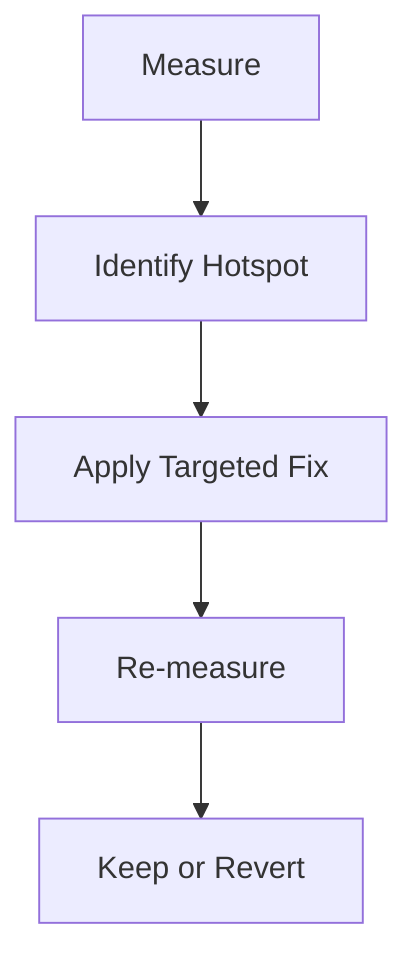

---
title: Performance Optimization
slug: day-058-performance-optimization
dayLabel: Day 58
level: Advanced
estimatedMinutes: 30
order: 58
track: react
---
# Day 58 [Advanced]: Performance Optimization

## Index

- [Goal](#goal)
- [Prerequisites](#prerequisites)
- [Explanation](#explanation)
- [Topic by Topic](#topic-by-topic)
- [Key Concepts](#key-concepts)
- [Visual Concept Map](#visual-concept-map)
- [End-to-End Practical](#end-to-end-practical)
- [Hands-on Coding](#hands-on-coding)
- [Mini Exercise](#mini-exercise)
- [Assessment Quiz](#assessment-quiz)
- [Task](#task)
- [Self Check](#self-check)
- [Interview Questions and Answers](#interview-questions-and-answers)
- [Day 58 Outcome](#day-58-outcome)

## Goal

Apply a profiling-first optimization workflow and fix measurable performance bottlenecks.

## Prerequisites

- Day 57 completed
- Memoization and code-splitting basics

## Explanation

Performance tuning should start with measurement, not assumptions. Profile first, optimize targeted hotspots, then verify impact.

## Topic by Topic

### Topic 1: Profiling Mindset

Theory:
Identify expensive renders and long commits using profiling tools.

Practical:
Profile one slow screen with React DevTools Profiler.

Code Example:

```jsx
// Record interaction and inspect commit durations.
```

**Explanation:** This topic explains Profiling Mindset in a practical way so you can apply it confidently in real React projects.

**Key Points:**

- Understand the core idea of Profiling Mindset.
- Apply the pattern using clean, readable code.
- Avoid common mistakes through predictable React flow.

### Topic 2: Render Bottleneck Patterns

Theory:
Large lists and frequent parent updates often drive slow renders.

Practical:
Pinpoint expensive child rerenders.

Code Example:

```jsx
console.count("Row render");
```

**Explanation:** This topic explains Render Bottleneck Patterns in a practical way so you can apply it confidently in real React projects.

**Key Points:**

- Understand the core idea of Render Bottleneck Patterns.
- Apply the pattern using clean, readable code.
- Avoid common mistakes through predictable React flow.

### Topic 3: Optimization Toolkit

Theory:
Use React.memo, useMemo, useCallback, and splitting selectively.

Practical:
Apply one value memo and one component memo.

Code Example:

```jsx
const filtered = useMemo(() => heavyFilter(data), [data, query]);
```

**Explanation:** This topic explains Optimization Toolkit in a practical way so you can apply it confidently in real React projects.

**Key Points:**

- Understand the core idea of Optimization Toolkit.
- Apply the pattern using clean, readable code.
- Avoid common mistakes through predictable React flow.

### Topic 4: Avoid Premature Optimization

Theory:
Over-optimization increases code complexity.

Practical:
Keep optimization only where profiler confirms bottleneck.

Code Example:

```jsx
// Remove unnecessary memoization if no measurable win.
```

**Explanation:** This topic explains Avoid Premature Optimization in a practical way so you can apply it confidently in real React projects.

**Key Points:**

- Understand the core idea of Avoid Premature Optimization.
- Apply the pattern using clean, readable code.
- Avoid common mistakes through predictable React flow.

### Topic 5: Performance Checklist

Theory:
Use repeatable checklist for ongoing performance reviews.

Practical:
Audit bundle size, rerenders, and network waterfall.

Code Example:

```jsx
// Checklist: rerender count, interaction latency, chunk size.
```

**Explanation:** This topic explains Performance Checklist in a practical way so you can apply it confidently in real React projects.

**Key Points:**

- Understand the core idea of Performance Checklist.
- Apply the pattern using clean, readable code.
- Avoid common mistakes through predictable React flow.

### Topic 6: Production Guardrails for Performance Optimization

Theory:
At this stage, strong engineering comes from repeatable quality checks that prevent regressions in state flow, edge cases, and maintainability.

Practical:
Define a short review checklist for this topic that verifies correctness, fallback behavior, and readability before merge.

Code Example:

`jsx
// Add a checklist step before release for this feature area.
`
**Explanation:** This topic explains Production Guardrails for Performance Optimization in a practical way so you can apply it confidently in real React projects.

**Key Points:**

- Understand the core idea of Production Guardrails for Performance Optimization.
- Apply the pattern using clean, readable code.
- Avoid common mistakes through predictable React flow.

## Key Concepts

- Profile-before-optimize approach
- Hotspot isolation
- Targeted optimization strategies
- Complexity vs benefit tradeoff
- Repeatable performance checklist

- Quality guardrail mindset

## Visual Concept Map



## End-to-End Practical

1. Profile one heavy screen.
2. Identify top two expensive components.
3. Apply focused optimizations.
4. Re-profile same interactions.
5. Document before/after results.

## Hands-on Coding

### Example 1: Case - Memoize Product Search Derivation

Scenario:
Catalog page lags while typing due to repeated heavy filtering.

```jsx
const visibleProducts = useMemo(() => {
  return products.filter((p) =>
    p.name.toLowerCase().includes(query.toLowerCase()),
  );
}, [products, query]);
```

### Example 2: Case - Prevent Unnecessary Row Re-renders

Scenario:
Order table rows rerender on every unrelated toolbar update.

```jsx
const OrderRow = React.memo(function OrderRow({ order, onSelect }) {
  return <div onClick={() => onSelect(order.id)}>{order.name}</div>;
});
```

### Example 3: Case - Lazy-load Heavy Analytics Panel

Scenario:
Analytics charts should load only when user opens insights tab.

```jsx
const AnalyticsPanel = lazy(() => import("./AnalyticsPanel"));

{
  showInsights && (
    <Suspense fallback={<p>Loading analytics...</p>}>
      <AnalyticsPanel />
    </Suspense>
  );
}
```

## Mini Exercise

Scenario:
You are optimizing a student dashboard.

Profile the page and fix two hotspots:

- one rerender issue
- one expensive calculation issue

Expected output:

- Measurable improvement from profiler output
- Clear explanation of what changed and why
- No unnecessary complexity introduced

## Assessment Quiz

### Quiz Questions

1. Why profile before optimizing?
2. Name two common rerender causes.
3. True or False: More memoization always means better performance.
4. Which optimization helps reduce initial JS payload?
5. What should be documented after optimization?

### Quiz Answers

1. To target real bottlenecks, not assumptions
2. Unstable props/callbacks and heavy parent updates
3. False
4. Code splitting/lazy loading
5. Before/after metrics and impacted components

## Task

- Profile one feature screen
- Optimize at least two confirmed bottlenecks
- Complete mini exercise

## Self Check

- You can run a practical optimization workflow end-to-end
- You can justify performance changes with data
- You can answer at least 4 out of 5 quiz questions correctly

## Interview Questions and Answers

### Beginner

**Question:** Why is performance profiling important?

**Answer:** It reveals real bottlenecks before code changes.

**Question:** Name one tool for React performance analysis.

**Answer:** React DevTools Profiler.

### Middle

**Question:** How do you reduce expensive rerenders in list UIs?

**Answer:** Memoize rows and stabilize props/callbacks.

**Question:** What is a healthy optimization process?

**Answer:** Measure, optimize target area, then verify improvements.

### Advanced

**Question:** How do you balance performance and maintainability?

**Answer:** Optimize only hotspots with measurable impact and keep code readable.

**Question:** When should optimization be reverted?

**Answer:** If complexity increases with no meaningful performance gain.

## Day 58 Outcome

- You can execute evidence-based frontend performance optimization
- You can improve performance without over-optimizing
- You are ready for runtime failure resilience in Day 59

