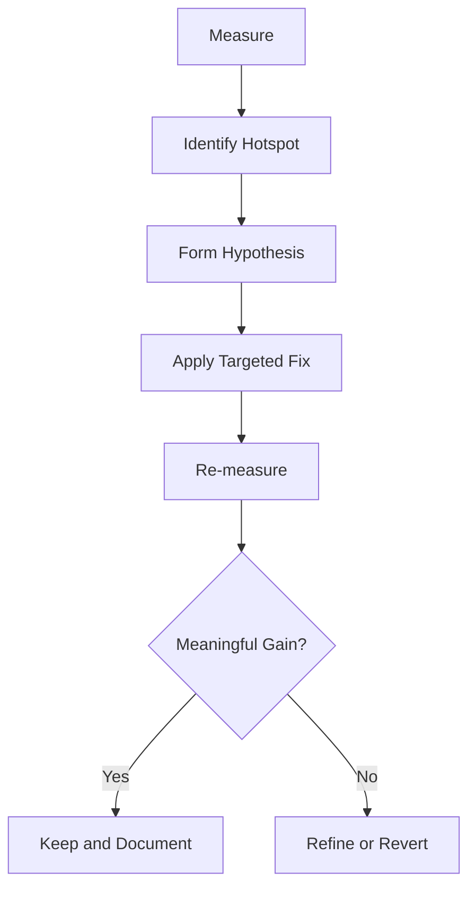

---
title: Performance Optimization
slug: day-058-performance-optimization
dayLabel: Day 58
level: Advanced
estimatedMinutes: 30
order: 58
track: react
---
---
title: Performance Optimization
slug: day-058-performance-optimization
dayLabel: Day 58
level: Advanced
estimatedMinutes: 30
order: 58
track: react
---
# Day 58 [Advanced]: Performance Optimization

## Goal

Apply a profiling-first optimization workflow and fix measurable performance bottlenecks. By the end of this lesson, you should be able to distinguish render cost, JavaScript cost, network cost, and bundle cost, then choose an optimization based on evidence rather than intuition.

## Prerequisites

- Day 57 completed
- Memoization and code-splitting basics

## Explanation

Performance tuning should start with measurement, not assumptions. Profile first, optimize targeted hotspots, then verify impact using the same interaction and measurement conditions.

A useful workflow is:

```text
Measure
  ↓
Find the bottleneck
  ↓
Form a hypothesis
  ↓
Apply the smallest useful fix
  ↓
Measure again
  ↓
Keep, refine, or revert
```

Performance is broader than React renders. A screen can feel slow because of expensive JavaScript, excessive rendering, a large initial bundle, slow network requests, image cost, or main-thread work. Do not use `React.memo` for a network problem or code splitting for an expensive calculation without first identifying the actual bottleneck.

## Topic by Topic

### Topic 1: Profiling Mindset

Theory:
Identify expensive renders and long commits using profiling tools. React DevTools Profiler can help you understand which components participated in a commit and how much rendering work was associated with them.

Practical:
Profile one slow screen with React DevTools Profiler. Record the interaction you care about, such as typing in a search box or opening a dashboard panel, and use the same interaction before and after the optimization.

Code Example:

```jsx
console.count("ProductList render");
```

For a learning experiment, a render counter can quickly reveal unexpected renders. For actual optimization decisions, combine it with the React DevTools Profiler and, when appropriate, browser Performance tools.

**Explanation:** Profiling is about establishing evidence. A component appearing frequently in logs is not automatically the bottleneck; the important question is whether its work contributes meaningfully to the slow interaction.

**Key Points:**

- Profile the user interaction that feels slow.
- Separate render frequency from actual render cost.
- Use the same scenario before and after a change.
- Record enough evidence to explain why the optimization was made.

### Topic 2: Render Bottleneck Patterns

Theory:
Large lists, expensive calculations, unstable props, broad parent updates, and unnecessary state placement can drive slow renders.

Practical:
Pinpoint expensive child rerenders and check whether the child actually needs to rerender when unrelated state changes.

Code Example:

```jsx
console.count("Row render");
```

For example, a toolbar state update should not automatically force expensive rows to repeat costly work if their relevant inputs have not changed. Possible fixes include moving state closer to where it is used, reducing the amount of work done during render, stabilizing props where justified, or memoizing an expensive child after profiling confirms the need.

**Explanation:** Not every rerender is bad. The optimization target is unnecessary or expensive work that affects user-perceived performance. Avoid treating render count alone as the performance metric.

**Key Points:**

- Large lists can amplify small rendering costs.
- Unstable object/function props can defeat memoization.
- State placed too high in the tree can cause broader updates than necessary.
- Optimize expensive work, not merely every rerender.

### Topic 3: Optimization Toolkit

Theory:
Use `React.memo`, `useMemo`, `useCallback`, lazy loading, and code splitting selectively. Each tool addresses a different type of cost.

Practical:
Apply one value memo and one component memo to confirmed hotspots, then verify whether the change improves the measured interaction.

Code Example:

```jsx
const filtered = useMemo(() => heavyFilter(data), [data, query]);
```

For component memoization:

```jsx
const ProductRow = React.memo(function ProductRow({ product }) {
  return <p>{product.name}</p>;
});
```

For route or feature-level code splitting:

```jsx
const ReportsPage = lazy(() => import("./ReportsPage"));
```

These optimizations should not be treated as interchangeable. `useMemo` can avoid repeating a calculation, `React.memo` can skip parent-driven child rendering when props are equal, and lazy loading can reduce the JavaScript that must be loaded before a feature is used.

**Explanation:** Choose the optimization that matches the bottleneck. Memoizing a cheap calculation can add complexity without meaningful benefit, while lazy loading a rarely visited heavy feature can reduce initial loading cost substantially.

**Key Points:**

- Match the optimization to the measured bottleneck.
- `useMemo` targets repeated derived calculations.
- `React.memo` targets avoidable parent-driven child rendering.
- Lazy loading/code splitting targets JavaScript loading and initial bundle cost.

### Topic 4: Avoid Premature Optimization

Theory:
Over-optimization increases code complexity and can make dependency relationships harder to understand.

Practical:
Keep optimization only where the profiler or another measurement confirms a meaningful bottleneck.

Code Example:

```jsx
// Do not add useMemo/useCallback automatically.
// Keep the simple version unless measurement shows a reason to optimize.
const total = items.reduce((sum, item) => sum + item.price, 0);
```

A simple calculation that runs on a small list may be cheaper than maintaining memoization dependencies. Optimization becomes valuable when the calculation is expensive, runs frequently, or is part of a demonstrated performance problem.

**Explanation:** Premature optimization is not the same as performance engineering. Good performance engineering uses evidence to keep the application responsive while preserving understandable code.

**Key Points:**

- Simpler code is often preferable when performance is already acceptable.
- Measure before introducing optimization complexity.
- Re-check dependency arrays when using memoization.
- Remove an optimization that does not produce a meaningful benefit.

### Topic 5: Performance Checklist

Theory:
Use a repeatable checklist for ongoing performance reviews across rendering, JavaScript, bundle size, network behavior, and user interaction latency.

Practical:
Audit bundle size, rerenders, expensive calculations, and the network waterfall for one real feature.

Code Example:

```jsx
// Checklist:
// 1. Render/commit cost
// 2. Main-thread JavaScript work
// 3. Initial and lazy-loaded chunk size
// 4. Network waterfall
// 5. User interaction latency
```

For production investigations, combine React DevTools Profiler with browser Performance and Network tools. Bundle analyzers can help identify unexpectedly large dependencies when JavaScript payload is the issue.

**Explanation:** A performance checklist prevents teams from focusing exclusively on React rendering when the real problem may be a large dependency, slow API, oversized image, or expensive browser work.

**Key Points:**

- Check rendering and main-thread work.
- Check initial and lazy-loaded JavaScript.
- Inspect network timing and payload size.
- Measure the user interaction that matters.
- Compare before/after evidence.

### Topic 6: Production Guardrails for Performance Optimization

Theory:
At this stage, strong engineering comes from repeatable quality checks that prevent performance regressions while protecting correctness, maintainability, and accessibility.

Practical:
Define a short review checklist for this topic that verifies correctness, fallback behavior, measurable impact, and readability before merge.

Code Example:

```jsx
// Production review checklist:
// 1. Identify the measured bottleneck.
// 2. Record before/after evidence.
// 3. Confirm behavior and accessibility are unchanged.
// 4. Check loading/error fallbacks for lazy features.
// 5. Remove optimization if it provides no meaningful gain.
```

**Explanation:** Performance work should remain reversible and measurable. A change that makes a benchmark look better but introduces stale UI, inaccessible loading states, or difficult-to-maintain code is not a successful production optimization.

**Key Points:**

- Keep performance changes evidence-based.
- Preserve correctness and accessibility.
- Verify loading and fallback behavior.
- Document meaningful before/after measurements.

## Key Concepts

- Profile-before-optimize approach
- Hotspot isolation
- Render vs JavaScript vs network vs bundle bottlenecks
- Targeted optimization strategies
- `React.memo`, `useMemo`, and `useCallback`
- Lazy loading and code splitting
- Complexity vs benefit tradeoff
- Repeatable performance checklist

- Quality guardrail mindset

## Visual Concept Map



## End-to-End Practical

1. Profile one heavy screen.
2. Identify the top two expensive contributors to the target interaction.
3. Determine whether each problem is rendering, JavaScript, network, or bundle related.
4. Apply focused optimizations that match those bottlenecks.
5. Re-profile the same interactions under comparable conditions.
6. Document before/after results and any trade-offs.
7. Check correctness, loading states, and accessibility.
8. Keep the optimization only when the measured benefit justifies its complexity.

## Hands-on Coding

### Example 1: Case - Memoize Product Search Derivation

Scenario:
Catalog page lags while typing due to repeated heavy filtering.

```jsx
const visibleProducts = useMemo(() => {
  return products.filter((p) =>
    p.name.toLowerCase().includes(query.toLowerCase()),
  );
}, [products, query]);
```

If `products` is recreated on every parent render, this memo will also recalculate. The optimization is useful only when the calculation is sufficiently expensive and the dependencies remain stable enough to provide a benefit.

### Example 2: Case - Prevent Unnecessary Row Re-renders

Scenario:
Order table rows rerender on every unrelated toolbar update.

```jsx
const OrderRow = React.memo(function OrderRow({ order, onSelect }) {
  return <div onClick={() => onSelect(order.id)}>{order.name}</div>;
});
```

The parent should also avoid recreating `order` and `onSelect` references unnecessarily if the profiling evidence shows that reference churn is preventing the optimization from helping.

### Example 3: Case - Lazy-load Heavy Analytics Panel

Scenario:
Analytics charts should load only when the user opens the insights tab.

```jsx
const AnalyticsPanel = lazy(() => import("./AnalyticsPanel"));

{showInsights && (
  <Suspense fallback={<p>Loading analytics...</p>}>
    <AnalyticsPanel />
  </Suspense>
)}
```

Lazy loading can reduce the initial JavaScript needed for the page, but the feature still needs a useful loading fallback and should be measured to confirm that the reduced initial payload is worth the deferred loading cost.

## Mini Exercise

Scenario:
You are optimizing a student dashboard.

Profile the page and fix two hotspots:

- one rerender issue
- one expensive calculation issue

Expected output:

- Measurable improvement from profiler output
- Clear explanation of what changed and why
- Before/after measurement for the same interaction
- No unnecessary complexity introduced
- Confirmation that functionality and accessibility remain intact

## Assessment Quiz

### Quiz Questions

1. Why profile before optimizing?
2. Name two common rerender causes.
3. True or False: More memoization always means better performance.
4. Which optimization helps reduce initial JS payload?
5. What should be documented after optimization?
6. Why is a render count alone not enough to prove a performance problem?
7. Which browser tools can help investigate network and main-thread bottlenecks?
8. When should a performance optimization be reverted?

### Quiz Answers

1. To target real bottlenecks rather than assumptions.
2. Unstable props/callbacks, expensive parent updates, broad state updates, and expensive render calculations are common examples.
3. False. Memoization can add comparison and maintenance cost.
4. Code splitting/lazy loading can reduce the JavaScript required initially.
5. Before/after metrics, the impacted interaction/components, and relevant trade-offs.
6. A component can render frequently but be cheap; another component may render less often but perform expensive work. Cost and user impact matter.
7. Browser Performance and Network panels are useful alongside React DevTools Profiler for different classes of bottlenecks.
8. When the measured benefit is insignificant or absent and the added complexity is not justified.

## Task

- Profile one feature screen
- Identify at least two confirmed bottlenecks
- Optimize at least two confirmed bottlenecks using appropriate techniques
- Complete mini exercise
- Record before/after measurements
- Explain why each chosen optimization matches its bottleneck

## Self Check

- You can run a practical optimization workflow end-to-end
- You can distinguish render, JavaScript, network, and bundle bottlenecks at a high level
- You can justify performance changes with data
- You know when memoization is appropriate and when it is unnecessary
- You can explain why code splitting can improve initial loading
- You can answer at least 6 out of 8 quiz questions correctly

## Interview Questions and Answers

### Beginner

**Question:** Why is performance profiling important?

**Answer:** It reveals real bottlenecks before code changes, helping engineers optimize the work that actually affects the user experience.

**Question:** Name one tool for React performance analysis.

**Answer:** React DevTools Profiler.

### Middle

**Question:** How do you reduce expensive rerenders in list UIs?

**Answer:** First profile the list to find the expensive work. Depending on the bottleneck, you may memoize expensive rows, stabilize relevant props/callbacks, move state closer to where it is used, or reduce the work performed during rendering.

**Question:** What is a healthy optimization process?

**Answer:** Measure a representative interaction, identify the bottleneck, form a hypothesis, make the smallest useful change, and measure the same interaction again before deciding whether to keep the optimization.

### Advanced

**Question:** How do you balance performance and maintainability?

**Answer:** Optimize only measured hotspots, choose the least complex technique that solves the problem, document the evidence, and remove optimizations that do not provide a meaningful benefit.

**Question:** When should optimization be reverted?

**Answer:** If complexity increases without a meaningful measured performance gain, or if the optimization introduces correctness, accessibility, or maintainability problems.

## Day 58 Outcome

- You can execute evidence-based frontend performance optimization
- You can distinguish common categories of frontend performance bottlenecks
- You can improve performance without over-optimizing
- You can validate changes with before/after measurements
- You are ready for runtime failure resilience in Day 59
