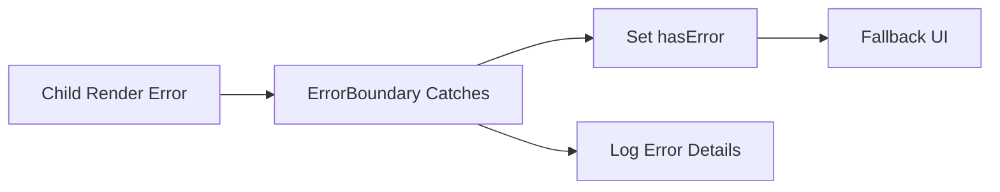

---
title: Error Boundaries
slug: day-059-error-boundaries
dayLabel: Day 59
level: Advanced
estimatedMinutes: 30
order: 59
track: react
---
# Day 59 [Advanced]: Error Boundaries

## Index

- [Goal](#goal)
- [Prerequisites](#prerequisites)
- [Explanation](#explanation)
- [Topic by Topic](#topic-by-topic)
- [Key Concepts](#key-concepts)
- [Visual Concept Map](#visual-concept-map)
- [End-to-End Practical](#end-to-end-practical)
- [Hands-on Coding](#hands-on-coding)
- [Mini Exercise](#mini-exercise)
- [Assessment Quiz](#assessment-quiz)
- [Task](#task)
- [Self Check](#self-check)
- [Interview Questions and Answers](#interview-questions-and-answers)
- [Day 59 Outcome](#day-59-outcome)

## Goal

Contain UI crashes with Error Boundaries and design graceful fallback experiences.

## Prerequisites

- Day 58 completed
- React component lifecycle basics

## Explanation

Error boundaries catch render-time errors in child tree and show fallback UI instead of crashing the whole app.

## Topic by Topic

### Topic 1: What Error Boundaries Catch

Theory:
They catch rendering, lifecycle, and constructor errors in descendants.

Practical:
Wrap risky widget with boundary.

Code Example:

```jsx
<ErrorBoundary>
  <RiskyWidget />
</ErrorBoundary>
```

**Explanation:** This topic explains What Error Boundaries Catch in a practical way so you can apply it confidently in real React projects.

**Key Points:**

- Understand the core idea of What Error Boundaries Catch.
- Apply the pattern using clean, readable code.
- Avoid common mistakes through predictable React flow.

### Topic 2: Class-based Boundary API

Theory:
Use class component with `getDerivedStateFromError` and `componentDidCatch`.

Practical:
Set `hasError` and render fallback.

Code Example:

```jsx
static getDerivedStateFromError() { return { hasError: true }; }
```

**Explanation:** This topic explains Class-based Boundary API in a practical way so you can apply it confidently in real React projects.

**Key Points:**

- Understand the core idea of Class-based Boundary API.
- Apply the pattern using clean, readable code.
- Avoid common mistakes through predictable React flow.

### Topic 3: Logging Errors

Theory:
Use `componentDidCatch` to log error details.

Practical:
Forward stack to monitoring service.

Code Example:

```jsx
componentDidCatch(error, info) { console.error(error, info); }
```

**Explanation:** This topic explains Logging Errors in a practical way so you can apply it confidently in real React projects.

**Key Points:**

- Understand the core idea of Logging Errors.
- Apply the pattern using clean, readable code.
- Avoid common mistakes through predictable React flow.

### Topic 4: Granular Boundary Placement

Theory:
Place boundaries around feature blocks, not only root.

Practical:
Wrap dashboard widgets independently.

Code Example:

```jsx
<WidgetBoundary>
  <ChartWidget />
</WidgetBoundary>
```

**Explanation:** This topic explains Granular Boundary Placement in a practical way so you can apply it confidently in real React projects.

**Key Points:**

- Understand the core idea of Granular Boundary Placement.
- Apply the pattern using clean, readable code.
- Avoid common mistakes through predictable React flow.

### Topic 5: Recovery UX

Theory:
Fallback UI should guide user to retry or navigate safely.

Practical:
Add reset/reload action in fallback.

Code Example:

```jsx
<button onClick={onRetry}>Try Again</button>
```

**Explanation:** This topic explains Recovery UX in a practical way so you can apply it confidently in real React projects.

**Key Points:**

- Understand the core idea of Recovery UX.
- Apply the pattern using clean, readable code.
- Avoid common mistakes through predictable React flow.

### Topic 6: Production Guardrails for Error Boundaries

Theory:
At this stage, strong engineering comes from repeatable quality checks that prevent regressions in state flow, edge cases, and maintainability.

Practical:
Define a short review checklist for this topic that verifies correctness, fallback behavior, and readability before merge.

Code Example:

`jsx
// Add a checklist step before release for this feature area.
`
**Explanation:** This topic explains Production Guardrails for Error Boundaries in a practical way so you can apply it confidently in real React projects.

**Key Points:**

- Understand the core idea of Production Guardrails for Error Boundaries.
- Apply the pattern using clean, readable code.
- Avoid common mistakes through predictable React flow.

## Key Concepts

- Crash containment strategy
- Boundary lifecycle methods
- Error logging for observability
- Feature-level boundary placement
- User recovery from crashes

- Quality guardrail mindset

## Visual Concept Map



## End-to-End Practical

1. Build reusable ErrorBoundary class.
2. Wrap risky feature components.
3. Render fallback when error occurs.
4. Log error metadata.
5. Add user recovery action.

## Hands-on Coding

### Example 1: Case - Generic ErrorBoundary Component

Scenario:
A multi-widget dashboard should not crash fully when one widget throws.

```jsx
import React from "react";

class ErrorBoundary extends React.Component {
  constructor(props) {
    super(props);
    this.state = { hasError: false };
  }

  static getDerivedStateFromError() {
    return { hasError: true };
  }

  componentDidCatch(error, info) {
    console.error("Captured error:", error, info);
  }

  render() {
    if (this.state.hasError) {
      return <p>Something went wrong in this section.</p>;
    }
    return this.props.children;
  }
}
```

### Example 2: Case - Feature-level Boundary Usage

Scenario:
An analytics panel should fail gracefully without affecting top navigation and other widgets.

```jsx
function Dashboard() {
  return (
    <div>
      <Navbar />
      <ErrorBoundary>
        <AnalyticsWidget />
      </ErrorBoundary>
      <ActivityFeed />
    </div>
  );
}
```

### Example 3: Case - Fallback Recovery Action

Scenario:
A chart section crash should offer a user retry option.

```jsx
function ErrorFallback({ onRetry }) {
  return (
    <div>
      <p>Chart failed to render.</p>
      <button onClick={onRetry}>Reload Section</button>
    </div>
  );
}
```

## Mini Exercise

Scenario:
You are building a finance dashboard.

Wrap `PortfolioWidget`, `MarketFeed`, and `InsightsCard` separately with boundaries. Add logging and fallback retry UI.

Expected output:

- One widget crash does not break entire page
- Error details are logged
- User sees clear fallback with recovery action

## Assessment Quiz

### Quiz Questions

1. What errors can boundaries catch?
2. Which methods are required in class ErrorBoundary?
3. True or False: Error boundaries catch errors inside event handlers automatically.
4. Why place boundaries around feature modules?
5. What should fallback UI provide besides message?

### Quiz Answers

1. Render/lifecycle/constructor errors in child tree
2. getDerivedStateFromError and componentDidCatch
3. False
4. To isolate failures and preserve rest of app
5. Recovery guidance such as retry/navigation

## Task

- Implement class-based ErrorBoundary
- Add boundaries around at least 2 independent features
- Complete mini exercise

## Self Check

- You can contain runtime crashes with proper boundaries
- You can design user-friendly fallback experiences
- You can answer at least 4 out of 5 quiz questions correctly

## Interview Questions and Answers

### Beginner

**Question:** What is an Error Boundary in React?

**Answer:** A component that catches rendering errors in child components.

**Question:** Why use fallback UI?

**Answer:** To keep app usable when a section crashes.

### Middle

**Question:** Where should Error Boundaries be placed?

**Answer:** Around risky or independent feature sections.

**Question:** What does componentDidCatch provide?

**Answer:** Error object and component stack info for logging.

### Advanced

**Question:** Why are Error Boundaries still relevant with modern frameworks?

**Answer:** They provide runtime resilience and controlled failure domains in client UI.

**Question:** What limitation should teams remember about Error Boundaries?

**Answer:** They do not catch async/event-handler errors automatically.

## Day 59 Outcome

- You can implement robust crash containment with Error Boundaries
- You can preserve app usability during feature failures
- You are ready for capstone architecture planning in Day 60

