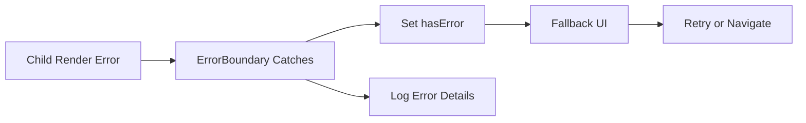

---
title: Error Boundaries
slug: day-059-error-boundaries
dayLabel: Day 59
level: Advanced
estimatedMinutes: 30
order: 59
track: react
---
---
title: Error Boundaries
slug: day-059-error-boundaries
dayLabel: Day 59
level: Advanced
estimatedMinutes: 30
order: 59
track: react
---
# Day 59 [Advanced]: Error Boundaries

## Goal

Contain UI crashes with Error Boundaries and design graceful fallback experiences. You will also learn what Error Boundaries do **not** catch, how to choose useful failure boundaries, and how to combine logging with recovery UX.

## Prerequisites

- Day 58 completed
- React component lifecycle basics
- Basic understanding of component rendering and asynchronous UI

## Explanation

Error boundaries catch rendering, lifecycle, and constructor errors in descendant components and show fallback UI instead of allowing that part of the tree to render normally. They create a **failure boundary** around a UI region.

A boundary is not a general-purpose JavaScript `try/catch`. It does not automatically catch errors from event handlers, asynchronous callbacks such as `setTimeout`, or rejected promises. Those failures need their own handling strategy.

A useful mental model is:

```text
Child component throws during render/lifecycle
                ↓
          Error Boundary
          ↙            ↘
      log error      fallback UI
                         ↓
                  retry / navigate
```

The goal is not to hide errors. The goal is to isolate a failure, preserve as much of the application as possible, and give the engineering team enough information to diagnose the problem.

## Topic by Topic

### Topic 1: What Error Boundaries Catch

Theory:
They catch errors during rendering, lifecycle methods, and constructors of descendant components. They do not catch errors from event handlers, asynchronous callbacks, server-side rendering, or errors thrown by the boundary itself.

Practical:
Wrap a risky widget with a boundary so a failure in that widget does not remove unrelated dashboard content.

Code Example:

```jsx
<ErrorBoundary>
  <RiskyWidget />
</ErrorBoundary>
```

**Explanation:** The boundary protects the descendant tree. If `RiskyWidget` throws while React is rendering it, the boundary can switch to its fallback state. Event-handler failures still need local `try/catch` or another explicit error-handling strategy.

**Key Points:**

- Boundaries catch render/lifecycle/constructor errors in descendants.
- They do not automatically catch event-handler or arbitrary async errors.
- The boundary itself must be outside the component that may fail.
- Use boundaries to define meaningful failure domains.

### Topic 2: Class-based Boundary API

Theory:
A traditional React Error Boundary is implemented with a class component using `getDerivedStateFromError` to update fallback state and `componentDidCatch` to perform side effects such as logging.

Practical:
Set `hasError` in `getDerivedStateFromError` and render fallback UI when the state is active.

Code Example:

```jsx
class ErrorBoundary extends React.Component {
  state = { hasError: false };

  static getDerivedStateFromError() {
    return { hasError: true };
  }

  componentDidCatch(error, info) {
    console.error(error, info);
  }

  render() {
    return this.state.hasError
      ? <p>Something went wrong.</p>
      : this.props.children;
  }
}
```

**Explanation:** `getDerivedStateFromError` is the render-phase mechanism for switching to fallback UI. `componentDidCatch` is the place for side effects such as reporting the error and component stack to an observability system. A boundary should not attempt to silently recover by ignoring the original error.

**Key Points:**

- `getDerivedStateFromError` updates state used by fallback rendering.
- `componentDidCatch` is appropriate for logging/reporting side effects.
- Error Boundaries are class-based in React's built-in API.
- Keep fallback rendering simple and dependable.

### Topic 3: Logging Errors

Theory:
Use `componentDidCatch` to capture error details and component-stack information. Production applications should forward useful diagnostics to an approved monitoring service rather than relying only on `console.error`.

Practical:
Forward error and component stack to a monitoring abstraction while avoiding sensitive user data in logs.

Code Example:

```jsx
componentDidCatch(error, info) {
  console.error("Captured error:", error, info);
  reportUiError({
    message: error.message,
    componentStack: info.componentStack,
  });
}
```

**Explanation:** Observability should answer what failed, where it failed, and how often it happens. Avoid logging passwords, tokens, payment details, or unnecessary personal data. A reporting function can add environment, release, route, and correlation information without coupling the boundary to a particular monitoring vendor.

**Key Points:**

- `componentDidCatch` receives the error and component-stack information.
- Centralize reporting behind a small logging abstraction.
- Avoid sensitive information in client-side error reports.
- Include release/environment context when useful for diagnosis.

### Topic 4: Granular Boundary Placement

Theory:
Place boundaries around meaningful feature blocks rather than only at the root. A root boundary is useful as a last-resort safety net, while feature boundaries preserve independent areas of the application.

Practical:
Wrap dashboard widgets independently so one failing chart does not hide navigation, activity data, or unrelated widgets.

Code Example:

```jsx
<WidgetBoundary>
  <ChartWidget />
</WidgetBoundary>
```

**Explanation:** Boundary placement is a product decision as well as a technical decision. If two features can fail independently and users can still work with the rest of the page, separate boundaries usually provide a better failure domain. Too many boundaries can also add unnecessary complexity, so choose meaningful boundaries rather than wrapping every small component.

**Key Points:**

- Use feature-level boundaries for independent failure domains.
- Keep a high-level fallback as a final safety net where appropriate.
- Avoid wrapping every tiny component without a clear recovery benefit.
- Design fallback scope around what the user can still use.

### Topic 5: Recovery UX

Theory:
Fallback UI should explain the problem at the right level, preserve unaffected content, and guide the user toward a safe recovery action such as retrying or navigating elsewhere.

Practical:
Add a retry action that resets the boundary state and remounts the failed subtree when appropriate.

Code Example:

```jsx
<button onClick={onRetry}>Try Again</button>
```

**Explanation:** A retry button should not merely hide the error. The failed subtree needs to be reset or remounted so the same broken state is not immediately displayed again. For data-related failures, a retry may also trigger a fresh request. For deterministic programming errors, repeated retries may fail again and should be paired with useful navigation or support guidance.

**Key Points:**

- Give users a clear recovery path.
- Preserve unaffected parts of the application.
- Reset the failed subtree before retrying when necessary.
- Do not expose technical stack traces as the primary user message.

### Topic 6: Production Guardrails for Error Boundaries

Theory:
At this stage, strong engineering comes from repeatable quality checks that prevent regressions in failure isolation, logging, recovery behavior, and maintainability.

Practical:
Define a short review checklist for this topic that verifies boundary placement, fallback behavior, logging, recovery, and privacy before merge.

Code Example:

```jsx
// Production checklist:
// 1. Boundary is placed around a meaningful failure domain.
// 2. Fallback keeps unaffected UI usable.
// 3. Errors are reported without sensitive data.
// 4. Retry/reset behavior is tested.
// 5. A top-level safety boundary exists where appropriate.
```

**Explanation:** Error handling is part of application architecture, not only a visual fallback. Test both the failure path and the recovery path, verify that logging works in production builds, and make sure a boundary does not accidentally hide a critical failure that should terminate the current workflow.

**Key Points:**

- Test failure and recovery paths.
- Verify observability without leaking sensitive data.
- Use meaningful boundary placement.
- Keep fallback components simple and reliable.

## Key Concepts

- Crash containment strategy
- Boundary lifecycle methods
- Error logging for observability
- Feature-level boundary placement
- User recovery from crashes
- Errors Error Boundaries do not catch
- Failure-domain design
- Retry and reset behavior
- Privacy-aware error reporting

- Quality guardrail mindset

## Visual Concept Map



## End-to-End Practical

1. Build reusable ErrorBoundary class.
2. Wrap risky feature components.
3. Render fallback when error occurs.
4. Log error metadata without sensitive data.
5. Add user recovery action.
6. Test a real render-time failure and verify unaffected features remain usable.
7. Test the recovery path and confirm the failed subtree can render again when the underlying problem is resolved.

## Hands-on Coding

### Example 1: Case - Generic ErrorBoundary Component

Scenario:
A multi-widget dashboard should not crash fully when one widget throws.

```jsx
import React from "react";

class ErrorBoundary extends React.Component {
  constructor(props) {
    super(props);
    this.state = { hasError: false };
  }

  static getDerivedStateFromError() {
    return { hasError: true };
  }

  componentDidCatch(error, info) {
    console.error("Captured error:", error, info);
  }

  render() {
    if (this.state.hasError) {
      return <p>Something went wrong in this section.</p>;
    }
    return this.props.children;
  }
}
```

The boundary contains render-time errors from its descendants. In a production implementation, replace the console-only logging with an application monitoring abstraction and consider a reset mechanism for recoverable failures.

### Example 2: Case - Feature-level Boundary Usage

Scenario:
An analytics panel should fail gracefully without affecting top navigation and other widgets.

```jsx
function Dashboard() {
  return (
    <div>
      <Navbar />
      <ErrorBoundary>
        <AnalyticsWidget />
      </ErrorBoundary>
      <ActivityFeed />
    </div>
  );
}
```

This creates an independent failure domain for the analytics feature. The boundary should be placed at a level where its fallback can replace the failed feature without removing unrelated page content.

### Example 3: Case - Fallback Recovery Action

Scenario:
A chart section crash should offer a user retry option.

```jsx
function ErrorFallback({ onRetry }) {
  return (
    <div role="alert">
      <p>Chart failed to render.</p>
      <button type="button" onClick={onRetry}>
        Reload Section
      </button>
    </div>
  );
}
```

The retry callback should reset/remount the failed subtree or otherwise perform a known recovery operation. A button alone does not reset an Error Boundary.

## Mini Exercise

Scenario:
You are building a finance dashboard.

Wrap `PortfolioWidget`, `MarketFeed`, and `InsightsCard` separately with boundaries. Add logging and fallback retry UI.

Expected output:

- One widget crash does not break entire page
- Error details are logged without sensitive data
- User sees clear fallback with recovery action
- Retry/reset behavior is verified
- Unaffected dashboard features remain usable

## Assessment Quiz

### Quiz Questions

1. What errors can boundaries catch?
2. Which methods are used by a class Error Boundary?
3. True or False: Error boundaries catch errors inside event handlers automatically.
4. Why place boundaries around feature modules?
5. What should fallback UI provide besides message?
6. Why should `componentDidCatch` avoid sending sensitive data to a monitoring service?
7. What is the difference between a root boundary and a feature-level boundary?
8. Why does a retry action sometimes need to reset or remount the failed subtree?

### Quiz Answers

1. Render, lifecycle, and constructor errors in descendant components.
2. `getDerivedStateFromError` for fallback state and `componentDidCatch` for side effects such as logging.
3. False. Event-handler errors need explicit handling in the event logic.
4. To isolate failures and preserve the rest of the application.
5. Recovery guidance such as retry, navigation, or another safe next step.
6. Client-side logs can contain user or application-sensitive information and should follow privacy/security requirements.
7. A root boundary is a broad last-resort safety net, while a feature-level boundary isolates a specific failure domain and usually provides more useful recovery.
8. Because the original failed component tree may remain in the error state; retrying should create a clean rendering attempt when the underlying issue can be recovered.

## Task

- Implement class-based ErrorBoundary
- Add boundaries around at least 2 independent features
- Add safe error reporting abstraction
- Add fallback recovery behavior
- Complete mini exercise
- Test at least one render-time failure and its recovery path

## Self Check

- You can contain runtime crashes with proper boundaries
- You can distinguish errors boundaries catch from errors they do not catch
- You can design user-friendly fallback experiences
- You can place boundaries around meaningful failure domains
- You can explain why logging and privacy must be considered together
- You can answer at least 7 out of 8 quiz questions correctly

## Interview Questions and Answers

### Beginner

**Question:** What is an Error Boundary in React?

**Answer:** A component that catches supported rendering errors in descendant components and renders fallback UI instead of allowing that failed subtree to render normally.

**Question:** Why use fallback UI?

**Answer:** To keep the application usable when a feature crashes and to give the user a safe next action instead of exposing a broken screen.

### Middle

**Question:** Where should Error Boundaries be placed?

**Answer:** Around meaningful independent or risky feature sections, with an appropriate higher-level boundary as a final safety net. Placement should reflect the application's failure domains.

**Question:** What does `componentDidCatch` provide?

**Answer:** It receives the error and an error-info object containing component-stack information. It is commonly used for logging/reporting side effects.

### Advanced

**Question:** Why are Error Boundaries still relevant with modern frameworks?

**Answer:** They provide client-side runtime resilience and controlled failure domains. Framework-level error handling can complement them, but boundaries are still useful for isolating failures inside interactive component trees.

**Question:** What limitation should teams remember about Error Boundaries?

**Answer:** They do not automatically catch event-handler errors, arbitrary asynchronous callback failures, server-side rendering errors, or errors thrown by the boundary itself. Those cases require other error-handling mechanisms.

**Question:** How would you design an Error Boundary strategy for a large dashboard?

**Answer:** Use a broad safety boundary around the application area plus feature-level boundaries around independent widgets or workflows. Each feature boundary should have an appropriate fallback, safe reporting, and a recovery path. The goal is to maximize useful UI that survives a failure without hiding critical errors.

## Day 59 Outcome

- You can implement robust crash containment with Error Boundaries
- You can distinguish supported boundary errors from other failure types
- You can preserve app usability during feature failures
- You can design logging, fallback, and recovery as one resilience strategy
- You are ready for capstone architecture planning in Day 60

