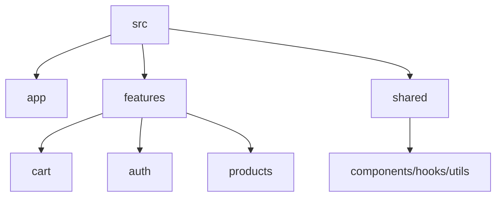

---
title: Folder Structure and Best Practices
slug: day-060-folder-structure-and-best-practices
dayLabel: Day 60
level: Advanced
estimatedMinutes: 30
order: 60
track: react
---
---
title: Folder Structure and Best Practices
slug: day-060-folder-structure-and-best-practices
dayLabel: Day 60
level: Advanced
estimatedMinutes: 30
order: 60
track: react
---
# Day 60 [Advanced]: Folder Structure and Best Practices

## Goal

Design maintainable React project architecture using feature-based folders and practical engineering best practices. The goal is not to find one universally correct folder tree, but to establish clear ownership, predictable imports, and boundaries that continue to work as the application grows.

## Prerequisites

- Day 59 completed
- Experience with mini projects from this curriculum

## Explanation

Strong folder architecture reduces technical debt, improves onboarding, and helps projects scale across teams. A good structure should make it easy to answer three questions: **who owns this code, who can depend on it, and where should new code go?**

Folder structure is an architectural tool, not a substitute for good module boundaries. A small application may not need many folders, while a large application benefits from explicit feature ownership and carefully controlled shared code.

## Topic by Topic

### Topic 1: Folder Strategy Options

Theory:
Two common styles are type-based and feature-based structures. Type-based structures group files such as `components`, `hooks`, and `utils`; feature-based structures group code by business capability such as `cart`, `auth`, and `products`.

Practical:
Compare both and choose feature-first for scale when related UI, state, API code, and tests need to evolve together.

Code Example:

```text
src/
  features/
    cart/
      components/
      hooks/
      cartSlice.js
      selectors.js
      cart.test.js
```

**Explanation:** Feature-first organization keeps changes for one business capability close together. It reduces the need to navigate across many global type folders when implementing or debugging one feature. For a very small application, however, a simpler structure can be more appropriate.

**Key Points:**

- Understand the core idea of Folder Strategy Options.
- Choose structure based on application size and ownership boundaries.
- Keep related feature code close together.
- Avoid creating folders simply because a template contains them.

### Topic 2: Feature Module Boundaries

Theory:
Each feature should own its UI, hooks, state, and tests where appropriate. A feature should expose a small public surface instead of allowing every other module to import its internal implementation details.

Practical:
Create module folders for auth, cart, products and define which components, hooks, selectors, and services are intended for external use.

Code Example:

```text
features/
  auth/
    components/
    hooks/
    authApi.js
    index.js
  products/
    components/
    productsApi.js
    index.js
```

A useful rule is: **feature internals stay private unless another feature genuinely needs them**. This makes future refactoring safer.

**Explanation:** This topic explains Feature Module Boundaries in a practical way so you can apply it confidently in real React projects. Clear boundaries reduce accidental coupling and make ownership visible to the team.

**Key Points:**

- Understand the core idea of Feature Module Boundaries.
- Apply the pattern using clean, readable code.
- Keep feature internals private by default.
- Expose only stable APIs that other modules actually need.

### Topic 3: Shared Layer Design

Theory:
Shared utilities and UI primitives should be centralized only when they are genuinely cross-feature. The shared layer should not become a dumping ground for code whose ownership is unclear.

Practical:
Use `shared/components`, `shared/utils`, `shared/hooks` for reusable, feature-independent code.

Code Example:

```text
shared/
  components/
    Button.jsx
  hooks/
    useDebounce.js
  utils/
    formatCurrency.js
```

A `CartSummary` component that only makes sense for the cart feature belongs in `features/cart`, not in `shared/components`. Promote code to shared when there is a clear reuse case and the abstraction is stable.

**Explanation:** This topic explains Shared Layer Design in a practical way so you can apply it confidently in real React projects. Good shared layers reduce duplication without hiding business-specific behavior behind vague abstractions.

**Key Points:**

- Understand the core idea of Shared Layer Design.
- Apply the pattern using clean, readable code.
- Share stable, feature-independent code.
- Avoid premature abstractions and generic dumping folders.

### Topic 4: Naming and Import Conventions

Theory:
Consistent naming reduces confusion and import chaos. Import direction should also be predictable: application composition can depend on features, while shared utilities should not depend on feature-specific modules.

Practical:
Adopt explicit file names and index exports where they improve the public API of a feature.

Code Example:

```text
features/
  cart/
    components/
      CartList.jsx
    cartSlice.js
    selectors.js
    index.js
```

Example public export:

```jsx
// features/cart/index.js
export { default as cartReducer } from "./cartSlice";
export { selectCartTotal } from "./selectors";
```

Use barrel files deliberately. Large or deeply nested barrel chains can hide dependencies and may contribute to circular-import problems, so direct imports can be preferable for internal implementation files.

**Explanation:** This topic explains Naming and Import Conventions in a practical way so you can apply it confidently in real React projects. Consistency matters more than a particular naming style; choose one convention and apply it across the repository.

**Key Points:**

- Understand the core idea of Naming and Import Conventions.
- Apply the pattern using clean, readable code.
- Keep import direction predictable.
- Use barrel exports as intentional public module boundaries.

### Topic 5: Documentation and Onboarding

Theory:
README and architecture docs enable faster team ramp-up. Documentation should explain decisions and workflows rather than merely repeating the folder names.

Practical:
Document structure, scripts, module ownership, development commands, testing expectations, and important architectural rules.

Code Example:

```md
## Project Structure

- `app/` - application composition and providers
- `features/` - business/domain modules
- `shared/` - feature-independent reusable code

## Conventions

- Keep feature-specific code inside its feature.
- Avoid feature-to-feature imports unless the dependency is intentional.
- Run tests and linting before opening a pull request.
```

**Explanation:** This topic explains Documentation and Onboarding in a practical way so you can apply it confidently in real React projects. Good documentation should help a new developer make the correct change without needing to reverse-engineer the entire codebase.

**Key Points:**

- Understand the core idea of Documentation and Onboarding.
- Apply the pattern using clean, readable documentation.
- Document architectural decisions and development workflows.
- Keep documentation close to the conventions it describes.

### Topic 6: Production Guardrails for Folder Structure and Best Practices

Theory:
At this stage, strong engineering comes from repeatable quality checks that prevent regressions in state flow, edge cases, and maintainability. Folder conventions should be supported by tooling and review practices rather than relying only on developer memory.

Practical:
Define a short review checklist for this topic that verifies module ownership, import direction, fallback behavior, test placement, and readability before merge.

Code Example:

```text
Architecture review checklist

[ ] New code has a clear feature owner
[ ] Shared code is genuinely reusable
[ ] Imports do not create unintended dependency cycles
[ ] Feature internals are not unnecessarily exposed
[ ] Tests live close to the behavior they verify
[ ] README/architecture notes are updated when conventions change
```

**Explanation:** This topic explains Production Guardrails for Folder Structure and Best Practices in a practical way so you can apply it confidently in real React projects. The objective is to make architectural quality repeatable during code review and CI, not dependent on individual memory.

**Key Points:**

- Understand the core idea of Production Guardrails for Folder Structure and Best Practices.
- Apply the pattern using clean, readable code.
- Use review and tooling to prevent architectural drift.
- Prefer simple, enforceable conventions over excessive rules.

## Key Concepts

- Feature-first architecture
- Module boundaries and ownership
- Shared layer conventions
- Import and naming consistency
- Documentation-driven scalability
- Dependency direction and circular-import prevention
- Public feature APIs and encapsulation
- Quality guardrail mindset

## Visual Concept Map



## End-to-End Practical

1. Choose one mini project for refactor.
2. Design target feature-based structure.
3. Define ownership and dependency direction before moving files.
4. Move files by module ownership.
5. Update imports and index exports.
6. Check for accidental circular dependencies and unnecessary cross-feature imports.
7. Update README with architecture notes.
8. Run tests and linting after the refactor to catch broken imports or behavior.

## Hands-on Coding

### Example 1: Case - Feature-based Refactor Map

Scenario:
A shopping app currently mixes all files in one folder and needs scalable separation.

```text
src/
	app/
		store.js
		providers.jsx
	features/
		cart/
			components/
			cartSlice.js
			selectors.js
		products/
			components/
			productsApi.js
	shared/
		components/
		hooks/
		utils/
```

The important part is ownership, not the exact number of subfolders. If a feature has only two files, do not create five empty directories just to match a template.

### Example 2: Case - Barrel Export per Feature

Scenario:
A team wants simpler imports from each feature package.

```jsx
// features/cart/index.js
export { default as cartReducer } from "./cartSlice";
export * from "./selectors";
```

Consumers can import from the feature's public entry point while implementation files remain private. Use this pattern selectively and watch for circular dependencies in large barrel trees.

### Example 3: Case - README Architecture Section

Scenario:
New contributors should understand project modules and conventions quickly.

```md
## Architecture

- `app/`: store, providers, root composition
- `features/`: domain modules with local state and UI
- `shared/`: reusable cross-feature code

## Dependency Rule

- `shared` must not depend on feature-specific code.
- Features should avoid importing another feature's internal files.
- `app` composes features and application-wide providers.
```

## Mini Exercise

Scenario:
You are preparing your Day 56 shopping cart mini project for portfolio.

Refactor into feature-based structure (`cart`, `products`, `auth`), create shared UI folder, and update README architecture section. Before considering the refactor complete, document ownership and check that shared code does not depend on a feature.

Expected output:

- Project folders reflect domain ownership
- Imports are cleaner and more predictable
- README clearly explains project structure
- Feature-to-feature dependencies are intentional
- No obvious circular dependency is introduced

## Assessment Quiz

### Quiz Questions

1. Why does feature-based architecture scale better?
2. What belongs in shared folder?
3. True or False: All app logic should be placed in one `utils` folder.
4. Why use index/barrel exports cautiously?
5. What documentation is essential after major refactor?
6. Why should shared code generally avoid importing feature-specific modules?
7. Where should a component that is specific to the cart domain normally live?
8. What is one practical way to prevent architectural drift?

### Quiz Answers

1. Related files stay co-located and easier to maintain, while domain ownership makes changes easier to locate.
2. Reusable cross-feature components, hooks, and utilities that have stable, feature-independent behavior.
3. False. A large generic `utils` folder often hides ownership and can become a dumping ground.
4. They simplify imports but can hide dependency relationships and contribute to circular dependency problems when overused.
5. README architecture, important conventions, development scripts, and any dependency/ownership rules introduced by the refactor.
6. Otherwise the supposedly shared layer becomes coupled to one business domain and cannot safely be reused by other features.
7. Inside the relevant feature, for example `features/cart/components/CartSummary.jsx`.
8. Combine documented conventions with code review, linting/dependency checks, tests, and periodic refactoring.

## Task

- Refactor one mini project into feature-based structure
- Add architecture notes to README
- Define clear feature ownership and dependency direction
- Check for unnecessary circular or cross-feature dependencies
- Complete mini exercise

## Self Check

- You can design scalable React folder architecture
- You can enforce maintainable project conventions
- You can distinguish shared code from feature-specific code
- You can explain dependency direction and module ownership
- You can answer at least 6 out of 8 quiz questions correctly

## Interview Questions and Answers

### Beginner

**Question:** What is feature-based folder structure?

**Answer:** Organizing files by business/domain features rather than file types. For example, cart-related UI, state, hooks, and tests are kept under a cart feature.

**Question:** Why maintain clear folder conventions?

**Answer:** They make code easier to locate, clarify ownership, reduce accidental coupling, and improve team collaboration.

### Middle

**Question:** What is a common anti-pattern in project structure?

**Answer:** Dumping unrelated files in a single folder without domain boundaries, or creating broad `utils` and `components` folders that become difficult to own.

**Question:** How does shared layer reduce duplication?

**Answer:** Common feature-independent behavior is centralized and reused across features. The key is to share stable abstractions rather than moving every reusable-looking file into `shared` prematurely.

### Advanced

**Question:** How can architecture decisions affect delivery speed?

**Answer:** Clean boundaries reduce the number of unrelated files a developer must understand for a change, reduce merge conflicts, and make ownership clearer. Poor boundaries create cross-feature coupling that slows changes.

**Question:** How do you prevent architectural drift over time?

**Answer:** Document conventions, enforce linting/code-review rules where practical, test dependency boundaries, and refactor proactively when repeated exceptions appear.

**Question:** How would you decide whether code belongs in `shared` or inside a feature?

**Answer:** Start with the feature unless the code is clearly feature-independent and has a stable reuse case. Shared code should not require knowledge of one business domain to function correctly.

## Day 60 Outcome

- You can architect and refactor React projects for long-term scale
- You can present portfolio-ready structure and engineering standards
- You can explain feature ownership, shared boundaries, and dependency direction
- You can use practical guardrails to prevent architectural drift
- You have completed a complete beginner-to-advanced React learning arc
