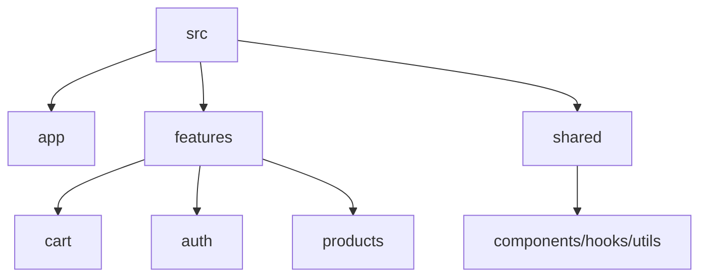

---
title: Folder Structure and Best Practices
slug: day-060-folder-structure-and-best-practices
dayLabel: Day 60
level: Advanced
estimatedMinutes: 30
order: 60
track: react
---
# Day 60 [Advanced]: Folder Structure and Best Practices

## Index

- [Goal](#goal)
- [Prerequisites](#prerequisites)
- [Explanation](#explanation)
- [Topic by Topic](#topic-by-topic)
- [Key Concepts](#key-concepts)
- [Visual Concept Map](#visual-concept-map)
- [End-to-End Practical](#end-to-end-practical)
- [Hands-on Coding](#hands-on-coding)
- [Mini Exercise](#mini-exercise)
- [Assessment Quiz](#assessment-quiz)
- [Task](#task)
- [Self Check](#self-check)
- [Interview Questions and Answers](#interview-questions-and-answers)
- [Day 60 Outcome](#day-60-outcome)

## Goal

Design maintainable React project architecture using feature-based folders and practical engineering best practices.

## Prerequisites

- Day 59 completed
- Experience with mini projects from this curriculum

## Explanation

Strong folder architecture reduces technical debt, improves onboarding, and helps projects scale across teams.

## Topic by Topic

### Topic 1: Folder Strategy Options

Theory:
Two common styles are type-based and feature-based structures.

Practical:
Compare both and choose feature-first for scale.

Code Example:

```jsx
features / cart / components / CartList.jsx;
```

**Explanation:** This topic explains Folder Strategy Options in a practical way so you can apply it confidently in real React projects.

**Key Points:**

- Understand the core idea of Folder Strategy Options.
- Apply the pattern using clean, readable code.
- Avoid common mistakes through predictable React flow.

### Topic 2: Feature Module Boundaries

Theory:
Each feature should own its UI, hooks, state, and tests.

Practical:
Create module folders for auth, cart, products.

Code Example:

```jsx
features/auth/
features/products/
```

**Explanation:** This topic explains Feature Module Boundaries in a practical way so you can apply it confidently in real React projects.

**Key Points:**

- Understand the core idea of Feature Module Boundaries.
- Apply the pattern using clean, readable code.
- Avoid common mistakes through predictable React flow.

### Topic 3: Shared Layer Design

Theory:
Shared utilities and UI primitives should be centralized.

Practical:
Use `shared/components`, `shared/utils`, `shared/hooks`.

Code Example:

```jsx
shared / components / Button.jsx;
```

**Explanation:** This topic explains Shared Layer Design in a practical way so you can apply it confidently in real React projects.

**Key Points:**

- Understand the core idea of Shared Layer Design.
- Apply the pattern using clean, readable code.
- Avoid common mistakes through predictable React flow.

### Topic 4: Naming and Import Conventions

Theory:
Consistent naming reduces confusion and import chaos.

Practical:
Adopt explicit file names and index exports.

Code Example:

```jsx
features / cart / index.js;
```

**Explanation:** This topic explains Naming and Import Conventions in a practical way so you can apply it confidently in real React projects.

**Key Points:**

- Understand the core idea of Naming and Import Conventions.
- Apply the pattern using clean, readable code.
- Avoid common mistakes through predictable React flow.

### Topic 5: Documentation and Onboarding

Theory:
README and architecture docs enable faster team ramp-up.

Practical:
Document structure, scripts, and module ownership.

Code Example:

```md
## Project Structure
```

**Explanation:** This topic explains Documentation and Onboarding in a practical way so you can apply it confidently in real React projects.

**Key Points:**

- Understand the core idea of Documentation and Onboarding.
- Apply the pattern using clean, readable code.
- Avoid common mistakes through predictable React flow.

### Topic 6: Production Guardrails for Folder Structure and Best Practices

Theory:
At this stage, strong engineering comes from repeatable quality checks that prevent regressions in state flow, edge cases, and maintainability.

Practical:
Define a short review checklist for this topic that verifies correctness, fallback behavior, and readability before merge.

Code Example:

`jsx
// Add a checklist step before release for this feature area.
`
**Explanation:** This topic explains Production Guardrails for Folder Structure and Best Practices in a practical way so you can apply it confidently in real React projects.

**Key Points:**

- Understand the core idea of Production Guardrails for Folder Structure and Best Practices.
- Apply the pattern using clean, readable code.
- Avoid common mistakes through predictable React flow.

## Key Concepts

- Feature-first architecture
- Module boundaries and ownership
- Shared layer conventions
- Import and naming consistency
- Documentation-driven scalability

- Quality guardrail mindset

## Visual Concept Map



## End-to-End Practical

1. Choose one mini project for refactor.
2. Design target feature-based structure.
3. Move files by module ownership.
4. Update imports and index exports.
5. Update README with architecture notes.

## Hands-on Coding

### Example 1: Case - Feature-based Refactor Map

Scenario:
A shopping app currently mixes all files in one folder and needs scalable separation.

```text
src/
	app/
		store.js
		providers.jsx
	features/
		cart/
			components/
			cartSlice.js
			selectors.js
		products/
			components/
			productsApi.js
	shared/
		components/
		hooks/
		utils/
```

### Example 2: Case - Barrel Export per Feature

Scenario:
A team wants simpler imports from each feature package.

```jsx
// features/cart/index.js
export { default as cartReducer } from "./cartSlice";
export * from "./selectors";
```

### Example 3: Case - README Architecture Section

Scenario:
New contributors should understand project modules and conventions quickly.

```md
## Architecture

- `app/`: store, providers, root composition
- `features/`: domain modules with local state and UI
- `shared/`: reusable cross-feature code
```

## Mini Exercise

Scenario:
You are preparing your Day 56 shopping cart mini project for portfolio.

Refactor into feature-based structure (`cart`, `products`, `auth`), create shared UI folder, and update README architecture section.

Expected output:

- Project folders reflect domain ownership
- Imports are cleaner and more predictable
- README clearly explains project structure

## Assessment Quiz

### Quiz Questions

1. Why does feature-based architecture scale better?
2. What belongs in shared folder?
3. True or False: All app logic should be placed in one `utils` folder.
4. Why use index/barrel exports cautiously?
5. What documentation is essential after major refactor?

### Quiz Answers

1. Related files stay co-located and easier to maintain
2. Reusable cross-feature components, hooks, and utilities
3. False
4. They simplify imports but should avoid circular dependency confusion
5. README architecture and conventions guide

## Task

- Refactor one mini project into feature-based structure
- Add architecture notes to README
- Complete mini exercise

## Self Check

- You can design scalable React folder architecture
- You can enforce maintainable project conventions
- You can answer at least 4 out of 5 quiz questions correctly

## Interview Questions and Answers

### Beginner

**Question:** What is feature-based folder structure?

**Answer:** Organizing files by business/domain features rather than file types.

**Question:** Why maintain clear folder conventions?

**Answer:** Easier navigation and team collaboration.

### Middle

**Question:** What is a common anti-pattern in project structure?

**Answer:** Dumping unrelated files in a single folder without domain boundaries.

**Question:** How does shared layer reduce duplication?

**Answer:** Common code is centralized and reused across features.

### Advanced

**Question:** How can architecture decisions affect delivery speed?

**Answer:** Clean boundaries reduce change impact and speed up development.

**Question:** How do you prevent architectural drift over time?

**Answer:** Document conventions, enforce linting/code review rules, and refactor proactively.

## Day 60 Outcome

- You can architect and refactor React projects for long-term scale
- You can present portfolio-ready structure and engineering standards
- You have completed a complete beginner-to-advanced React learning arc

