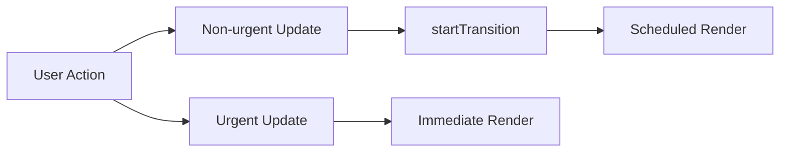

---
title: React 18+ Rendering Model
slug: day-061-react-18-rendering-model
dayLabel: Day 61
level: Advanced
estimatedMinutes: 30
order: 61
track: react
---
# Day 61 [Advanced]: React 18+ Rendering Model

## Index

- [Goal](#goal)
- [Prerequisites](#prerequisites)
- [Explanation](#explanation)
- [Topic by Topic](#topic-by-topic)
- [Key Concepts](#key-concepts)
- [Visual Concept Map](#visual-concept-map)
- [End-to-End Practical](#end-to-end-practical)
- [Hands-on Coding](#hands-on-coding)
- [Mini Exercise](#mini-exercise)
- [Assessment Quiz](#assessment-quiz)
- [Task](#task)
- [Self Check](#self-check)
- [Interview Questions and Answers](#interview-questions-and-answers)
- [Day 61 Outcome](#day-61-outcome)

## Goal

Understand how React 18+ renders updates with automatic batching, priorities, and concurrent scheduling behavior.

## Prerequisites

- Day 60 completed
- Strong comfort with state updates and event handling

## Explanation

React 18 introduced a rendering model that can prioritize urgent updates, batch more updates automatically, and keep interfaces responsive during heavy work.

## Topic by Topic

### Topic 1: Automatic Batching

Theory:
React batches multiple state updates into fewer renders, even in async contexts.

Practical:
Test multiple setState calls inside timeout/promise.

Code Example:

```jsx
setCount((c) => c + 1);
setFlag((f) => !f);
```

**Explanation:** This topic explains Automatic Batching in a practical way so you can apply it confidently in real React projects.

**Key Points:**

- Understand the core idea of Automatic Batching.
- Apply the pattern using clean, readable code.
- Avoid common mistakes through predictable React flow.

### Topic 2: Urgent vs Non-urgent Updates

Theory:
User typing/clicking should stay urgent; heavy recalculation can be lower priority.

Practical:
Separate immediate input update from expensive list update.

Code Example:

```jsx
setQuery(value); // urgent
startTransition(() => setFiltered(...)); // non-urgent
```

**Explanation:** This topic explains Urgent vs Non-urgent Updates in a practical way so you can apply it confidently in real React projects.

**Key Points:**

- Understand the core idea of Urgent vs Non-urgent Updates.
- Apply the pattern using clean, readable code.
- Avoid common mistakes through predictable React flow.

### Topic 3: Rendering Interruptibility

Theory:
Concurrent rendering can pause/restart work to keep UI responsive.

Practical:
Simulate expensive filtering and observe interaction smoothness.

Code Example:

```jsx
const deferredQuery = useDeferredValue(query);
```

**Explanation:** This topic explains Rendering Interruptibility in a practical way so you can apply it confidently in real React projects.

**Key Points:**

- Understand the core idea of Rendering Interruptibility.
- Apply the pattern using clean, readable code.
- Avoid common mistakes through predictable React flow.

### Topic 4: StrictMode Development Behavior

Theory:
StrictMode may double-invoke render/effects in dev to reveal unsafe patterns.

Practical:
Audit effect cleanup and idempotency.

Code Example:

```jsx
useEffect(() => {
  subscribe();
  return unsubscribe;
}, []);
```

**Explanation:** This topic explains StrictMode Development Behavior in a practical way so you can apply it confidently in real React projects.

**Key Points:**

- Understand the core idea of StrictMode Development Behavior.
- Apply the pattern using clean, readable code.
- Avoid common mistakes through predictable React flow.

### Topic 5: Migration Mindset

Theory:
Most apps work without changes, but heavy screens benefit from priority-aware updates.

Practical:
Pick one slow page and classify urgent vs non-urgent updates.

Code Example:

```jsx
// Urgent: input value, focus
// Deferred: expensive derivation
```

**Explanation:** This topic explains Migration Mindset in a practical way so you can apply it confidently in real React projects.

**Key Points:**

- Understand the core idea of Migration Mindset.
- Apply the pattern using clean, readable code.
- Avoid common mistakes through predictable React flow.

### Topic 6: Reliability Patterns for React 18+ Rendering Model

Theory:
Advanced apps need reliable rendering and data workflows that stay stable under retries, loading delays, and test scenarios.

Practical:
Add a failure-path test and one monitoring signal so this topic is validated beyond the happy path.

Code Example:

`jsx
// Validate happy path and failure path for production reliability.
`
**Explanation:** This topic explains Reliability Patterns for React 18+ Rendering Model in a practical way so you can apply it confidently in real React projects.

**Key Points:**

- Understand the core idea of Reliability Patterns for React 18+ Rendering Model.
- Apply the pattern using clean, readable code.
- Avoid common mistakes through predictable React flow.

## Key Concepts

- Automatic batching beyond event handlers
- Update priority model
- Concurrent rendering behavior
- StrictMode dev checks
- Performance-oriented migration strategy

- Reliability-first implementation

## Visual Concept Map



## End-to-End Practical

1. Create heavy searchable list screen.
2. Implement naive filtering on each keypress.
3. Add transition/deferred strategies.
4. Compare responsiveness before/after.
5. Document render behavior observations.

## Hands-on Coding

### Example 1: Case - Automatic Batching in Async Callback

Scenario:
In a notifications panel, two states update after an API response and should cause one render pass.

```jsx
function AsyncBatchDemo() {
  const [count, setCount] = React.useState(0);
  const [status, setStatus] = React.useState("idle");

  const run = () => {
    Promise.resolve().then(() => {
      setCount((c) => c + 1);
      setStatus("done");
    });
  };

  return (
    <button onClick={run}>
      Run ({count}) - {status}
    </button>
  );
}
```

### Example 2: Case - Urgent Input + Non-urgent Filter

Scenario:
A product search should keep typing smooth while filtering a large list.

```jsx
import { useState, useTransition } from "react";

function SearchPage({ products }) {
  const [query, setQuery] = useState("");
  const [visible, setVisible] = useState(products);
  const [isPending, startTransition] = useTransition();

  const onChange = (e) => {
    const value = e.target.value;
    setQuery(value);
    startTransition(() => {
      setVisible(
        products.filter((p) =>
          p.name.toLowerCase().includes(value.toLowerCase()),
        ),
      );
    });
  };

  return (
    <div>
      <input value={query} onChange={onChange} />
      {isPending && <p>Updating results...</p>}
      <p>Results: {visible.length}</p>
    </div>
  );
}
```

### Example 3: Case - Deferred Query Rendering

Scenario:
A candidate directory delays expensive rendering until input settles.

```jsx
import { useDeferredValue } from "react";

function Directory({ candidates, query }) {
  const deferredQuery = useDeferredValue(query);
  const filtered = React.useMemo(() => {
    return candidates.filter((c) =>
      c.name.toLowerCase().includes(deferredQuery.toLowerCase()),
    );
  }, [candidates, deferredQuery]);

  return <p>Matched Candidates: {filtered.length}</p>;
}
```

## Mini Exercise

Scenario:
You are improving a CRM contacts screen that freezes while typing.

Split updates into urgent and non-urgent flows, then compare behavior with and without transition/deferred value.

Expected output:

- Typing remains responsive
- Heavy list updates occur without UI jank
- Clear explanation of rendering priority decisions

## Assessment Quiz

### Quiz Questions

1. What is automatic batching in React 18?
2. Why classify updates into urgent and non-urgent?
3. True or False: startTransition should wrap every state update.
4. What is useDeferredValue useful for?
5. Why can StrictMode show double execution in development?

### Quiz Answers

1. Grouping multiple updates into fewer renders, including async contexts
2. To keep critical interactions responsive
3. False
4. Deferring expensive updates based on changing input
5. To detect side-effect bugs and unsafe patterns

## Task

- Build batching demo for sync vs async updates
- Add one urgent vs non-urgent update split in a heavy screen
- Complete mini exercise

## Self Check

- You can explain React 18 rendering priorities
- You can apply transition/deferred techniques correctly
- You can answer at least 4 out of 5 quiz questions correctly

## Interview Questions and Answers

### Beginner

**Question:** What changed in React 18 rendering model?

**Answer:** Better scheduling and broader automatic batching.

**Question:** What is the purpose of startTransition?

**Answer:** Mark non-urgent updates so urgent interactions stay fast.

### Middle

**Question:** How do you decide whether an update is urgent?

**Answer:** If it directly affects immediate user interaction like typing/clicking, it is urgent.

**Question:** When would you use useDeferredValue?

**Answer:** For expensive derived UI tied to fast-changing input.

### Advanced

**Question:** Why can concurrent rendering restart work?

**Answer:** React may interrupt low-priority rendering to process urgent updates first.

**Question:** What migration risk appears when relying on effect side effects?

**Answer:** StrictMode may expose non-idempotent logic through repeated invokes in development.

## Day 61 Outcome

- You can reason about React 18+ rendering behavior practically
- You can keep UX responsive with update prioritization
- You are ready for async loading orchestration in Day 62

