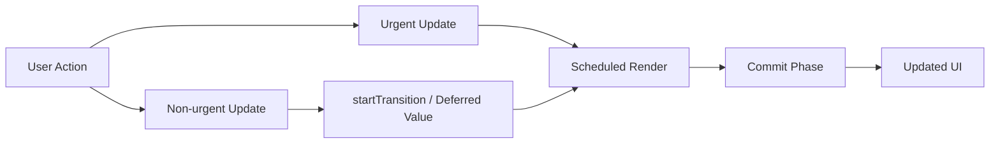

---
title: React 18+ Rendering Model
slug: day-061-react-18-rendering-model
dayLabel: Day 61
level: Advanced
estimatedMinutes: 30
order: 61
track: react
---
---
title: React 18+ Rendering Model
slug: day-061-react-18-rendering-model
dayLabel: Day 61
level: Advanced
estimatedMinutes: 30
order: 61
track: react
---
# Day 61 [Advanced]: React 18+ Rendering Model

## Goal

Understand how React 18+ renders updates with automatic batching, priorities, and concurrent scheduling behavior. You should also be able to distinguish **rendering work from committing DOM changes**, identify when an update is urgent, and use transitions/deferred values only when measurement shows they improve the user experience.

## Prerequisites

- Day 60 completed
- Strong comfort with state updates and event handling
- Basic understanding of hooks and component rendering

## Explanation

React 18 introduced a rendering model that can prioritize urgent updates, batch more updates automatically, and keep interfaces responsive during heavy work. Concurrent rendering does not mean that JavaScript runs on multiple threads. Instead, React can schedule rendering work, pause or abandon unfinished work, and continue with a more important update before committing the final result.

A useful mental model is:

```text
State / props change
      ↓
React schedules update
      ↓
Render phase calculates the next UI
      ↓
Work may be prioritized, interrupted, or restarted
      ↓
Commit phase applies the accepted result
      ↓
Browser paints the updated UI
```

The render phase should remain free of side effects. Effects and DOM synchronization belong to the appropriate post-commit lifecycle. This distinction becomes especially important when React development checks or concurrent scheduling cause render logic to execute more than once.

## Topic by Topic

### Topic 1: Automatic Batching

Theory:
React batches multiple state updates into fewer renders. In React 18 with a modern root created by `createRoot`, batching also applies to updates originating from promises, timeouts, and other asynchronous callbacks.

Practical:
Test multiple state updates inside a promise or timeout and observe that React can process them together rather than committing after every individual update.

Code Example:

```jsx
import { useState } from "react";

function AsyncBatchDemo() {
  const [count, setCount] = useState(0);
  const [status, setStatus] = useState("idle");

  const run = () => {
    Promise.resolve().then(() => {
      setCount((c) => c + 1);
      setStatus("done");
    });
  };

  return (
    <button onClick={run}>
      Run ({count}) - {status}
    </button>
  );
}
```

Use functional state updates when the next value depends on the previous value. Batching is an implementation detail that reduces unnecessary commits; it should not be used as a reason to assume that state changes are immediately visible inside the same event handler.

**Explanation:** This topic explains Automatic Batching in a practical way so you can apply it confidently in real React projects. Batching improves efficiency, but it does not change the basic rule that state updates schedule a future render rather than mutating the current render's state variable.

**Key Points:**

- Understand the core idea of Automatic Batching.
- React 18 broadens automatic batching for async updates when using the modern root API.
- Use functional updates when the next state depends on previous state.
- Do not rely on immediate state mutation after calling a setter.

### Topic 2: Urgent vs Non-urgent Updates

Theory:
User typing, clicking, and focus changes generally need a fast response. Expensive derived UI can be marked as non-urgent so React can keep more important interactions responsive.

Practical:
Separate the immediate input update from an expensive list update with `useTransition`.

Code Example:

```jsx
import { useState, useTransition } from "react";

function Search({ products }) {
  const [query, setQuery] = useState("");
  const [filtered, setFiltered] = useState(products);
  const [isPending, startTransition] = useTransition();

  const handleChange = (event) => {
    const value = event.target.value;

    setQuery(value); // urgent

    startTransition(() => {
      setFiltered(
        products.filter((product) =>
          product.name.toLowerCase().includes(value.toLowerCase()),
        ),
      ); // non-urgent
    });
  };

  return (
    <>
      <input value={query} onChange={handleChange} />
      {isPending && <p>Updating results...</p>}
      <p>{filtered.length} results</p>
    </>
  );
}
```

A transition does not make expensive JavaScript itself faster. It changes the priority of the resulting React update so urgent work has a better chance to be processed first. Measure the real bottleneck before adding transitions.

**Explanation:** This topic explains Urgent vs Non-urgent Updates in a practical way so you can apply it confidently in real React projects. The important skill is classifying updates by user experience rather than blindly marking expensive code as a transition.

**Key Points:**

- Understand the core idea of Urgent vs Non-urgent Updates.
- Keep direct user interaction updates urgent.
- Use `startTransition` for non-urgent UI updates when appropriate.
- A transition changes scheduling priority; it does not optimize the underlying algorithm.

### Topic 3: Rendering Interruptibility

Theory:
Concurrent rendering allows React to work on an update without requiring every unit of rendering work to finish before another higher-priority update can be considered. React may pause, restart, or discard unfinished render work before committing it.

Practical:
Simulate expensive filtering and observe whether a transition or deferred value improves interaction responsiveness.

Code Example:

```jsx
import { useDeferredValue, useMemo } from "react";

function Results({ items, query }) {
  const deferredQuery = useDeferredValue(query);

  const filteredItems = useMemo(() => {
    const normalized = deferredQuery.trim().toLowerCase();
    return items.filter((item) =>
      item.name.toLowerCase().includes(normalized),
    );
  }, [items, deferredQuery]);

  return <p>{filteredItems.length} matches</p>;
}
```

`useDeferredValue` lets a value used by a non-urgent part of the UI lag behind the latest value. The input can remain responsive while the expensive result UI catches up. It is not a debounce: React may render intermediate values, and the deferred value is still eventually updated.

**Explanation:** This topic explains Rendering Interruptibility in a practical way so you can apply it confidently in real React projects. Interruptibility is about scheduling and responsiveness, not about guaranteeing that rendering always finishes in smaller chunks.

**Key Points:**

- Understand the core idea of Rendering Interruptibility.
- Concurrent rendering can pause or abandon unfinished render work.
- Keep render logic pure because React may execute render work more than once.
- `useDeferredValue` is different from debouncing and throttling.

### Topic 4: StrictMode Development Behavior

Theory:
StrictMode enables additional development-only checks. With React 18, an effect may appear to run, clean up, and run again during development so missing cleanup and non-idempotent logic become easier to detect. This behavior is not a production double-request guarantee.

Practical:
Audit subscriptions, timers, event listeners, and other effects so setup is paired with reliable cleanup.

Code Example:

```jsx
import { useEffect } from "react";

function OnlineStatus() {
  useEffect(() => {
    const handleOnline = () => {
      console.log("online");
    };

    window.addEventListener("online", handleOnline);

    return () => {
      window.removeEventListener("online", handleOnline);
    };
  }, []);

  return <p>Listening for network status changes</p>;
}
```

Do not “fix” StrictMode by adding flags that suppress legitimate effect execution. Instead, make effects resilient: create the resource in setup and release it in cleanup.

**Explanation:** This topic explains StrictMode Development Behavior in a practical way so you can apply it confidently in real React projects. StrictMode is a development aid for discovering unsafe assumptions; production behavior should still be designed around correct effect lifecycle management.

**Key Points:**

- Understand the core idea of StrictMode Development Behavior.
- Treat effect setup and cleanup as a pair.
- Do not use global flags to hide lifecycle problems.
- Development-only StrictMode behavior should not be mistaken for production behavior.

### Topic 5: Migration Mindset

Theory:
Most applications do not need a complete rewrite to benefit from React 18's rendering capabilities. Start with user-visible bottlenecks, classify updates, measure them, and introduce concurrent features where they solve a real problem.

Practical:
Pick one slow page and classify its updates as urgent, non-urgent, or unnecessary. Measure before and after the change.

Code Example:

```jsx
// Urgent: input value, focus, selected button state
setQuery(value);

// Non-urgent: expensive result rendering
startTransition(() => {
  setResults(buildResults(value));
});
```

Do not automatically wrap every update in a transition. If the work is already cheap, adding scheduling complexity may provide no measurable benefit. First determine whether the bottleneck is rendering, JavaScript computation, network latency, or bundle size.

**Explanation:** This topic explains Migration Mindset in a practical way so you can apply it confidently in real React projects. Performance work is most effective when it starts with measurement and a clearly identified user-facing bottleneck.

**Key Points:**

- Understand the core idea of Migration Mindset.
- Measure before and after performance changes.
- Classify updates according to user experience.
- Do not use concurrency features as a substitute for fixing inefficient algorithms.

### Topic 6: Reliability Patterns for React 18+ Rendering Model

Theory:
Advanced apps need reliable rendering and data workflows that stay stable under retries, loading delays, development checks, and interrupted render work. Components should remain pure during render, and effects should be safe to start and clean up repeatedly.

Practical:
Add a failure-path test and one monitoring signal so this topic is validated beyond the happy path. Also verify that expensive work can be abandoned without leaving external resources in an inconsistent state.

Code Example:

```jsx
function Price({ value }) {
  // Pure render: no subscriptions, mutations, or network calls here.
  return <strong>{new Intl.NumberFormat("en-IN").format(value)}</strong>;
}
```

**Explanation:** This topic explains Reliability Patterns for React 18+ Rendering Model in a practical way so you can apply it confidently in real React projects. Pure rendering and correct effect cleanup make components safer when React schedules or repeats rendering work during development and concurrent updates.

**Key Points:**

- Understand the core idea of Reliability Patterns for React 18+ Rendering Model.
- Keep render functions pure.
- Make effects correctly clean up external resources.
- Validate both success and failure paths.

## Key Concepts

- Automatic batching beyond event handlers
- Update priority model
- Concurrent rendering behavior
- Render phase vs commit phase
- `startTransition` and non-urgent updates
- `useDeferredValue` for deferred UI values
- StrictMode development checks
- Performance-oriented migration strategy
- Pure rendering and reliable effect cleanup
- Measurement before optimization

## Visual Concept Map



## End-to-End Practical

1. Create a heavy searchable list screen.
2. Implement naive filtering on each keypress.
3. Measure responsiveness and identify the actual bottleneck.
4. Add transition/deferred strategies where appropriate.
5. Keep the input update urgent while allowing expensive result rendering to be non-urgent.
6. Compare responsiveness before and after.
7. Verify effects have correct cleanup under StrictMode development checks.
8. Document render behavior observations and the reason for each optimization.

## Hands-on Coding

### Example 1: Case - Automatic Batching in Async Callback

Scenario:
In a notifications panel, two states update after an API response and should be processed together by React when using the React 18 modern root.

```jsx
import { useState } from "react";

function AsyncBatchDemo() {
  const [count, setCount] = useState(0);
  const [status, setStatus] = useState("idle");

  const run = () => {
    Promise.resolve().then(() => {
      setCount((c) => c + 1);
      setStatus("done");
    });
  };

  return (
    <button onClick={run}>
      Run ({count}) - {status}
    </button>
  );
}
```

The important observation is not merely the number of renders. React's batching behavior should be treated as a scheduling optimization; application correctness must not depend on a specific render count.

### Example 2: Case - Urgent Input + Non-urgent Filter

Scenario:
A product search should keep typing smooth while filtering a large list.

```jsx
import { useState, useTransition } from "react";

function SearchPage({ products }) {
  const [query, setQuery] = useState("");
  const [visible, setVisible] = useState(products);
  const [isPending, startTransition] = useTransition();

  const onChange = (e) => {
    const value = e.target.value;
    setQuery(value);

    startTransition(() => {
      setVisible(
        products.filter((p) =>
          p.name.toLowerCase().includes(value.toLowerCase()),
        ),
      );
    });
  };

  return (
    <div>
      <input value={query} onChange={onChange} />
      {isPending && <p>Updating results...</p>}
      <p>Results: {visible.length}</p>
    </div>
  );
}
```

For very large datasets, also consider improving the filtering algorithm, reducing rendered rows, virtualization, or server-side search. A transition is not a replacement for those optimizations.

### Example 3: Case - Deferred Query Rendering

Scenario:
A candidate directory delays expensive rendering until the non-urgent value catches up.

```jsx
import { useDeferredValue, useMemo } from "react";

function Directory({ candidates, query }) {
  const deferredQuery = useDeferredValue(query);

  const filtered = useMemo(() => {
    const normalized = deferredQuery.trim().toLowerCase();
    return candidates.filter((candidate) =>
      candidate.name.toLowerCase().includes(normalized),
    );
  }, [candidates, deferredQuery]);

  return <p>Matched Candidates: {filtered.length}</p>;
}
```

This example demonstrates deferred rendering rather than delayed network requests. If the goal is to reduce API calls, use an appropriate debounce/request strategy instead.

## Mini Exercise

Scenario:
You are improving a CRM contacts screen that freezes while typing.

Split updates into urgent and non-urgent flows, then compare behavior with and without transition/deferred value. Record what actually improved and identify whether JavaScript computation, rendering, or DOM size remains the dominant bottleneck.

Expected output:

- Typing remains responsive
- Heavy list updates occur without unnecessary UI jank
- Clear explanation of rendering priority decisions
- Measurement or profiling evidence supports the chosen optimization

## Assessment Quiz

### Quiz Questions

1. What is automatic batching in React 18?
2. Why classify updates into urgent and non-urgent?
3. True or False: `startTransition` should wrap every state update.
4. What is `useDeferredValue` useful for?
5. Why can StrictMode show repeated effect execution in development?
6. What is the difference between the render phase and commit phase?
7. True or False: `useDeferredValue` is the same as debouncing an input.
8. Why should performance optimizations be measured before and after implementation?

### Quiz Answers

1. Grouping multiple state updates into fewer rendering/commit cycles, including updates from many async contexts when using React 18's modern root.
2. To give direct user interactions a better chance of staying responsive while lower-priority UI work catches up.
3. False. Only updates that are appropriate to treat as non-urgent should be transitioned.
4. It allows a value used by non-urgent UI to lag behind a rapidly changing value so urgent UI can remain responsive.
5. StrictMode intentionally performs additional development checks that can expose missing cleanup and non-idempotent effects.
6. The render phase calculates what the UI should look like; the commit phase applies the accepted result to the host environment such as the DOM.
7. False. Deferred rendering changes React scheduling priority; debouncing delays when a callback or operation starts.
8. Without measurement, an optimization can add complexity without improving the actual bottleneck or user experience.

## Task

- Build a batching demo for sync vs async updates
- Add one urgent vs non-urgent update split in a heavy screen
- Profile the screen before and after the change
- Add correct cleanup for at least one effect
- Complete the mini exercise

## Self Check

- You can explain React 18 rendering priorities
- You can distinguish render and commit phases at a high level
- You can apply transition/deferred techniques correctly
- You understand why StrictMode exposes lifecycle problems in development
- You can explain why concurrency is not the same as multi-threaded JavaScript
- You can answer at least 6 out of 8 quiz questions correctly

## Interview Questions and Answers

### Beginner

**Question:** What changed in the React 18 rendering model?

**Answer:** React 18 introduced broader automatic batching and concurrent rendering capabilities that let React schedule updates with more flexibility while preserving the existing component model.

**Question:** What is the purpose of `startTransition`?

**Answer:** It marks state updates as non-urgent so React can prioritize more important interactions, such as typing or clicking, over expensive result rendering.

### Middle

**Question:** How do you decide whether an update is urgent?

**Answer:** Consider the user's immediate interaction. Input text, focus, selection, and direct feedback generally need to update quickly. Expensive derived lists or secondary visual updates can often be lower priority.

**Question:** When would you use `useDeferredValue`?

**Answer:** When a rapidly changing value drives expensive UI and you want that secondary UI to lag behind slightly while the primary interaction remains responsive. It does not debounce network requests.

### Advanced

**Question:** Why can concurrent rendering restart work?

**Answer:** React may interrupt unfinished low-priority render work when a more important update arrives. It can then continue or restart rendering using the latest state before committing a result. This is why render logic must be pure.

**Question:** What migration risk appears when relying on effect side effects?

**Answer:** Effects with missing cleanup or non-idempotent setup can behave incorrectly when development StrictMode exposes repeated setup/cleanup cycles. The solution is to make the effect lifecycle correct rather than suppressing the extra development check.

**Question:** Does `startTransition` make an expensive algorithm faster?

**Answer:** No. It changes update priority. If filtering takes 500 ms of JavaScript work, the algorithm still needs optimization, virtualization, pagination, memoization, or another appropriate strategy if that work is the real bottleneck.

**Question:** Why is render purity important in concurrent React?

**Answer:** React may start, pause, restart, or discard render work. If rendering performs side effects such as network calls, subscriptions, or mutations, those operations can happen at incorrect times or more than once. Side effects should be coordinated through appropriate lifecycle mechanisms.

## Day 61 Outcome

- You can reason about React 18+ rendering behavior practically
- You can distinguish urgent and non-urgent UI work
- You can use batching, transitions, and deferred values with the correct mental model
- You can write render-pure components and reliable effects
- You are ready for async loading orchestration in Day 62
