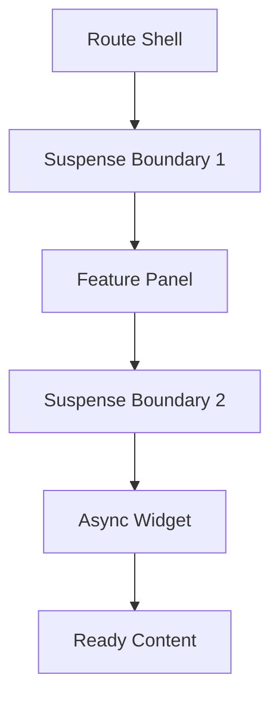

---
title: Suspense and Boundaries
slug: day-062-suspense-and-boundaries
dayLabel: Day 62
level: Advanced
estimatedMinutes: 30
order: 62
track: react
---
# Day 62 [Advanced]: Suspense and Boundaries

## Index

- [Goal](#goal)
- [Prerequisites](#prerequisites)
- [Explanation](#explanation)
- [Topic by Topic](#topic-by-topic)
- [Key Concepts](#key-concepts)
- [Visual Concept Map](#visual-concept-map)
- [End-to-End Practical](#end-to-end-practical)
- [Hands-on Coding](#hands-on-coding)
- [Mini Exercise](#mini-exercise)
- [Assessment Quiz](#assessment-quiz)
- [Task](#task)
- [Self Check](#self-check)
- [Interview Questions and Answers](#interview-questions-and-answers)
- [Day 62 Outcome](#day-62-outcome)

## Goal

Implement Suspense boundaries to deliver structured loading states for lazy and async UI sections.

## Prerequisites

- Day 61 completed
- Familiarity with lazy loading and fallback UI

## Explanation

Suspense lets you define loading boundaries so different parts of UI can load independently and progressively.

## Topic by Topic

### Topic 1: Suspense Basics

Theory:
Suspense shows fallback while child component/code/data is not ready.

Practical:
Wrap lazy-loaded component with boundary.

Code Example:

```jsx
<Suspense fallback={<p>Loading...</p>}>
  <LazyPage />
</Suspense>
```

**Explanation:** This topic explains Suspense Basics in a practical way so you can apply it confidently in real React projects.

**Key Points:**

- Understand the core idea of Suspense Basics.
- Apply the pattern using clean, readable code.
- Avoid common mistakes through predictable React flow.

### Topic 2: Nested Boundaries

Theory:
Nested boundaries provide staged loading rather than full-page blocking.

Practical:
Keep shell visible while deeper module loads.

Code Example:

```jsx
<Suspense fallback={<ShellLoader />}>
  <Layout />
</Suspense>
```

**Explanation:** This topic explains Nested Boundaries in a practical way so you can apply it confidently in real React projects.

**Key Points:**

- Understand the core idea of Nested Boundaries.
- Apply the pattern using clean, readable code.
- Avoid common mistakes through predictable React flow.

### Topic 3: Suspense + Lazy Routes

Theory:
Route-level splitting can improve first paint and navigation experience.

Practical:
Use lazy import for route components.

Code Example:

```jsx
const AdminPage = lazy(() => import("./AdminPage"));
```

**Explanation:** This topic explains Suspense + Lazy Routes in a practical way so you can apply it confidently in real React projects.

**Key Points:**

- Understand the core idea of Suspense + Lazy Routes.
- Apply the pattern using clean, readable code.
- Avoid common mistakes through predictable React flow.

### Topic 4: Boundary UX Design

Theory:
Fallback should match feature context and perceived progress.

Practical:
Use skeletons/placeholders instead of generic spinners everywhere.

Code Example:

```jsx
fallback={<ProductGridSkeleton />}
```

**Explanation:** This topic explains Boundary UX Design in a practical way so you can apply it confidently in real React projects.

**Key Points:**

- Understand the core idea of Boundary UX Design.
- Apply the pattern using clean, readable code.
- Avoid common mistakes through predictable React flow.

### Topic 5: Error vs Loading Boundaries

Theory:
Suspense handles waiting; Error Boundary handles failure.

Practical:
Compose both for robust async UI.

Code Example:

```jsx
<ErrorBoundary>
  <Suspense fallback={<p>Loading...</p>}>
    <Widget />
  </Suspense>
</ErrorBoundary>
```

**Explanation:** This topic explains Error vs Loading Boundaries in a practical way so you can apply it confidently in real React projects.

**Key Points:**

- Understand the core idea of Error vs Loading Boundaries.
- Apply the pattern using clean, readable code.
- Avoid common mistakes through predictable React flow.

### Topic 6: Reliability Patterns for Suspense and Boundaries

Theory:
Advanced apps need reliable rendering and data workflows that stay stable under retries, loading delays, and test scenarios.

Practical:
Add a failure-path test and one monitoring signal so this topic is validated beyond the happy path.

Code Example:

`jsx
// Validate happy path and failure path for production reliability.
`
**Explanation:** This topic explains Reliability Patterns for Suspense and Boundaries in a practical way so you can apply it confidently in real React projects.

**Key Points:**

- Understand the core idea of Reliability Patterns for Suspense and Boundaries.
- Apply the pattern using clean, readable code.
- Avoid common mistakes through predictable React flow.

## Key Concepts

- Suspense fallback control
- Progressive loading with nested boundaries
- Route-level lazy boundaries
- Context-aware loading UX
- Composing loading and error containment

- Reliability-first implementation

## Visual Concept Map



## End-to-End Practical

1. Lazy-load two feature modules.
2. Add top-level Suspense for route shell.
3. Add nested Suspense for inner widgets.
4. Combine with Error Boundary.
5. Validate smooth staged loading flow.

## Hands-on Coding

### Example 1: Case - Route-level Lazy Boundary

Scenario:
An HR portal loads payroll page only when visited.

```jsx
import { lazy, Suspense } from "react";

const PayrollPage = lazy(() => import("./PayrollPage"));

function AppRoutes() {
  return (
    <Suspense fallback={<p>Loading route...</p>}>
      <PayrollPage />
    </Suspense>
  );
}
```

### Example 2: Case - Nested Suspense for Dashboard Widgets

Scenario:
Dashboard frame should render immediately while analytics widget streams later.

```jsx
const Analytics = React.lazy(() => import("./Analytics"));

function Dashboard() {
  return (
    <div>
      <h2>Dashboard</h2>
      <Suspense fallback={<p>Loading analytics...</p>}>
        <Analytics />
      </Suspense>
    </div>
  );
}
```

### Example 3: Case - Suspense with Error Boundary

Scenario:
A medical report widget can be slow or fail; loading and failure must be handled separately.

```jsx
<ErrorBoundary>
  <Suspense fallback={<p>Preparing report...</p>}>
    <ReportWidget />
  </Suspense>
</ErrorBoundary>
```

## Mini Exercise

Scenario:
You are building an education dashboard with Lessons, Progress, and Insights sections.

Create nested boundaries so page shell loads first, each section shows contextual fallback, and failures stay isolated.

Expected output:

- Incremental section-by-section loading
- Better perceived performance
- Isolated failure experience without full page crash

## Assessment Quiz

### Quiz Questions

1. What does Suspense fallback represent?
2. Why use nested boundaries?
3. True or False: Suspense replaces Error Boundaries.
4. Where is route-level Suspense commonly applied?
5. What makes fallback UI effective?

### Quiz Answers

1. Temporary UI while child resource is loading
2. To provide progressive, localized loading states
3. False
4. Around lazy-loaded route components
5. Contextual placeholders that match content structure

## Task

- Add nested Suspense boundaries in one app
- Pair at least one boundary with Error Boundary
- Complete mini exercise

## Self Check

- You can design staged loading flows with Suspense
- You can combine loading and error boundaries correctly
- You can answer at least 4 out of 5 quiz questions correctly

## Interview Questions and Answers

### Beginner

**Question:** What is Suspense in React?

**Answer:** A mechanism for rendering fallback UI while waiting for components/resources.

**Question:** Why use fallback UIs?

**Answer:** To avoid blank screens during async waits.

### Middle

**Question:** Why are nested boundaries useful?

**Answer:** They keep already-ready UI visible while slower sections continue loading.

**Question:** How is Suspense different from Error Boundary?

**Answer:** Suspense handles loading; Error Boundary handles rendering failures.

### Advanced

**Question:** What is a common anti-pattern with Suspense fallback design?

**Answer:** Using one global spinner that blocks entire app unnecessarily.

**Question:** How can boundary granularity improve UX metrics?

**Answer:** Smaller boundaries reduce perceived wait and improve interactivity of ready sections.

## Day 62 Outcome

- You can build structured loading architecture with Suspense
- You can improve perceived speed with boundary granularity
- You are ready for deeper concurrent interactions in Day 63

