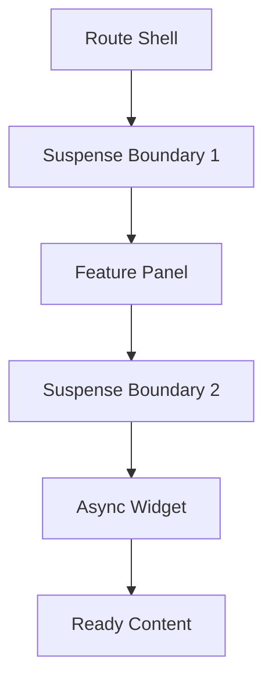

---
title: Suspense and Boundaries
slug: day-062-suspense-and-boundaries
dayLabel: Day 62
level: Advanced
estimatedMinutes: 30
order: 62
track: react
---
---
title: Suspense and Boundaries
slug: day-062-suspense-and-boundaries
dayLabel: Day 62
level: Advanced
estimatedMinutes: 30
order: 62
track: react
---
# Day 62 [Advanced]: Suspense and Boundaries

## Goal

Implement Suspense boundaries to deliver structured loading states for lazy and async UI sections, while understanding where Suspense is appropriate and where an Error Boundary or explicit loading state is still required.

## Prerequisites

- Day 61 completed
- Familiarity with lazy loading and fallback UI

## Explanation

Suspense lets you declare a boundary for UI that is not ready yet. React can show the boundary's fallback while a supported child suspends, then retry rendering that subtree when it becomes ready. Suspense is especially useful with `lazy` for code-split components and with React features/frameworks that support Suspense-enabled data fetching.

A critical distinction is that **Suspense is not a generic promise wrapper**. Simply starting a fetch inside `useEffect` does not make that component suspend. For ordinary effect-based fetching, explicit loading/error state or a data library with Suspense support is still needed.

## Topic by Topic

### Topic 1: Suspense Basics

Theory:
Suspense shows fallback UI while a supported child component or resource is not ready. With `lazy`, the common case is waiting for a dynamically imported component's code to load.

Practical:
Wrap a lazy-loaded component with a boundary and keep the fallback small and contextual.

Code Example:

```jsx
import { lazy, Suspense } from "react";

const LazyPage = lazy(() => import("./LazyPage"));

export default function Page() {
  return (
    <Suspense fallback={<p>Loading page...</p>}>
      <LazyPage />
    </Suspense>
  );
}
```

**Explanation:** The fallback is rendered only while the descendant is suspended. Once the lazy module resolves, React renders `LazyPage`. The fallback should not be treated as an error state.

**Key Points:**

- Understand the core idea of Suspense Basics.
- Use `Suspense` with supported suspending resources/components.
- Keep fallback UI contextual and lightweight.
- Do not assume every asynchronous operation automatically suspends.

### Topic 2: Nested Boundaries

Theory:
Nested boundaries provide staged loading rather than forcing one large subtree to wait behind a single fallback.

Practical:
Keep the application shell visible while a deeper feature loads, and give slower sections their own boundary where useful.

Code Example:

```jsx
import { lazy, Suspense } from "react";

const Analytics = lazy(() => import("./Analytics"));

function Dashboard() {
  return (
    <Suspense fallback={<p>Loading dashboard...</p>}>
      <DashboardShell />
      <Suspense fallback={<p>Loading analytics...</p>}>
        <Analytics />
      </Suspense>
    </Suspense>
  );
}
```

The inner boundary can reveal the dashboard shell without replacing the entire page with a spinner. Boundary granularity should follow meaningful UX regions, not every component.

**Explanation:** This topic explains Nested Boundaries in a practical way so you can apply it confidently in real React projects. Good nesting keeps ready content available while slower regions continue loading.

**Key Points:**

- Understand the core idea of Nested Boundaries.
- Apply boundaries around meaningful UI regions.
- Avoid excessive boundaries that create noisy loading states.
- Keep already-ready content visible where possible.

### Topic 3: Suspense + Lazy Routes

Theory:
Route-level code splitting can reduce the initial JavaScript required by an application and load a route only when it is needed.

Practical:
Use `lazy` for route components and place the boundary around the route outlet or route content.

Code Example:

```jsx
import { lazy, Suspense } from "react";

const AdminPage = lazy(() => import("./AdminPage"));

function AdminRoute() {
  return (
    <Suspense fallback={<p>Loading admin page...</p>}>
      <AdminPage />
    </Suspense>
  );
}
```

With React Router, the same idea can be applied around route content or through the router's supported loading APIs. Keep route boundaries aligned with navigation expectations so users understand what is loading.

**Explanation:** This topic explains Suspense + Lazy Routes in a practical way so you can apply it confidently in real React projects. Code splitting is a delivery optimization; Suspense provides the UI boundary while the split module is unavailable.

**Key Points:**

- Understand the core idea of Suspense + Lazy Routes.
- Use `lazy` for components that benefit from code splitting.
- Provide route-specific fallback UI.
- Do not confuse code splitting with data fetching.

### Topic 4: Boundary UX Design

Theory:
Fallback should match feature context and perceived progress. A good fallback communicates what is loading without making the application feel frozen.

Practical:
Use skeletons or placeholders that resemble the final content instead of a generic spinner everywhere.

Code Example:

```jsx
function ProductGridSkeleton() {
  return <div aria-label="Loading products">Loading products...</div>;
}

<Suspense fallback={<ProductGridSkeleton />}>
  <ProductGrid />
</Suspense>
```

For accessible loading experiences, make sure status text is understandable to assistive technology and avoid unnecessary repeated announcements when nested boundaries resolve quickly.

**Explanation:** This topic explains Boundary UX Design in a practical way so you can apply it confidently in real React projects. The fallback is part of the product experience, so it should communicate scope, preserve layout stability, and avoid distracting transitions.

**Key Points:**

- Understand the core idea of Boundary UX Design.
- Match fallback UI to the content being loaded.
- Preserve layout stability where possible.
- Consider accessibility when communicating loading state.

### Topic 5: Error vs Loading Boundaries

Theory:
Suspense handles waiting for supported suspending work; Error Boundaries handle errors thrown during rendering and related React lifecycle work. They solve different failure modes and are often composed together.

Practical:
Place an Error Boundary around a Suspense boundary when a lazy or async feature needs both a loading experience and a recovery experience.

Code Example:

```jsx
<ErrorBoundary fallback={<p>Could not load this widget.</p>}>
  <Suspense fallback={<p>Loading widget...</p>}>
    <Widget />
  </Suspense>
</ErrorBoundary>
```

A production Error Boundary should also provide an actionable recovery path where appropriate, such as retrying a route or returning to a stable parent screen.

**Explanation:** This topic explains Error vs Loading Boundaries in a practical way so you can apply it confidently in real React projects. Loading and failure should be designed as separate states rather than represented by one generic fallback.

**Key Points:**

- Understand the core idea of Error vs Loading Boundaries.
- Keep loading and failure states conceptually separate.
- Combine Suspense with Error Boundaries for resilient feature loading.
- Provide useful recovery or navigation when a feature fails.

### Topic 6: Reliability Patterns for Suspense and Boundaries

Theory:
Advanced apps need reliable rendering and data workflows that stay stable under retries, loading delays, network failures, and test scenarios. Boundary design should be intentional and should not hide genuine errors behind endless loading UI.

Practical:
Test both the loading and failure paths, and verify that recovery does not create duplicate requests or stale UI.

Code Example:

```jsx
import { lazy, Suspense } from "react";

const Reports = lazy(() => import("./Reports"));

function ReportsSection() {
  return (
    <ErrorBoundary fallback={<p>Reports are temporarily unavailable.</p>}>
      <Suspense fallback={<p>Loading reports...</p>}>
        <Reports />
      </Suspense>
    </ErrorBoundary>
  );
}
```

For production applications, pair boundary behavior with logging/monitoring and automated tests for fallback, success, and failure paths. A retry action should reset the relevant failure state rather than blindly remounting the entire application.

**Explanation:** This topic explains Reliability Patterns for Suspense and Boundaries in a practical way so you can apply it confidently in real React projects. The objective is predictable behavior when asynchronous UI succeeds, takes time, or fails.

**Key Points:**

- Understand the core idea of Reliability Patterns for Suspense and Boundaries.
- Test loading, success, failure, and recovery paths.
- Avoid infinite retry or permanently stuck fallback states.
- Monitor important boundary failures in production.

## Key Concepts

- Suspense fallback control
- Progressive loading with nested boundaries
- Route-level lazy boundaries
- Context-aware loading UX
- Composing loading and error containment
- Suspense-enabled vs ordinary asynchronous data fetching
- Reliability-first implementation
- Recovery and monitoring strategy

## Visual Concept Map



## End-to-End Practical

1. Lazy-load two feature modules.
2. Add top-level Suspense for route shell.
3. Add nested Suspense for inner widgets.
4. Combine with Error Boundary.
5. Define contextual loading and failure UI.
6. Validate loading, success, failure, and recovery paths.
7. Confirm that ordinary `useEffect` fetching is not incorrectly assumed to suspend.

## Hands-on Coding

### Example 1: Case - Route-level Lazy Boundary

Scenario:
An HR portal loads the payroll page only when visited.

```jsx
import { lazy, Suspense } from "react";

const PayrollPage = lazy(() => import("./PayrollPage"));

function AppRoutes() {
  return (
    <Suspense fallback={<p>Loading route...</p>}>
      <PayrollPage />
    </Suspense>
  );
}

export default AppRoutes;
```

### Example 2: Case - Nested Suspense for Dashboard Widgets

Scenario:
The dashboard frame should render immediately while an analytics widget loads separately.

```jsx
import { lazy, Suspense } from "react";

const Analytics = lazy(() => import("./Analytics"));

function Dashboard() {
  return (
    <div>
      <h2>Dashboard</h2>
      <Suspense fallback={<p>Loading analytics...</p>}>
        <Analytics />
      </Suspense>
    </div>
  );
}

export default Dashboard;
```

### Example 3: Case - Suspense with Error Boundary

Scenario:
A medical report widget can be slow or fail; loading and failure must be handled separately.

```jsx
<ErrorBoundary fallback={<p>Preparing report failed. Please retry.</p>}>
  <Suspense fallback={<p>Preparing report...</p>}>
    <ReportWidget />
  </Suspense>
</ErrorBoundary>
```

The `ErrorBoundary` shown here represents an existing error-boundary component that accepts a fallback. In a real application, its implementation should provide logging and an appropriate recovery action.

## Mini Exercise

Scenario:
You are building an education dashboard with Lessons, Progress, and Insights sections.

Create nested boundaries so the page shell loads first, each section shows contextual fallback UI, and failures stay isolated.

Expected output:

- Incremental section-by-section loading
- Better perceived performance
- Isolated failure experience without full page crash
- A clear recovery path for a failed section

## Assessment Quiz

### Quiz Questions

1. What does a Suspense fallback represent?
2. Why use nested boundaries?
3. True or False: Suspense replaces Error Boundaries.
4. Where is route-level Suspense commonly applied?
5. What makes fallback UI effective?
6. Does a fetch started inside `useEffect` automatically suspend the component?
7. Why should Suspense boundaries not be placed around every small component?
8. What should be tested in a production-ready Suspense flow?

### Quiz Answers

1. Temporary UI shown while a supported descendant is suspended and not ready to render.
2. To provide progressive, localized loading states while keeping ready UI visible.
3. False. Suspense and Error Boundaries solve different problems and can be composed.
4. Around lazy-loaded route components or route content that uses Suspense-enabled loading.
5. Contextual placeholders that communicate scope, preserve layout, and avoid unnecessary blocking.
6. No. Ordinary effect-based fetching needs explicit loading/error handling unless a Suspense-enabled data mechanism is used.
7. Excessive boundaries can create noisy UX and unnecessary fallback transitions; boundaries should represent meaningful loading regions.
8. Loading, success, failure, recovery, retry behavior, and monitoring/logging paths.

## Task

- Add nested Suspense boundaries in one app
- Pair at least one boundary with an Error Boundary
- Design contextual fallback UI
- Test loading and failure paths
- Complete the mini exercise

## Self Check

- You can design staged loading flows with Suspense
- You can distinguish Suspense from Error Boundary responsibilities
- You know when `lazy` and route-level boundaries are useful
- You understand that ordinary `useEffect` fetching does not automatically suspend
- You can answer at least 6 out of 8 quiz questions correctly

## Interview Questions and Answers

### Beginner

**Question:** What is Suspense in React?

**Answer:** A React mechanism for displaying fallback UI while a supported descendant is suspended and not ready to render.

**Question:** Why use fallback UIs?

**Answer:** To communicate progress instead of showing a blank or frozen-looking region while supported work is pending.

### Middle

**Question:** Why are nested boundaries useful?

**Answer:** They allow already-ready UI to remain visible while slower sections continue loading, creating more localized and progressive experiences.

**Question:** How is Suspense different from Error Boundary?

**Answer:** Suspense handles the waiting state for supported suspending work; Error Boundaries handle rendering errors and provide failure containment. They are complementary.

### Advanced

**Question:** What is a common anti-pattern with Suspense fallback design?

**Answer:** Using one global spinner for unrelated regions or placing boundaries so aggressively that the interface repeatedly disappears and reappears during normal updates.

**Question:** Why is it important to understand Suspense-enabled data fetching?

**Answer:** Because not every promise or `fetch` call suspends automatically. Assuming ordinary `useEffect` fetching will trigger Suspense leads to incorrect loading architecture and broken assumptions.

**Question:** How can boundary granularity improve UX metrics?

**Answer:** Smaller, meaningful boundaries can allow ready regions to become usable sooner and reduce perceived waiting, while avoiding unnecessary full-page fallbacks.

**Question:** How would you test a Suspense boundary in production-oriented code?

**Answer:** Test the loading fallback, successful resolution, error fallback, and recovery/retry behavior. Also verify that retries do not introduce duplicate work or leave stale UI.

## Day 62 Outcome

- You can build structured loading architecture with Suspense
- You can improve perceived speed with appropriate boundary granularity
- You can combine loading and error containment correctly
- You can distinguish code-splitting Suspense from ordinary effect-based data fetching
- You are ready for deeper concurrent interactions in Day 63

