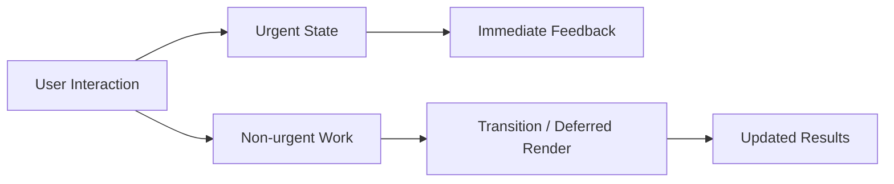

---
title: Concurrent Features
slug: day-063-concurrent-features
dayLabel: Day 63
level: Advanced
estimatedMinutes: 30
order: 63
track: react
---
---
title: Concurrent Features
slug: day-063-concurrent-features
dayLabel: Day 63
level: Advanced
estimatedMinutes: 30
order: 63
track: react
---
# Day 63 [Advanced]: Concurrent Features

## Goal

Master React concurrent features to maintain responsive interactions while expensive UI work is scheduled as non-urgent work. The goal is not simply to make code “faster”, but to keep urgent user interactions responsive and choose the correct scheduling tool for the problem.

## Prerequisites

- Day 62 completed
- Understanding of React 18 rendering model

## Explanation

React concurrent features allow React to work on rendering without treating every update as equally urgent. This means an update that can wait can be interrupted or deferred while React keeps important interactions such as typing and clicking responsive.

The key APIs in this lesson are `useTransition` and `useDeferredValue`. They solve related but different problems: `useTransition` marks state updates as non-urgent, while `useDeferredValue` lets a derived consumer use a lagging version of an already-changing value.

These APIs do not make expensive JavaScript computation disappear. If filtering 100,000 records is inherently expensive, the computation still costs CPU time. Concurrent scheduling can improve responsiveness, but it should be combined with profiling, virtualization, memoization, server-side filtering, or other appropriate optimizations when the workload requires them.

## Topic by Topic

### Topic 1: useTransition for Non-urgent Updates

Theory:
`useTransition` returns `isPending` and `startTransition`. Updates scheduled inside `startTransition` are marked as non-urgent, allowing urgent updates such as controlled input state to receive priority.

Practical:
Keep the input value urgent and put the expensive result update inside a transition.

Code Example:

```jsx
import { useState, useTransition } from "react";

function Search({ items }) {
  const [query, setQuery] = useState("");
  const [results, setResults] = useState(items);
  const [isPending, startTransition] = useTransition();

  function handleChange(event) {
    const nextQuery = event.target.value;
    setQuery(nextQuery); // urgent: keep typing responsive

    startTransition(() => {
      setResults(
        items.filter((item) =>
          item.name.toLowerCase().includes(nextQuery.toLowerCase()),
        ),
      );
    });
  }

  return (
    <>
      <input value={query} onChange={handleChange} />
      {isPending && <small>Updating results...</small>}
      <p>{results.length} results</p>
    </>
  );
}
```

**Explanation:** The input update remains urgent, while the result update is transition work. `isPending` communicates that the transition has not finished. A transition should be used for non-urgent UI state, not for the value that directly controls a text input.

**Key Points:**

- Understand the core idea of useTransition for Non-urgent Updates.
- Keep urgent interaction state outside the transition.
- Use `isPending` to communicate transition progress.
- Remember that transitions prioritize work; they do not eliminate CPU cost.

### Topic 2: useDeferredValue for Derived UI

Theory:
`useDeferredValue` returns a value that may lag behind the current value while React works on the deferred version. It is useful when an expensive subtree consumes a rapidly changing value.

Practical:
Keep the search input controlled by the immediate query and pass `deferredQuery` to an expensive result component.

Code Example:

```jsx
import { useDeferredValue, useMemo, useState } from "react";

function SearchResults({ items }) {
  const [query, setQuery] = useState("");
  const deferredQuery = useDeferredValue(query);

  const results = useMemo(() => {
    const normalized = deferredQuery.toLowerCase();
    return items.filter((item) =>
      item.name.toLowerCase().includes(normalized),
    );
  }, [items, deferredQuery]);

  return (
    <>
      <input value={query} onChange={(e) => setQuery(e.target.value)} />
      <p>Matches: {results.length}</p>
    </>
  );
}
```

The important idea is that the input uses `query`, while the expensive consumer uses `deferredQuery`. This is different from delaying the event itself with a timer.

**Explanation:** This topic explains useDeferredValue for Derived UI in a practical way so you can apply it confidently in real React projects. Deferral is useful when a consumer can safely display slightly older data while the user continues interacting.

**Key Points:**

- Understand the core idea of useDeferredValue for Derived UI.
- Keep the immediate value for urgent UI.
- Pass the deferred value to expensive consumers.
- Do not treat `useDeferredValue` as a replacement for server-side optimization.

### Topic 3: Pending UI Signals

Theory:
Concurrent UI can intentionally show intermediate states. Users should understand that background work is progressing without being blocked by a full-page loading screen.

Practical:
Use a lightweight pending indicator and avoid replacing already usable content unnecessarily.

Code Example:

```jsx
function SearchStatus({ isPending }) {
  return isPending ? (
    <small role="status" aria-live="polite">
      Updating results...
    </small>
  ) : (
    <small>Results are up to date.</small>
  );
}
```

A pending indicator should be visually subtle and accessible. Avoid aggressive spinners that appear and disappear on every keystroke.

**Explanation:** This topic explains Pending UI Signals in a practical way so you can apply them confidently in real React projects. Good pending feedback communicates progress without making responsive UI feel blocked.

**Key Points:**

- Understand the core idea of Pending UI Signals.
- Use lightweight, contextual status feedback.
- Preserve already-rendered content where possible.
- Consider accessibility when announcing asynchronous UI changes.

### Topic 4: Choosing the Right Tool

Theory:
`useTransition` controls the priority of state updates, while `useDeferredValue` controls which version of a value an expensive consumer receives. Neither is a universal performance solution.

Practical:
Use `useTransition` when you own the state update and can mark the update as non-urgent. Use `useDeferredValue` when an existing changing value feeds an expensive subtree.

Code Example:

```jsx
// useTransition: you control the state update
startTransition(() => {
  setSelectedTab(nextTab);
});

// useDeferredValue: you control the consumer
const deferredQuery = useDeferredValue(query);
return <ExpensiveResults query={deferredQuery} />;
```

Choose based on the data flow rather than adding both hooks automatically. Profile the screen before and after the change.

**Explanation:** This topic explains Choosing the Right Tool in a practical way so you can apply it confidently in real React projects. The correct hook depends on whether you need to schedule an update or defer a value consumed by expensive UI.

**Key Points:**

- Understand the core idea of Choosing the Right Tool.
- Use `useTransition` for non-urgent state updates you control.
- Use `useDeferredValue` for expensive consumers of changing values.
- Measure the result instead of assuming either API improves performance.

### Topic 5: Tradeoffs and Testing

Theory:
Concurrent scheduling changes when work becomes visible, so tests and UX should not depend on a specific render timing. The application should remain correct whether React completes work quickly or has to interrupt and retry it.

Practical:
Test rapid typing, repeated transitions, changing props, empty results, large datasets, and error paths. Keep render logic pure and avoid side effects during rendering.

Code Example:

```jsx
import { render, screen } from "@testing-library/react";
import userEvent from "@testing-library/user-event";
import Search from "./Search";

test("keeps the search input usable during updates", async () => {
  const user = userEvent.setup();

  render(
    <Search
      items={[{ name: "React" }, { name: "Angular" }]}
    />,
  );

  const input = screen.getByRole("textbox");
  await user.type(input, "React");

  expect(input).toHaveValue("React");
});
```

Tests should verify observable behavior rather than asserting an exact internal number of renders. Performance should be measured with profiling tools and realistic data volumes.

**Explanation:** This topic explains Tradeoffs and Testing in a practical way so you can apply it confidently in real React projects. Concurrent features should preserve correctness under different scheduling conditions.

**Key Points:**

- Understand the core idea of Tradeoffs and Testing.
- Test behavior instead of implementation-specific render timing.
- Include rapid interaction and edge-case scenarios.
- Profile realistic workloads before and after optimization.

### Topic 6: Reliability Patterns for Concurrent Features

Theory:
Advanced apps need reliable rendering and data workflows that remain correct under rapid interactions, interrupted renders, retries, loading delays, and test scenarios. Concurrent rendering also reinforces the rule that render functions must stay pure because React may start, pause, or restart rendering work.

Practical:
Validate both success and failure paths, avoid side effects during render, and keep expensive calculations isolated so scheduling changes do not alter business correctness.

Code Example:

```jsx
function Results({ items, query }) {
  const deferredQuery = useDeferredValue(query);

  const filtered = items.filter((item) =>
    item.name.toLowerCase().includes(deferredQuery.toLowerCase()),
  );

  return <p>{filtered.length} matches</p>;
}
```

The filtering calculation is derived from inputs and has no side effects. In production, pair concurrent features with profiling, automated interaction tests, and monitoring of real user interaction latency.

**Explanation:** This topic explains Reliability Patterns for Concurrent Features in a practical way so you can apply them confidently in real React projects. The objective is predictable application behavior even when React schedules rendering work differently.

**Key Points:**

- Understand the core idea of Reliability Patterns for Concurrent Features.
- Keep render functions pure and deterministic.
- Test rapid interactions and failure paths.
- Use production measurements to validate responsiveness improvements.

## Key Concepts

- Non-urgent update scheduling
- Deferred rendering strategies
- Pending state communication
- Correct hook selection
- Concurrency-aware testing
- Render purity and interruptible work
- Performance measurement before optimization
- Reliability-first implementation

## Visual Concept Map



## End-to-End Practical

1. Build a heavy employee search screen.
2. Measure input responsiveness with the naive update model.
3. Keep the input state urgent.
4. Add `useTransition` when the application controls the expensive state update, or `useDeferredValue` when an expensive consumer can lag behind the input value.
5. Add a lightweight pending indicator where appropriate.
6. Test rapid typing, empty results, large datasets, and repeated interactions.
7. Profile again and compare the user-visible result rather than assuming the hooks improved performance.

## Hands-on Coding

### Example 1: Case - Concurrent Search with useTransition

Scenario:
A recruitment panel has 20,000 profiles and search typing should stay responsive.

```jsx
import { useState, useTransition } from "react";

function CandidateSearch({ allCandidates }) {
  const [query, setQuery] = useState("");
  const [results, setResults] = useState(allCandidates);
  const [isPending, startTransition] = useTransition();

  const onChange = (event) => {
    const next = event.target.value;
    setQuery(next);

    startTransition(() => {
      const normalized = next.toLowerCase();
      setResults(
        allCandidates.filter((candidate) =>
          candidate.skills
            .join(" ")
            .toLowerCase()
            .includes(normalized),
        ),
      );
    });
  };

  return (
    <div>
      <input value={query} onChange={onChange} placeholder="Search skills" />
      {isPending && <p role="status">Searching...</p>}
      <p>Matches: {results.length}</p>
    </div>
  );
}

export default CandidateSearch;
```

### Example 2: Case - useDeferredValue for Analytics Filter

Scenario:
Sales analytics charts are expensive and should be allowed to lag behind rapid typing.

```jsx
import { useDeferredValue, useMemo, useState } from "react";

function AnalyticsFilter({ rows }) {
  const [query, setQuery] = useState("");
  const deferredQuery = useDeferredValue(query);

  const filteredRows = useMemo(() => {
    const normalized = deferredQuery.toLowerCase();
    return rows.filter((row) =>
      row.region.toLowerCase().includes(normalized),
    );
  }, [rows, deferredQuery]);

  return (
    <>
      <input value={query} onChange={(e) => setQuery(e.target.value)} />
      <p>Rows: {filteredRows.length}</p>
    </>
  );
}

export default AnalyticsFilter;
```

### Example 3: Case - Pending Indicator in Multi-panel Workspace

Scenario:
A legal case workspace updates a document graph in the background and must show clear status.

```jsx
function WorkspaceStatus({ isPending }) {
  return isPending ? (
    <span role="status">Refreshing graph...</span>
  ) : (
    <span>Up to date</span>
  );
}
```

The status should supplement, not replace, the existing content. The goal is to communicate progress while allowing the user to continue with urgent interactions.

## Mini Exercise

Scenario:
You are optimizing a hospital patient search dashboard with heavy filter logic.

Add `useTransition` and `useDeferredValue` in appropriate places and include pending indicators. First identify which state is urgent and which UI is expensive; do not add both hooks automatically.

Expected output:

- Fast typing under heavy data volume
- Controlled delayed expensive rendering
- Clear user-visible status for background updates
- No regression in empty, loading, or error states
- A before/after performance observation

## Assessment Quiz

### Quiz Questions

1. What does `useTransition` return?
2. When should `useDeferredValue` be preferred?
3. True or False: Transitioned updates are always immediate.
4. Why show pending UI?
5. What risk should be tested when using concurrent features?
6. Does `useTransition` make an expensive JavaScript calculation free?
7. What is the main difference between `useTransition` and `useDeferredValue`?
8. Why should render logic remain pure with concurrent rendering?

### Quiz Answers

1. An `isPending` flag and a `startTransition` function.
2. When an expensive consumer can safely use a deferred version of a rapidly changing value.
3. False. Transition work is non-urgent and may be interrupted or delayed.
4. To communicate background progress without blocking urgent interaction.
5. Timing-sensitive UX and correctness edge cases during rapid interactions, retries, and interrupted work.
6. No. It changes scheduling priority; the underlying computation still consumes resources.
7. `useTransition` marks state updates as non-urgent; `useDeferredValue` provides a lagging version of an existing value for expensive consumers.
8. React may start, pause, restart, or abandon rendering work, so side effects during render can cause incorrect behavior.

## Task

- Optimize a heavy search using the appropriate concurrent hook
- Add pending-state indicators where useful
- Measure the screen before and after the change
- Test rapid interaction and edge cases
- Complete the mini exercise

## Self Check

- You can apply concurrent hooks in real scenarios
- You can distinguish urgent and non-urgent work
- You can choose between `useTransition` and `useDeferredValue`
- You can preserve responsiveness under load
- You can explain why concurrent APIs do not replace profiling or algorithmic optimization
- You can answer at least 6 out of 8 quiz questions correctly

## Interview Questions and Answers

### Beginner

**Question:** What is `useTransition` used for?

**Answer:** It marks state updates as non-urgent so React can keep more urgent interactions responsive while processing the transition.

**Question:** What does `isPending` indicate?

**Answer:** It indicates that a transition started with `startTransition` is still pending.

### Middle

**Question:** How is `useDeferredValue` different from debounce?

**Answer:** Debounce usually delays work using a timer. `useDeferredValue` lets React schedule rendering of a value at lower priority and does not impose a fixed time delay.

**Question:** Why might concurrent features improve perceived performance?

**Answer:** They can allow urgent interactions such as typing to remain responsive while expensive UI updates are rendered as lower-priority work.

### Advanced

**Question:** What architectural pattern helps with concurrent-heavy screens?

**Answer:** Separate urgent interaction state from expensive derived UI, keep render logic pure, and isolate expensive subtrees so they can be deferred or transitioned without blocking critical controls.

**Question:** What monitoring signal validates concurrent optimization success?

**Answer:** Real-user interaction latency, responsiveness during heavy interactions, and profiler evidence showing that the expensive work no longer blocks urgent UI. A lower render count alone is not sufficient.

**Question:** When would you avoid adding `useTransition` or `useDeferredValue`?

**Answer:** When the update is already cheap, when the result must be immediately consistent, or when profiling shows no meaningful responsiveness problem. Extra scheduling complexity without measurable benefit is unnecessary.

**Question:** Why can concurrent rendering expose unsafe component code?

**Answer:** Rendering may be started and discarded or repeated, so side effects performed during render can run at unexpected times. Side effects belong in appropriate event handlers or effects rather than render calculations.

## Day 63 Outcome

- You can implement concurrent interaction patterns effectively
- You can distinguish urgent work from non-urgent rendering work
- You can choose between `useTransition` and `useDeferredValue` based on data flow
- You can test and measure responsiveness instead of relying on assumptions
- You are ready for advanced server-write workflows in Day 64
