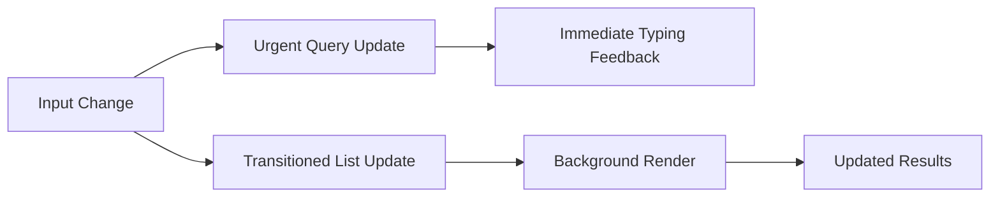

---
title: Concurrent Features
slug: day-063-concurrent-features
dayLabel: Day 63
level: Advanced
estimatedMinutes: 30
order: 63
track: react
---
# Day 63 [Advanced]: Concurrent Features

## Index

- [Goal](#goal)
- [Prerequisites](#prerequisites)
- [Explanation](#explanation)
- [Topic by Topic](#topic-by-topic)
- [Key Concepts](#key-concepts)
- [Visual Concept Map](#visual-concept-map)
- [End-to-End Practical](#end-to-end-practical)
- [Hands-on Coding](#hands-on-coding)
- [Mini Exercise](#mini-exercise)
- [Assessment Quiz](#assessment-quiz)
- [Task](#task)
- [Self Check](#self-check)
- [Interview Questions and Answers](#interview-questions-and-answers)
- [Day 63 Outcome](#day-63-outcome)

## Goal

Master React concurrent features to maintain responsiveness during expensive UI updates.

## Prerequisites

- Day 62 completed
- Understanding of React 18 rendering model

## Explanation

Concurrent features help React schedule work intelligently so urgent interactions stay smooth while heavy updates run in the background.

## Topic by Topic

### Topic 1: useTransition for Non-urgent Updates

Theory:
Transition marks updates that can be interrupted/deprioritized.

Practical:
Apply transition to expensive list derivation.

Code Example:

```jsx
const [isPending, startTransition] = useTransition();
```

**Explanation:** This topic explains useTransition for Non-urgent Updates in a practical way so you can apply it confidently in real React projects.

**Key Points:**

- Understand the core idea of useTransition for Non-urgent Updates.
- Apply the pattern using clean, readable code.
- Avoid common mistakes through predictable React flow.

### Topic 2: useDeferredValue for Derived UI

Theory:
Deferred value lets expensive UI lag behind fast input safely.

Practical:
Compute filtered list from deferred search term.

Code Example:

```jsx
const deferred = useDeferredValue(query);
```

**Explanation:** This topic explains useDeferredValue for Derived UI in a practical way so you can apply it confidently in real React projects.

**Key Points:**

- Understand the core idea of useDeferredValue for Derived UI.
- Apply the pattern using clean, readable code.
- Avoid common mistakes through predictable React flow.

### Topic 3: Pending UI Signals

Theory:
Users should know background updates are in progress.

Practical:
Show lightweight pending indicator.

Code Example:

```jsx
{
  isPending && <small>Updating...</small>;
}
```

**Explanation:** This topic explains Pending UI Signals in a practical way so you can apply it confidently in real React projects.

**Key Points:**

- Understand the core idea of Pending UI Signals.
- Apply the pattern using clean, readable code.
- Avoid common mistakes through predictable React flow.

### Topic 4: Choosing the Right Tool

Theory:
useTransition controls state updates; useDeferredValue controls value propagation.

Practical:
Use both in search-heavy pages.

Code Example:

```jsx
// transition for setState, deferred for expensive consumers
```

**Explanation:** This topic explains Choosing the Right Tool in a practical way so you can apply it confidently in real React projects.

**Key Points:**

- Understand the core idea of Choosing the Right Tool.
- Apply the pattern using clean, readable code.
- Avoid common mistakes through predictable React flow.

### Topic 5: Tradeoffs and Testing

Theory:
Concurrency can change timing behavior.

Practical:
Validate UX and edge cases under rapid user interactions.

Code Example:

```jsx
// test rapid typing and quick tab switching
```

**Explanation:** This topic explains Tradeoffs and Testing in a practical way so you can apply it confidently in real React projects.

**Key Points:**

- Understand the core idea of Tradeoffs and Testing.
- Apply the pattern using clean, readable code.
- Avoid common mistakes through predictable React flow.

### Topic 6: Reliability Patterns for Concurrent Features

Theory:
Advanced apps need reliable rendering and data workflows that stay stable under retries, loading delays, and test scenarios.

Practical:
Add a failure-path test and one monitoring signal so this topic is validated beyond the happy path.

Code Example:

`jsx
// Validate happy path and failure path for production reliability.
`
**Explanation:** This topic explains Reliability Patterns for Concurrent Features in a practical way so you can apply it confidently in real React projects.

**Key Points:**

- Understand the core idea of Reliability Patterns for Concurrent Features.
- Apply the pattern using clean, readable code.
- Avoid common mistakes through predictable React flow.

## Key Concepts

- Non-urgent update scheduling
- Deferred rendering strategies
- Pending state communication
- Correct hook selection
- Concurrency-aware testing

- Reliability-first implementation

## Visual Concept Map



## End-to-End Practical

1. Build heavy employee search screen.
2. Measure lag with naive update model.
3. Add useTransition around expensive update.
4. Add useDeferredValue for derived list.
5. Verify improved interaction responsiveness.

## Hands-on Coding

### Example 1: Case - Concurrent Search with useTransition

Scenario:
A recruitment panel has 20,000 profiles and search typing should stay instant.

```jsx
import { useState, useTransition } from "react";

function CandidateSearch({ allCandidates }) {
  const [query, setQuery] = useState("");
  const [results, setResults] = useState(allCandidates);
  const [isPending, startTransition] = useTransition();

  const onChange = (e) => {
    const next = e.target.value;
    setQuery(next);

    startTransition(() => {
      setResults(
        allCandidates.filter((c) =>
          c.skills.join(" ").toLowerCase().includes(next.toLowerCase()),
        ),
      );
    });
  };

  return (
    <div>
      <input value={query} onChange={onChange} placeholder="Search skills" />
      {isPending && <p>Searching...</p>}
      <p>Matches: {results.length}</p>
    </div>
  );
}
```

### Example 2: Case - useDeferredValue for Analytics Filter

Scenario:
Sales analytics charts are expensive and should update after user stops rapid typing.

```jsx
function AnalyticsFilter({ rows }) {
  const [query, setQuery] = React.useState("");
  const deferredQuery = React.useDeferredValue(query);

  const filteredRows = React.useMemo(() => {
    return rows.filter((r) =>
      r.region.toLowerCase().includes(deferredQuery.toLowerCase()),
    );
  }, [rows, deferredQuery]);

  return (
    <>
      <input value={query} onChange={(e) => setQuery(e.target.value)} />
      <p>Rows: {filteredRows.length}</p>
    </>
  );
}
```

### Example 3: Case - Pending Indicator in Multi-panel Workspace

Scenario:
A legal case workspace updates document graph in background and must show clear status.

```jsx
{
  isPending ? <span>Refreshing graph...</span> : <span>Up to date</span>;
}
```

## Mini Exercise

Scenario:
You are optimizing a hospital patient search dashboard with heavy filter logic.

Add useTransition and useDeferredValue in appropriate places and include pending indicators.

Expected output:

- Fast typing under heavy data volume
- Controlled delayed expensive rendering
- Clear user-visible loading status for background updates

## Assessment Quiz

### Quiz Questions

1. What does useTransition return?
2. When should useDeferredValue be preferred?
3. True or False: Transitioned updates are always immediate.
4. Why show pending UI?
5. What risk should be tested when using concurrent features?

### Quiz Answers

1. isPending flag and startTransition function
2. When expensive UI derives from quickly changing values
3. False
4. To communicate in-progress background updates
5. Timing-related UX/logic edge cases during rapid interactions

## Task

- Optimize heavy search using useTransition and useDeferredValue
- Add pending-state indicators
- Complete mini exercise

## Self Check

- You can apply concurrent hooks in real scenarios
- You can preserve responsiveness under load
- You can answer at least 4 out of 5 quiz questions correctly

## Interview Questions and Answers

### Beginner

**Question:** What is useTransition used for?

**Answer:** Marking non-urgent state updates.

**Question:** What does isPending indicate?

**Answer:** That a transition update is still processing.

### Middle

**Question:** How is useDeferredValue different from debounce?

**Answer:** It is React scheduling-based UI deferral, not timer-based event delay.

**Question:** Why might concurrent features improve perceived performance?

**Answer:** Urgent interactions remain responsive while heavy updates run in background.

### Advanced

**Question:** What architectural pattern helps with concurrent-heavy screens?

**Answer:** Separate urgent UI state from expensive derived state.

**Question:** What monitoring signal validates concurrent optimization success?

**Answer:** Improved interaction latency and reduced input jank under load.

## Day 63 Outcome

- You can implement concurrent interaction patterns effectively
- You can maintain UX quality in heavy data scenarios
- You are ready for advanced server-write workflows in Day 64

