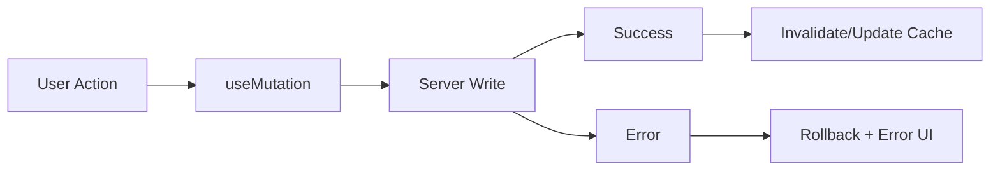

---
title: TanStack Query Mutations
slug: day-064-tanstack-query-mutations
dayLabel: Day 64
level: Advanced
estimatedMinutes: 30
order: 64
track: react
---
---
title: TanStack Query Mutations
slug: day-064-tanstack-query-mutations
dayLabel: Day 64
level: Advanced
estimatedMinutes: 30
order: 64
track: react
---
# Day 64 [Advanced]: TanStack Query Mutations

## Goal

Handle server write operations using TanStack Query mutations with reliable UI sync, cache updates, error recovery, and production-safe retry behavior.

## Prerequisites

- Day 63 completed
- Query basics and queryClient familiarity

## Explanation

Mutations are write operations such as create, update, and delete. Unlike queries, mutations are normally triggered by an explicit user action. After a mutation succeeds, related cached queries must either be updated directly or invalidated so the UI reflects the server's latest state.

A production mutation flow should also consider pending state, duplicate submissions, server validation errors, optimistic updates, rollback, retries, and whether a request is safe to repeat.

## Topic by Topic

### Topic 1: Mutation Lifecycle

Theory:
A mutation moves through states such as idle, pending, success, and error. These states can drive disabled buttons, progress indicators, success feedback, and retry actions.

Practical:
Prevent accidental duplicate submissions while a create operation is pending and show a useful error when it fails.

Code Example:

```jsx
const mutation = useMutation({ mutationFn: createItem });

<button disabled={mutation.isPending} onClick={() => mutation.mutate(formData)}>
  {mutation.isPending ? "Saving..." : "Save"}
</button>
```

**Explanation:** This topic explains Mutation Lifecycle in a practical way so you can apply it confidently in real React projects. Mutation state should be part of the user experience rather than something hidden from the UI.

**Key Points:**

- Understand the core idea of Mutation Lifecycle.
- Apply the pattern using clean, readable code.
- Disable or otherwise guard duplicate user actions when appropriate.
- Give users clear pending, success, and failure feedback.

### Topic 2: Invalidate Queries

Theory:
After a successful write, related list/detail queries may contain stale data. Invalidating the relevant query marks it stale and lets TanStack Query refetch according to its normal query behavior.

Practical:
Invalidate the task list after a successful create or delete.

Code Example:

```jsx
const queryClient = useQueryClient();

const mutation = useMutation({
  mutationFn: createTodo,
  onSuccess: () => {
    queryClient.invalidateQueries({ queryKey: ["todos"] });
  },
});
```

Use the same query-key shape consistently. Invalidating `["todos"]` is different from invalidating an unrelated key such as `["users"]`.

**Explanation:** This topic explains Invalidate Queries in a practical way so you can apply it confidently in real React projects. Invalidation is often the safest default when the server may apply transformations, permissions, generated IDs, or other business rules.

**Key Points:**

- Understand the core idea of Invalidate Queries.
- Apply the pattern using clean, readable code.
- Keep query keys consistent.
- Prefer invalidation when rebuilding the exact server response locally is difficult.

### Topic 3: Optimistic Updates

Theory:
Optimistic UI updates the cache before the server confirms the write. It can make interactions feel instant, but it requires a previous snapshot and a rollback strategy.

Practical:
Cancel an active query, save the previous cache, update it optimistically, restore it on failure, and invalidate after the request settles.

Code Example:

```jsx
onMutate: async (id) => {
  await queryClient.cancelQueries({ queryKey: ["todos"] });

  const previous = queryClient.getQueryData(["todos"]);

  queryClient.setQueryData(["todos"], (old = []) =>
    old.filter((todo) => todo.id !== id),
  );

  return { previous };
},
onError: (_error, _id, context) => {
  queryClient.setQueryData(["todos"], context?.previous);
},
onSettled: () => {
  queryClient.invalidateQueries({ queryKey: ["todos"] });
},
```

**Explanation:** This topic explains Optimistic Updates in a practical way so you can apply it confidently in real React projects. Optimistic updates are appropriate when the expected result is predictable and the UX benefit justifies rollback complexity.

**Key Points:**

- Understand the core idea of Optimistic Updates.
- Snapshot before modifying cached data.
- Roll back when the server rejects the operation.
- Reconcile with the server after the mutation settles.

### Topic 4: Mutation Error Handling

Theory:
Write failures need clear recovery paths. Errors can come from validation, authorization, connectivity, conflicts, or server failures, so the UI should not treat every error as the same.

Practical:
Display a useful message and allow the user to retry when retrying is safe.

Code Example:

```jsx
if (mutation.isError) {
  return (
    <div role="alert">
      <p>Save failed. Please check the form and try again.</p>
      <button onClick={() => mutation.reset()}>Dismiss</button>
    </div>
  );
}
```

For real applications, map known server validation errors to the relevant form fields instead of exposing raw exception messages.

**Explanation:** This topic explains Mutation Error Handling in a practical way so you can apply it confidently in real React projects. Good error handling tells the user what happened and what action is safe to take next.

**Key Points:**

- Understand the core idea of Mutation Error Handling.
- Separate validation, authorization, network, and unexpected failures where useful.
- Avoid exposing raw server errors to end users.
- Provide recovery actions appropriate to the failure.

### Topic 5: Mutation Reusability

Theory:
Wrap common mutation configuration into custom hooks when multiple screens share the same server operation and cache behavior.

Practical:
Create `useCreateTask` and `useDeleteTask` hooks that keep API and cache logic out of presentation components.

Code Example:

```jsx
export function useCreateTask() {
  const queryClient = useQueryClient();

  return useMutation({
    mutationFn: createTask,
    onSuccess: () => {
      queryClient.invalidateQueries({ queryKey: ["tasks"] });
    },
  });
}
```

The hook should expose the mutation behavior without unnecessarily coupling the component to transport details. Keep the abstraction focused; do not create a custom hook only to rename `useMutation`.

**Explanation:** This topic explains Mutation Reusability in a practical way so you can apply it confidently in real React projects. A good mutation hook centralizes behavior that genuinely needs to stay consistent across consumers.

**Key Points:**

- Understand the core idea of Mutation Reusability.
- Keep API and cache concerns reusable where appropriate.
- Avoid abstractions that add no meaningful behavior.
- Keep mutation hooks focused on one domain operation.

### Topic 6: Reliability Patterns for TanStack Query Mutations

Theory:
Advanced apps need reliable rendering and data workflows that stay stable under retries, loading delays, race conditions, and test scenarios.

Practical:
Validate both happy and failure paths, protect against duplicate submissions, and add monitoring for important mutation failures.

Code Example:

```jsx
const mutation = useMutation({
  mutationFn: saveTask,
  retry: 0,
  onError: (error) => {
    reportError(error);
  },
});

<button disabled={mutation.isPending} onClick={() => mutation.mutate(task)}>
  {mutation.isPending ? "Saving..." : "Save task"}
</button>
```

Retry policy should match the operation. Automatically repeating a read-only request is different from automatically repeating a payment or non-idempotent create operation. Coordinate retry behavior with backend idempotency and API semantics.

**Explanation:** This topic explains Reliability Patterns for TanStack Query Mutations in a practical way so you can apply it confidently in real React projects. Production reliability comes from predictable state transitions, safe retries, observability, and server/client consistency.

**Key Points:**

- Understand the core idea of Reliability Patterns for TanStack Query Mutations.
- Apply the pattern using clean, readable code.
- Prevent accidental duplicate writes.
- Align retry policy with backend idempotency and operation semantics.

## Key Concepts

- Mutation state lifecycle
- Cache invalidation strategy
- Optimistic update with rollback
- Robust error and retry UX
- Reusable mutation hooks
- Query-key consistency
- Duplicate-write prevention and idempotency
- Reliability-first implementation

## Visual Concept Map



## End-to-End Practical

1. Build list query for items.
2. Add create mutation with pending and success feedback.
3. Add delete mutation with invalidation.
4. Add optimistic update for a suitable operation.
5. Save the previous cache snapshot before optimistic changes.
6. Add rollback and retry for failure handling.
7. Test duplicate clicks, server errors, and stale-cache scenarios.

## Hands-on Coding

### Example 1: Case - Create Item Mutation

Scenario:
A project tracker lets managers add tasks and refresh the task list after a successful server write.

```jsx
const queryClient = useQueryClient();

const createTaskMutation = useMutation({
  mutationFn: async (payload) => {
    const res = await fetch("/api/tasks", {
      method: "POST",
      headers: { "Content-Type": "application/json" },
      body: JSON.stringify(payload),
    });

    if (!res.ok) {
      throw new Error("Unable to create task");
    }

    return res.json();
  },
  onSuccess: () => {
    queryClient.invalidateQueries({ queryKey: ["tasks"] });
  },
});
```

### Example 2: Case - Delete with Optimistic Update

Scenario:
A support queue removes a ticket immediately for snappy UX, then confirms with the server.

```jsx
const deleteMutation = useMutation({
  mutationFn: async (id) => {
    const response = await fetch(`/api/tickets/${id}`, {
      method: "DELETE",
    });

    if (!response.ok) {
      throw new Error("Unable to delete ticket");
    }
  },
  onMutate: async (id) => {
    await queryClient.cancelQueries({ queryKey: ["tickets"] });

    const previous = queryClient.getQueryData(["tickets"]);

    queryClient.setQueryData(["tickets"], (old = []) =>
      old.filter((ticket) => ticket.id !== id),
    );

    return { previous };
  },
  onError: (_error, _id, context) => {
    queryClient.setQueryData(["tickets"], context?.previous);
  },
  onSettled: () => {
    queryClient.invalidateQueries({ queryKey: ["tickets"] });
  },
});
```

### Example 3: Case - Reusable Mutation Hook

Scenario:
An internal app standardizes user creation flow across multiple screens.

```jsx
export function useCreateUser() {
  const queryClient = useQueryClient();

  return useMutation({
    mutationFn: async (payload) => {
      const response = await fetch("/api/users", {
        method: "POST",
        headers: { "Content-Type": "application/json" },
        body: JSON.stringify(payload),
      });

      if (!response.ok) {
        throw new Error("Unable to create user");
      }

      return response.json();
    },
    onSuccess: () => {
      queryClient.invalidateQueries({ queryKey: ["users"] });
    },
  });
}
```

## Mini Exercise

Scenario:
You are building a school assignments portal.

Implement create + delete assignment mutations, optimistic deletion, rollback on failure, and protection against duplicate submissions.

Expected output:

- UI reflects mutation changes quickly
- Cache stays consistent after server confirmation
- Failures recover without stale/broken UI
- Pending actions cannot accidentally submit the same write multiple times

## Assessment Quiz

### Quiz Questions

1. What is mutation in TanStack Query?
2. Why invalidate query after a write operation?
3. True or False: Optimistic updates never need rollback.
4. Which callback is used to prepare optimistic cache changes?
5. What is a key risk in mutation-heavy apps?
6. Why should mutation retry policy consider idempotency?
7. When is direct `setQueryData` useful after a successful mutation?
8. Why should API responses be checked before treating a `fetch` mutation as successful?

### Quiz Answers

1. A server write action such as create, update, or delete.
2. To mark related cached data stale so it can be synchronized with the server.
3. False. The server can reject the operation, so rollback may be required.
4. `onMutate`.
5. Cache inconsistency, duplicate writes, or poor recovery when success/error flows are not handled correctly.
6. Repeating a non-idempotent operation can create duplicate server-side effects.
7. When the exact resulting cache state is known and updating it locally is more efficient than refetching.
8. Because `fetch` does not reject its promise for ordinary HTTP error statuses such as 400 or 500.

## Task

- Add create/delete flows with query invalidation
- Add one optimistic update with rollback
- Add pending-state protection for duplicate submissions
- Define a safe retry strategy
- Complete mini exercise

## Self Check

- You can build robust mutation flows with TanStack Query
- You can manage cache sync and error recovery
- You understand optimistic rollback
- You can reason about retry and idempotency
- You can answer at least 6 out of 8 quiz questions correctly

## Interview Questions and Answers

### Beginner

**Question:** What does useMutation do?

**Answer:** It manages asynchronous server write operations and exposes mutation state and lifecycle callbacks for UI synchronization.

**Question:** What happens after a successful mutation typically?

**Answer:** Related queries are invalidated or their cached data is updated so consumers see current server state.

### Middle

**Question:** Why use optimistic updates?

**Answer:** They improve perceived responsiveness by updating the UI before the server response, provided the application can safely predict the expected result and roll back if necessary.

**Question:** How do you recover from an optimistic update failure?

**Answer:** Save the previous cache in `onMutate`, restore it in `onError`, and commonly invalidate the query in `onSettled` to reconcile with the server.

### Advanced

**Question:** When would you choose `setQueryData` over invalidation?

**Answer:** When the exact resulting cache state is known, deterministic, and inexpensive to construct. Invalidation is safer when server-side transformations or related changes are difficult to reproduce locally.

**Question:** What production concern matters for repeated mutation retries?

**Answer:** Idempotency and duplicate-write prevention. The client retry policy must match the server contract so a repeated request does not accidentally create multiple side effects.

**Question:** Why should `fetch` mutation functions explicitly check `response.ok`?

**Answer:** `fetch` resolves for HTTP error statuses by default. The mutation must throw when the response is unsuccessful if TanStack Query's error state should represent that failure.

**Question:** How would you test an optimistic mutation?

**Answer:** Test the immediate optimistic state, successful reconciliation, rollback after failure, final invalidation/refetch, duplicate submissions, and behavior when the underlying query is already fetching.

## Day 64 Outcome

- You can implement production-grade mutation workflows
- You can keep TanStack Query cache reliable after writes
- You can implement optimistic updates with safe rollback
- You can design retry and error behavior around real server semantics
- You are ready for scalable pagination and infinite-query patterns in Day 65
