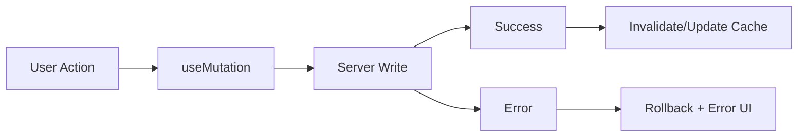

---
title: TanStack Query Mutations
slug: day-064-tanstack-query-mutations
dayLabel: Day 64
level: Advanced
estimatedMinutes: 30
order: 64
track: react
---
# Day 64 [Advanced]: TanStack Query Mutations

## Index

- [Goal](#goal)
- [Prerequisites](#prerequisites)
- [Explanation](#explanation)
- [Topic by Topic](#topic-by-topic)
- [Key Concepts](#key-concepts)
- [Visual Concept Map](#visual-concept-map)
- [End-to-End Practical](#end-to-end-practical)
- [Hands-on Coding](#hands-on-coding)
- [Mini Exercise](#mini-exercise)
- [Assessment Quiz](#assessment-quiz)
- [Task](#task)
- [Self Check](#self-check)
- [Interview Questions and Answers](#interview-questions-and-answers)
- [Day 64 Outcome](#day-64-outcome)

## Goal

Handle server write operations using TanStack Query mutations with reliable UI sync and cache updates.

## Prerequisites

- Day 63 completed
- Query basics and queryClient familiarity

## Explanation

Mutations are write operations like create, update, and delete. After mutation success, cached queries must be updated or invalidated to keep UI accurate.

## Topic by Topic

### Topic 1: Mutation Lifecycle

Theory:
Mutation has pending, success, and error states.

Practical:
Show user feedback for each stage.

Code Example:

```jsx
const mutation = useMutation({ mutationFn: createItem });
```

**Explanation:** This topic explains Mutation Lifecycle in a practical way so you can apply it confidently in real React projects.

**Key Points:**

- Understand the core idea of Mutation Lifecycle.
- Apply the pattern using clean, readable code.
- Avoid common mistakes through predictable React flow.

### Topic 2: Invalidate Queries

Theory:
After write, stale list queries should refetch.

Practical:
Invalidate list key after successful create/delete.

Code Example:

```jsx
queryClient.invalidateQueries({ queryKey: ["todos"] });
```

**Explanation:** This topic explains Invalidate Queries in a practical way so you can apply it confidently in real React projects.

**Key Points:**

- Understand the core idea of Invalidate Queries.
- Apply the pattern using clean, readable code.
- Avoid common mistakes through predictable React flow.

### Topic 3: Optimistic Updates

Theory:
Optimistic UI updates immediately before server response.

Practical:
Update cache in onMutate and rollback on failure.

Code Example:

```jsx
onError: (_err, _vars, ctx) =>
  queryClient.setQueryData(["todos"], ctx.previous);
```

**Explanation:** This topic explains Optimistic Updates in a practical way so you can apply it confidently in real React projects.

**Key Points:**

- Understand the core idea of Optimistic Updates.
- Apply the pattern using clean, readable code.
- Avoid common mistakes through predictable React flow.

### Topic 4: Mutation Error Handling

Theory:
Write failures need clear recovery path.

Practical:
Display toast and retry action.

Code Example:

```jsx
if (mutation.isError) return <p>Save failed</p>;
```

**Explanation:** This topic explains Mutation Error Handling in a practical way so you can apply it confidently in real React projects.

**Key Points:**

- Understand the core idea of Mutation Error Handling.
- Apply the pattern using clean, readable code.
- Avoid common mistakes through predictable React flow.

### Topic 5: Mutation Reusability

Theory:
Wrap common mutation patterns into custom hooks.

Practical:
Create `useCreateTask` and `useDeleteTask` hooks.

Code Example:

```jsx
export function useCreateTask() { return useMutation(...); }
```

**Explanation:** This topic explains Mutation Reusability in a practical way so you can apply it confidently in real React projects.

**Key Points:**

- Understand the core idea of Mutation Reusability.
- Apply the pattern using clean, readable code.
- Avoid common mistakes through predictable React flow.

### Topic 6: Reliability Patterns for TanStack Query Mutations

Theory:
Advanced apps need reliable rendering and data workflows that stay stable under retries, loading delays, and test scenarios.

Practical:
Add a failure-path test and one monitoring signal so this topic is validated beyond the happy path.

Code Example:

`jsx
// Validate happy path and failure path for production reliability.
`
**Explanation:** This topic explains Reliability Patterns for TanStack Query Mutations in a practical way so you can apply it confidently in real React projects.

**Key Points:**

- Understand the core idea of Reliability Patterns for TanStack Query Mutations.
- Apply the pattern using clean, readable code.
- Avoid common mistakes through predictable React flow.

## Key Concepts

- Mutation state lifecycle
- Cache invalidation strategy
- Optimistic update with rollback
- Robust error and retry UX
- Reusable mutation hooks

- Reliability-first implementation

## Visual Concept Map



## End-to-End Practical

1. Build list query for items.
2. Add create mutation with success feedback.
3. Add delete mutation with invalidation.
4. Add optimistic update for better UX.
5. Add rollback and retry for failure handling.

## Hands-on Coding

### Example 1: Case - Create Item Mutation

Scenario:
A project tracker lets managers add tasks and instantly refresh task list.

```jsx
const queryClient = useQueryClient();

const createTaskMutation = useMutation({
  mutationFn: async (payload) => {
    const res = await fetch("/api/tasks", {
      method: "POST",
      headers: { "Content-Type": "application/json" },
      body: JSON.stringify(payload),
    });
    return res.json();
  },
  onSuccess: () => {
    queryClient.invalidateQueries({ queryKey: ["tasks"] });
  },
});
```

### Example 2: Case - Delete with Optimistic Update

Scenario:
A support queue removes ticket immediately for snappy UX, then confirms with server.

```jsx
const deleteMutation = useMutation({
  mutationFn: async (id) => fetch(`/api/tickets/${id}`, { method: "DELETE" }),
  onMutate: async (id) => {
    await queryClient.cancelQueries({ queryKey: ["tickets"] });
    const previous = queryClient.getQueryData(["tickets"]);
    queryClient.setQueryData(["tickets"], (old = []) =>
      old.filter((t) => t.id !== id),
    );
    return { previous };
  },
  onError: (_err, _id, ctx) => {
    queryClient.setQueryData(["tickets"], ctx?.previous);
  },
  onSettled: () => {
    queryClient.invalidateQueries({ queryKey: ["tickets"] });
  },
});
```

### Example 3: Case - Reusable Mutation Hook

Scenario:
An internal app standardizes user creation flow across multiple screens.

```jsx
export function useCreateUser() {
  const queryClient = useQueryClient();

  return useMutation({
    mutationFn: (payload) =>
      fetch("/api/users", {
        method: "POST",
        headers: { "Content-Type": "application/json" },
        body: JSON.stringify(payload),
      }).then((r) => r.json()),
    onSuccess: () => queryClient.invalidateQueries({ queryKey: ["users"] }),
  });
}
```

## Mini Exercise

Scenario:
You are building a school assignments portal.

Implement create + delete assignment mutations, optimistic deletion, and rollback on failure.

Expected output:

- UI reflects mutation changes quickly
- Cache stays consistent after server confirmation
- Failures recover without stale/broken UI

## Assessment Quiz

### Quiz Questions

1. What is mutation in TanStack Query?
2. Why invalidate query after write operation?
3. True or False: Optimistic updates never need rollback.
4. Which callback is used to prepare optimistic cache changes?
5. What is a key risk in mutation-heavy apps?

### Quiz Answers

1. A server write action such as create/update/delete
2. To refresh stale cached data
3. False
4. onMutate
5. Cache inconsistency if success/error flows are not handled correctly

## Task

- Add create/delete flows with query invalidation
- Add one optimistic update with rollback
- Complete mini exercise

## Self Check

- You can build robust mutation flows with TanStack Query
- You can manage cache sync and error recovery
- You can answer at least 4 out of 5 quiz questions correctly

## Interview Questions and Answers

### Beginner

**Question:** What does useMutation do?

**Answer:** Handles asynchronous server write operations.

**Question:** What happens after successful mutation typically?

**Answer:** Related queries are invalidated or cache is updated.

### Middle

**Question:** Why use optimistic updates?

**Answer:** Improve perceived responsiveness by updating UI immediately.

**Question:** How do you recover from optimistic update failure?

**Answer:** Restore previous cache snapshot in onError.

### Advanced

**Question:** When choose setQueryData over invalidation?

**Answer:** When precise local cache update is cheap and deterministic.

**Question:** What production concern matters for repeated mutation retries?

**Answer:** Idempotency and duplicate-write prevention on backend.

## Day 64 Outcome

- You can implement production-grade mutation workflows
- You can keep TanStack Query cache reliable after writes
- You are ready for scalable loading patterns in Day 65

