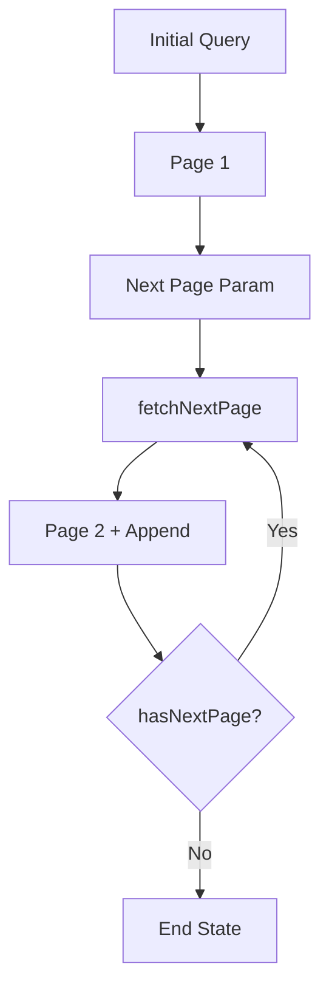

---
title: Pagination and Infinite Query
slug: day-065-pagination-and-infinite-query
dayLabel: Day 65
level: Advanced
estimatedMinutes: 30
order: 65
track: react
---
# Day 65 [Advanced]: Pagination and Infinite Query

## Index

- [Goal](#goal)
- [Prerequisites](#prerequisites)
- [Explanation](#explanation)
- [Topic by Topic](#topic-by-topic)
- [Key Concepts](#key-concepts)
- [Visual Concept Map](#visual-concept-map)
- [End-to-End Practical](#end-to-end-practical)
- [Hands-on Coding](#hands-on-coding)
- [Mini Exercise](#mini-exercise)
- [Assessment Quiz](#assessment-quiz)
- [Task](#task)
- [Self Check](#self-check)
- [Interview Questions and Answers](#interview-questions-and-answers)
- [Day 65 Outcome](#day-65-outcome)

## Goal

Implement robust pagination and infinite query patterns for large datasets with smooth UX.

## Prerequisites

- Day 64 completed
- Query keys and mutation/query lifecycle basics

## Explanation

Loading all records at once is expensive. Pagination and infinite loading reduce initial payload and scale better for content-heavy products.

## Topic by Topic

### Topic 1: Number-based Pagination

Theory:
Page index and page size control data windows.

Practical:
Fetch `page` and `limit` query params.

Code Example:

```jsx
fetch(`/api/posts?page=${page}&limit=10`);
```

**Explanation:** This topic explains Number-based Pagination in a practical way so you can apply it confidently in real React projects.

**Key Points:**

- Understand the core idea of Number-based Pagination.
- Apply the pattern using clean, readable code.
- Avoid common mistakes through predictable React flow.

### Topic 2: keepPreviousData Strategy

Theory:
Avoid UI flicker while moving between pages.

Practical:
Retain previous page data during transition.

Code Example:

```jsx
placeholderData: keepPreviousData;
```

**Explanation:** This topic explains keepPreviousData Strategy in a practical way so you can apply it confidently in real React projects.

**Key Points:**

- Understand the core idea of keepPreviousData Strategy.
- Apply the pattern using clean, readable code.
- Avoid common mistakes through predictable React flow.

### Topic 3: Infinite Query Pattern

Theory:
Infinite queries append pages progressively.

Practical:
Use `getNextPageParam` with cursor/page info.

Code Example:

```jsx
useInfiniteQuery({ getNextPageParam: (last) => last.nextCursor });
```

**Explanation:** This topic explains Infinite Query Pattern in a practical way so you can apply it confidently in real React projects.

**Key Points:**

- Understand the core idea of Infinite Query Pattern.
- Apply the pattern using clean, readable code.
- Avoid common mistakes through predictable React flow.

### Topic 4: Load More Trigger

Theory:
Trigger can be button-based or intersection observer based.

Practical:
Start with button, then upgrade to auto-load.

Code Example:

```jsx
<button onClick={() => fetchNextPage()}>Load More</button>
```

**Explanation:** This topic explains Load More Trigger in a practical way so you can apply it confidently in real React projects.

**Key Points:**

- Understand the core idea of Load More Trigger.
- Apply the pattern using clean, readable code.
- Avoid common mistakes through predictable React flow.

### Topic 5: UX and Performance Safeguards

Theory:
Handle empty states, end-of-list, and retry errors.

Practical:
Provide `hasNextPage`, loading state, and retry controls.

Code Example:

```jsx
if (!hasNextPage) return <p>End of list</p>;
```

**Explanation:** This topic explains UX and Performance Safeguards in a practical way so you can apply it confidently in real React projects.

**Key Points:**

- Understand the core idea of UX and Performance Safeguards.
- Apply the pattern using clean, readable code.
- Avoid common mistakes through predictable React flow.

### Topic 6: Reliability Patterns for Pagination and Infinite Query

Theory:
Advanced apps need reliable rendering and data workflows that stay stable under retries, loading delays, and test scenarios.

Practical:
Add a failure-path test and one monitoring signal so this topic is validated beyond the happy path.

Code Example:

`jsx
// Validate happy path and failure path for production reliability.
`
**Explanation:** This topic explains Reliability Patterns for Pagination and Infinite Query in a practical way so you can apply it confidently in real React projects.

**Key Points:**

- Understand the core idea of Reliability Patterns for Pagination and Infinite Query.
- Apply the pattern using clean, readable code.
- Avoid common mistakes through predictable React flow.

## Key Concepts

- Pagination data windows
- Smooth page transitions
- Infinite loading architecture
- Next-page derivation logic
- Resilient large-list UX

- Reliability-first implementation

## Visual Concept Map



## End-to-End Practical

1. Build page-based list using query key with page number.
2. Add previous/next navigation controls.
3. Preserve previous data for smooth transitions.
4. Convert same endpoint to infinite query model.
5. Add end-of-list and retry handling.

## Hands-on Coding

### Example 1: Case - Basic Pagination Query

Scenario:
A news portal loads articles 10 at a time by page.

```jsx
const [page, setPage] = React.useState(1);

const postsQuery = useQuery({
  queryKey: ["posts", page],
  queryFn: async () => {
    const res = await fetch(`/api/posts?page=${page}&limit=10`);
    return res.json();
  },
  placeholderData: keepPreviousData,
});
```

### Example 2: Case - Infinite Query with Load More

Scenario:
A social feed app appends content chunk-by-chunk.

```jsx
const feedQuery = useInfiniteQuery({
  queryKey: ["feed"],
  queryFn: async ({ pageParam = 1 }) => {
    const res = await fetch(`/api/feed?page=${pageParam}`);
    return res.json();
  },
  getNextPageParam: (lastPage) => lastPage.nextPage ?? undefined,
});

const allItems = feedQuery.data?.pages.flatMap((p) => p.items) ?? [];
```

### Example 3: Case - End-of-list and Retry UX

Scenario:
An e-learning catalog must clearly show when no more courses are available.

```jsx
{
  feedQuery.isError && (
    <button onClick={() => feedQuery.refetch()}>Retry</button>
  );
}
{
  feedQuery.hasNextPage ? (
    <button
      onClick={() => feedQuery.fetchNextPage()}
      disabled={feedQuery.isFetchingNextPage}
    >
      {feedQuery.isFetchingNextPage ? "Loading..." : "Load More"}
    </button>
  ) : (
    <p>No more courses.</p>
  );
}
```

## Mini Exercise

Scenario:
You are building a job board with thousands of listings.

Implement both:

- classic page navigation
- infinite scroll style loading

Add robust states for loading, error, empty list, and end-of-list.

Expected output:

- Large list loads in smaller chunks
- Smooth transitions between pages
- Reliable load-more behavior with clear UX states

## Assessment Quiz

### Quiz Questions

1. Why avoid loading all records in a single request?
2. What does keepPreviousData improve?
3. True or False: Infinite query requires next page derivation logic.
4. Which helper fetches additional pages?
5. What UI state should appear when no more pages exist?

### Quiz Answers

1. High payload hurts latency and memory usage
2. Reduces flicker between page transitions
3. True
4. fetchNextPage
5. End-of-list message with no further load action

## Task

- Build paginated list and convert to infinite query
- Add loading/error/empty/end-of-list states
- Complete mini exercise

## Self Check

- You can implement scalable list data loading patterns
- You can choose between pagination and infinite strategy
- You can answer at least 4 out of 5 quiz questions correctly

## Interview Questions and Answers

### Beginner

**Question:** What is pagination?

**Answer:** Dividing large dataset into manageable pages.

**Question:** What is infinite query?

**Answer:** Progressive loading that appends pages as user requests more.

### Middle

**Question:** Why use keepPreviousData in paginated queries?

**Answer:** It keeps prior page visible while next page loads.

**Question:** What determines whether more pages exist?

**Answer:** hasNextPage from getNextPageParam result.

### Advanced

**Question:** When should you prefer numbered pagination over infinite loading?

**Answer:** When users need deterministic page jumps, shareable page URLs, or tabular navigation.

**Question:** What performance issue can infinite lists introduce?

**Answer:** Unbounded DOM growth unless virtualization/windowing is applied.

## Day 65 Outcome

- You can build scalable pagination and infinite query systems
- You can design resilient UX for large datasets
- You are ready for advanced form systems in upcoming lessons

