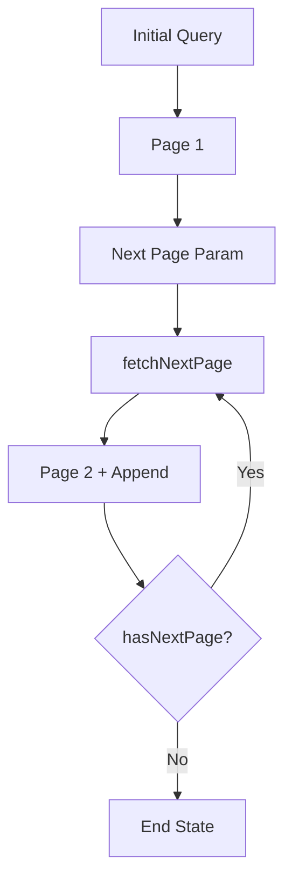

# Day 65 [Advanced]: Pagination and Infinite Query

## Goal

Implement robust pagination and infinite query patterns for large datasets with smooth UX, predictable cache behavior, and reliable loading, error, empty, and end-of-list states.

## Prerequisites

- Day 64 completed
- Query keys and mutation/query lifecycle basics
- Familiarity with `useQuery` and `useInfiniteQuery`

## Explanation

Loading thousands of records in one request increases payload size, memory usage, rendering work, and time to useful content. Pagination loads a deterministic slice of data, while infinite queries progressively append pages as the user asks for more.

The right choice depends on the product. Numbered pagination is useful when users need direct page navigation, stable URLs, or table-style workflows. Infinite loading is useful for feeds, catalogs, and discovery experiences where sequential browsing is natural.

A reliable implementation must also handle race conditions, duplicate load-more actions, retries, empty responses, and the end of the dataset. Pagination is a data-flow problem as much as a UI problem.

## Topic by Topic

### Topic 1: Number-based Pagination

Theory:
Page index and page size control data windows. The page number normally belongs in the query key so each page has its own cache entry.

Practical:
Fetch `page` and `limit` query params and make sure the server validates them.

Code Example:

```jsx
const postsQuery = useQuery({
  queryKey: ["posts", page],
  queryFn: async () => {
    const res = await fetch(`/api/posts?page=${page}&limit=10`);
    if (!res.ok) throw new Error("Failed to load posts");
    return res.json();
  },
});
```

Keeping `page` in the query key ensures React Query/TanStack Query can distinguish cached results for page 1, page 2, and so on. Always check `response.ok` when using `fetch`, because HTTP 4xx/5xx responses do not reject the promise automatically.

**Explanation:** This topic explains Number-based Pagination in a practical way so you can apply it confidently in real React projects. The page belongs in the query identity, while the server remains responsible for validating pagination parameters.

**Key Points:**

- Understand the core idea of Number-based Pagination.
- Put pagination inputs that affect the response in the query key.
- Validate page and limit values on the server.
- Handle HTTP errors explicitly when using `fetch`.

### Topic 2: keepPreviousData Strategy

Theory:
Changing the page changes the query key, so a new query can temporarily enter a pending state. `keepPreviousData`/`placeholderData: keepPreviousData` can keep the previous result visible while the next page loads.

Practical:
Use it when preserving the current list is better UX than replacing it with a blank loading state.

Code Example:

```jsx
import { keepPreviousData, useQuery } from "@tanstack/react-query";

const postsQuery = useQuery({
  queryKey: ["posts", page],
  queryFn: fetchPosts,
  placeholderData: keepPreviousData,
});
```

The previous data is a placeholder while the new page is fetched; it is not the new page's cached result. Use `postsQuery.isPlaceholderData` when the UI needs to distinguish the temporary data state.

**Explanation:** This topic explains keepPreviousData Strategy in a practical way so you can apply it confidently in real React projects. The goal is smoother transitions without pretending that the new page has already loaded.

**Key Points:**

- Understand the core idea of keepPreviousData Strategy.
- Preserve useful previous content during page transitions.
- Distinguish placeholder data from the newly fetched result.
- Disable or delay navigation when the next page is known to be unavailable.

### Topic 3: Infinite Query Pattern

Theory:
Infinite queries keep multiple pages under one query and use page parameters to determine what should be fetched next.

Practical:
Use `initialPageParam` and `getNextPageParam` to define the pagination contract explicitly.

Code Example:

```jsx
const feedQuery = useInfiniteQuery({
  queryKey: ["feed"],
  initialPageParam: 1,
  queryFn: async ({ pageParam }) => {
    const res = await fetch(`/api/feed?page=${pageParam}`);
    if (!res.ok) throw new Error("Failed to load feed");
    return res.json();
  },
  getNextPageParam: (lastPage) => lastPage.nextPage ?? undefined,
});
```

`getNextPageParam` returns the parameter for the next request. Returning `undefined` tells TanStack Query that there is no next page.

**Explanation:** This topic explains Infinite Query Pattern in a practical way so you can apply it confidently in real React projects. Cursor-based APIs can use a cursor instead of a numeric page, and cursor pagination is often more stable when records are inserted while the user is browsing.

**Key Points:**

- Understand the core idea of Infinite Query Pattern.
- Define `initialPageParam` explicitly.
- Derive the next page from server response metadata.
- Use `undefined` when no additional page exists.

### Topic 4: Load More Trigger

Theory:
A load-more action can be button-based or automatically triggered with `IntersectionObserver`. A button is usually the simplest and most accessible starting point.

Practical:
Prevent duplicate requests while a page is already being fetched.

Code Example:

```jsx
<button
  onClick={() => feedQuery.fetchNextPage()}
  disabled={!feedQuery.hasNextPage || feedQuery.isFetchingNextPage}
>
  {feedQuery.isFetchingNextPage ? "Loading..." : "Load More"}
</button>
```

For automatic loading, an `IntersectionObserver` can watch a sentinel near the end of the list. The observer callback should still check `hasNextPage` and `isFetchingNextPage` before requesting another page.

**Explanation:** This topic explains Load More Trigger in a practical way so you can apply it confidently in real React projects. The trigger should be resilient to rapid clicks, repeated intersections, and slow networks.

**Key Points:**

- Understand the core idea of Load More Trigger.
- Prefer an accessible button before introducing auto-loading.
- Prevent duplicate next-page requests.
- Guard intersection-based loading with query state.

### Topic 5: UX and Performance Safeguards

Theory:
Large lists need explicit loading, error, empty, end-of-list, and retry states. Infinite lists can also grow the DOM without bound, so virtualization may be necessary for very large datasets.

Practical:
Provide `hasNextPage`, `isFetchingNextPage`, error handling, and clear end-of-list messaging.

Code Example:

```jsx
if (feedQuery.isError) {
  return <button onClick={() => feedQuery.refetch()}>Retry</button>;
}

if (!feedQuery.data?.pages.some((page) => page.items.length > 0)) {
  return <p>No results found.</p>;
}

if (!feedQuery.hasNextPage) {
  return <p>End of list</p>;
}
```

In a real component, these conditions should be composed with the list rather than returning the end state before rendering already-loaded items. For very large result sets, combine pagination with list virtualization/windowing instead of allowing thousands of DOM nodes to accumulate.

**Explanation:** This topic explains UX and Performance Safeguards in a practical way so you can apply it confidently in real React projects. The best implementation communicates exactly what is happening and avoids unnecessary rendering work.

**Key Points:**

- Understand the core idea of UX and Performance Safeguards.
- Design loading, error, empty, and end-of-list states.
- Prevent duplicate fetches and unnecessary renders.
- Consider virtualization for very large rendered lists.

### Topic 6: Reliability Patterns for Pagination and Infinite Query

Theory:
Advanced list experiences must remain predictable under retries, slow networks, duplicate triggers, changing filters, and partially loaded pages. Reliability means validating both the happy path and failure path.

Practical:
Test initial loading, page transitions, next-page failures, retry behavior, empty results, and the end of the dataset. Add monitoring for repeated query failures or unusually slow page requests.

Code Example:

```jsx
async function fetchPosts({ pageParam = 1 }) {
  const res = await fetch(`/api/posts?page=${pageParam}&limit=20`);

  if (!res.ok) {
    throw new Error(`Posts request failed: ${res.status}`);
  }

  return res.json();
}
```

When filters or search terms change, include those values in the query key so stale pages are not mixed with the new result set. For cursor APIs, treat the server-provided cursor as opaque rather than trying to calculate it on the client.

**Explanation:** This topic explains Reliability Patterns for Pagination and Infinite Query in a practical way so you can apply it confidently in real React projects. Reliable pagination is about correct cache identity, predictable transitions, recoverable failures, and controlled rendering growth.

**Key Points:**

- Understand the core idea of Reliability Patterns for Pagination and Infinite Query.
- Validate loading, failure, retry, empty, and end-of-list paths.
- Include filters/search values in query identity.
- Keep cursor generation on the server when using cursor-based APIs.

## Key Concepts

- Pagination data windows
- Smooth page transitions
- Infinite loading architecture
- Next-page derivation logic
- Resilient large-list UX
- Query-key identity for filters and pagination
- Cursor-based vs offset/page-based pagination
- List virtualization and DOM growth
- Reliability-first implementation

## Visual Concept Map



## End-to-End Practical

1. Build a page-based list using a query key containing the page number.
2. Add previous/next navigation controls.
3. Preserve previous data for smoother transitions.
4. Convert the same endpoint to an infinite query model.
5. Add loading, error, empty, retry, and end-of-list states.
6. Prevent duplicate `fetchNextPage` calls.
7. Add filters to the query key and reset pagination when filters change.
8. Evaluate virtualization when the rendered list becomes large.

## Hands-on Coding

### Example 1: Case - Basic Pagination Query

Scenario:
A news portal loads articles 10 at a time by page.

```jsx
import { keepPreviousData, useQuery } from "@tanstack/react-query";

const postsQuery = useQuery({
  queryKey: ["posts", page],
  queryFn: async () => {
    const res = await fetch(`/api/posts?page=${page}&limit=10`);
    if (!res.ok) throw new Error("Failed to load posts");
    return res.json();
  },
  placeholderData: keepPreviousData,
});
```

### Example 2: Case - Infinite Query with Load More

Scenario:
A social feed app appends content chunk-by-chunk.

```jsx
const feedQuery = useInfiniteQuery({
  queryKey: ["feed"],
  initialPageParam: 1,
  queryFn: async ({ pageParam }) => {
    const res = await fetch(`/api/feed?page=${pageParam}`);
    if (!res.ok) throw new Error("Failed to load feed");
    return res.json();
  },
  getNextPageParam: (lastPage) => lastPage.nextPage ?? undefined,
});

const allItems = feedQuery.data?.pages.flatMap((p) => p.items) ?? [];
```

### Example 3: Case - End-of-list and Retry UX

Scenario:
An e-learning catalog must clearly show when no more courses are available.

```jsx
{feedQuery.isError && (
  <button onClick={() => feedQuery.refetch()}>Retry</button>
)}

{feedQuery.data?.pages.flatMap((p) => p.items).length === 0 &&
  !feedQuery.isPending && <p>No courses found.</p>}

{feedQuery.hasNextPage ? (
  <button
    onClick={() => feedQuery.fetchNextPage()}
    disabled={feedQuery.isFetchingNextPage}
  >
    {feedQuery.isFetchingNextPage ? "Loading..." : "Load More"}
  </button>
) : (
  <p>No more courses.</p>
)}
```

## Mini Exercise

Scenario:
You are building a job board with thousands of listings.

Implement both:

- classic page navigation
- infinite scroll style loading

Add robust states for loading, error, empty list, retry, and end-of-list. Ensure changing a search/filter value creates a new query identity and does not append results from the previous filter.

Expected output:

- Large list loads in smaller chunks
- Smooth transitions between pages
- Reliable load-more behavior with clear UX states
- Correct reset behavior when filters change

## Assessment Quiz

### Quiz Questions

1. Why avoid loading all records in a single request?
2. What does `keepPreviousData` improve?
3. True or False: Infinite query requires next-page derivation logic.
4. Which helper fetches additional pages?
5. What UI state should appear when no more pages exist?
6. Why should page/filter values be represented in a query key?
7. What problem can an unbounded infinite list create in the browser?
8. When can cursor-based pagination be preferable to page-number pagination?

### Quiz Answers

1. A large payload increases latency, memory usage, parsing work, and rendering cost.
2. It reduces flicker by keeping the previous result visible while the next page is fetched.
3. True. `getNextPageParam` determines the next page parameter and signals when no page remains.
4. `fetchNextPage`.
5. A clear end-of-list state with no further load action.
6. Query keys identify cached results. Different filters/pages should not accidentally share the same cache identity.
7. DOM growth can increase memory usage, layout work, and rendering cost; virtualization can help.
8. When the dataset changes frequently and stable continuation from the last item is more reliable than offset/page numbers.

## Task

- Build a paginated list and convert it to infinite query
- Add loading/error/empty/end-of-list states
- Add retry behavior
- Prevent duplicate next-page requests
- Handle filter changes correctly
- Complete mini exercise

## Self Check

- You can implement scalable list data loading patterns
- You can choose between pagination and infinite strategy
- You can design correct query keys for page/filter state
- You can handle retries and end-of-list behavior
- You can answer at least 6 out of 8 quiz questions correctly

## Interview Questions and Answers

### Beginner

**Question:** What is pagination?

**Answer:** Dividing a large dataset into manageable windows so the client loads only the records needed for the current view.

**Question:** What is infinite query?

**Answer:** A query pattern that progressively loads and appends pages as the user requests more data.

### Middle

**Question:** Why use `keepPreviousData` in paginated queries?

**Answer:** It keeps the previous result available as placeholder data while the next page loads, reducing visual flicker.

**Question:** What determines whether more pages exist?

**Answer:** `getNextPageParam` determines the next page parameter. When it returns `undefined`, TanStack Query treats the query as having no next page.

### Advanced

**Question:** When should you prefer numbered pagination over infinite loading?

**Answer:** When users need deterministic page jumps, shareable page URLs, explicit progress through a dataset, or table-style navigation.

**Question:** What performance issue can infinite lists introduce?

**Answer:** Unbounded DOM growth. Loading more data does not automatically mean the browser should keep every item mounted; virtualization/windowing can limit rendered nodes.

**Question:** How should filters interact with pagination?

**Answer:** Filter/search values should be part of the query key. When the filter changes, the application should start from the appropriate first page rather than append new results to the previous filter's pages.

**Question:** Offset pagination vs cursor pagination: what is the trade-off?

**Answer:** Offset/page pagination is simple and supports direct page navigation, but inserts/deletes can shift results between pages. Cursor pagination provides a continuation token and is often more stable for changing feeds, but it is less suited to arbitrary page jumps.

## Day 65 Outcome

- You can build scalable pagination and infinite query systems
- You can design resilient UX for large datasets
- You can choose between page-based and cursor-based strategies
- You can prevent common cache, retry, and rendering problems
- You are ready for advanced form systems in upcoming lessons
