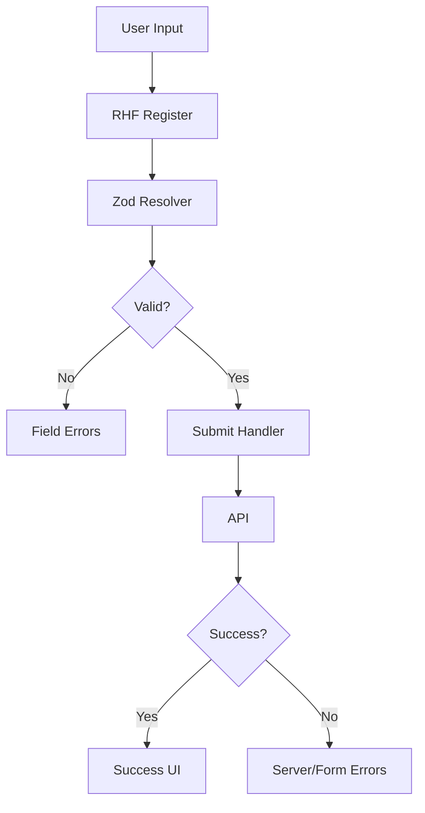

---
title: Advanced Forms with RHF + Zod
slug: day-066-advanced-forms-with-rhf-zod
dayLabel: Day 66
level: Advanced
estimatedMinutes: 30
order: 66
track: react
---
# Day 66 [Advanced]: Advanced Forms with RHF + Zod

## Goal

Build production-ready forms using React Hook Form and Zod with strong validation, clean error handling, dynamic fields, server-side error mapping, and predictable submission behavior.

## Prerequisites

- Day 65 completed
- Good understanding of controlled inputs and form events
- Familiarity with async API calls

## Explanation

React Hook Form (RHF) reduces form-state boilerplate and unnecessary re-renders, while Zod provides schema-driven runtime validation. Together they separate **form state management** from **validation rules**.

A production form should validate more than the happy path. It should define required fields, cross-field rules where needed, accessible error messages, pending/disabled states, server validation errors, reset behavior, and safe handling of failed submissions.

## Topic by Topic

### Topic 1: RHF Core Setup

Theory:
RHF manages form state with minimal rerender overhead and exposes utilities such as `register`, `handleSubmit`, `watch`, `reset`, and `formState`.

Practical:
Initialize `useForm`, register fields, and keep submission logic outside individual input elements.

Code Example:

```jsx
import { useForm } from "react-hook-form";

function ProfileForm() {
  const {
    register,
    handleSubmit,
    formState: { errors },
  } = useForm();

  const onSubmit = (data) => {
    console.log(data);
  };

  return (
    <form onSubmit={handleSubmit(onSubmit)}>
      <input {...register("name", { required: "Name is required" })} />
      {errors.name && <p>{errors.name.message}</p>}
      <button type="submit">Save</button>
    </form>
  );
}
```

**Explanation:** `register` connects the input to RHF, while `handleSubmit` runs validation before invoking the submit callback. Keep the submit button explicitly typed as `submit` and other form actions such as Add/Remove as `button`.

**Key Points:**

- Understand the core idea of RHF Core Setup.
- Use `register` and `handleSubmit` for predictable form flow.
- Keep validation and submission concerns separate from individual inputs.
- Avoid accidental form submission from non-submit buttons.

### Topic 2: Zod Schema Validation

Theory:
Validation rules are centralized in a schema instead of being scattered throughout JSX. The RHF resolver connects Zod validation to form submission and field state.

Practical:
Define a schema and pass `zodResolver(schema)` to `useForm`.

Code Example:

```jsx
import { z } from "zod";
import { zodResolver } from "@hookform/resolvers/zod";
import { useForm } from "react-hook-form";

const schema = z.object({
  email: z.string().email("Enter a valid email"),
  password: z.string().min(8, "Minimum 8 characters"),
});

function LoginForm() {
  const { register, handleSubmit } = useForm({
    resolver: zodResolver(schema),
  });

  return (
    <form onSubmit={handleSubmit(console.log)}>
      <input {...register("email")} />
      <input type="password" {...register("password")} />
      <button type="submit">Login</button>
    </form>
  );
}
```

Schema validation runs before the successful submit handler. For values that need normalization, make the transformation explicit so the submitted value and validation behavior remain predictable.

**Explanation:** This topic explains Zod Schema Validation in a practical way so you can apply it confidently in real React projects. Centralized schemas make rules easier to reuse, review, and test.

**Key Points:**

- Understand the core idea of Zod Schema Validation.
- Connect Zod to RHF with `zodResolver`.
- Keep validation rules centralized and testable.
- Distinguish validation from data transformation/normalization.

### Topic 3: Error Messages and UX

Theory:
Validation feedback should be specific, field-scoped, and understandable. Errors should not depend only on color, and the form should make it easy to locate the first invalid field.

Practical:
Show inline errors from `formState.errors` and associate them with inputs.

Code Example:

```jsx
const {
  register,
  formState: { errors },
} = useForm();

<input
  id="email"
  aria-invalid={errors.email ? "true" : "false"}
  aria-describedby={errors.email ? "email-error" : undefined}
  {...register("email", { required: "Email is required" })}
/>

{errors.email && (
  <p id="email-error" role="alert">
    {errors.email.message}
  </p>
)}
```

For long forms, consider focusing the first invalid field after submit. Keep server errors distinguishable from client validation errors when that distinction helps the user recover.

**Explanation:** This topic explains Error Messages and UX in a practical way so you can apply it confidently in real React projects. Good validation UX tells the user what is wrong, where it is wrong, and what action will fix it.

**Key Points:**

- Understand the core idea of Error Messages and UX.
- Show actionable, field-specific messages.
- Use accessible associations such as `aria-describedby`.
- Do not communicate validation state through color alone.

### Topic 4: Nested and Dynamic Fields

Theory:
Real forms often include arrays and nested objects. `useFieldArray` manages repeating groups while preserving stable field identifiers.

Practical:
Use `useFieldArray` for dynamic rows and use `field.id` as the React `key`, not the array index.

Code Example:

```jsx
const { control, register } = useForm({
  defaultValues: { skills: [{ value: "" }] },
});

const { fields, append, remove } = useFieldArray({
  control,
  name: "skills",
});

{fields.map((field, index) => (
  <div key={field.id}>
    <input {...register(`skills.${index}.value`)} />
    <button type="button" onClick={() => remove(index)}>
      Remove
    </button>
  </div>
))}
```

For nested data, use RHF's field-name paths consistently, such as `address.city` or `skills.0.value`. Validation schemas should mirror the submitted data shape.

**Explanation:** This topic explains Nested and Dynamic Fields in a practical way so you can apply it confidently in real React projects. Stable field identity prevents subtle input-state problems when rows are added, removed, or reordered.

**Key Points:**

- Understand the core idea of Nested and Dynamic Fields.
- Use `useFieldArray` for repeating form groups.
- Use `field.id` as the React list key.
- Keep RHF field paths and Zod schema shape aligned.

### Topic 5: Submission Lifecycle

Theory:
Submission includes client validation, pending state, server response handling, success feedback, and recovery after failure. A submit handler should not assume that a network request succeeded merely because `fetch` resolved.

Practical:
Use `isSubmitting`, check `response.ok`, map known server errors, and reset only when the product flow requires it.

Code Example:

```jsx
const {
  handleSubmit,
  formState: { isSubmitting },
} = useForm();

const onSubmit = async (data) => {
  const response = await fetch("/api/profile", {
    method: "POST",
    headers: { "Content-Type": "application/json" },
    body: JSON.stringify(data),
  });

  if (!response.ok) {
    throw new Error("Unable to save profile");
  }
};

<form onSubmit={handleSubmit(onSubmit)}>
  <button type="submit" disabled={isSubmitting}>
    {isSubmitting ? "Saving..." : "Save"}
  </button>
</form>
```

In production, catch expected API failures and show an actionable form-level message. Disable duplicate submission while the same operation is pending, but do not use disabling as a substitute for server-side idempotency where duplicate requests are dangerous.

**Explanation:** This topic explains Submission Lifecycle in a practical way so you can apply it confidently in real React projects. A reliable submit flow handles validation, network failure, server rejection, and successful completion as separate states.

**Key Points:**

- Understand the core idea of Submission Lifecycle.
- Track pending state with `isSubmitting`.
- Check HTTP response status explicitly.
- Prevent accidental duplicate submissions and provide recovery feedback.

### Topic 6: Reliability Patterns for Advanced Forms with RHF + Zod

Theory:
Advanced forms need reliable behavior under slow networks, rejected requests, dynamic field changes, validation edge cases, and repeated submissions. Production quality comes from testing failure paths as deliberately as the happy path.

Practical:
Validate client rules, simulate a failed API response, verify field-level server errors, and confirm that retrying does not lose valid user input.

Code Example:

```jsx
const onSubmit = async (data) => {
  try {
    const response = await fetch("/api/register", {
      method: "POST",
      headers: { "Content-Type": "application/json" },
      body: JSON.stringify(data),
    });

    if (!response.ok) {
      const payload = await response.json().catch(() => null);

      if (payload?.code === "EMAIL_EXISTS") {
        setError("email", {
          type: "server",
          message: "Email already exists",
        });
        return;
      }

      throw new Error("Registration failed");
    }

    // Show success UI or navigate after a confirmed success.
  } catch (error) {
    setFormError("Unable to submit right now. Please try again.");
  }
};
```

The example assumes `setError` comes from RHF and `setFormError` represents application-level form state. Keep sensitive server details out of user-facing messages and logs.

**Explanation:** This topic explains Reliability Patterns for Advanced Forms with RHF + Zod in a practical way so you can apply it confidently in real React projects. The goal is to preserve user input, distinguish validation from transport failures, and provide a safe recovery path.

**Key Points:**

- Understand the core idea of Reliability Patterns for Advanced Forms with RHF + Zod.
- Test both validation and API failure paths.
- Preserve valid user input during recoverable failures.
- Separate field errors from form-level errors.

## Key Concepts

- RHF lightweight form state model
- Zod schema-first validation
- RHF resolver integration
- Inline and accessible error UX patterns
- Dynamic field arrays
- Server-to-field error mapping
- Reliable submit and recovery handling
- Client validation vs server validation
- Reliability-first implementation

## Visual Concept Map



## End-to-End Practical

1. Build job application form with multiple fields.
2. Add Zod schema for all client validation rules.
3. Add dynamic skills section with `useFieldArray`.
4. Show inline and accessible errors.
5. Add pending state and prevent accidental duplicate submits.
6. Handle submit success and API error responses.
7. Map known server validation errors to fields with `setError`.
8. Test invalid input, successful submission, server rejection, network failure, and retry without losing valid input.

## Hands-on Coding

### Example 1: Case - RHF + Zod Basic Form

Scenario:
An onboarding form must validate name, email, and password consistently.

```jsx
import { useForm } from "react-hook-form";
import { z } from "zod";
import { zodResolver } from "@hookform/resolvers/zod";

const schema = z.object({
  name: z.string().min(2, "Name is too short"),
  email: z.string().email("Invalid email"),
  password: z.string().min(8, "Minimum 8 characters"),
});

function SignupForm() {
  const {
    register,
    handleSubmit,
    formState: { errors, isSubmitting },
  } = useForm({ resolver: zodResolver(schema) });

  const onSubmit = async (data) => {
    console.log("Submitted:", data);
  };

  return (
    <form onSubmit={handleSubmit(onSubmit)}>
      <input {...register("name")} placeholder="Name" />
      {errors.name && <p>{errors.name.message}</p>}
      <input {...register("email")} placeholder="Email" />
      {errors.email && <p>{errors.email.message}</p>}
      <input type="password" {...register("password")} placeholder="Password" />
      {errors.password && <p>{errors.password.message}</p>}
      <button type="submit" disabled={isSubmitting}>
        {isSubmitting ? "Submitting..." : "Submit"}
      </button>
    </form>
  );
}
```

### Example 2: Case - Dynamic Skills Section

Scenario:
A resume builder allows users to add/remove multiple skill entries.

```jsx
import { useFieldArray, useForm } from "react-hook-form";

function SkillsForm() {
  const { register, control, handleSubmit } = useForm({
    defaultValues: { skills: [{ value: "" }] },
  });
  const { fields, append, remove } = useFieldArray({ control, name: "skills" });

  return (
    <form onSubmit={handleSubmit(console.log)}>
      {fields.map((field, index) => (
        <div key={field.id}>
          <input {...register(`skills.${index}.value`)} placeholder="Skill" />
          <button type="button" onClick={() => remove(index)}>
            Remove
          </button>
        </div>
      ))}
      <button type="button" onClick={() => append({ value: "" })}>
        Add Skill
      </button>
      <button type="submit">Save</button>
    </form>
  );
}
```

### Example 3: Case - Backend Error Mapping

Scenario:
Registration API may return a duplicate email error that should map to the email field while preserving the other entered values.

```jsx
const onSubmit = async (data) => {
  const res = await fetch("/api/register", {
    method: "POST",
    headers: { "Content-Type": "application/json" },
    body: JSON.stringify(data),
  });

  if (!res.ok) {
    const err = await res.json().catch(() => null);

    if (err?.code === "EMAIL_EXISTS") {
      setError("email", {
        type: "server",
        message: "Email already exists",
      });
      return;
    }

    throw new Error("Registration failed");
  }
};
```

## Mini Exercise

Scenario:
You are building a loan application form with applicant details, income section, and dynamic co-applicants.

Use RHF + Zod for validation, add dynamic rows, map server-side rejection reasons to field errors, and preserve entered values when the server rejects the submission.

Expected output:

- All critical fields validated by schema
- Dynamic sections handled cleanly
- Client and server errors shown with clear messages
- Submit button reflects pending state
- Retry does not discard valid user input

## Assessment Quiz

### Quiz Questions

1. Why combine RHF with Zod?
2. Which RHF utility helps dynamic input arrays?
3. True or False: Validation rules should be duplicated in every input component.
4. What is the role of resolver in RHF?
5. Why map API errors to field-level messages?
6. Why should non-submit buttons inside a form use `type="button"`?
7. Why must a `fetch` submit handler check `response.ok`?
8. What is the difference between a field-level server error and a form-level error?

### Quiz Answers

1. Efficient form state management plus centralized schema validation.
2. `useFieldArray`.
3. False. Centralizing rules makes them easier to maintain and test.
4. It connects an external validation schema such as Zod to RHF's validation lifecycle.
5. To give users precise, actionable feedback at the field that needs correction.
6. Otherwise the browser treats a button without an explicit type as a submit button and may trigger an unintended form submission.
7. `fetch` resolves normally for HTTP 4xx/5xx responses; `response.ok` must be checked explicitly.
8. A field error identifies a specific input problem, while a form-level error represents a failure that cannot be mapped cleanly to one field, such as a temporary server failure.

## Task

- Build a complex validated form using React Hook Form + Zod
- Add dynamic fields and accessible error messages
- Add server error mapping and form-level failure handling
- Add pending/duplicate-submit protection
- Test retry without losing valid user input
- Complete mini exercise

## Self Check

- You can build scalable validated forms with RHF + Zod
- You can handle dynamic fields and server errors gracefully
- You can design accessible field-level error feedback
- You can distinguish validation, server rejection, and network failure
- You can answer at least 6 out of 8 quiz questions correctly

## Interview Questions and Answers

### Beginner

**Question:** What is React Hook Form?

**Answer:** A library for managing React form state and validation with an API designed to minimize unnecessary re-renders and boilerplate.

**Question:** What does Zod provide?

**Answer:** Schema-based runtime validation that describes expected data and validation rules in code.

### Middle

**Question:** Why is `useFieldArray` useful?

**Answer:** It manages add/remove/reorder flows for repeating fields while providing stable field IDs for React rendering.

**Question:** How do you display validation errors in RHF?

**Answer:** Read field errors from `formState.errors` and render accessible, field-specific messages near the associated input.

### Advanced

**Question:** How do you integrate backend validation with schema validation?

**Answer:** Keep predictable client rules in Zod, then map known server validation codes to fields using RHF's `setError`. Keep unexpected transport/server failures at form level.

**Question:** What is a key scalability advantage of schema-first forms?

**Answer:** Rules remain centralized, reusable, and easier to test independently from presentation components.

**Question:** How would you handle a failed submission without losing user input?

**Answer:** Keep the current RHF state, map recoverable server errors with `setError`, show a form-level retry message for unexpected failures, and avoid calling `reset` unless the product explicitly requires it.

**Question:** What security concern should be considered when displaying backend validation errors?

**Answer:** Do not expose sensitive internal exception details, stack traces, database information, or security-sensitive diagnostics to the user. Return safe, actionable error messages instead.

## Day 66 Outcome

- You can implement production-grade forms with RHF + Zod
- You can handle complex validation and dynamic form structures
- You can map server errors without losing valid user input
- You can design accessible and reliable submission flows
- You are ready for accessibility hardening in Day 67
