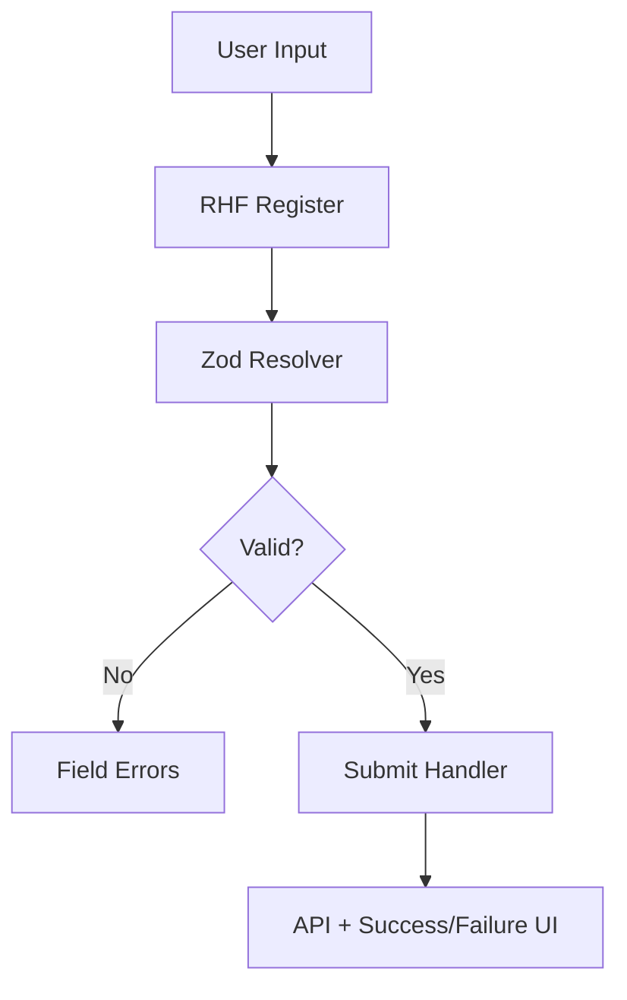

---
title: Advanced Forms with RHF + Zod
slug: day-066-advanced-forms-with-rhf-zod
dayLabel: Day 66
level: Advanced
estimatedMinutes: 30
order: 66
track: react
---
# Day 66 [Advanced]: Advanced Forms with RHF + Zod

## Index

- [Goal](#goal)
- [Prerequisites](#prerequisites)
- [Explanation](#explanation)
- [Topic by Topic](#topic-by-topic)
- [Key Concepts](#key-concepts)
- [Visual Concept Map](#visual-concept-map)
- [End-to-End Practical](#end-to-end-practical)
- [Hands-on Coding](#hands-on-coding)
- [Mini Exercise](#mini-exercise)
- [Assessment Quiz](#assessment-quiz)
- [Task](#task)
- [Self Check](#self-check)
- [Interview Questions and Answers](#interview-questions-and-answers)
- [Day 66 Outcome](#day-66-outcome)

## Goal

Build production-ready forms using React Hook Form and Zod with strong validation, clean error handling, and scalable structure.

## Prerequisites

- Day 65 completed
- Good understanding of controlled inputs and form events

## Explanation

React Hook Form (RHF) reduces re-renders and boilerplate, while Zod provides schema-driven validation with predictable rules.

## Topic by Topic

### Topic 1: RHF Core Setup

Theory:
RHF manages form state with minimal rerender overhead.

Practical:
Initialize `useForm` and register fields.

Code Example:

```jsx
const { register, handleSubmit, formState } = useForm();
```

**Explanation:** This topic explains RHF Core Setup in a practical way so you can apply it confidently in real React projects.

**Key Points:**

- Understand the core idea of RHF Core Setup.
- Apply the pattern using clean, readable code.
- Avoid common mistakes through predictable React flow.

### Topic 2: Zod Schema Validation

Theory:
Validation rules are centralized in schema, not scattered in JSX.

Practical:
Define schema and connect with RHF resolver.

Code Example:

```jsx
const schema = z.object({ email: z.string().email() });
```

**Explanation:** This topic explains Zod Schema Validation in a practical way so you can apply it confidently in real React projects.

**Key Points:**

- Understand the core idea of Zod Schema Validation.
- Apply the pattern using clean, readable code.
- Avoid common mistakes through predictable React flow.

### Topic 3: Error Messages and UX

Theory:
Validation feedback should be specific and field-scoped.

Practical:
Show inline errors from `formState.errors`.

Code Example:

```jsx
{
  errors.email && <p>{errors.email.message}</p>;
}
```

**Explanation:** This topic explains Error Messages and UX in a practical way so you can apply it confidently in real React projects.

**Key Points:**

- Understand the core idea of Error Messages and UX.
- Apply the pattern using clean, readable code.
- Avoid common mistakes through predictable React flow.

### Topic 4: Nested and Dynamic Fields

Theory:
Real forms often include arrays and nested objects.

Practical:
Use `useFieldArray` for dynamic rows.

Code Example:

```jsx
const { fields, append, remove } = useFieldArray({ control, name: "skills" });
```

**Explanation:** This topic explains Nested and Dynamic Fields in a practical way so you can apply it confidently in real React projects.

**Key Points:**

- Understand the core idea of Nested and Dynamic Fields.
- Apply the pattern using clean, readable code.
- Avoid common mistakes through predictable React flow.

### Topic 5: Submission Lifecycle

Theory:
Submission includes pending state, server error handling, and reset flow.

Practical:
Use `isSubmitting` and map backend errors.

Code Example:

```jsx
if (isSubmitting) return <button disabled>Saving...</button>;
```

**Explanation:** This topic explains Submission Lifecycle in a practical way so you can apply it confidently in real React projects.

**Key Points:**

- Understand the core idea of Submission Lifecycle.
- Apply the pattern using clean, readable code.
- Avoid common mistakes through predictable React flow.

### Topic 6: Reliability Patterns for Advanced Forms with RHF + Zod

Theory:
Advanced apps need reliable rendering and data workflows that stay stable under retries, loading delays, and test scenarios.

Practical:
Add a failure-path test and one monitoring signal so this topic is validated beyond the happy path.

Code Example:

`jsx
// Validate happy path and failure path for production reliability.
`
**Explanation:** This topic explains Reliability Patterns for Advanced Forms with RHF + Zod in a practical way so you can apply it confidently in real React projects.

**Key Points:**

- Understand the core idea of Reliability Patterns for Advanced Forms with RHF + Zod.
- Apply the pattern using clean, readable code.
- Avoid common mistakes through predictable React flow.

## Key Concepts

- RHF lightweight form state model
- Zod schema-first validation
- Inline error UX patterns
- Dynamic field arrays
- Reliable submit and recovery handling

- Reliability-first implementation

## Visual Concept Map



## End-to-End Practical

1. Build job application form with multiple fields.
2. Add Zod schema for all validation rules.
3. Add dynamic skills section with field array.
4. Show inline errors and pending state.
5. Handle submit success and API error response.

## Hands-on Coding

### Example 1: Case - RHF + Zod Basic Form

Scenario:
An onboarding form must validate name, email, and password consistently.

```jsx
import { useForm } from "react-hook-form";
import { z } from "zod";
import { zodResolver } from "@hookform/resolvers/zod";

const schema = z.object({
  name: z.string().min(2, "Name is too short"),
  email: z.string().email("Invalid email"),
  password: z.string().min(8, "Minimum 8 characters"),
});

function SignupForm() {
  const {
    register,
    handleSubmit,
    formState: { errors, isSubmitting },
  } = useForm({ resolver: zodResolver(schema) });

  const onSubmit = async (data) => {
    console.log("Submitted:", data);
  };

  return (
    <form onSubmit={handleSubmit(onSubmit)}>
      <input {...register("name")} placeholder="Name" />
      {errors.name && <p>{errors.name.message}</p>}
      <input {...register("email")} placeholder="Email" />
      {errors.email && <p>{errors.email.message}</p>}
      <input type="password" {...register("password")} placeholder="Password" />
      {errors.password && <p>{errors.password.message}</p>}
      <button disabled={isSubmitting}>
        {isSubmitting ? "Submitting..." : "Submit"}
      </button>
    </form>
  );
}
```

### Example 2: Case - Dynamic Skills Section

Scenario:
A resume builder allows users to add/remove multiple skill entries.

```jsx
import { useFieldArray, useForm } from "react-hook-form";

function SkillsForm() {
  const { register, control, handleSubmit } = useForm({
    defaultValues: { skills: [{ value: "" }] },
  });
  const { fields, append, remove } = useFieldArray({ control, name: "skills" });

  return (
    <form onSubmit={handleSubmit(console.log)}>
      {fields.map((field, index) => (
        <div key={field.id}>
          <input {...register(`skills.${index}.value`)} placeholder="Skill" />
          <button type="button" onClick={() => remove(index)}>
            Remove
          </button>
        </div>
      ))}
      <button type="button" onClick={() => append({ value: "" })}>
        Add Skill
      </button>
      <button type="submit">Save</button>
    </form>
  );
}
```

### Example 3: Case - Backend Error Mapping

Scenario:
Registration API may return duplicate email error that should map to email field.

```jsx
const onSubmit = async (data) => {
  const res = await fetch("/api/register", {
    method: "POST",
    headers: { "Content-Type": "application/json" },
    body: JSON.stringify(data),
  });

  if (!res.ok) {
    const err = await res.json();
    if (err.code === "EMAIL_EXISTS") {
      setError("email", { type: "server", message: "Email already exists" });
    }
  }
};
```

## Mini Exercise

Scenario:
You are building a loan application form with applicant details, income section, and dynamic co-applicants.

Use RHF + Zod for validation, add dynamic rows, and map server-side rejection reasons to field errors.

Expected output:

- All critical fields validated by schema
- Dynamic sections handled cleanly
- Client and server errors shown with clear messages

## Assessment Quiz

### Quiz Questions

1. Why combine RHF with Zod?
2. Which RHF utility helps dynamic input arrays?
3. True or False: Validation rules should be duplicated in every input component.
4. What is the role of resolver in RHF?
5. Why map API errors to field-level messages?

### Quiz Answers

1. Efficient form state plus centralized schema validation
2. useFieldArray
3. False
4. Connect external validation schema (like Zod) to RHF
5. To give actionable, precise feedback to users

## Task

- Build complex validated form using React Hook Form + Zod
- Add dynamic fields and server error mapping
- Complete mini exercise

## Self Check

- You can build scalable validated forms with RHF + Zod
- You can handle dynamic fields and server errors gracefully
- You can answer at least 4 out of 5 quiz questions correctly

## Interview Questions and Answers

### Beginner

**Question:** What is React Hook Form?

**Answer:** A library for performant form state management in React.

**Question:** What does Zod provide?

**Answer:** Schema-based runtime validation with typed rules.

### Middle

**Question:** Why is useFieldArray useful?

**Answer:** It manages add/remove/reorder flows for repeating fields efficiently.

**Question:** How do you display validation errors in RHF?

**Answer:** Read from `formState.errors` and render field-specific messages.

### Advanced

**Question:** How do you integrate backend validation with schema validation?

**Answer:** Keep schema for client rules, then map API error codes to fields via `setError`.

**Question:** What is a key scalability advantage of schema-first forms?

**Answer:** Rules stay centralized, reusable, and easier to test across components.

## Day 66 Outcome

- You can implement production-grade forms with RHF + Zod
- You can handle complex validation and dynamic form structures
- You are ready for accessibility hardening in Day 67

