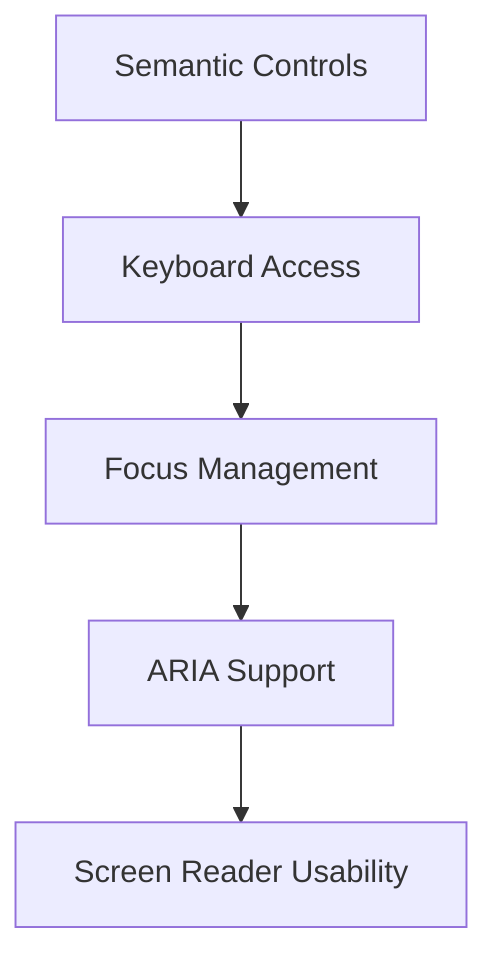

---
title: Accessibility in React
slug: day-067-accessibility-in-react
dayLabel: Day 67
level: Advanced
estimatedMinutes: 30
order: 67
track: react
---
# Day 67 [Advanced]: Accessibility in React

## Index

- [Goal](#goal)
- [Prerequisites](#prerequisites)
- [Explanation](#explanation)
- [Topic by Topic](#topic-by-topic)
- [Key Concepts](#key-concepts)
- [Visual Concept Map](#visual-concept-map)
- [End-to-End Practical](#end-to-end-practical)
- [Hands-on Coding](#hands-on-coding)
- [Mini Exercise](#mini-exercise)
- [Assessment Quiz](#assessment-quiz)
- [Task](#task)
- [Self Check](#self-check)
- [Interview Questions and Answers](#interview-questions-and-answers)
- [Day 67 Outcome](#day-67-outcome)

## Goal

Build React features that are keyboard-accessible, screen-reader friendly, and compliant with core accessibility standards.

## Prerequisites

- Day 66 completed
- Basic understanding of semantic HTML

## Explanation

Accessibility (a11y) is a quality baseline. Proper semantics, focus management, and ARIA usage make products usable for everyone.

## Topic by Topic

### Topic 1: Semantic HTML First

Theory:
Use native elements before ARIA workarounds.

Practical:
Prefer `<button>` over clickable `<div>`.

Code Example:

```jsx
<button onClick={save}>Save</button>
```

**Explanation:** This topic explains Semantic HTML First in a practical way so you can apply it confidently in real React projects.

**Key Points:**

- Understand the core idea of Semantic HTML First.
- Apply the pattern using clean, readable code.
- Avoid common mistakes through predictable React flow.

### Topic 2: Keyboard Navigation

Theory:
All interactive controls must be reachable/operable via keyboard.

Practical:
Verify Tab, Shift+Tab, Enter, and Escape flows.

Code Example:

```jsx
onKeyDown={(e) => e.key === "Enter" && open()}
```

**Explanation:** This topic explains Keyboard Navigation in a practical way so you can apply it confidently in real React projects.

**Key Points:**

- Understand the core idea of Keyboard Navigation.
- Apply the pattern using clean, readable code.
- Avoid common mistakes through predictable React flow.

### Topic 3: ARIA Labels and Relationships

Theory:
ARIA supplements semantics when needed.

Practical:
Bind labels, descriptions, and state attributes.

Code Example:

```jsx
<input aria-describedby="email-help" />
```

**Explanation:** This topic explains ARIA Labels and Relationships in a practical way so you can apply it confidently in real React projects.

**Key Points:**

- Understand the core idea of ARIA Labels and Relationships.
- Apply the pattern using clean, readable code.
- Avoid common mistakes through predictable React flow.

### Topic 4: Focus Management

Theory:
Dialogs and route changes should move focus intentionally.

Practical:
Set initial focus inside modal and restore on close.

Code Example:

```jsx
firstFocusableRef.current?.focus();
```

**Explanation:** This topic explains Focus Management in a practical way so you can apply it confidently in real React projects.

**Key Points:**

- Understand the core idea of Focus Management.
- Apply the pattern using clean, readable code.
- Avoid common mistakes through predictable React flow.

### Topic 5: Accessible Error and Status Messages

Theory:
Dynamic updates should be announced to assistive tech.

Practical:
Use `aria-live` for async status.

Code Example:

```jsx
<p aria-live="polite">Form saved successfully</p>
```

**Explanation:** This topic explains Accessible Error and Status Messages in a practical way so you can apply it confidently in real React projects.

**Key Points:**

- Understand the core idea of Accessible Error and Status Messages.
- Apply the pattern using clean, readable code.
- Avoid common mistakes through predictable React flow.

### Topic 6: Reliability Patterns for Accessibility in React

Theory:
Advanced apps need reliable rendering and data workflows that stay stable under retries, loading delays, and test scenarios.

Practical:
Add a failure-path test and one monitoring signal so this topic is validated beyond the happy path.

Code Example:

`jsx
// Validate happy path and failure path for production reliability.
`
**Explanation:** This topic explains Reliability Patterns for Accessibility in React in a practical way so you can apply it confidently in real React projects.

**Key Points:**

- Understand the core idea of Reliability Patterns for Accessibility in React.
- Apply the pattern using clean, readable code.
- Avoid common mistakes through predictable React flow.

## Key Concepts

- Semantic-first implementation
- Keyboard-first interaction model
- Proper ARIA usage
- Focus lifecycle management
- Assistive-technology friendly feedback

- Reliability-first implementation

## Visual Concept Map



## End-to-End Practical

1. Audit one feature with keyboard-only testing.
2. Replace non-semantic interactive elements.
3. Add ARIA attributes for missing relationships.
4. Fix focus flow for modal/dialog pattern.
5. Add live region for save or loading status.

## Hands-on Coding

### Example 1: Case - Replace Clickable div with Button

Scenario:
An admin panel uses clickable `div` controls that are not keyboard-friendly.

```jsx
function Toolbar({ onPublish }) {
  return (
    <div>
      <button type="button" onClick={onPublish}>
        Publish
      </button>
    </div>
  );
}
```

### Example 2: Case - Accessible Modal Focus Trap Entry

Scenario:
An insurance app modal should focus first actionable element when opened.

```jsx
function ConfirmModal({ open, onClose }) {
  const firstRef = React.useRef(null);

  React.useEffect(() => {
    if (open) firstRef.current?.focus();
  }, [open]);

  if (!open) return null;

  return (
    <div role="dialog" aria-modal="true" aria-labelledby="confirm-title">
      <h2 id="confirm-title">Confirm Policy Update</h2>
      <button ref={firstRef} onClick={onClose}>
        Close
      </button>
    </div>
  );
}
```

### Example 3: Case - Form Error Announcements

Scenario:
A scholarship form needs clear screen-reader announcements for validation errors.

```jsx
<label htmlFor="email">Email</label>
<input id="email" aria-invalid={!!errors.email} aria-describedby="email-error" />
{errors.email && (
	<p id="email-error" role="alert">
		{errors.email.message}
	</p>
)}
```

## Mini Exercise

Scenario:
You are improving a course enrollment form and confirmation modal.

Fix keyboard navigation, label relationships, focus entry/exit, and error announcements.

Expected output:

- Entire flow works without mouse
- Screen reader reads labels and errors correctly
- Focus order remains logical through modal interactions

## Assessment Quiz

### Quiz Questions

1. Why prefer semantic HTML over custom ARIA roles?
2. What does `aria-live` solve?
3. True or False: Keyboard support is optional if mouse works.
4. What is one common focus issue in modals?
5. Why use `role="alert"` on error blocks?

### Quiz Answers

1. Native semantics are more reliable and require less extra code
2. Announces dynamic content changes to assistive technology
3. False
4. Focus not moving into modal or not restored on close
5. To immediately announce important error messages

## Task

- Fix one feature for keyboard and ARIA compliance
- Add focus management and live announcements
- Complete mini exercise

## Self Check

- You can implement practical accessibility fixes in React
- You can validate keyboard and screen-reader readiness
- You can answer at least 4 out of 5 quiz questions correctly

## Interview Questions and Answers

### Beginner

**Question:** What does accessibility mean in web UI?

**Answer:** Designing interfaces usable by people with diverse abilities.

**Question:** Why are semantic elements important?

**Answer:** They provide built-in accessibility behavior and meaning.

### Middle

**Question:** How do you make form errors accessible?

**Answer:** Use `aria-invalid`, linked error text, and alert/live regions.

**Question:** What keyboard checks should every feature pass?

**Answer:** Reachable controls, visible focus, and Enter/Escape behavior where relevant.

### Advanced

**Question:** When should ARIA be added?

**Answer:** Only when native semantics cannot express needed accessibility metadata.

**Question:** How do you operationalize accessibility in team workflow?

**Answer:** Add a11y checks in code review, testing, and component library standards.

## Day 67 Outcome

- You can deliver accessibility-compliant React features
- You can enforce keyboard and screen-reader usability patterns
- You are ready for measurable performance diagnostics in Day 68

